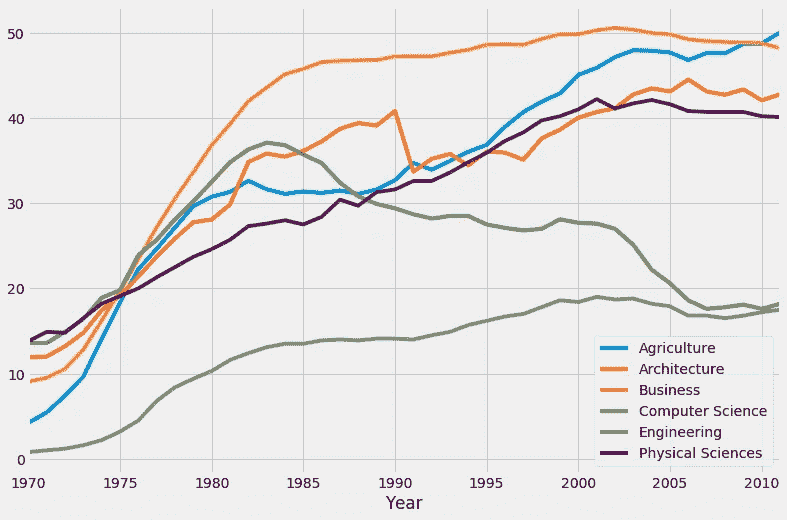
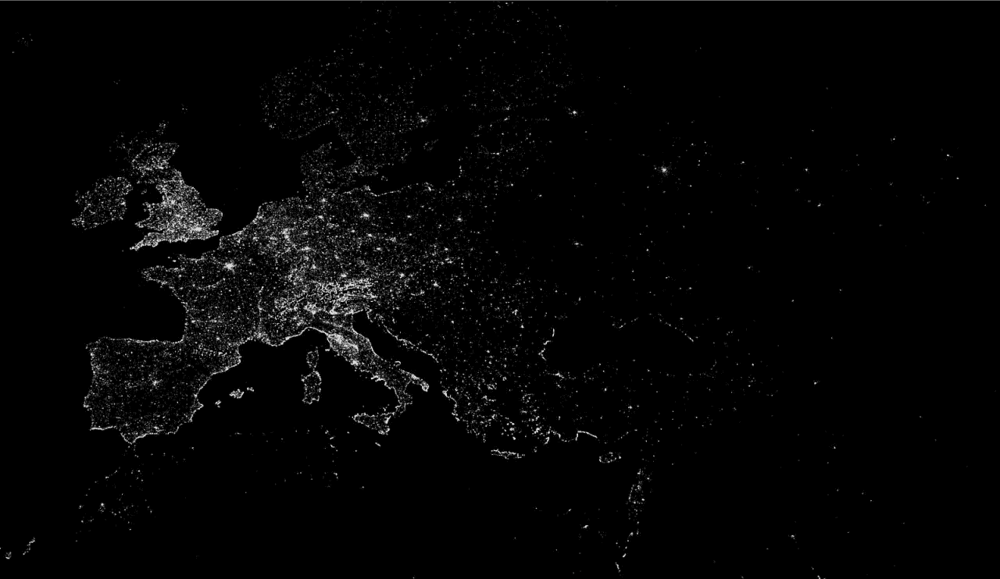

# 学习数据科学—第 2 部分:播客、博客

> 原文：<https://towardsdatascience.com/learning-data-science-part-2-podcasts-blogs-8bed327eb1b5?source=collection_archive---------7----------------------->

Photo by [fabio](https://unsplash.com/@fabioha?utm_source=medium&utm_medium=referral) on [Unsplash](https://unsplash.com?utm_source=medium&utm_medium=referral)

这是“学习数据科学”的第二部分，是我在尝试沉浸于数据科学时收集的链接和资源。我开始这样做是为了跟踪所有我觉得有用的学习资源，但如果它也能对任何人有所帮助，那就是“一举两得”。在第一部分“[学习数据科学——第一部分:MOOC、Youtube、Ted](https://medium.com/towards-data-science/learning-data-science-part-1-mooc-youtube-ted-20617dbb7f4b) ”中，我列出了大部分视频资源。尽管视觉辅助工具在学习时很有帮助，但我想有效地利用我的通勤时间，我经常在地铁里收不到信号，或者流式视频对我的移动数据使用来说有点太重。

# 播客

[partial Derivative 的 Chris Albon](https://medium.com/@chris.popily) 在 Metis 举办的现场演讲中总结了听播客如何帮助你，[“揭开数据科学的神秘面纱”](https://www.thisismetis.com/demystifying-data-science)(现场演讲于 2017 年 9 月 27 日举行，但你仍然可以通过在他们的网站上注册来获得录音。我不确定是否会有录音，所以我在英国时间下午 3 点到凌晨 3 点看了 12 个小时的演讲…)。播客是关于“让你的大脑一遍又一遍地听到这些术语”。当然，30 分钟的播客不会让你成为专家，但你会听到实际的数据科学家如何谈论一个主题，他们如何将其应用于实际问题。在播客的一集之后，你会比以前更好地了解这个话题。

*   [数据怀疑论者](https://dataskeptic.com/)(特别喜欢迷你剧集，主持人 Kyle Polich 向联合主持人 Linh Da 非常直观地解释了各种数据科学概念，没有数学或计算)
*   [偏导数](http://partiallyderivative.com/)(很难过看到 2017 年 9 月 5 日最后一集之后就停了。听着听着，我感觉就像在听数据科学家们在酒吧里就该领域最近的话题聊天。我在非常有趣和轻松的方式中学习如何在各种情况下应用特定的 ML 算法，有什么限制。再次，悲伤地看到它停止了)

The hosts of Partially Derivative: from left, Jonathon Morgan, Vidya Spandana, Chris Albon

*   [线性题外话](http://lineardigressions.com/)(两位主持人之间的对话，凯蒂·马龙是数据科学家，本·贾菲是 UI 工程师。很好地结合了对数据科学的不同观点，如果您是精通技术的数据科学家新手，即使没有某个主题的专业知识，您也可以关注他们的谈话)
*   学习机器 101 (这是一个非常有教育意义的播客，专注于机器学习，如果你感兴趣，我建议你从第一集开始听，因为它建立了你对该领域历史发展和理论的基本理解)
*   [统计+故事](http://www.npr.org/podcasts/530134710/stats-stories)(这更像是一个统计和新闻播客。考虑到许多数据科学概念来自统计学，学习如何像统计学家一样思考是非常有用的)
*   [或多或少](http://www.bbc.co.uk/programmes/p02nrss1/episodes/downloads) (BBC 关于我们身边的数字和统计的播客。同样，我不是专门研究数据科学的，但看到统计数据和我们日常生活之间的联系非常有帮助。凭借一点自己的创造力，您可能会为您的数据科学项目找到一个好主题)

# 博客

有这么多好的博客，要跟上你感兴趣的每一个博客并不容易。这就是 RSS feeder 派上用场的地方。我最近发现了 [Feedly](https://feedly.com/) ，它让我不用翻找书签，也不用查看是否有博客更新。您只需复制并粘贴博客地址，然后点击“关注”。然后你可以去 Feedly 查看你关注的所有博客的更新。(我是免费会员，我可以添加的来源仅限于 100 个)

## 出版商的博客

*   [数据博客——卫报](https://www.theguardian.com/data)(英国《卫报》的博客分享他们新闻背后的数据故事)
*   [数据— O'Reilly Media](https://www.oreilly.com/topics/data) (关于广阔数据前景的优质文章)

the O’Reilly tarsier

## 组织的博客

*   [脸书研究博客](https://research.fb.com/category/data-science/)(他们有关于数据科学的博客，你可以访问各种主题的研究论文；自然语言处理，计算机视觉等。)
*   [AWS AI 博客](https://aws.amazon.com/blogs/ai/)(作为新手，我还没机会用 AWS 跑模型。供我个人以后参考)
*   [Tableau 博客](https://www.tableau.com/about/blog)(还是那句话，我没用过 Tableau，但是很感兴趣)
*   [彭博——图形](https://www.bloomberg.com/graphics)(数据可视化非常酷的经济新闻故事。有时他们会分享方法，并展示他们是如何得出这些指标的)
*   [GDS 博客](https://gdsdata.blog.gov.uk/)(英国政府数字服务的数据博客)的数据。了解政府如何组织和使用数据的良好来源)

## 数据社区/门户

*   [fivethirtyeeight](http://fivethirtyeight.com/)(美国著名统计学家内特·西尔弗的网站。擅长政治和体育。有时他们在 Github 页面中有用于分析的数据集。)

Fiverthirtyeight styled graph is very famous, there’s even a style sheet replicating this style in Matplotlib

*   [分析 Vidhya](https://www.analyticsvidhya.com/) (专注于数据科学的业务分析方面。可以找到教程、技巧和窍门。关于各种数据科学应用的分步教程非常有用)
*   [数据经济](http://dataconomy.com/)(本网站更关注数据科学的总体环境，将数据放在上下文中，而不是特定主题的教程)
*   [KDnuggets](http://www.kdnuggets.com/) (著名的数据门户网站，涵盖广泛的话题。新闻、教程等)
*   [Dataquest 博客](https://www.dataquest.io/blog/)(这来自一个在线数据科学课程。擅长教程类型的文章。)

## 个人

*   [Jer Thorp: blprnt.blg](http://blog.blprnt.com/) (数据艺术家，我在之前的帖子里已经介绍过了。最先进的数据可视化)

A map of hotels in Western Europe, showing the density in capital cities like Paris, London, Madrid and Rome (Image courtesy Jer Thorp; flickr.com/photos/blprnt/)

*   [数据科学 101](http://101.datascience.community/) (“揭开数据科学的神秘面纱”的演讲者之一，Ryan Swanstrom。关于如何学习数据科学的良好资源)
*   兰德尔·s·奥尔森博士(我第一次知道他是在他写的一篇 538 年的文章中。在他的个人博客中，他分享了数据科学的思维过程，以及他如何将数据科学应用于现实生活中的问题)

## 个人兴趣(时尚和零售领域的数据科学)

*   [Net-A-Porter 技术博客](http://techblog.net-a-porter.com/)
*   Lyst 的工程博客
*   [Etsy technical 博客:代码如同手艺](https://codeascraft.com/)
*   [Stitch Fix 技术博客](http://multithreaded.stitchfix.com/blog/)

我很快就要在伦敦大会上开始一个新兵训练营课程，我想我会很忙来跟上所有的课程工作和项目，但如果可能的话，我会试着分享我的学习之旅。