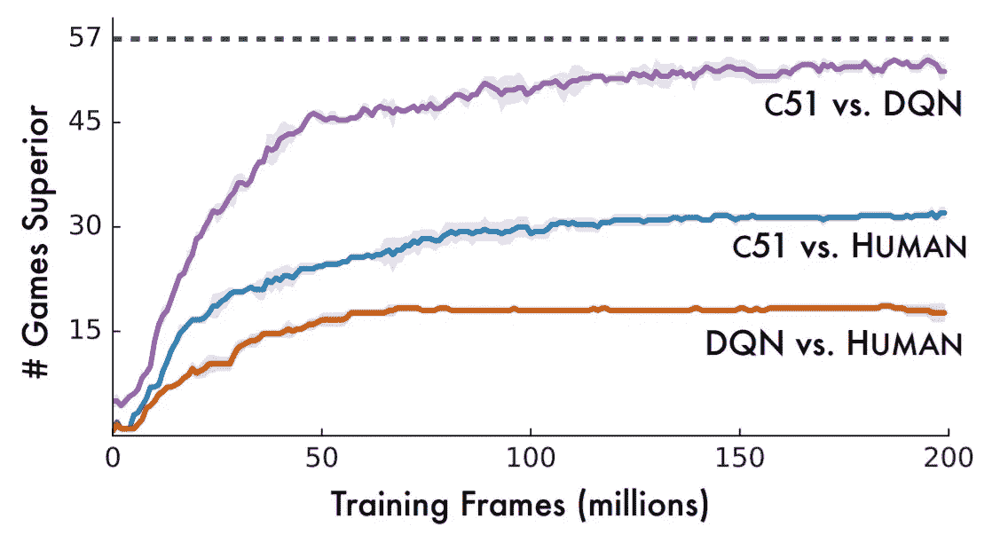
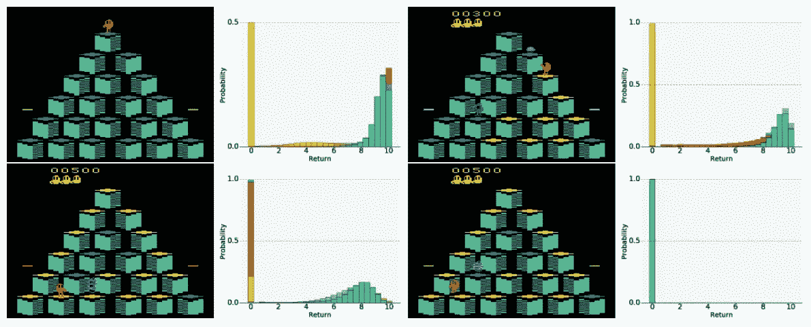

# 学习奖励分配导致 RL 的艺术状态

> 原文：<https://towardsdatascience.com/learning-distributions-over-rewards-leads-to-state-of-the-art-in-rl-5afbf70672e?source=collection_archive---------11----------------------->

最近在 DeepMind 中完成的[工作](https://arxiv.org/pdf/1707.06887.pdf)“强化学习的分布式视角”展示了许多 Atari 游戏中具有特殊技巧的最新成果。他们训练了一个神经网络来提供可能的奖励分布，而不是单一的价值。

基本上这是一个很好的老深度 Q 网络。但是，它并没有逼近预期的未来回报值，而是生成了可能结果的整体分布。这种变化背后的主要动机是分布可能有几个峰值。仅仅将它们平均为一个期望值可能是不合适的，并导致不充分的结果。

他们用代表不同奖励值范围的分类变量的概率代替了 DQN 的输出。他们测试了不同数量的区间，分割了可能的值范围:5、11、21、51 和 51 个区间的表现远远优于其他区间。超出此范围的值被剪切到最后一个容器中。对学习算法进行了第二次修改，以处理分布贝尔曼方程。

与普通 DQN 相比，TensorFlow 实施所需的计算时间增加了约 25 %,但只需要一小部分训练步骤就可以实现卓越的性能。与 DQN 相比，在没有其他现代 RL 技术的情况下，这种方法几乎将具有超人性能的游戏数量增加了一倍:

您可以在原始论文中找到所有的数学和实现细节。虽然研究人员使用 DQN 作为基础，但更先进的模型可能会提供更好的性能。

## 它看起来像什么

行动中:

*最初发表于* [*认知混乱*](http://cognitivechaos.com/learning-distributions-rewards-leads-state-art-rl/) *。*