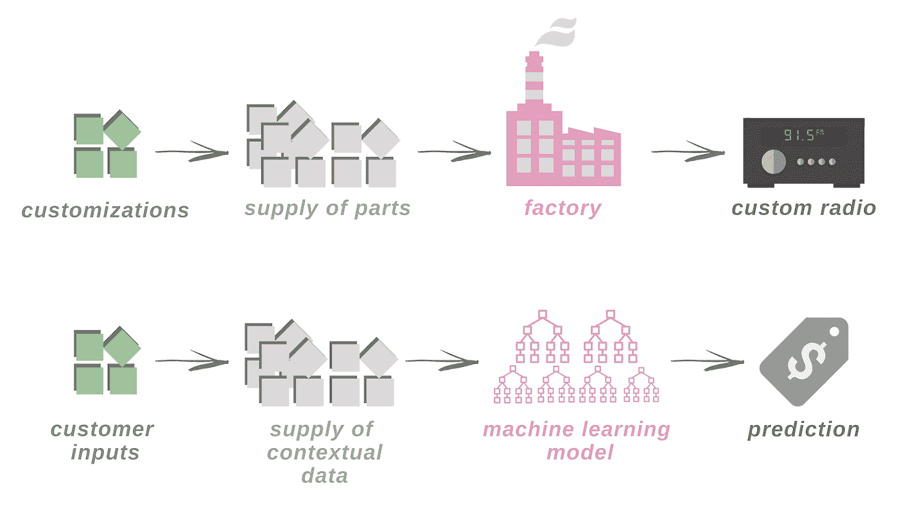
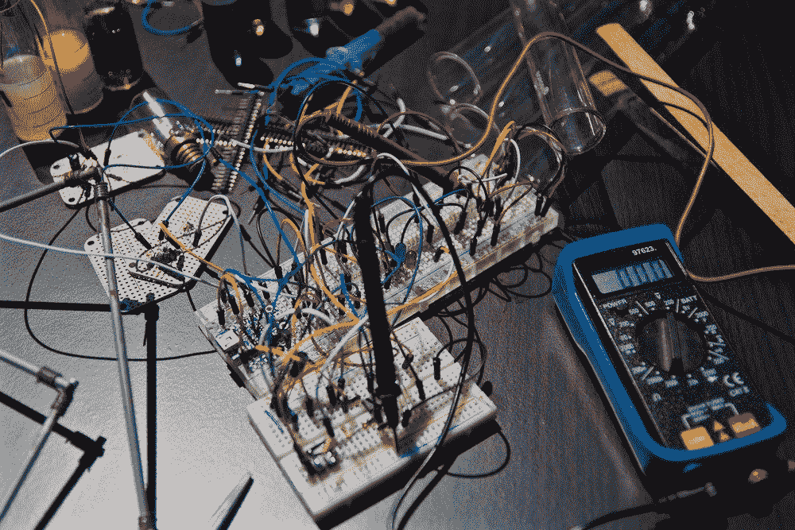

# 向机器学习:关于数据产品，传统制造业能教给我们什么

> 原文：<https://towardsdatascience.com/learning-from-machines-what-traditional-manufacturing-can-teach-us-about-data-products-e661f92c3594?source=collection_archive---------20----------------------->

## *从航空工程师转型为数据科学家的见解*

Photo by [Chris Leipelt](https://unsplash.com/photos/4UgUpo3YdKk?utm_source=unsplash&utm_medium=referral&utm_content=creditCopyText) on [Unsplash](https://unsplash.com/search/photos/airplane-dashboard?utm_source=unsplash&utm_medium=referral&utm_content=creditCopyText)

*这是一个两部分系列探索机器学习(ML)产品的* ***第一部分*** *。在第一部分中，我将实物产品和 ML 产品的生产进行了比较。在* [***第二部分***](/learning-from-machines-the-data-supply-chain-4380f420bb2c) *中，我讨论了为什么这些相似之处应该告知数据科学家如何进行产品开发。*

作为一个领域，数据科学非常新，管理该领域的规范仍在建立中。有大量的资源解释机器学习中涉及的数学、统计学和迭代逻辑。还有更多研究如何将机器学习作为一种***工具*** 来指导决策和解决业务问题——例如 A/B 测试和预测客户流失——或者作为一种*功能来优化用户体验——想想推荐系统和个性化的策划内容。但是，因为它在商业中不太常见，所以关于机器学习作为一种***产品*** 的讨论要少得多，因为它的主要目的是解决市场问题并直接产生收入，例如自动驾驶汽车、客户支持聊天机器人服务和自动化保险服务等。*

*在这一系列文章中，我以一种新的方式构建了机器学习产品概念，利用我在航空航天制造领域的背景来进行对比，以告知数据科学家和产品经理应该如何处理 ML 产品的开发和维护。*

# ***工厂类比***

*虽然这似乎违反直觉，但开发和维护机器学习产品的过程与构建物理产品比开发软件应用程序有更多的共同点。软件开发生命周期中通常缺少的是一个关键组件:数据供应链。这种缺失使得软件开发在某些方面变得更简单，因为拥有对产品不可或缺的数据意味着需要在产品的整个生命周期中考虑它。*

*那是什么意思？让我们从一个简单的类比开始，我发现这个类比有助于我的非技术朋友理解机器学习产品和物理产品之间的联系。*

*当你想要生产一个实体产品时——让我们使用飞机无线电，因为我曾经在一家制造这些产品的公司工作过——你需要设计和建造工厂，培训员工如何组装无线电，管理制造无线电所需的零件供应，整合任何客户定制，制造无线电并将其交付给你的客户。同样，在构建 ML 产品时，您需要训练模型(即设计/构建工厂并培训工人)，收集客户输入(定制)并丰富这些输入(管理零件供应)以生成预测(即收音机)。*

*因为有如此多高度相互依赖的活动部件，一个功能的故障会导致其他功能的故障。你可以拥有拥有高端设备和顶级劳动力技能的最先进工厂，但不可靠或不充分的供应链(即数据缺失或数据不正确)最终会让你的产品沉没。*

**

*Building a custom aircraft radio versus providing customer predictions*

*相比之下，开发软件产品的过程要复杂得多。这类似于设计和构建一种体验。以一个销售服装的网站为例。一旦建成，有一个维护方面涉及到保持其运作。您可能希望定期更换内容或添加新功能来增强用户体验，但您通常不会依赖外部来源的数据流来维持网站的运行。虽然会有实物库存的供应链，但这与网站运营是分开的；网站本身根本不需要专门的供应链。因此，供应管理方面在软件开发生命周期框架中并不存在。一旦数据产品依赖于持续的输入数据，框架就需要遵循物理产品的供应管理实践，否则您将被迫进行被动管理。*

# ***深入观察***

*回到实物产品的类比，让我们来看几个现实生活中的场景，说明为什么实物产品的比较如此有用，特别是在涉及供应链管理时。*

*有一段时间，我在一家生产无线电的航空公司做采购员。有一天，我们发现有一批坏的开关集成电路(一种电子芯片)。大部分产品都没有通过测试，我们需要购买更多的产品来生产一台不太受欢迎的收音机。当我与我们的供应商核实时，我发现他们不再销售这种芯片。更糟糕的是，其他供应商已经将其列为过时产品。制造商两年前就已经停止生产了，我们对此一无所知。我们已经做了 12 年的收音机。我们需要尽快更换芯片！*

*我们能够在一个子组件上做一个小的重新设计，以包含一个更新、更小的芯片。这需要暂停生产，直到新的设计到位，在重新开始生产之前重新测试产品，并加班加点完成订单，以兑现客户的承诺。对于一个更保守的行业，同样的产品销售几十年，这种情况并不少见。*

**

*Photo by [Nicolas Thomas](https://unsplash.com/photos/3GZi6OpSDcY?utm_source=unsplash&utm_medium=referral&utm_content=creditCopyText) on [Unsplash](https://unsplash.com/search/photos/experiment?utm_source=unsplash&utm_medium=referral&utm_content=creditCopyText)*

*虽然这可能不会立即显而易见，但这种情况实际上与数据科学家可能遇到的情况非常相似。最近，我在检查一个原型模型的数据更新。我想验证我们使用的所有外部上下文数据都是新鲜的，所以测试预测将是准确的。在检查中，我注意到有一个资源已经过时了，更糟糕的是，我们再也无法访问那个资源了。我们需要尽快替换数据集！*

*虽然我们能够找到新的可比数据来源，但这些数据并不完全匹配。就像前面的飞机无线电示例一样，替换需要重新培训和重新测试新的 ML 模型，并重新运行我们的所有评估指标来检查影响。幸运的是，这不是在真实环境中托管的；我只能想象不得不将生产模型离线以修复数据质量或数据检索紧急情况的噩梦。这将是难以置信的破坏性。有一些最佳实践和检查可以帮助防止这些问题，但是我将把这个讨论留到以后。*

*从这些例子中，物理和 ML 产品开发之间的一些更深层次的相似之处应该是显而易见的。两者:*

*   *要求持续**供应高质量的投入**(或零件)，以便持续生产/交付；*
*   *受到供应链的**摆布(特别是在产品依赖非内部生成的数据的情况下)；***
*   *随着时间的推移，要求**根据需要重新设计**，以满足可持续性和/或性能需求。在这两种情况下，这通常严重依赖于供应链。*

*更重要的是，这些例子暗示了管理开发的需要，要意识到供应链如何影响产品生命周期的各个阶段。就像在制造业中一样，依赖于数据供应的数据产品需要从一开始就考虑到这些数据来进行管理。这是我将在这个由两部分组成的系列的下一篇文章中讨论的内容，在这篇文章中，我将探索用于最小化风险的传统供应链管理方法，并将其转化为数据科学产品。*

*总之，机器学习和数据依赖系统的性质使你面临其他软件应用程序中通常看不到的独特风险，但这些风险不是该行业独有的。它们在制造业中以类似的形式存在，供应链战略的概念可以直接应用于数据科学。管理好数据风险就是确保你的 ML 产品持续成功。这就是数据供应策略的存在或缺乏能够成就或摧毁你的产品的地方。*

**嗨，我是* [***凯蒂·拉泽尔-费尔曼***](https://www.linkedin.com/in/klazellfairman/) *。我是纽约市*[***geo phy***](https://geophy.com/)*的数据科学家。对这个帖子有疑问或者对这个话题很好奇？欢迎在下面评论或者* [*联系我*](https://twitter.com/k_lazell) *！**