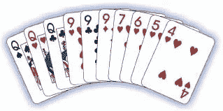
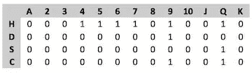
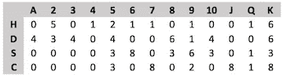
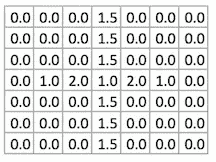

# 人工智能学习金拉米，第一部分

> 原文：<https://towardsdatascience.com/learning-gin-rummy-part-i-75aef02c94ba?source=collection_archive---------5----------------------->

在我关于主题的[上一篇文章中，我描述并包含了一个手工构建的玩金拉米的系统的代码，该系统只考虑当前可见的牌，而不考虑对手已经捡起或埋在弃牌堆中的先前可见的牌的记忆。我的直觉是，如果你在策略中包含已知牌的历史，你应该可以玩得更好，并且可靠地击败我手工构建的策略。](https://medium.com/@markfasciano/computer-gin-rummy-27-years-later-ad3c2325315c)

理解手牌构建策略的关键首先是手牌和游戏状态的表示，其次是手牌评估函数。

## 表现

金拉米世界的表示是一个 4 x 13 的矩阵，对应于一副牌中的四种花色，以及花色中牌的值，从 a 到 k。例如，拿这手(赢的)十张牌来说:



这将由矩阵表示(其中 1 表示您有该卡):



游戏状态也是 4×13 矩阵，然而代替 0/1，有九种状态对应于哪个玩家持有哪些牌，哪些牌已经被放在弃牌堆中，哪些牌留在库存中(面朝下的牌堆)。这些状态是:

```
## Card states:          
## 0 Stock         
## 1 Player 0 card that was stock      
## 2 Player 0 card that was discard      
## 3 Player 1 card that was stock      
## 4 Player 1 card that was discard      
## 5 Player 0 top-discard       
## 6 Player 0 discard       
## 7 Player 1 top-discard       
## 8 Player 1 discard 
```

一个游戏状态的例子，玩家 0 刚刚用上面说明的那手牌赢了游戏:



最后，还有另一种表示方法，那就是股票牌的顺序(stockOrder)，它表示为一副牌中 52 张牌的列表，这是一个 4 x 13 矩阵的简化版本。游戏开始时，洗牌相当于:

```
stockOrder = np.arange(52)
```

## 手动评估

手牌评估功能为手牌中的每张牌赋值，值越高的牌越有价值，有助于组成得分牌。价值较低的牌是你可以弃掉的牌。

手动构建的手牌评估函数背后的思想是，如果一张牌在花色中具有水平最近邻，以构成顺子得分(例如，上面手牌中的红心 4 到 7)，则该牌获得更高的值。此外，如果一张牌有垂直的相邻牌(例如三个皇后)，它的价值也更高。

手动构建的手牌评估函数使用卷积矩阵来评估手牌中的每张牌。



这意味着，根据水平相邻的牌，增加的价值最大，而相同价值不同花色的牌也很有价值。

## 战略

每回合，玩家必须做出两个决定:

1.  **取货**:你是要正面朝上的丢弃，还是正面朝下的股票卡？
2.  **弃牌**:你手里的 11 张牌你会弃哪张？

手工构建策略是**拾取**步骤的一个简单规则:

1.  用最大弃牌评估当前手牌
2.  如果最上面的弃牌是你手中价值最低的牌，则取牌。否则拾取丢弃。

更简单的规则是**弃牌**步骤:评估你手中的 11 张牌，弃掉价值最低的牌。

## 手工打造的策略有什么好的吗？

在我和我的两个孩子艾娃和卢卡参加的一场非正式锦标赛中，手工打造的策略极具竞争力。这是玩金拉米游戏的最佳策略吗？大概不会。手工构建的策略有点愚蠢，因为它忽略或“忘记”了以前玩过的牌。我知道如果我的对手在收集 a，我会尽量避免丢弃 a。手工构建的策略不会这样做。

我可以认真考虑一下，自己构建一个考虑历史牌的手牌评估函数的扩展，但我想开发一个自动学习这种手牌评估的系统。是时候学习人工智能技术了。下一篇[将会讲述我是如何接近这个](https://medium.com/towards-data-science/ai-learning-gin-rummy-part-ii-enter-google-tensorflow-7338ef93f2ed)的。