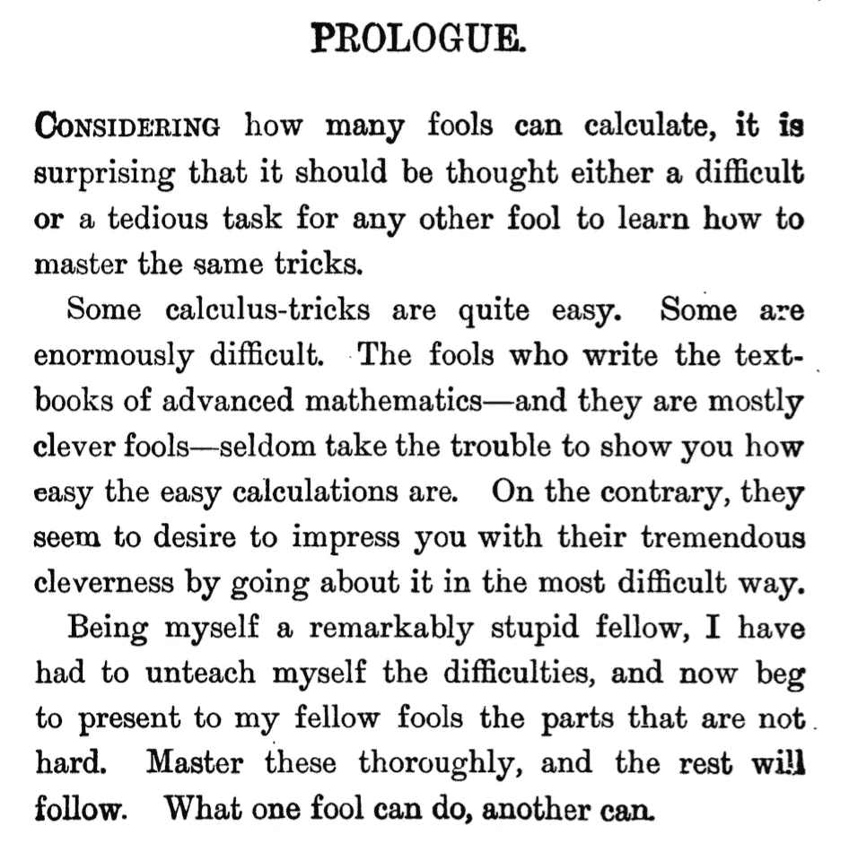
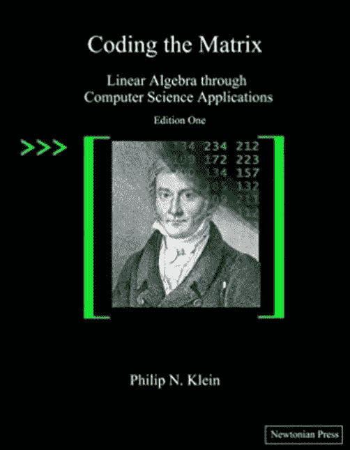

# 为机器学习和深度学习学习数学

> 原文：<https://towardsdatascience.com/learning-maths-for-machine-learning-and-deep-learning-5509c097ee83?source=collection_archive---------2----------------------->

虽然我在攻读工程学位时确实学了很多数学，但当我想进入机器学习领域时，我已经忘记了大部分。毕业后，我从未真正需要过任何数学。我做了很多依赖逻辑的 web 编程，我可以诚实地说，每一个标题中带有“管理”一词的系统都让我损失了三分之一的数学知识！我已经为学习管理系统、内容管理系统和客户关系管理系统编写了扩展程序——我将让您来计算我在使用这些系统后获得了多少数学应用。目前，我已经掌握了很好的数据科学技能，可以使用各种 ML 和 DL 算法。我已经成功完成了许多 MOOCs 课程(例如，Udacity 的深度学习基础课程和吴恩达的新 Coursera 课程)。我会用 Scikit Learn，TensorFlow，Kera 的。….但是我对创造新的算法变种有粗略的想法。目前，我真的想创建一种新的交互式主题建模算法。由于缺乏数学知识，我感到进退两难。在我试图重新学习一些基础数学的旅行中，我遇到了几本由具有解释艺术的人写的书。这些书产生了巨大的不同，因为它们能够以非常简单的方式传达复杂的概念。我写这篇博客是为了分享这些伟大的资源，尤其是对程序员而言。这些书涵盖了微积分和线性代数。我还没有找到一本等效的概率和统计书籍——如果你知道一本，请留下评论或发推文。

# 汤普森使微积分变得简单

从一本 1914 年写的书里学微积分！书的 [pdf 是免费的。这本书简直太棒了。英语是有点老的风格，但解释是永恒的。汤普森让微积分变得超级简单。成本函数的优化是 ML 和 DL 的核心，这本书将帮助你理解最小化的基础。那些渐变体面的更新规则将不再看起来像魔术。看看序言就知道了——它为这本书的其余部分定下了基调……](http://djm.cc/library/Calculus_Made_Easy_Thompson.pdf)

The Prologue from Calculus Made Easy by S. Thompson

# P. N .克莱因的矩阵编码

大多数线性代数书从简单开始，但是像图像、基、维数、正交化、特征向量这样的概念是以完全抽象的方式介绍的。大多数线性代数书籍甚至没有介绍真实世界的应用，并且很难看出你在哪里或者为什么要使用数学。矩阵乘法是一个很好的例子，我学到了一些东西，但从来没有真正理解(即，为什么它不是一个元素一个元素地执行)。[编码矩阵](http://codingthematrix.com/)不一样！您实际上可以在提高 Python 编程技能的同时构建自己的线性代数库！这本书充满了实际的计算机科学应用(例如，固定白板照片的角度)。

Coding the Matrix — the best Linear Algebra book ever!