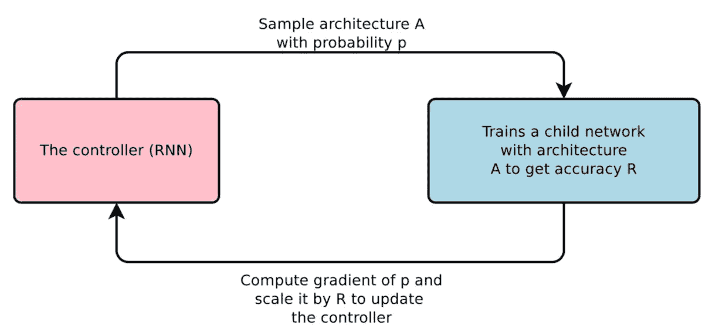
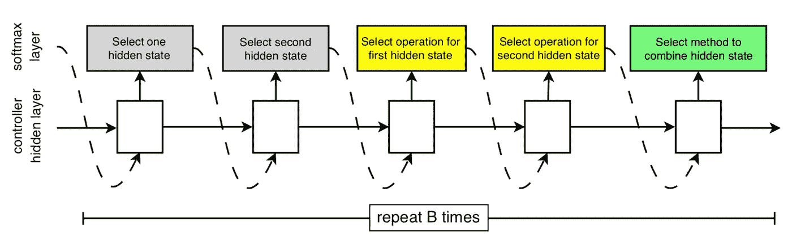
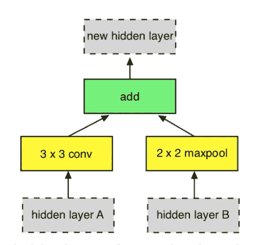
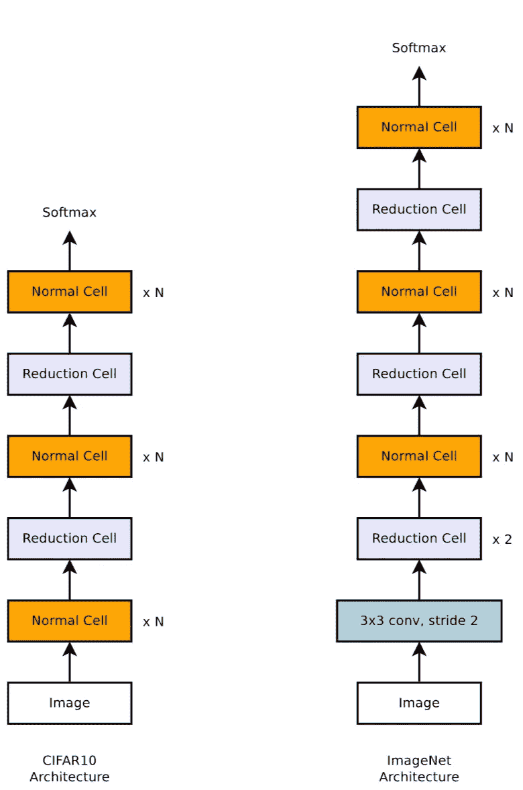
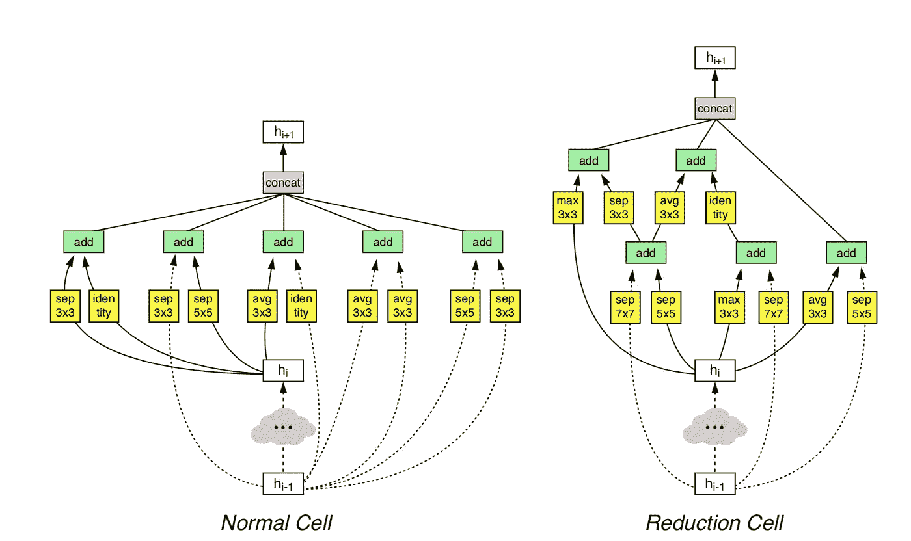
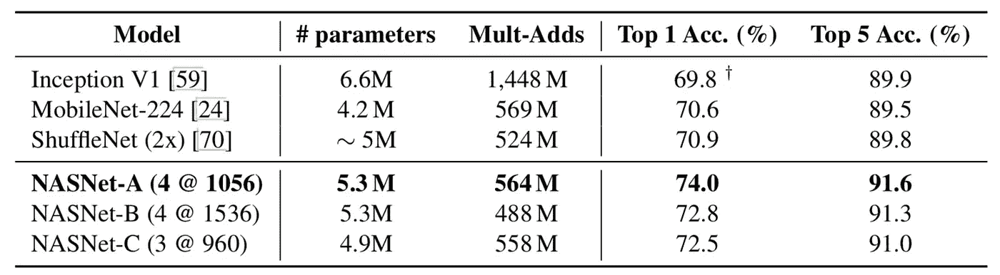
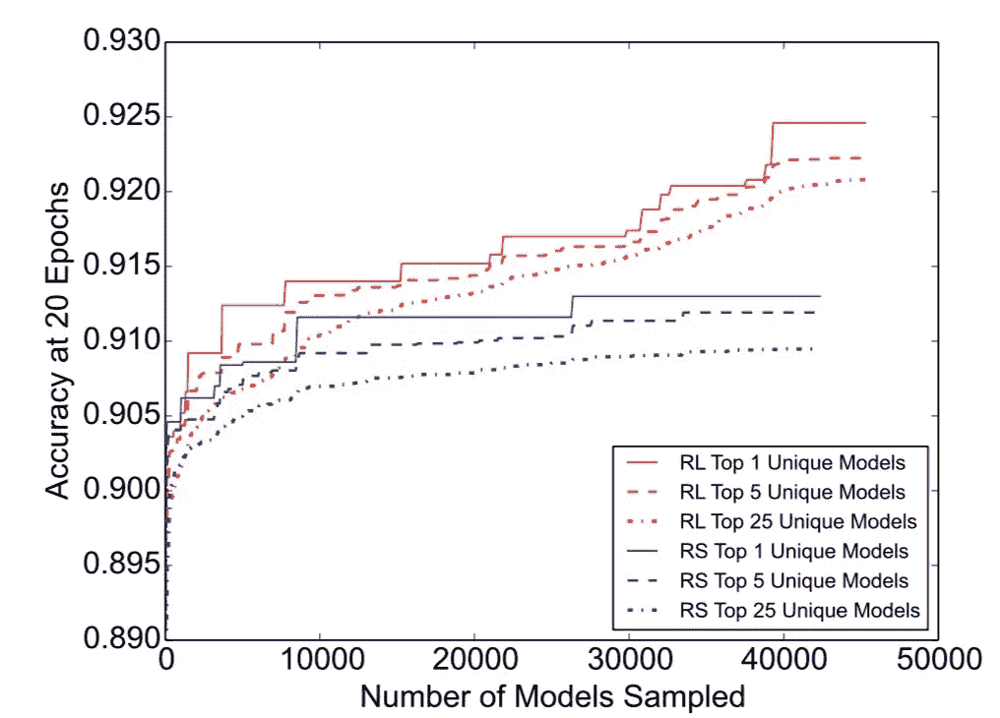

# 学习神经网络架构

> 原文：<https://towardsdatascience.com/learning-neural-network-architectures-6109cb133caf?source=collection_archive---------12----------------------->

## *如何自动创建神经网络*

上次我们谈到了[学习的限制](https://medium.com/@culurciello/at-the-limits-of-learning-46122b99dfc5)，以及消除对神经网络架构设计的需求将如何导致更好的结果和深度神经网络的使用。

在这里，我们将分析所有最近的学习神经网络架构的方法，并揭示利弊。这篇文章会随着时间的推移而发展，所以一定要不时登录以获取更新。

# 首先…

学习一个神经网络架构意味着什么？这意味着尝试以最佳方式组合所有的[神经网络构建模块](https://medium.com/@culurciello/neural-networks-building-blocks-a5c47bcd7c8d)，以在某些任务中获得最高性能，比如说:对 ImageNet 图像进行分类。

[这里你可以看到](/neural-network-architectures-156e5bad51ba)过去 10 年左右所有最近的神经网络架构。所有这些建筑都是人类凭直觉和原始脑力精心打造的。这是人类最大的智慧，但是正如你所想象的，它并不总是导致最好的解决方案。正如[我们在这里提到的](https://medium.com/@culurciello/at-the-limits-of-learning-46122b99dfc5)，这不是进步的方式，因为我们将受到人类思维所能想到的限制，并且永远不会完全搜索神经架构的大空间。想想最近*象棋*和*围棋*的游戏发生了什么！人类被搜索最佳行动和策略的神经网络算法打得落花流水。

> 神经网络算法将在神经结构搜索领域击败人类，就像他们在围棋和国际象棋中击败人类一样！

所以要走的路真的是使用神经网络来寻找越来越好的神经架构。实际上，我们将使用相同的梯度下降技术来引导神经结构的巨大搜索。

但是正如你所看到的，有许多可能的神经构建模块，搜索空间是巨大的。想象我们已经尝试了所有可能的卷积层:不同数量的输入输出平面、膨胀、深度、池化、非线性等…搜索空间可以从 10 个⁴到 10 个⁸or [更多](https://arxiv.org/abs/1712.00559)选项！这是一个巨大的空间。想象一下，我们花 1 个小时来训练和测试一个架构……那么我们将需要 10 个⁴小时，或者永恒！

# 梯度方法

基于控制器的方法，如 [Zoph，Le (2017](https://arxiv.org/abs/1611.01578) )使用递归神经网络来创建新的架构，然后用强化学习来测试它们。

An overview of Neural Architecture Search

他们将神经网络的连接和结构编码成可变长度的字符串，并使用 RNN 控制器来生成新的架构。“子网络”是在数据集上训练的，以产生训练和验证精度。验证准确度被用作训练控制器的奖励信号。随着控制器随着时间的推移在搜索中改进，这又在接下来的迭代中产生更好的神经网络。

[刘看着艾尔通。(2017)](https://arxiv.org/abs/1712.00559) 使用启发式搜索，从简单的神经网络结构开始，逐步增加复杂度。本文基于[Zoph et al(2018)](https://arxiv.org/abs/1707.07012)的工作。在后一篇论文中，他们再次使用相同的 RNN 控制器来搜索架构:

Controller model architecture for recursively constructing one block of a convolutional cell.

该控制器产生一系列输出，这些输出对上图顶部的每个元素进行编码，基本上包括:使用前两层，对两个输入中的每一个应用哪种操作，以及用哪种方法将它们的两个输出合并成一个输出。

为了减少可能的参数组合数量，他们使用下图所示的固定构造块架构。该区块可以实现[类残差](/neural-network-architectures-156e5bad51ba)层和[类 Google net](/neural-network-architectures-156e5bad51ba)层。它们允许 RNN 控制器为每层找到多个块，通常是 5 个，这是有效性和搜索空间之间的一个很好的折衷。

Example constructed block

在这项工作中，他们还将可能的基本构建模块的数量限制在以下列表中:

*   身份；1x7 然后 7x1 卷积；1×3 然后 3×1 卷积；3x3 平均池化；3x3 或 5x5 或 7x7 最大池化；1x1 或 3x3 卷积；3×3 或 5×5 或 7×7 深度方向可分离卷积；3x3 扩展卷积

Scalable architectures for image classification consist of two repeated motifs termed Normal Cell and Reduction Cell.

他们创造了如左图所示的架构。基于以前的架构历史，他们决定整体架构应由两种类型的单元组成:(1)返回相同维度的特征图的卷积单元或*正常单元*；以及(2)返回高度、宽度或*缩减单元* l 缩减两次的特征图的卷积单元。注意，在这些架构中，每当空间激活大小减小时，它们还会将输出中的滤波器数量增加一倍，以保持大致恒定的隐藏状态维度。还要注意的是，左图中的这个架构有点类似于 ResNet 中的[模块，包括普通和简化单元的选择。](/neural-network-architectures-156e5bad51ba)

为了训练控制器 RNN，他们使用强化学习。一旦 RNN 建造了一个建筑，它就被训练了。利用验证数据集中的准确性，产生奖励信号，并用于向 RNN 控制器提供反馈，最终训练它在建筑搜索方面越来越好。由于奖励信号是不可微分的，他们使用策略梯度方法，如[加强](http://www-anw.cs.umass.edu/~barto/courses/cs687/williams92simple.pdf)，并通过使用以前验证奖励的移动平均值减去当前验证值。这有效地充当了验证准确性的增量改进度量。

有趣的是，在下图中你可以看到算法找到的最佳细胞。它们似乎是更复杂版本的 Inception-ResNet 层。

Architecture of the best convolutional cells (NASNet-A) with B = 5 blocks identified with CIFAR-10

结果很好！他们发现，与人类手工制作相比，大型和小型神经网络都非常高效和高性能。下面我们报告一个小模型的表格。

Performance on ImageNet classification on a subset of models operating in a constrained computational setting, i.e., < 1.5 B multiply-accumulate operations per image

最后，本文对强化学习搜索相对于随机搜索的性能做了一些有益的评论。在过去的努力中，击败随机搜索出人意料地困难。RL 搜索更好，可以找到很多更好的模型，但随机搜索的效果也令人惊讶。毕竟这就是创造我们人类大脑的东西，但在此之前只花了几十万年和 50 亿年…

Comparing the efficiency of random search (RS) to re- inforcement learning (RL) for learning neural architectures

总的来说，这是一个很有指导意义的模型搜索，但方法和结果可以用于许多不同类型的神经网络。我们希望在接下来的几年里看到这项技术得到更多的应用。一个缺点是所使用的模型架构非常类似于 ResNet 块架构。此外，构造的块仅捕获可能集合的子集。这当然都是为了[减少搜索空间](https://arxiv.org/abs/1712.00559)并使问题更易处理，但是它并没有例如推广到编码器-解码器架构或更小的应用。为此，人们将不得不创建新的构造块和基础网络。

此外，对体系结构的搜索计算量非常大，并且花费大量时间。你需要 500 个 GPU(贵的像英伟达 P100！)而且你需要在 4 天内测试 20，000 个神经网络才能[找到结果](https://arxiv.org/abs/1712.00559)。

# 遗传搜索

遗传搜索是穷举搜索方法，创建不同的神经架构，然后逐一尝试。因此，它们经常受到无向导搜索的缓慢过程的限制。例如 Wierstra 等人(2005 年)、Floreano 等人(2008 年)、Stanley 等人(2009 年)。这些方法使用进化算法来搜索新的架构。

[神经进化](https://eng.uber.com/deep-neuroevolution/)是一种最近在强化学习算法中获得成功的方法。它最近在强化学习任务中取得了成功，而其他算法(DQN、A2C 等)却没有取得成功。)失败了。

# 作为网络架构搜索进行修剪

[最近，神经网络的修剪作为一种神经网络结构搜索技术被重新审视](https://arxiv.org/abs/1810.05270)。本文展示了两个主要的见解:1)可以从修剪过的神经网络开始，并从头开始训练它；2)修剪因此可以被视为类似于网络结构搜索的优化神经网络结构的技术。

注意，修剪产生的结果不如上面讨论的基于梯度的搜索技术好。

# 关于作者

我在硬件和软件方面都有将近 20 年的神经网络经验(一个罕见的组合)。在这里看关于我:[媒介](https://medium.com/@culurciello/)、[网页](https://e-lab.github.io/html/contact-eugenio-culurciello.html)、[学者](https://scholar.google.com/citations?user=SeGmqkIAAAAJ)、 [LinkedIn](https://www.linkedin.com/in/eugenioculurciello/) 等等…