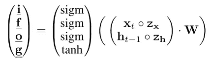
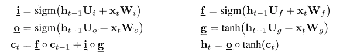

# [学习笔记]循环网络中的辍学—第 2 部分

> 原文：<https://towardsdatascience.com/learning-note-dropout-in-recurrent-networks-part-2-f209222481f8?source=collection_archive---------1----------------------->

## 喀拉斯和 PyTorch 的经常性辍学实施

在进行实验之前，我想详细检查一下实现，以便更好地理解和将来参考。由于篇幅限制，我用`#...`省略了对当前讨论不重要的行。

[https://keras.io/img/keras-logo-small.jpg](https://keras.io/img/keras-logo-small.jpg)

## 克拉斯

这里我用的是 *Tensorflow 1.3.0* 自带的 Keras。

实现主要驻留在`LSTM`类中。我们从`LSTM.get_constants`类方法开始。为`Recurrent.call`方法中的每个批处理调用它，以提供丢弃掩码。(输入辍学率和经常性辍学率已作为实例属性存储在`__init__`。)

输入以 ***(样本，时间(用零填充)，input_dim)*** 的形式排列。上面的代码块创建形状为 ***(samples，input_dim)*** 的输入掩码，然后随机将元素设置为零。因此，对于每个序列/样本，新的掩码**被采样，与论文【1】中描述的一致。**

注意**创建了四个不同的掩模**，对应于 LSTM 的四个门。只有 LSTM 支持这个设置。(更多细节见下文)。

同样，上面创建了四个形状为 ***(samples，hidden_units)*** 的循环遮罩。

接下来我们转向`LSTM.step`方法，该方法在每个时间步依次执行:

Keras 有 [3 个 LSTM](https://github.com/tensorflow/tensorflow/blob/v1.3.0/tensorflow/contrib/keras/python/keras/layers/recurrent.py#L140) 实现，默认为实现 0:

> 实现:{0、1 或 2}之一。如果设置为 0，RNN 将使用使用更少、更大矩阵乘积的实现，从而在 CPU 上运行更快，但消耗更多内存。如果设置为 1，RNN 将使用更多的矩阵产品，但较小的，因此运行速度较慢(实际上可能在 GPU 上更快)，同时消耗较少的内存。如果设置为 2(仅适用于 LSTM/GRU)，RNN 会将输入门、忽略门和输出门组合成一个矩阵，从而在 GPU 上实现更省时的并行化。注意:RNN 辍学必须为所有门共享，导致稍微减少正规化。

实现 2 对应于捆绑权重 LSTM。上面的代码块实现了 dropout，就像这个公式[1]一样:

Dropout in Tied-weight LSTM

请注意它是如何只获取第一个遮罩并丢弃其余的(三个遮罩)的。这是因为这个公式要求所有门共享 RNN 辍学。

看来实施 *0* 和 *1* 在如何应用输入压差方面有所不同。在实现 *0* 中，转换后的输入在`step` 方法之外预计算，而在实现 *1* 中，输入被丢弃并在`step`内转换。

(注意每个门如何使用它自己的下降掩码，以及如何为每个门组合转换的输入和隐藏状态。)

就是这样。实现没有任何惊喜，所以你[可以放心使用](https://keras.io/layers/recurrent/#lstm) `[dropout](https://keras.io/layers/recurrent/#lstm)` [和](https://keras.io/layers/recurrent/#lstm) `[recurrent_dropout](https://keras.io/layers/recurrent/#lstm)` [参数](https://keras.io/layers/recurrent/#lstm)。你唯一需要考虑的可能是是否使用实现 *2* 而不是 *0* 来加快速度。

(目前 Keras 似乎不提供[1]中描述的嵌入丢失。不过，我认为你绝对可以为此编写一个自定义层。)

[http://pytorch.org/tutorials/_images/pytorch-logo-flat.png](http://pytorch.org/tutorials/_images/pytorch-logo-flat.png)

## PyTorch

正如在第 1 部分中提到的，PyTorch 不提供对变化的辍学的本地支持。我们将使用来自[*sales force/awd-lstm-lm*](https://github.com/salesforce/awd-lstm-lm/)*项目的实现。(此部分针对 PyTorch 0.2.0 版本)*

****锁定输出*** 可用于对每个时间步长应用相同的下降掩码(如输入下降):*

*PyTorch 一般支持两种序列张量排列: ***(样本，时间，输入 _ dim)******(时间，样本，输入 _dim)*** 。上述代码块是为后一种安排而设计的。您可以很容易地修改它来支持这两种安排。`m`被创建为一个单一时间步长的下降遮罩，形状为 ***(1，样本，输入 _ 尺寸)*** 。因此，每个序列都要采样一个新的掩码，与 Keras 中的一样。*

*接下来是 ***WeightDrop*** 类。在[2]中提出的这种压差形式更简单，性能更好，即使在捆绑权重设置中，每个门也允许不同的压差。相比之下，要实现传统的变分丢失，可能需要在 For 循环中将 LSTM/RNN 分解成单独的时间步长。*

*在`_setup`***weight drop***中禁用参数展平(否则无法与 CUDA 配合使用)，并将目标权重矩阵(通常为`weight_hh_l0`)重命名为带有`_raw` 后缀的矩阵。在`forward`中，目标权重被应用了一个删除遮罩，被复制并重命名为原始属性名(`weight_hh_l0`)。注意注册的参数是带有`_raw`后缀的权重矩阵(删除操作不会影响该权重矩阵)。*

*有两种类型的重量下降，由`variational`参数控制。在我们能够理解代码之前，我们首先需要知道权重矩阵是如何工作的:对于 LSTM `nn.LSTM`，有四个相关联的参数:`weight_ih_l0`、`weight_hh_l0`、`bias_ih_l0`、`bias_hh_l0`。命名要足够明显:`ih`表示输入要隐藏；`hh`意为隐来隐去；`l0`表示第一层。如果以`nn.LSTM(2, 8, num_layers=1)` 为例，`weight_hh_l0` **(U)** 会有一个 *(32，8)* 的形状，对应四个门和八个隐藏单元(32 = 8 * 4)。你应该能认出这是一只负重 LSTM。这暗示了隐藏状态矩阵 **(h)** 被整形 *(8，batch_size)* 。矩阵乘法 **Uh** 将产生一个 *32 x batch_size* 矩阵。每列代表一个单个序列的八个隐藏单元及其四个内部门的转换后的循环输入(注意 PyTorch 使用 **Uh** 而不是 **hU** ):*

**

*Internal Definition of LSTM*

*对于`variational=True`，创建形状为 *(4 * hidden_units，1)* 的遮罩。将任何一个元素设置为零意味着**切断隐藏单元**中一个门的所有循环连接。*这似乎有点不可思议。*如果我们希望 dropout out 与 Keras 绑定权重实现(下面的公式)一致，我们需要使用形状为 *(1，hidden_units)* 的遮罩。将任何一个元素设置为零意味着**切断所有源自隐藏单元**的循环连接。(记住，Keras 中的单个循环漏失遮罩是成形的*(示例，hidden_units)。*)有可能是我弄错了，或者是 bug，或者是作者故意这样做的。我还不确定。*

**

*(Reprise) Dropout in Tied-weight LSTM*

*对于`variational=False`，创建形状 *(4 * hidden_units，hidden_units)* 的遮罩。因此，不同的隐藏单元和不同的门使用不同的掩模。*

****WeightDrop*** 和 ***Keras*** 实现的一个重要区别是权重矩阵的丢弃掩码只能在**每小批量**采样一次。如果您试图对每个序列采样一次，那么它实际上是使用大小为 1 的小批量，失去了使用小批量的目的。根据小批量的大小，这种限制导致每个小批量内不同程度的变化减少。(记住，在 Keras 中，对每个序列采样新的缺失掩码。)因此，总是从`variational=False`配置开始似乎是个好主意。*

*最后，嵌入漏失:*

*这应该很简单。漏音遮罩的形状为 ***(num_words，1)*** ，漏音应用于字级。如[1]中所述，当字数和嵌入维数很大时，这种实现可能会有一些性能问题。但是我猜作者认为这是代码简单性和性能之间的一个适当的折衷。*

## *把它放在一起*

*使用所有三个讨论过的辍学的示例模型:*

*(第 11–15 行)虽然 ***WeightDrop*** 不需要分割时间步，但是它需要分割 RNN 层。这是我们可以在图层之间应用***locked roup***的唯一方法。*

*(第 30 行)此处`forward`应用了嵌入 dropout。*

*(第 31，35 行)***locked rout***通过简单地传递张量和辍学率来应用。*

## *待续*

*这个帖子很乱，很抱歉。用简单的英语从技术上写作很难…无论如何，在最后一部分，我将记录一些实验结果。所得结果与文献[1]的结果有些不同。我也会试着对此做一些解释。*

* [## [学习笔记]循环网络中的辍学—第 1 部分

### 理论基础

becominghuman.ai](https://becominghuman.ai/learning-note-dropout-in-recurrent-networks-part-1-57a9c19a2307)  [## [学习笔记]循环网络中的辍学—第 3 部分

### 一些实证结果比较

medium.com](https://medium.com/@ceshine/learning-note-dropout-in-recurrent-networks-part-3-1b161d030cd4) 

## 参考

1.  y . gal 和 z . Ghahramani(2015 年)。[在递归神经网络中基于理论的辍学应用。](http://arxiv.org/abs/1512.05287)
2.  梅里蒂，s .，凯斯卡尔，N. S .，&索彻，R. (2017)。[规范和优化 LSTM 语言模型](http://arxiv.org/abs/1708.02182)。*