# [学习笔记]循环网络中的辍学—第 3 部分

> 原文：<https://towardsdatascience.com/learning-note-dropout-in-recurrent-networks-part-3-1b161d030cd4?source=collection_archive---------5----------------------->

## 一些实证结果比较

在第一部分中，我们介绍了循环网络中变分丢失的理论基础。第二部分研究了 Keras 和 PyTorch 中的实现细节。现在是最后一部分，我们在公共数据集上比较不同的模型。

## MC 辍学实施

*Keras* 没有一个参数或函数来启用测试时间的丢失。[虽然你可以使用一个总是活跃的 lambda 层，](https://github.com/fchollet/keras/issues/1606)我们不容易比较标准漏失近似和蒙特卡罗漏失的结果。

撰写核心论文[1]，[的 Yarin Gal 提供了一个 2017 年 2 月在 Github](https://medium.com/p/1b161d030cd4/edit) 上实现 MC dropout 的例子。这也是 Keras 开始为经常性辍学提供内置支持的时候。仅仅过了几个月，它就很快过时了。我挖了一下 [***似乎*** 已经让它与 *Kera* s 的最新版本 *Tensorflow 1.3.0* 一起工作了。](https://github.com/ceshine/recurrent-dropout-experiments/blob/master/yaringal_callbacks.py)

对于 PyTorch 来说，事情就简单多了。在前馈前使用`model.eval()`使能标准压差近似值，使用`model.train()`使能蒙特卡洛压差。

请注意，一些超参数是根据框架经验调整的。例如，在 *Keras* 中，学习率被设置为 1e-3，但在 *PyTorch* 中，它被设置为 1e-4。目的是避免模型永远收敛。因此，建议将重点放在同一框架中实现的模型之间的比较上。

# [康奈尔电影评论数据集](http://www.cs.cornell.edu/people/pabo/movie-review-data/)

该数据集在论文[1]中用于评估不同的模型。有 10，620 个训练样本和 2，655 个测试/验证样本。这是一个回归问题。给定一个单词序列，模型需要预测用户给这部电影的分数。将[分数归一化，使其以零为中心，单位方差为](https://github.com/ceshine/recurrent-dropout-experiments/blob/master/yaringal_dataset.py#L51)。在下面的讨论中，**【原始 MSE】**将对应于归一化分数的均方误差，**将对应于原始分数的均方根误差(文中使用 RMSE)。**

**批量大小设置为 128，序列长度为 200(填充)，与论文中相同。所有模型中隐藏单元的数量保持不变。唯一的区别是如何应用辍学。**

**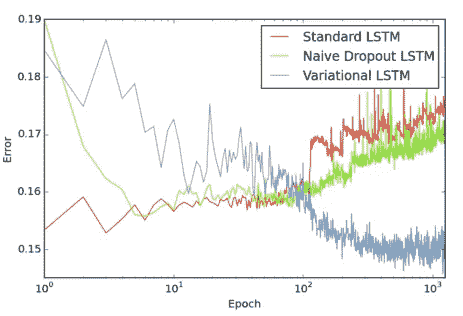**

**Fig 3(b) in [1]: Naive Dropout LSTM over-fits eventually**

**论文中使用的退出概率似乎大多是 *0.5* 。正如你在上图中看到的，这可能与缓慢的收敛速度有关。变分 LSTM 需要数百个历元才能胜过其他两个模型。我没有太多的时间来训练这么多的纪元，所以在允许一些过度拟合的同时，降低了退出概率以提高速度。关于确切的概率，请参考本节末尾的电子表格。**

## **克拉斯**

**评估了三种模型:**

1.  ***变量:*使用输入压差、循环压差和输出压差。**
2.  ***无脱落:*只有极低的重量衰减。**
3.  ***朴素漏失:*使用时间步长独立输入漏失，输出漏失。**

**所有三种模型都没有嵌入丢失。**

**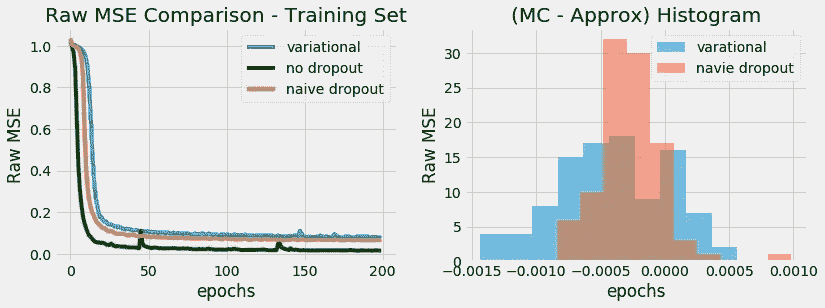**

***(向右修正图表的坐标轴标签:X 轴:"* ***原始 MSE 差异*** *"，Y 轴:"* ***计数****"】***

**图表“(MC —近似值)直方图”是每个样本的 MC 差值的原始 MSE 减去标准差值近似值的直方图。注:在变分和简单的 LSTM 模型中，MC 下降通常产生较低的原始 MSE。**

**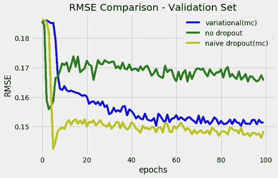**

**天真的辍学者似乎是最好的执行者，并且不会随着时间的推移而过度适应。**

## **PyTorch**

**测试了五个模型:**

1.  ***重量下降* [ *2* ]:使用输入下降、重量下降、输出下降、嵌入下降。**
2.  ***无脱落*:香草单层 LSTM，无重量衰减。**
3.  ***朴素漏失*:使用时间步长独立输入漏失，输出漏失。**
4.  ***变重量下降*:与 ***变重量下降*** 相同，但*变*参数设置为真。**
5.  ***无经常性脱落的变化* ( *变量-2* ， *v w/o r-drop* ):与重量脱落相同，但重量脱落概率设置为零。(无经常性辍学)**

**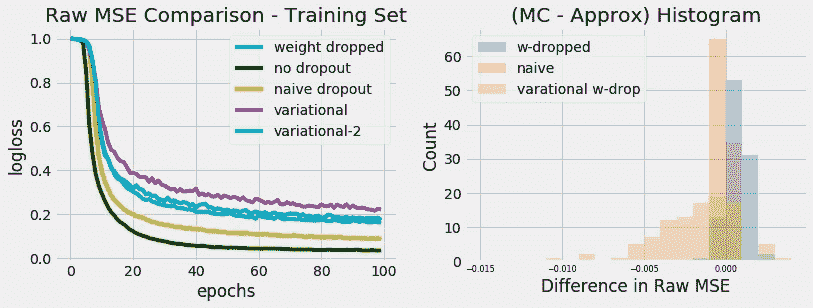**

**对于重量下降的 LSTM，MC 压差低于标准压差近似值。这也适用于没有经常性辍学的变分 LSTM。**

**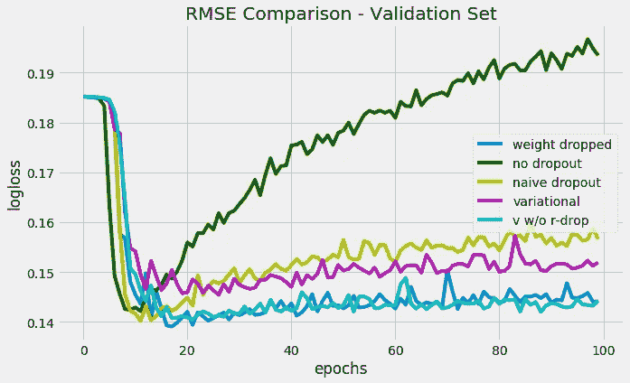**

**在这种情况下，“无辍学”模型严重过度拟合。与 Keras 的结果相比，我们也许可以把 RMSE 的陡峭上升归因于没有重量衰减。然而，PyTorch 的“天真辍学”模式在 RMSE 也有缓慢上升的趋势。“重量下降变化”模型似乎有一些不合适的问题。**

## **摘要**

**以下是实验及其结果的详细记录:**

**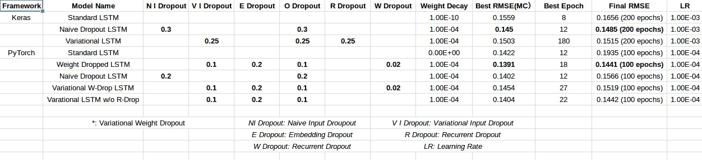**

**[Spreadsheet Link](https://docs.google.com/spreadsheets/d/e/2PACX-1vQ_3NX8kEe3hoYGXac4QaUeo5HDAT9__FfhTiqc_sGwG0HoWbeLlGYZXEfDfOnpcTB9n2dBkVmixCNQ/pubhtml?gid=0&single=true)**

***(似乎没有办法把谷歌电子表格嵌入到一个中等的帖子里。请使用表格下方的链接获取表格的网页版本。)***

**(尽管 MC dropout 在减重模型中的性能较差，但为了简单起见，我坚持使用 MC dropout:**所有预测(除了“无脱落”模型)都是使用 10 轮 MC dropout 创建的。****

# **[IMDB 电影评论数据集](http://ai.stanford.edu/~amaas/data/sentiment/)**

**这个数据集是一个二元分类问题。有 25000 个训练样本和 25000 个测试样本。目标是从给定的单词序列中预测用户是否喜欢这部电影。**

**批量大小为 128，序列长度为 80(填充)。**

**模型结构和之前差不多，这里就不赘述了。**

## **克拉斯**

**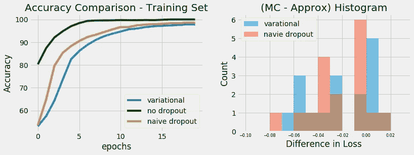**

**和以前一样，MC 丢失通常产生较低的对数损失。**

**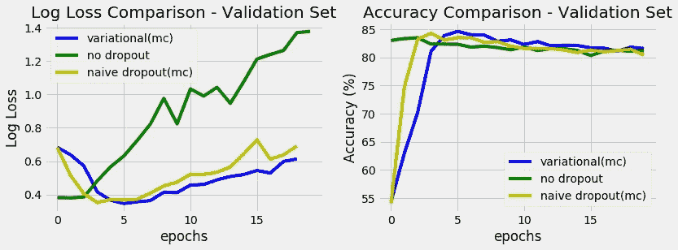**

***(epoch 17 后有一些数值问题，生成 NaNs 为 log loss。图表中省略了这些数据点。)***

**在这个数据集中，所有模型都随着时间的推移而过度拟合。**

## **PyTorch**

**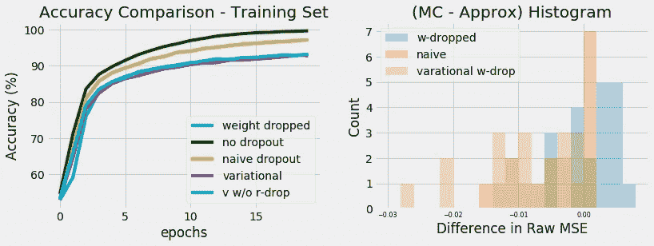**

**和以前一样，权重下降模型在 MC 丢失时表现更差，就像变分模型在经常性丢失时一样(不在直方图中)。**

**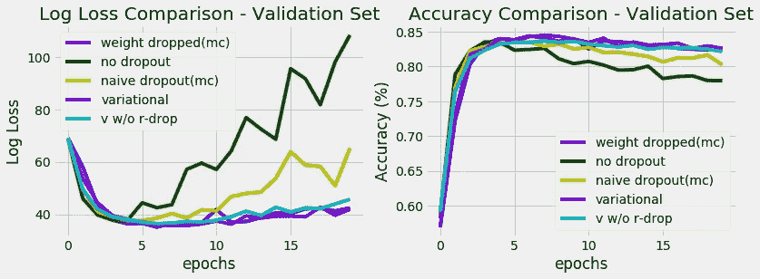**

**在这种情况下,“天真辍学”模型明显过度拟合。其他三个辍学模型都得到了类似的表现。**

## **摘要**

**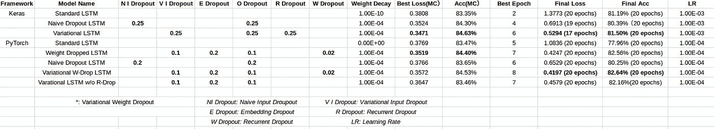**

**[Spreadsheet Link](https://docs.google.com/spreadsheets/d/e/2PACX-1vQ_3NX8kEe3hoYGXac4QaUeo5HDAT9__FfhTiqc_sGwG0HoWbeLlGYZXEfDfOnpcTB9n2dBkVmixCNQ/pubhtml?gid=490942750&single=true)**

**“变权重下降”在这个数据集中表现得令人惊讶，具有体面的验证损失，并且相当抗过拟合。**

## **总体评论**

1.  **我们可以从减肥模特身上得到一些不错的表现。然而，退出概率需要仔细调整。**
2.  **我怀疑 MC dropout 性能的下降与嵌入 dropout 的使用有关。我会尝试使用更多的采样轮或只是在测试时间禁用嵌入丢失。**
3.  **从 IMDB 数据集的结果来看，嵌入丢失似乎在防止过拟合方面有适度的贡献。**
4.  **在 Jupyter notebook 中进行实验(链接到下面的代码)需要大量的手工劳动，并且只能在一定程度上进行管理。如果需要更全面的评估，我会使用类似于[神圣的](http://sacred.readthedocs.io/en/latest/quickstart.html)来自动化这个过程。**

** [## ces hine/经常性辍学实验

### 通过在 GitHub 上创建一个帐户，为经常辍学实验的发展做出贡献。

github.com](https://github.com/ceshine/recurrent-dropout-experiments)** 

## **参考资料:**

1.  **Gal，y .，& Ghahramani，Z. (2016)。[作为贝叶斯近似的辍学:表示深度学习中的模型不确定性](https://arxiv.org/pdf/1506.02142.pdf)。**
2.  **梅里蒂，s .，凯斯卡尔，N. S .，&索彻，R. (2017)。[规范和优化 LSTM 语言模型](http://arxiv.org/abs/1708.02182)。**

## **以前的零件**

** [## [学习笔记]循环网络中的辍学—第 1 部分

### 理论基础

becominghuman.ai](https://becominghuman.ai/learning-note-dropout-in-recurrent-networks-part-1-57a9c19a2307)  [## [学习笔记]循环网络中的辍学—第 2 部分

### 喀拉斯和 PyTorch 的经常性辍学实施情况

medium.com](https://medium.com/towards-data-science/learning-note-dropout-in-recurrent-networks-part-2-f209222481f8)**