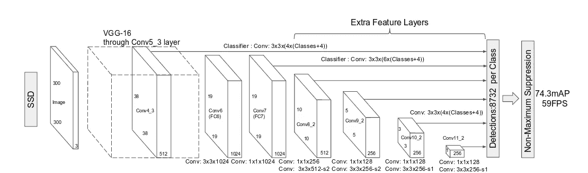
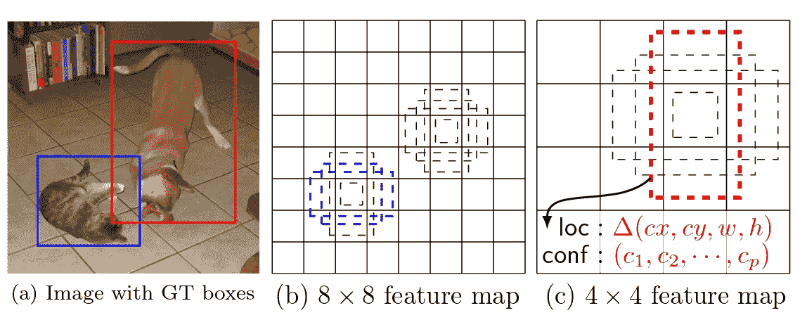
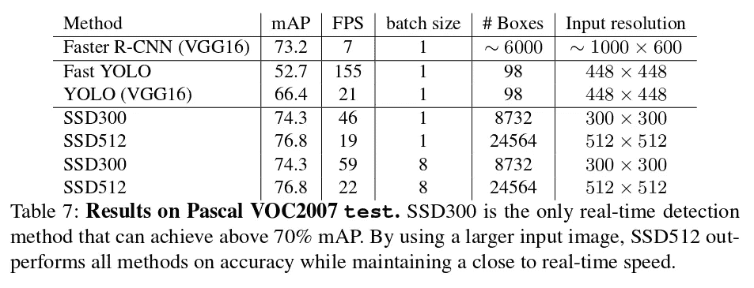

# [学习笔记]带 Pytorch 的单次多盒检测器—第 1 部分

> 原文：<https://towardsdatascience.com/learning-note-single-shot-multibox-detector-with-pytorch-part-1-38185e84bd79?source=collection_archive---------1----------------------->

最近我在尝试学习 [Pytorch](http://pytorch.org/) 以及一些物体检测深度学习算法。因此，为了一举两得，我决定阅读由 Max deGroot 撰写的[单次多盒检测器论文](https://arxiv.org/abs/1512.02325)以及其中一篇 [Pytorch 实现。](https://github.com/amdegroot/ssd.pytorch)

诚然，我在理解论文中的一些观点时有些困难。看了实现，挠了一会儿头，我想我至少弄明白了其中的一部分。所以下面是我在第一遍和第二遍阅读后对一些混淆概念的笔记。

## 网络结构



SSD Architecture taken from the original paper

首先，单次多盒检测器(SSD)使用在 ILSVRC CLS-LOC 数据集上预训练的 VGG-16 结构，并增加一些额外的卷积层。相关代码位于 [**ssd.py**](https://github.com/amdegroot/ssd.pytorch/blob/master/ssd.py) :

```
base = {
    '300': [64, 64, 'M', 128, 128, 'M', 256, 256, 256, 
            'C', 512, 512, 512, 'M', 512, 512, 512],
    '512': [],
}
extras = {
    '300': [256, 'S', 512, 128, 'S', 256, 128, 256, 128, 256],
    '512': [],
}
```

“m”表示内核大小为 2、步幅为 2 的最大池。“c”表示相同的最大池化，但带有在原始结构中没有出现的`ceil_mode=True`。我的理解是`ceil_mode=True`处理输入高度或宽度不能被 2 整除的情况，所以在输出中会有一些单元格来自 1x2，2x1，1x1 max 池。不知道为什么会在那里，但应该没什么区别。

“S”表示一个`stride=2`和`padding=1`卷积层，过滤器的数量在列表中紧随其后(例如，第一个“S”有 512 个过滤器)。

```
def vgg(cfg, i, batch_norm=False):
    layers = []
    in_channels = i
    for v in cfg:
        if v == 'M':
            layers += [nn.MaxPool2d(kernel_size=2, stride=2)]
        elif v == 'C':
            layers += [nn.MaxPool2d(
                kernel_size=2, stride=2, ceil_mode=True)]
        else:
            conv2d = nn.Conv2d(
                in_channels, v, kernel_size=3, padding=1)
            if batch_norm:
                layers += [
                    conv2d, nn.BatchNorm2d(v), 
                    nn.ReLU(inplace=True)]
            else:
                layers += [conv2d, nn.ReLU(inplace=True)]
            in_channels = v
    pool5 = nn.MaxPool2d(kernel_size=3, stride=1, padding=1)
    conv6 = nn.Conv2d(
                512, 1024, kernel_size=3, padding=6, dilation=6)
    conv7 = nn.Conv2d(1024, 1024, kernel_size=1)
    layers += [pool5, conv6,
               nn.ReLU(inplace=True), conv7,
               nn.ReLU(inplace=True)]
    return layers
```

请注意，它向原始 VGG 结构添加了一个 conv6 (1024 个 3×3 卷积滤波器，膨胀=6，填充=6)和一个 conv7 (1024 个 1×1 卷积滤波器)层。

```
def add_extras(cfg, i, batch_norm=False):
    # Extra layers added to VGG for feature scaling
    layers = []
    in_channels = i
    flag = False
    for k, v in enumerate(cfg):
        if in_channels != 'S':
            if v == 'S':
                layers += [
                    nn.Conv2d(in_channels, cfg[k + 1],
                        kernel_size=(1, 3)[flag], stride=2,
                        padding=1)]
            else:
                layers += [
                   nn.Conv2d(
                     in_channels, v, kernel_size=(1, 3)[flag])]
            flag = not flag
        in_channels = v
    return layer
```

额外层的构建使用一个旋转的 3x3 和 1x1 内核大小，可选的“S”标志表示`stride=2`和`padding=1`，正如我们已经提到的。

我们已经讨论了网络结构。现在是时候继续实际预测/检测物体的类别和位置了。

## 预测方案



Figure taken from the original paper

SSD 的一个关键概念是将神经网络中的中间层作为特征图。然后，它对要素地图运行 3x3 卷积过滤器，对默认框(Python 代码中的先前框)进行分类和预测偏移。每个位置有 4 或 6 个相应的默认框。自然地，较低层中的默认框较小，因为较低层捕获了输入图像的更精细的细节。

对于每个默认框，我们预测:

1.  它属于某一类的概率
2.  默认框中心的 x 和 y 偏移量
3.  宽度和高度缩放到默认框的宽度和高度

[中的默认框设置 **ssd.py**](https://github.com/amdegroot/ssd.pytorch/blob/master/ssd.py) **:**

```
mbox = {
    # number of boxes per feature map location    
    '300': [4, 6, 6, 6, 4, 4],  
    '512': [],
} def multibox(vgg, extra_layers, cfg, num_classes):
    loc_layers = []
    conf_layers = []
    vgg_source = [24, -2]
    for k, v in enumerate(vgg_source):
        loc_layers += [
            nn.Conv2d(vgg[v].out_channels,
                      cfg[k] * 4, kernel_size=3, padding=1)]
        conf_layers += [
            nn.Conv2d(vgg[v].out_channels,
                      cfg[k] * num_classes, kernel_size=3,
                      padding=1)]
    for k, v in enumerate(extra_layers[1::2], 2):
        loc_layers += [
            nn.Conv2d(v.out_channels, cfg[k]
                      * 4, kernel_size=3, padding=1)]
        conf_layers += [
            nn.Conv2d(v.out_channels, cfg[k]
                      * num_classes, kernel_size=3, padding=1)]
    return vgg, extra_layers, (loc_layers, conf_layers) def build_ssd(phase, size=300, num_classes=21):
    if phase != "test" and phase != "train":
        print("Error: Phase not recognized")
        return
    if size != 300:
        print("Error: Sorry only SSD300 is supported currently!")
        return
    return SSD(
        phase, *multibox(vgg(base[str(size)], 3),
                         add_extras(extras[str(size)], 1024),
                         mbox[str(size)], num_classes),     
        num_classes
    )
```

SSD 使用 VGG 模型中的两个层— Conv4_3 和 Conv7/FC7，它们对应于层索引 24 和-2(即 relu 激活之前)。这种获得层次的方式有点不靠谱。如果我们决定在 VGG 构造中使用 use `batch_norm=True`，多框构造将会得到错误的层。额外的层也应该如此，但事实上`batch_norm=True`甚至还没有在`add_extras()`中实现。

对于额外的图层，我们在每两层中使用第二层作为特征地图。一个奇怪的部分是，因为最后一层 Conv11_2 具有形状(256，1，1)，所以 3x3 卷积不是真正必要的。我猜这只是为了代码结构的简单。

注意，每个默认盒子应该有`num_class` + 4 (x，y，w，h)个输出。

## 锻炼



Table taken from the original paper

**尝试验证 SSD300 中默认盒子的数量(实现的那个)。**

## 解决办法

1.  Conv4_3: 38 * 38 * 4 = 5776
2.  Conv7: 19 * 19 * 6 = 2166
3.  Conv8_2: 10 * 10 * 6 = 600
4.  Conv9_2: 5 * 5 * 6 = 150
5.  Conv10_2: 3 * 3 * 4 = 36
6.  Conv11_2: 4

总计:5776+ 2166 + 600 + 150 + 36 + 4 = 8732

请注意，此计算包括填充单元格中的默认框，这些默认框将始终为零，因此基本上是无用的框。

**附加练习**:计算 SSD300 中有效默认框的数量。

## 待续

我们仍然没有讨论如何将这些默认框映射回输入图像中的实际位置，如何挑选与地面事实相匹配的正确默认框，以及如何构造损失函数来训练网络。这些问题将在下一篇文章中讨论。

(2017/07/28 更新:以下是该系列第二部的[和第三部](https://medium.com/towards-data-science/learning-note-single-shot-multibox-detector-with-pytorch-part-2-dd96bdf4f434)的[的链接。)](https://medium.com/@ceshine/learning-note-single-shot-multibox-detector-with-pytorch-part-3-f0711caa65ad)

(2018/07/12 更新:有人私下问了我一个有趣的问题。在此人的允许下，该问答被转贴于此:

问:*我试图阅读纸质 VGG-16 和固态硬盘，到处都提到固态硬盘使用 VGG-16 架构，但原始纸张中的固态硬盘架构图像从尺寸(38x38x512)开始，但 VGG-16 架构中唯一可用的尺寸是(224x224x64)、(112x112x128)、(56x56x256)等等，但没有它的(38 X 38 X 512)。*

答:*注意 VGG16 的(官方)输入图像尺寸是 224，SSD 的是 300。对于 224，特征映射如你所说演化为(224，224，64)，(112，112，128)，(56，56，256)和(28，28，512)。但如果将(300，300，3)图像输入放入 VGG16 架构。特征映射演变为(300，300，64)，(150，150，128)，(75，75，256)，(38，38，512)。*)