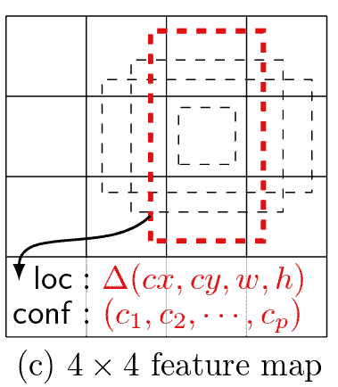
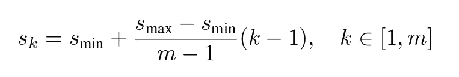
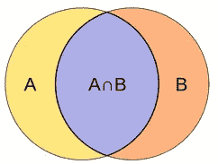

# [学习笔记]带 Pytorch 的单次多盒检测器—第 2 部分

> 原文：<https://towardsdatascience.com/learning-note-single-shot-multibox-detector-with-pytorch-part-2-dd96bdf4f434?source=collection_archive---------1----------------------->

## 平铺和匹配策略

[在上一篇](https://medium.com/towards-data-science/learning-note-single-shot-multibox-detector-with-pytorch-part-1-38185e84bd79)中，我们讨论了 SSD 的网络结构和预测方案。现在，我们继续将默认框和基本事实结合起来，这样就可以确定预测的质量(并通过训练进行改进)。

(提醒:[本文使用的 SSD 纸](https://arxiv.org/abs/1512.02325)和[py torch 实现](https://github.com/amdegroot/ssd.pytorch)

## 将默认框映射到输入图像上的坐标

在 [data/config.py](https://github.com/amdegroot/ssd.pytorch/blob/master/data/config.py) 中预先计算并硬编码了每个特征映射的默认框的参数:

```
#SSD300 CONFIGS                      
# newer version: use additional conv11_2 layer as last layer before multibox layers                       
v2 = {                           
    'feature_maps' : [38, 19, 10, 5, 3, 1],
    'min_dim' : 300,                                                    
    'steps' : [8, 16, 32, 64, 100, 300],                                                   
    'min_sizes' : [30, 60, 111, 162, 213, 264],                                                   
    'max_sizes' : [60, 111, 162, 213, 264, 315],                                                   
    'aspect_ratios' : [[2], [2, 3], [2, 3], [2, 3], [2], [2]],                                                   
    'variance' : [0.1, 0.2],                                                   
    'clip' : True,                                                   
    'name' : 'v2',                       
}
```

实际的映射发生在[层/函数/prior_box.py](https://github.com/amdegroot/ssd.pytorch/blob/master/layers/functions/prior_box.py) (P.S .默认框在实现中称为 prior boxed):

```
from itertools import product as productclass PriorBox(object):
    def __init__(self, cfg):
        super(PriorBox, self).__init__()
        # self.type = cfg.name
        self.image_size = cfg['min_dim']
        self.variance = cfg['variance'] or [0.1] […] for v in self.variance:
            if v <= 0:
                raise ValueError(
                    'Variances must be greater than 0') def forward(self):
        mean = []
        if self.version == 'v2':
            for k, f in enumerate(self.feature_maps):
                for i, j in product(range(f), repeat=2):
                    f_k = self.image_size / self.steps[k]
                    # unit center x,y
                    cx = (j + 0.5) / f_k
                    cy = (i + 0.5) / f_k # aspect_ratio: 1
                    # rel size: min_size
                    s_k = self.min_sizes[k]/self.image_size
                    mean += [cx, cy, s_k, s_k] # aspect_ratio: 1
                    # rel size: sqrt(s_k * s_(k+1))
                    s_k_prime = sqrt(
                        s_k * (self.max_sizes[k]/self.image_size))
                    mean += [cx, cy, s_k_prime, s_k_prime] # rest of aspect ratios
                    for ar in self.aspect_ratios[k]:
                        mean += [
                            cx, cy, s_k*sqrt(ar), s_k/sqrt(ar)]
                        mean += [
                            cx, cy, s_k/sqrt(ar), s_k*sqrt(ar)]

        […]        # back to torch land
        output = torch.Tensor(mean).view(-1, 4)
        if self.clip:
            output.clamp_(max=1, min=0)
        return output
```



Layout of the four default boxes (from original paper)

*(*[*ITER tools . product*](https://docs.python.org/3/library/itertools.html#itertools.product)*创建输入可迭代对象的笛卡尔积。所以 product(range(4)，repeat=2)得出(0，1，2，3)和(0，1，2，3)之间的所有组合，即(0，0)，(0，1) …，(3，2)，(3，3)。)*

以第一张特征图(38x38)为例。`f_k=300/8=37.5`。`i+0.5`和`j+0.5`的范围从 *0.5* 到 *37.5* 。所以中心点坐标 *cx* 和 *cy* 转化为(0.0133，0.0133)，(0.0133，0.04) …，(1，0.9733)，(1，1)。请注意，代码将坐标归一化为(0，1)，并且记住大多数特征图都是零填充的(最外面的单元总是零)。可以自己验证一下倒数第二个(未填充)要素图中最外面的中心点离 0 和 1 有一点距离。并且最后的特征图只有一个中心点正好位于(0.5，0.5)。

现在我们有了每个默认框的中心点。接下来我们要计算宽度和高度。有六种默认的方框布局:

1.  尺寸 *(s_k，s_k)* 的小方块
2.  大小为 *(sqrt(s_k * s_(k+1))、sqrt(s_k * s_(k+1)))* 的大正方形
3.  尺寸为 1:2 的矩形 *(s_k * 0.7071，s_k * 1.414)*
4.  2:1 矩形尺寸 *(s_k * 1.414，s_k * 0.7071)*
5.  尺寸为 *(s_k * 0.5774，s_k * 1.7321)* 的 1:3 矩形
6.  3:1 大小的矩形 *(s_k * 1.7321，s_k * 0.5774)*

对于具有 4 个默认框的要素地图，仅使用前四种布局。矩形的面积与小正方形的面积相同。这和上图不一样，上图面积好像和大正方形一样。

s_k 来自以下公式，第一个特征图除外:



Formula (4) from the original paper

默认框实际上是根据经验设计的，如论文中所述:

> 在实践中，还可以设计默认框的分布，以最适合特定的数据集。如何设计最优的镶嵌也是一个公开的问题。

因此，您可以根据自己的需要自由修改 *prior_box.py* 。

## 找到最符合实际情况的默认框

这就是所谓的“文中匹配策略”。这个想法非常简单——如果任何一对基础真值框和默认框的 [Jaccard overlap](https://www.wikiwand.com/en/Jaccard_index) 大于一个阈值(0.5)，那么它们就被认为是匹配的。在(希望)简单的英语中，如果重叠区域大于两个盒子覆盖区域的一半，这就是匹配。



The intersection need to be larger than half of the union. (Image from [Wikipedia](https://www.wikiwand.com/en/Jaccard_index#/overview))

相关代码位于 [layers/box_utils.py](https://github.com/amdegroot/ssd.pytorch/blob/master/layers/box_utils.py) :

```
def intersect(box_a, box_b):
    """ We resize both tensors to [A,B,2] without new malloc:
    [A,2] -> [A,1,2] -> [A,B,2]
    [B,2] -> [1,B,2] -> [A,B,2]
    Then we compute the area of intersect between box_a and box_b.
    Args:
      box_a: (tensor) bounding boxes, Shape: [A,4].
      box_b: (tensor) bounding boxes, Shape: [B,4].
    Return:
      (tensor) intersection area, Shape: [A,B].
    """
    A = box_a.size(0)
    B = box_b.size(0)
    max_xy = torch.min(box_a[:, 2:].unsqueeze(1).expand(A, B, 2),
                       box_b[:, 2:].unsqueeze(0).expand(A, B, 2))
    min_xy = torch.max(box_a[:, :2].unsqueeze(1).expand(A, B, 2),
                       box_b[:, :2].unsqueeze(0).expand(A, B, 2))
    inter = torch.clamp((max_xy - min_xy), min=0)
    return inter[:, :, 0] * inter[:, :, 1]
```

*(*[*tensor . unsqueeze*](http://pytorch.org/docs/master/torch.html#torch.unsqueeze)*在指定位置插入一个尺寸为 1 的新尺寸。应该相当于*[*numpy . expand _ dims*](https://docs.scipy.org/doc/numpy/reference/generated/numpy.expand_dims.html)*。*[*tensor . expand*](http://pytorch.org/docs/master/tensors.html#torch.Tensor.expand)*以记忆高效的方式扩展大小 1 维。当组合* [*时，它们在功能上等同于张量。重复*](https://github.com/pytorch/pytorch/issues/491) *，但是* [*张量。重复*](http://pytorch.org/docs/master/tensors.html#torch.Tensor.expand) *创建一个新的张量。)*

*(* [*)张量钳位*](http://pytorch.org/docs/master/torch.html#torch.clamp) *限制一个张量的最大值和最小值。应该相当于*[*numpy . clip*](https://docs.scipy.org/doc/numpy/reference/generated/numpy.clip.html)*。)*

作者巧妙的计算了交集。通过展开张量，我们现在能够在没有任何 for 循环的情况下，在一次运行中计算 box_a(基本事实)和 box_b(默认盒子)的每个组合的交集。

```
def jaccard(box_a, box_b):
    """Compute the jaccard overlap of two sets of boxes.  
       The jaccard overlap is simply the intersection over 
       union of two boxes.  Here we operate on ground truth 
       boxes and default boxes.
       E.g.:
          A ∩ B / A ∪ B = A ∩ B / (area(A) + area(B) - A ∩ B)
       Args:
          box_a: (tensor) Ground truth bounding boxes, 
                 Shape:    [num_objects,4]
          box_b: (tensor) Prior boxes from priorbox layers, 
                 Shape: [num_priors,4]
       Return:
          jaccard overlap: (tensor) 
                           Shape: [box_a.size(0), box_b.size(0)]
    """
    inter = intersect(box_a, box_b)
    area_a = ((box_a[:, 2] - box_a[:, 0]) *
              (box_a[:, 3] - 
               box_a[:, 1])).unsqueeze(1).expand_as(inter)
    area_b = ((box_b[:, 2] - box_b[:, 0]) *
              (box_b[:, 3] - 
               box_b[:, 1])).unsqueeze(0).expand_as(inter)  
    union = area_a + area_b - inter
    return inter / union  # [A,B]
```

在这里，作者使用同样的技巧来计算每个盒子的面积，然后得到并集。

```
def match(threshold, truths, priors, variances, 
          labels, loc_t, conf_t, idx):
    """Match each prior box with the ground truth box of 
       the highest jaccard overlap, encode the bounding boxes,
       then return the matched indices corresponding to both 
       confidence and location preds.

       Args:
         threshold: (float) The overlap threshold 
                    used when mathing boxes.
         truths: (tensor) Ground truth boxes, 
                 Shape: [num_obj, num_priors].
         priors: (tensor) Prior boxes from priorbox layers, 
                 Shape: [n_priors,4].
         variances: (tensor) Variances corresponding 
                    to each prior coord,
                    Shape: [num_priors, 4].
         labels: (tensor) All the class labels for the image,
                 Shape: [num_obj].
         loc_t: (tensor) Tensor to be filled w/ endcoded 
                location targets.
         conf_t: (tensor) Tensor to be filled w/ matched 
                 indices for conf preds.
         idx: (int) current batch index
       Return:
         The matched indices corresponding to 
         1)location and 2)confidence preds.
    """
    # jaccard index
    overlaps = jaccard(
        truths,
        point_form(priors)
    )
    # (Bipartite Matching)
    # [num_objects, 1] best prior for each ground truth
    best_prior_overlap, best_prior_idx = overlaps.max(1)
    # [1, num_priors] best ground truth for each prior
    best_truth_overlap, best_truth_idx = overlaps.max(0)
    best_truth_idx.squeeze_(0)
    best_truth_overlap.squeeze_(0)
    best_prior_idx.squeeze_(1)
    best_prior_overlap.squeeze_(1)
    # ensure best prior    
    best_truth_overlap.index_fill_(0, best_prior_idx, 2)     
    for j in range(best_prior_idx.size(0)):
        best_truth_idx[best_prior_idx[j]] = j
    # Shape: [num_priors,4]
    matches = truths[best_truth_idx] 
    # Shape: [num_priors]         
    conf = labels[best_truth_idx] + 1
    # label as background
    conf[best_truth_overlap < threshold] = 0  
    loc = encode(matches, priors, variances)
    # [num_priors,4] encoded offsets to learn
    loc_t[idx] = loc    
    # [num_priors] top class label for each prior
    conf_t[idx] = conf
```

*(*[*tensor . max*](http://pytorch.org/docs/master/torch.html#torch.max)*和 Tensor.min 在传递一个* `*dim*` *参数时返回两个张量:1。沿指定轴的实际最大/最小值。2.沿该轴的最大/最小值的索引)*

*(*[*Tensor.squeeze _*](http://pytorch.org/docs/master/tensors.html#torch.Tensor.squeeze_)*是 tensor . squeeze 的就地版本，返回一个去掉了所有尺寸为 1 的维度的张量。)*

*(*[*tensor . index _ fill _*](http://pytorch.org/docs/master/tensors.html#torch.Tensor.index_fill_)*用传递的索引值填充原始张量的元素)*

还记得我们从*那里得到的 prior_box.py* 是(cx，cy，w，h)格式吗？这里我们用`point_from`将其转换成(xmin，ymin，xmax，ymax)格式。为了节省空间，代码没有公布([在这里找到](http://layers/box_utils.py))。

这部分代码可能是最令人困惑的:

```
# ensure best prior    
best_truth_overlap.index_fill_(0, best_prior_idx, 2)     
for j in range(best_prior_idx.size(0)):
    best_truth_idx[best_prior_idx[j]] = j
```

张量****best _ prior _ idx***包含每个基础事实框的最佳匹配默认框的索引。所以第一行代码要做的是确保每个基本事实框至少有一个默认框通过了阈值。*

*for 循环将变化从第一行传播回张量 ***best_truth_idx*** ，，该张量包含每个默认框的最佳匹配基础真值框的索引。这种循环的效果是，当存在更需要它的另一个基本事实时，迫使先前的框放弃原始的最佳匹配基本事实(否则没有用于该基本事实的默认框)。*

*请注意，我们将每个默认框与一个真实背景相匹配，并为所有最大 Jaccard 重叠小于阈值(即背景)的默认框分配一个特殊的标签/类别零**。***

*有一个`encode`函数将匹配的真实和默认框对转换成损失函数理解的格式。损失函数将在下一篇文章中讨论。*

# *待续*

*我们讨论了如何将缺省框映射到实际坐标，以及如何匹配基础真值框和缺省框。这比我预期的要长，所以将会有第 3 部分讨论目标函数，最后是如何在测试阶段预测/检测。*

*(2017/07/28 更新:这里是该系列第三部的[链接)](https://medium.com/@ceshine/learning-note-single-shot-multibox-detector-with-pytorch-part-3-f0711caa65ad)*