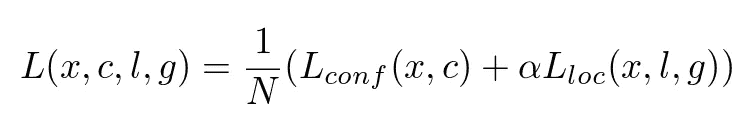
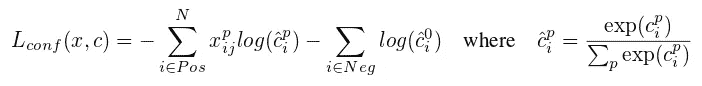
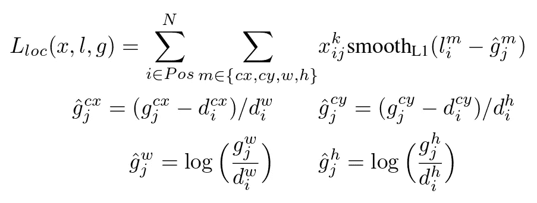

# [学习笔记]带 Pytorch 的单次多盒检测器—第 3 部分

> 原文：<https://towardsdatascience.com/learning-note-single-shot-multibox-detector-with-pytorch-part-3-f0711caa65ad?source=collection_archive---------3----------------------->

## 训练目标和推理

(提醒:[本文使用的 SSD 论文](https://arxiv.org/abs/1512.02325)和[py torch 实现](https://github.com/amdegroot/ssd.pytorch)。还有，第[系列的第一](https://medium.com/towards-data-science/learning-note-single-shot-multibox-detector-with-pytorch-part-1-38185e84bd79)和第[系列的第二](https://medium.com/towards-data-science/learning-note-single-shot-multibox-detector-with-pytorch-part-2-dd96bdf4f434)部分。)

## 训练目标/损失函数

每个深度学习/神经网络都需要一个可微分的目标函数来学习。在[将基础事实和默认框配对，并将剩余的默认框标记为背景](https://medium.com/@ceshine/learning-note-single-shot-multibox-detector-with-pytorch-part-2-dd96bdf4f434)之后，我们准备好制定 SSD 的目标函数:



Overall Objective — Formula (1) from the original paper

这个目标函数有两个部分:

1.  置信度损失:模型预测每个对象的类别有多准确
2.  局部化损失:模型创建的边界框离地面真实框有多近。

## 信心丧失



Confidence Loss — formula (3) from the original paper

这是实际标签和预测标签之间的简单的 softmax 损失函数。当第 **i** 个默认框与第 **j** 个类别 **p** 的第 **1** 匹配时。注意，有一个特殊的类别对应于背景框(没有地面真相匹配)。背景框被视为 ***负*** ，并且如我们稍后将看到的，被下采样以避免高度不平衡的训练数据集。

## 本地化损失



Localization Loss— Formula (2) from the original paper


Smooth L1 loss function from [Fast R-CNN paper](https://arxiv.org/abs/1504.08083)

定位损失仅在 ***正*** 盒上计算(具有匹配接地真值的盒)。它计算相对于中心点坐标的正确偏移和预测偏移之间的差异，以及相对于宽度和高度的正确比例和预测比例。消除绝对差异。

偏移和比例的差异根据默认框的宽度和高度进行归一化，并且比例在进行差异计算之前进行对数缩放。

## 代码

来自[层/模块/multibox_loss.py](https://github.com/amdegroot/ssd.pytorch/blob/master/layers/modules/multibox_loss.py) :

```
def forward(self, predictions, targets):
    """Multibox Loss
       Args:
         predictions (tuple): A tuple containing loc 
                              preds, conf preds,
                              and prior boxes from SSD net.
           conf shape:
               torch.size(batch_size,num_priors,num_classes)
           loc shape: torch.size(batch_size,num_priors,4)
               priors shape: torch.size(num_priors,4) ground_truth (tensor): Ground truth boxes and 
                                labels for a batch,
             shape: [batch_size,num_objs,5] 
                    (last idx is the label).
    """
    loc_data, conf_data, priors = predictions
    num = loc_data.size(0)
    priors = priors[:loc_data.size(1), :]
    num_priors = (priors.size(0))
    num_classes = self.num_classes # match priors (default boxes) and ground truth boxes
    loc_t = torch.Tensor(num, num_priors, 4)
    conf_t = torch.LongTensor(num, num_priors)
    for idx in range(num):
        truths = targets[idx][:,:-1].data
        labels = targets[idx][:,-1].data
        defaults = priors.data
        match(self.threshold,truths,defaults,
              self.variance,labels,loc_t,conf_t,idx)
    if self.use_gpu:
        loc_t = loc_t.cuda()
        conf_t = conf_t.cuda()
    # wrap targets
    loc_t = Variable(loc_t, requires_grad=False)
    conf_t = Variable(conf_t,requires_grad=False) pos = conf_t > 0
    num_pos = pos.sum() # Localization Loss (Smooth L1)
    # Shape: [batch,num_priors,4]
    pos_idx = pos.unsqueeze(pos.dim()).expand_as(loc_data)
    loc_p = loc_data[pos_idx].view(-1,4)
    loc_t = loc_t[pos_idx].view(-1,4)
    loss_l = F.smooth_l1_loss(loc_p, loc_t, size_average=False) # Compute max conf across batch for hard negative mining
    batch_conf = conf_data.view(-1,self.num_classes)
    loss_c = log_sum_exp(batch_conf) - batch_conf.gather(
                 1,   conf_t.view(-1,1)) # Hard Negative Mining
    loss_c[pos] = 0 # filter out pos boxes for now
    loss_c = loss_c.view(num, -1)
    _,loss_idx = loss_c.sort(1, descending=True)
    _,idx_rank = loss_idx.sort(1)
    num_pos = pos.long().sum(1)
    num_neg = torch.clamp(
        self.negpos_ratio*num_pos, max=pos.size(1)-1)
    neg = idx_rank < num_neg.expand_as(idx_rank) # Confidence Loss Including Positive and Negative Examples
    pos_idx = pos.unsqueeze(2).expand_as(conf_data)
    neg_idx = neg.unsqueeze(2).expand_as(conf_data)
    conf_p =  conf_data[
       (pos_idx+neg_idx).gt(0)].view(-1,self.num_classes)
    targets_weighted = conf_t[(pos+neg).gt(0)]
    loss_c = F.cross_entropy(
        conf_p, targets_weighted, size_average=False) # Sum of losses: L(x,c,l,g) = (Lconf(x, c) + αLloc(x,l,g)) / N
    N = num_pos.data.sum()
    loss_l/=N
    loss_c/=N
    return loss_l,loss_c
```

挺长的，我们来分解一下:

```
# match priors (default boxes) and ground truth boxes
loc_t = torch.Tensor(num, num_priors, 4)
conf_t = torch.LongTensor(num, num_priors)
for idx in range(num):
    truths = targets[idx][:,:-1].data
    labels = targets[idx][:,-1].data
    defaults = priors.data
    match(self.threshold,truths,defaults,
          self.variance,labels,loc_t,conf_t,idx)
[...]
# wrap targets
loc_t = Variable(loc_t, requires_grad=False)
conf_t = Variable(conf_t,requires_grad=False)
```

`num`对应批量大小。`idx`参数被传递给`match()`以让`match`知道要写哪一行。

*(设置 requires_grad=False 表示我们不需要在反向过程中计算这些变量的梯度。)* [*参考*](https://github.com/jcjohnson/pytorch-examples)

```
*pos = conf_t > 0
num_pos = pos.sum()# Localization Loss (Smooth L1)
# Shape: [batch,num_priors,4]
pos_idx = pos.unsqueeze(pos.dim()).expand_as(loc_data)
loc_p = loc_data[pos_idx].view(-1,4)
loc_t = loc_t[pos_idx].view(-1,4)
loss_l = F.smooth_l1_loss(loc_p, loc_t, size_average=False)*
```

**(*[*tensor . view*](http://pytorch.org/docs/master/tensors.html#torch.Tensor.view)*等价于*[*numpy . shape*](https://docs.scipy.org/doc/numpy/reference/generated/numpy.reshape.html)*，返回一个数据相同但大小不同的新张量。Tensor.view_as 的工作方式相同，但会自动将目标形状设置为传递的张量的形状。)**

*这部分计算本地化损失。*

*记住类标签 0 对应背景(负框)，我们可以用`> 0`找到正框。`pos`扩展为(num，num_priors，4)用于选择阳性框。`.view(-1, 4)`做的是将张量从(num，num_priors，4)展平到(num * num_priors，4)。`F`出自`import torch.nn.functional as F`。*

```
*# Compute max conf across batch for hard negative mining
batch_conf = conf_data.view(-1,self.num_classes)
loss_c = log_sum_exp(batch_conf) - batch_conf.gather(
                 1, conf_t.view(-1,1))# Hard Negative Mining
loss_c[pos] = 0 # filter out pos boxes for now
loss_c = loss_c.view(num, -1)
_, loss_idx = loss_c.sort(1, descending=True)
_, idx_rank = loss_idx.sort(1)
num_pos = pos.long().sum(1)
num_neg = torch.clamp(
    self.negpos_ratio*num_pos, max=pos.size(1)-1)
neg = idx_rank < num_neg.expand_as(idx_rank)*
```

**(*[*tensor . gather*](http://pytorch.org/docs/master/torch.html#torch.gather)*沿 dim 指定的轴收集值。)**

**(*[*tensor . sort*](http://pytorch.org/docs/master/torch.html#torch.sort)*类似于 Tensor.min 和 Tensor.max，它返回两个张量:1。已排序的值。2.排序值的原始索引)**

*对于置信损失 SSD 使用一种称为 [**硬负挖掘**](https://www.reddit.com/r/computervision/comments/2ggc5l/what_is_hard_negative_mining_and_how_is_it/) 的技术，即选择最困难的负框(它们具有更高的置信损失)，因此负对正比率最多为 3:1。*

*`log_sum_exp`来自 [layers/box_utils.py](https://github.com/amdegroot/ssd.pytorch/blob/master/layers/box_utils.py) 。它计算`log(c)`的分母部分。`batch_conf.gather`计算分子部分，其中只有真实标签的预测概率是重要的。*

*该代码使用两种排序来查找每个盒子的等级。首先获取排序索引，然后获取排序索引*的排序索引*作为秩。`num_neg`被`num_priors — 1`夹住，看起来怪怪的。实际的负数`num_prior — num_pos`似乎更合理。*

```
*# Confidence Loss Including Positive and Negative Examples
pos_idx = pos.unsqueeze(2).expand_as(conf_data)
neg_idx = neg.unsqueeze(2).expand_as(conf_data)
conf_p =  conf_data[
      (pos_idx+neg_idx).gt(0)].view(-1,self.num_classes)
targets_weighted = conf_t[(pos+neg).gt(0)]
loss_c = F.cross_entropy(
          conf_p, targets_weighted, size_average=False)*
```

*这部分应该很简单。收集预测和真实标签，然后传递给 cross_entropy 函数，得到总损失(还没有平均)。*

```
*# Sum of losses: L(x,c,l,g) = (Lconf(x, c) + αLloc(x,l,g)) / N
N = num_pos.data.sum()
loss_l /= N
loss_c /= N
return loss_l, loss_c*
```

*最后，计算两次损失的平均值，然后返还。现在我们有了训练网络所需的一切。*

## *推理*

*训练完网络后，是时候使用我们的检测器了。SSD 设计的一个特殊问题是，如果超过阈值，我们可以将多个默认框匹配到一个真实框。因此，在预测时，我们可能会预测一个对象周围的多个高度重叠的框。这通常不是目标检测算法的期望输出。我们需要做一些后期处理。*

*SSD 使用的技术被称为**非最大抑制(nms)** 。基本思想是迭代地将最有把握的盒子添加到最终输出中。如果候选框与最终输出中同类的任何框高度重叠(Jaccard 重叠高于 0.45)，则该框将被忽略。它还将每个图像的总预测盒数限制在 200 个。*

*实现(nms 函数)位于 [layers/box_utils.py](https://github.com/amdegroot/ssd.pytorch/blob/master/layers/box_utils.py) 。它有一些新的东西，如 [Tensor.numel](http://pytorch.org/docs/master/torch.html#torch.numel) 和 [torch.index_select](http://pytorch.org/docs/master/torch.html#torch.index_select) 带 *out* 参数。但是您现在应该对工作流程相当熟悉了，所以我不会在这里详细分析代码。*

## *谢谢大家！*

*就是这样！非常感谢您通读整个系列。有段时间没写过这么长的学习笔记/教程了，再来一遍感觉棒极了！*

*这个系列的目的真的是强迫自己钻到乱七八糟的细节里去，去理解到底是怎么回事。如果能对你有所帮助，我会很高兴。另外，如果我做错了什么或者错过了什么重要的事情，请随时告诉我。*