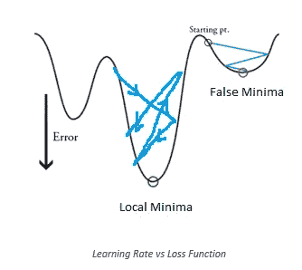
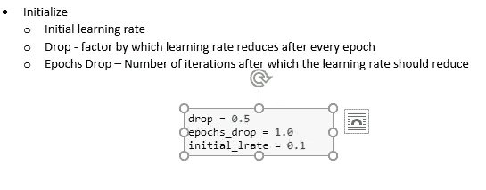
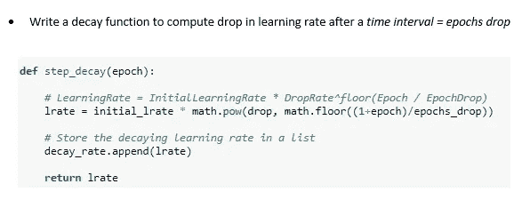
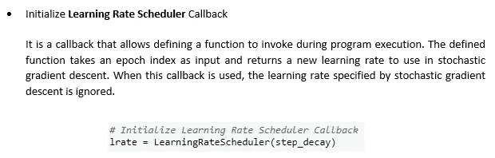
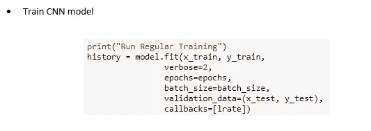
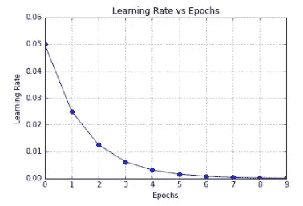
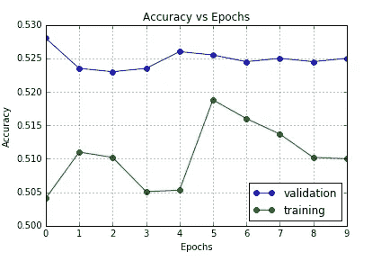

# 学习率调度程序

> 原文：<https://towardsdatascience.com/learning-rate-scheduler-d8a55747dd90?source=collection_archive---------10----------------------->

适应性学习率

在训练深度网络时，随着训练时期数量的增加，降低学习速率是有帮助的。这是基于直觉，即在高学习率的情况下，深度学习模型将拥有高动能。因此，它的参数向量会乱跳。因此，它不能停留在损失函数的更深和更窄的部分(局部最小值)。另一方面，如果学习速率非常小，那么系统的动能就会很低。因此，它会停留在损失函数的较浅和较窄的部分(假最小值)。

上图描述了高学习率将导致向量在局部最小值附近的随机往复运动，而低学习率将导致陷入错误的最小值。因此，知道何时降低学习速度可能很难找到答案。

我们的实验基于**阶跃衰减的原理。**这里，我们每隔几个历元就用一个常数因子降低学习率。典型值可能是每 5 个时期将学习速率减少一半，或者每 20 个时期减少 0.1。这些数字很大程度上取决于问题的类型和模型。你在实践中可能看到的一个启发是，在以固定的学习速率训练时观察验证误差，并且每当验证误差停止改善时，以一个常数(例如 0.5)降低学习速率。

在实践中，**步长衰减**是首选，因为它更容易解释超参数，如衰减分数和以历元为单位的步长计时。此外，还发现它提供了学习率值的稳定性，这反过来有助于随机梯度下降显示出快速收敛和高成功率。

实验步骤

实验结果

源代码

 [## shree 6791/深度学习

### 深度学习——这个知识库由 Shreenidhi Sudhakar 实施的深度学习项目组成。

github.com](https://github.com/shree6791/Deep-Learning/blob/master/CNN/Cats%20and%20Dogs/keras/src/Intern%20Task%203.ipynb)