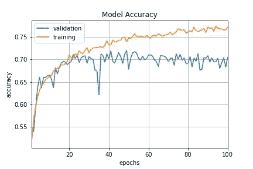
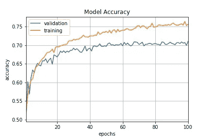
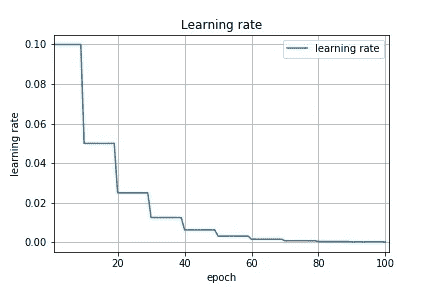
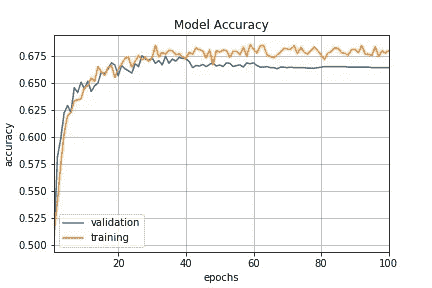
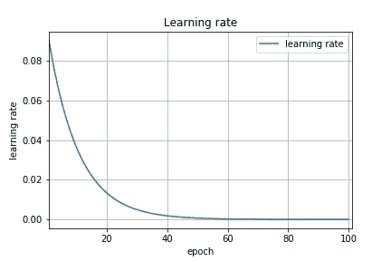
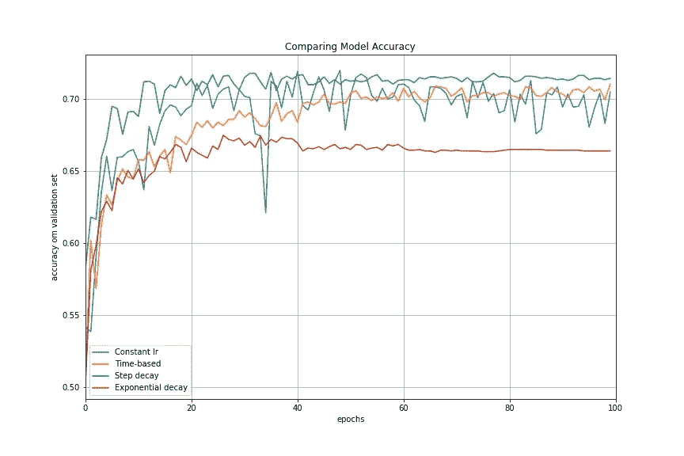
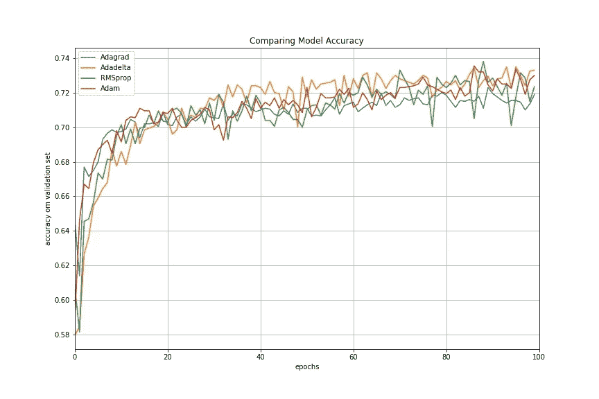
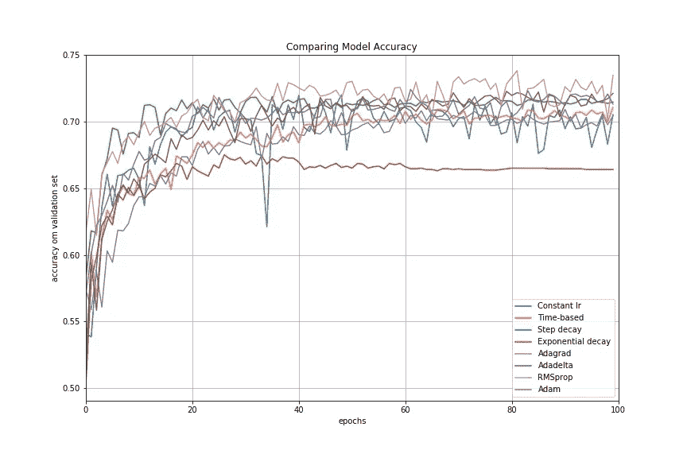

# 深度学习的学习速率表和自适应学习速率方法

> 原文：<https://towardsdatascience.com/learning-rate-schedules-and-adaptive-learning-rate-methods-for-deep-learning-2c8f433990d1?source=collection_archive---------0----------------------->

当训练深度神经网络时，随着训练的进行降低学习速率通常是有用的。这可以通过使用预定义的**学习率计划**或**自适应学习率方法**来完成。在本文中，我在 [CIFAR-10](https://www.cs.toronto.edu/~kriz/cifar.html) 上训练了一个卷积神经网络，使用不同的学习速率计划和自适应学习速率方法来比较它们的模型性能。

# 学习费率表

学习率时间表旨在通过根据预定义的时间表降低学习率来调整训练期间的学习率。常见的学习率时间表包括**基于时间的衰减**、**阶跃衰减**和**指数衰减**。为了说明的目的，我构建了一个在 [CIFAR-10](https://www.cs.toronto.edu/~kriz/cifar.html) 上训练的卷积神经网络，使用具有不同学习速率调度的随机梯度下降(SGD)优化算法来比较性能。

## **恒定学习率**

在 Keras 的 [SGD optimizer](https://keras.io/optimizers/#sgd) 中，恒定学习率是默认的学习率计划。默认情况下，动量和衰减率都设置为零。选择正确的学习速度是很棘手的。在我们的例子中，通过实验学习率的范围，`lr=0.1`显示了相对较好的开始性能。这可以作为我们试验不同学习速度策略的基准。

```
keras.optimizers.SGD(lr=0.1, momentum=0.0, decay=0.0, nesterov=**False**)
```



Fig 1 : Constant Learning Rate

## **基于时间的衰变**

基于时间的衰减的数学形式是`lr = lr0/(1+kt)`，其中`lr`、`k`是超参数，`t`是迭代次数。查看 Keras 的[源代码](https://github.com/fchollet/keras/blob/master/keras/optimizers.py#L126)，SGD 优化器采用`decay`和`lr`参数，并在每个时期以递减因子更新学习率。

```
lr *= (1\. / (1\. + self.decay * self.iterations))
```

动量是 SGD 优化器中的另一个参数，我们可以调整它以获得更快的收敛。与经典的 SGD 不同，动量法帮助参数向量以恒定的梯度下降在任何方向上建立速度，以防止振荡。动量的典型选择在 0.5 到 0.9 之间。

SGD optimizer 还有一个名为`nesterov`的参数，默认设置为 false。内斯特罗夫动量法是动量法的一个不同版本，它对凸函数有更强的理论收敛保证。在实践中，它比标准动量法稍微好一点。

在 Keras 中，我们可以通过在 SGD 优化器中设置初始学习率、衰减率和动量来实现基于时间的衰减。

```
learning_rate = 0.1
decay_rate = learning_rate / epochs
momentum = 0.8
sgd = SGD(lr=learning_rate, momentum=momentum, decay=decay_rate, nesterov=False)
```



Fig 2 : Time-based Decay Schedule

## 阶跃衰减

步长衰减计划每隔几个历元就将学习速率降低一个因子。阶跃衰减的数学形式为:

```
lr = lr0 * drop^floor(epoch / epochs_drop) 
```

一个典型的方法是每 10 个时期将学习率降低一半。为了在 Keras 中实现这一点，我们可以定义一个步长衰减函数，并使用 [LearningRateScheduler](https://keras.io/callbacks/#learningratescheduler) 回调将步长衰减函数作为参数，并返回更新后的学习速率，以供 SGD optimizer 使用。

```
def step_decay(epoch):
   initial_lrate = 0.1
   drop = 0.5
   epochs_drop = 10.0
   lrate = initial_lrate * math.pow(drop,  
           math.floor((1+epoch)/epochs_drop))
   return lratelrate = LearningRateScheduler(step_decay)
```

题外话，[回调](https://keras.io/callbacks/#callback)是在训练程序的给定阶段应用的一组函数。在训练期间，我们可以使用回调来查看模型的内部状态和统计数据。在我们的示例中，我们通过扩展基类`keras.callbacks.Callback`来创建一个定制回调，以记录培训过程中的损失历史和学习率。

```
class LossHistory(keras.callbacks.Callback):
    def on_train_begin(self, logs={}):
       self.losses = []
       self.lr = []

    def on_epoch_end(self, batch, logs={}):
       self.losses.append(logs.get(‘loss’))
       self.lr.append(step_decay(len(self.losses)))
```

将所有东西放在一起，我们可以传递一个回调列表，该列表由`LearningRateScheduler`回调和我们的定制回调组成，以适应模型。然后，我们可以通过访问`loss_history.lr`和`loss_history.losses`来可视化学习率时间表和损失历史。

```
loss_history = LossHistory()
lrate = LearningRateScheduler(step_decay)
callbacks_list = [loss_history, lrate]history = model.fit(X_train, y_train, 
   validation_data=(X_test, y_test), 
   epochs=epochs, 
   batch_size=batch_size, 
   callbacks=callbacks_list, 
   verbose=2)
```


Fig 3a : Step Decay Schedule



Fig 3b : Step Decay Schedule

## **指数衰减**

另一个常见的时间表是指数衰减。其数学形式为`lr = lr0 * e^(−kt)`，其中`lr`、`k`为超参数，`t`为迭代次数。类似地，我们可以通过定义指数衰减函数并将其传递给`LearningRateScheduler`来实现这一点。事实上，使用这种方法可以在 Keras 中实现任何定制的衰减计划。唯一的区别是定义了不同的自定义衰减函数。

```
def exp_decay(epoch):
   initial_lrate = 0.1
   k = 0.1
   lrate = initial_lrate * exp(-k*t)
   return lratelrate = LearningRateScheduler(exp_decay)
```



Fig 4a : Exponential Decay Schedule



Fig 4b : Exponential Decay Schedule

现在让我们在我们的例子中使用不同的学习率时间表来比较模型的准确性。



Fig 5 : Comparing Performances of Different Learning Rate Schedules

# 自适应学习率方法

使用学习率时间表的挑战在于它们的超参数必须预先定义，并且它们严重依赖于模型和问题的类型。另一个问题是相同的学习速率被应用于所有的参数更新。如果我们有稀疏的数据，我们可能希望在不同程度上更新参数。

自适应梯度下降算法，如**、** Adadelta、 [RMSprop](https://en.wikipedia.org/wiki/Stochastic_gradient_descent#RMSProp) **、** [Adam](https://en.wikipedia.org/wiki/Stochastic_gradient_descent#Adam) ，提供了经典 SGD 的替代方案。这些每参数学习率方法提供了启发式方法，而不需要为学习率调度手动调整超参数的昂贵工作。

简而言之， **Adagrad** 对更稀疏的参数执行较大的更新，对不太稀疏的参数执行较小的更新。它在稀疏数据和训练大规模神经网络方面具有良好的性能。然而，当训练深度神经网络时，它的单调学习速率通常被证明过于激进并且过早停止学习。 **Adadelta** 是 Adagrad 的扩展，旨在降低其激进的、单调递减的学习速率。 **RMSprop** 以非常简单的方式调整 Adagrad 方法，试图降低其激进的、单调递减的学习速率。 **Adam** 是对 RMSProp 优化器的更新，它类似于带有 momentum 的 RMSprop。

在 Keras 中，我们可以使用相应的优化器轻松实现这些自适应学习算法。通常建议将这些优化器的超参数保留为默认值(有时`lr`除外)。

```
keras.optimizers.Adagrad(lr=0.01, epsilon=1e-08, decay=0.0)keras.optimizers.Adadelta(lr=1.0, rho=0.95, epsilon=1e-08, decay=0.0)keras.optimizers.RMSprop(lr=0.001, rho=0.9, epsilon=1e-08, decay=0.0)keras.optimizers.Adam(lr=0.001, beta_1=0.9, beta_2=0.999, epsilon=1e-08, decay=0.0)
```

现在让我们看看使用不同的自适应学习率方法的模型性能。在我们的例子中，在其他自适应学习率方法中，Adadelta 给出了最好的模型精度。



Fig 6 : Comparing Performances of Different Adaptive Learning Algorithms

最后，我们比较了我们讨论过的所有学习速率表和自适应学习速率方法的性能。



Fig 7: Comparing Performances of Different Learning Rate Schedules and Adaptive Learning Algorithms

# 结论

在我研究的许多例子中，自适应学习率方法比学习率计划表现更好，并且在超参数设置中需要更少的努力。我们还可以使用 Keras 中的`LearningRateScheduler`来创建针对我们的数据问题的定制学习率计划。

作为进一步的阅读，Yoshua Bengio 的论文为深度学习的学习速率调优提供了非常好的实用建议，例如如何设置初始学习速率、小批量大小、纪元数量以及使用早期停止和动量。

[源代码](https://github.com/sukilau/Ziff/blob/master/3-CIFAR10-lrate/CIFAR10-lrate.ipynb)

## 参考资料:

*   [yo shua beng io 对深度架构基于梯度的训练的实用建议](http://arxiv.org/pdf/1206.5533v2.pdf)
*   [用于视觉识别的卷积神经网络](http://cs231n.github.io/neural-networks-3/#sgd)
*   [利用 Keras 在 Python 中使用深度学习模型的学习速率表](http://machinelearningmastery.com/using-learning-rate-schedules-deep-learning-models-python-keras/)