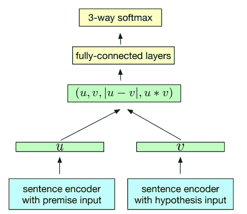
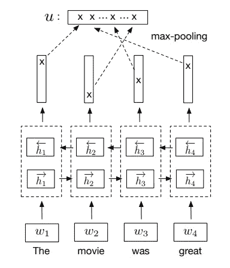
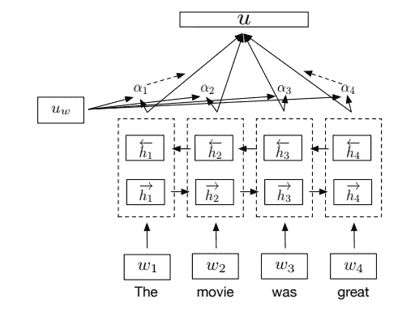
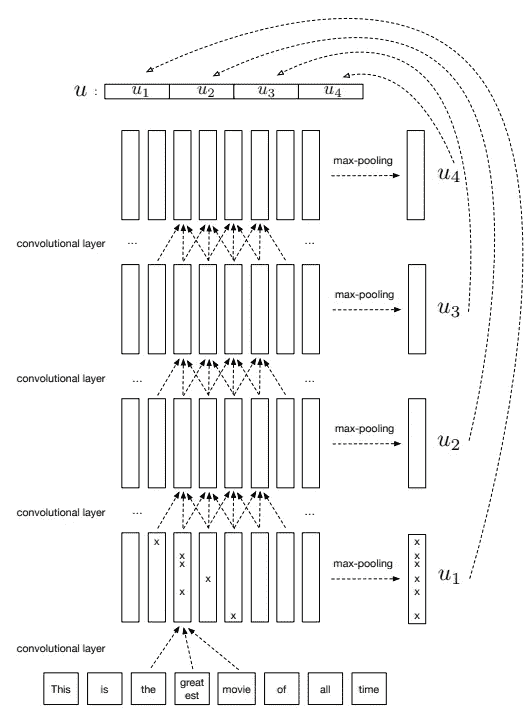
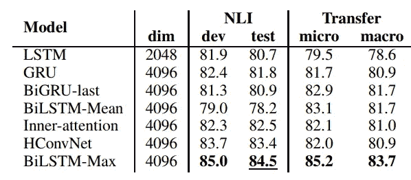

# 通过自然语言推理学习句子嵌入

> 原文：<https://towardsdatascience.com/learning-sentence-embeddings-by-natural-language-inference-a50b4661a0b8?source=collection_archive---------1----------------------->

无监督学习方法看起来像是构建单词、句子或文档嵌入的正常方式，因为它更一般化，使得预训练的嵌入结果可以转移到其他 NLP 下游问题。例如，单词嵌入中的 [skip-gram](/3-silver-bullets-of-word-embedding-in-nlp-10fa8f50cc5a) 和句子嵌入中的 skip-through 以及段落嵌入中的分布式词袋。


“closeup photo of person carrying professional video recorder” by [Laura Lee Moreau](https://unsplash.com/@laura_lee?utm_source=medium&utm_medium=referral) on [Unsplash](https://unsplash.com?utm_source=medium&utm_medium=referral)

Conneau 等人指出，ImageNet(图像分类)中的监督学习在将结果转移到下游问题方面做得很好。有些特征可以以某种方式转移到下游。因此，Conneau 等人使用文本蕴涵数据来训练一个句子嵌入层，称为 InferSent。

看完这篇文章，你会明白:

*   完美的设计
*   体系结构
*   履行
*   拿走

# 完美的设计

该团队使用 SNLI(斯坦福自然语言推理)数据来训练自然语言推理(NLI)问题的模型。NLI 的目标是找出句子 1(前提)和句子 2(假设)之间的关系。有三个范畴，即蕴涵、矛盾和中性。下面是一个非常简单的例子:


“two apples and walnuts on white towel” by [Alex Kotomanov](https://unsplash.com/@kotomanov?utm_source=medium&utm_medium=referral) on [Unsplash](https://unsplash.com?utm_source=medium&utm_medium=referral)

1.  我吃水果。
2.  我吃苹果。

直觉上，这种关系是隐含的。作者认为，NLI 是理解句子中语义关系的合适任务，因此它有助于为下游 NLP 问题的句子嵌入建立良好的嵌入。

# 体系结构

总体思路是，两个句子(前提输入和假设输入)将通过句子编码器(权重相同)进行转换。然后利用 3 种匹配方法来识别前提输入和假设输入之间的关系。



Conneau et al. (2017)

1.  两个向量的连接
2.  两个向量的逐元素乘积
3.  两个向量的绝对元素差

在概述之后，可能会进入句子编码器的架构。Conneau 等人评估了 7 种不同的架构:

1.  标准 LSTM
2.  标准 GRU
3.  前向和后向 GRU 的最后隐藏状态的串联
4.  具有平均轮询的双向 LSTM
5.  具有最大轮询的双向 LSTM
6.  自我关注网络(用 BiLSTM 关注)
7.  分层卷积网络

在首先得出最佳方法之前，我们可以认为用 BiLSTM 注意应该是最佳方法，因为注意机制有助于识别重要权重。实际上，在迁移学习中使用它可能是有害的。另一方面，采用平均轮询的 BiLSTM 可能由于无法定位重要部分而性能不佳。



#5 Bi-directional LSTM with max polling (Conneau et al., 2017)



#6 Self-attentive Network Architecture (Conneau et al., 2017)



Hierarchical convolutional networks (Conneau et al., 2017)

从实验结果来看，最大轮询的双向 LSTM 是最好的方法。



Conneau et al. (2017)

# 履行

有两种方法可以使用 InferSent。首先是在你的 NLP 问题中使用一个预先训练好的嵌入层。另一个是你自己发出的建筑噪音。

***加载预训练嵌入***

脸书研究小组提供了两个预训练模型，即版本 1(基于手套)和版本 2(基于快速文本)。

加载推断预训练模型和 GloVe(或 fastText)模型，然后您可以将句子编码为向量。

```
# Init InferSent Model
infer_sent_model = InferSent()
infer_sent_model.load_state_dict(torch.load(dest_dir + dest_file))# Setup Word Embedding Model
infer_sent_model.set_w2v_path(word_embs_model_path)# Build Vocab for InferSent model
model.build_vocab(sentences, tokenize=True)# Encode sentence to vectors
model.encode(sentences, tokenize=True)
```

***列车嵌入***

另一种方法是自己训练嵌入。你可以使用你自己的数据或原始数据集。因为这个推理器使用监督学习方法来生成句子嵌入，所以您首先需要有一个带注释的(带标签的)数据。

这是第一种方法的步骤。克隆人将原始的[回购](https://github.com/facebookresearch/InferSent)发送到本地。然后在控制台中执行“get_data.bash ”,以便下载和处理 SNLI(斯坦福自然语言推理)和 multi nli(NLI)语料库。确保您必须在当前文件夹而不是其他相对路径中执行以下 shell 脚本

```
./get_data.bash
```

之后，下载手套(和/或快速文本)

```
mkdir dataset/GloVe
curl -Lo dataset/GloVe/glove.840B.300d.zip http://nlp.stanford.edu/data/glove.840B.300d.zip
unzip dataset/GloVe/glove.840B.300d.zip -d dataset/GloVe/
mkdir dataset/fastText
curl -Lo dataset/fastText/crawl-300d-2M.vec.zip https://s3-us-west-1.amazonaws.com/fasttext-vectors/crawl-300d-2M.vec.zip
unzip dataset/fastText/crawl-300d-2M.vec.zip -d dataset/fastText/
```

正在下载预先训练好的模型。版本 1 通过使用 GloVe 来训练，而版本 2 利用了 fastText。

```
curl -Lo encoder/infersent1.pkl https://s3.amazonaws.com/senteval/infersent/infersent1.pkl
curl -Lo encoder/infersent2.pkl https://s3.amazonaws.com/senteval/infersent/infersent2.pkl
```

最后，您可以执行下面的命令来训练嵌入层。

```
python train_nli.py --word_emb_path ./glove.42B.300d.txt
```

对于我的单个 GPU 虚拟机，完成培训大约需要 1 天时间。

# 拿走

要访问所有代码，可以访问我的 [github](https://github.com/makcedward/nlp/blob/master/sample/nlp-embeddings-sentence-infersent.ipynb) repo。

*   与其他嵌入方法相比， **InferSent 使用监督学习**来计算单词向量。
*   **InferSent 利用单词嵌入** (GloVe/ fastText)构建句子嵌入。
*   预训练模型支持 GloVe(版本 1)和 fasttext(版本 2)

# 关于我

我是湾区的数据科学家。专注于数据科学、人工智能，尤其是 NLP 和平台相关领域的最新发展。你可以通过[媒体博客](http://medium.com/@makcedward/)、 [LinkedIn](https://www.linkedin.com/in/edwardma1026) 或 [Github](https://github.com/makcedward) 联系我。

# 参考

Conneau，D. Kiela，H. Schwenk，L. Barrault，A. Bordes， [*从自然语言推理数据中监督学习通用语句表示*](https://arxiv.org/abs/1705.02364)

[在 Pytorch 中感染](https://github.com/facebookresearch/InferSent)