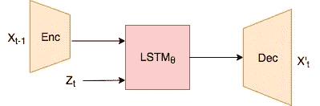
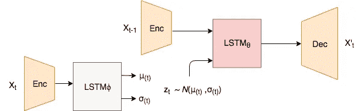
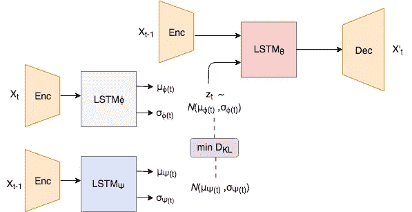
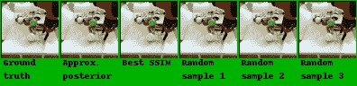
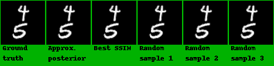

# 学习制作未来不确定的视频

> 原文：<https://towardsdatascience.com/learning-to-generate-videos-with-uncertain-futures-3d587fe06838?source=collection_archive---------9----------------------->

## “具有已知先验的随机视频生成”一文的摘要

**TL；DR:** 这篇文章提供了一个在[中描述的视频生成模型的高级概述，随机视频生成具有一个已知的先验](http://proceedings.mlr.press/v80/denton18a.html)，它能够生成具有多种未来的视频序列。

## 作为自我监督学习任务的视频生成

有监督的深度学习模型已被证明在最近的过去在诸如实时对象分割、检测、机器翻译和语音识别等困难任务上产生了突破性的结果。这些模型的高保真性能使它们在现实世界应用中的使用给世界带来了积极的影响(但有时也是消极的)。

无监督学习的下一阶段挑战也已经在一定程度上成功解决，如[领域适应](https://medium.com/neuromation-io-blog/state-of-the-art-in-domain-adaptation-cvpr-in-review-iv-21ac05f935b9)和[机器翻译](https://code.fb.com/ai-research/unsupervised-machine-translation-a-novel-approach-to-provide-fast-accurate-translations-for-more-languages/)。从原始、嘈杂的真实世界数据中学习在操作上更便宜、更快，因为可以跳过大量的手动预处理，如清理和注释。

无监督学习的一个子领域是自监督学习，最近由 [AI 社区](https://www.youtube.com/watch?v=7I0Qt7GALVk)谈论了很多。在这个场景中，模型被提供输入数据，并负责完成围绕该数据的故事。该领域中一个特别有趣的应用是生成任何给定视频序列的未来事件。

这个任务的警告使得这个问题变得困难，不像其他任务，其中输入具有固定的输出，视频中的未来事件可以以多种可能性解开，例如，击中地面的弹跳球可以具有多种可能的轨迹、旋转等。

## 具有学习先验的随机视频生成

2018 年在 ICML 发表的“[具有学习先验的随机视频生成](http://proceedings.mlr.press/v80/denton18a.html)”提出了一个框架，通过提出一个预测模型来处理这种情况，其中未来的“不确定”部分由从先验分布中采样的潜在变量来处理。为了理解其工作原理，让我们直接进入系统设计。

该系统由以下部件组成:

1.  预测模型
2.  推理模型
3.  已知先验

## 预测模型

预测模型是核心预测器/生成器，其他模型提供辅助信息来帮助预测模型。它由一个**编码器**组成，该编码器在时间 *t-1* 从视频中获取一个图像帧，并将其编码为潜在空间中的密集表示。这个表示向量然后被传递到 LSTM ( **【帧预测】**，它是预测模型的记忆组件。它有助于模型考虑序列中过去图像帧的信息。**帧预测器**负责预测未来下一帧的密集表示。然后，该图像被传递到**解码器/** 生成器网络，该网络在时间 *t* 将其转换为预测图像。为了进一步帮助解码器，在编码器和解码器之间进行跳跃连接，以便可以简单地直接复制视频的静态部分。

**帧预测器**也以一个辅助变量为条件，该辅助变量可被视为代表关于特定未来的信息。我们将在接下来的步骤中讨论这一点。

Prediction Model

到目前为止，模型的训练包括一个非常简单的目标，即最小化重建误差或预测帧和地面真实情况之间的 L2 距离。

## 推理模型

推理模型的任务是学习包含关于时间 *t* 的事件的信息的分布。从该分布中抽取样本 *z* ，其被传递到预测模型中的帧预测器上。

推理模型的输入是在时间 *t* 的图像帧，因此该模型仅在训练期间使用。推理模型的架构使用与预测模型中相同的**T21 编码器，因为在两个阶段中我们想要的图像编码类型是相同的。重复使用模型或**重量分配**会使学习过程变得简单一些。然后，编码矢量被传递到不同的 LSTM 模型(本文中称为**后验**)上，该模型具有与帧预测器相似的目标，但是在学习表示未来信息的背景下。后验者可能会学习查看过去的隐藏状态，并避免捕获已学习分布中的冗余信息。**

人们可能会想，推理模型可以简单地记忆整个图像，并通过解码器再现它。为了确保只捕获相关的信息，我们使用了**已学习的先验模型**。

Inference Model accompanies the Prediction model during training, providing latent variable containing information to a possible outcome in the future.

## 已知先验

为了防止推理模型简单地复制整个目标帧，我们施加了这样的限制，即来自后验的学习分布应该紧密匹配前**分布。这通过最小化后验和先验预测的两个多变量分布之间的 KL-散度来确保。这个先验分布是通过另一个模型学习的，该模型类似于推理模型，但是将时间 *t-1* 的帧作为输入。这里的思想是先验也是时间相关的，即在时间 *t* 预测的先验分布是直到 *t-1 的过去帧的函数。***

Complete model that is used during training with the objective of minimizing reconstruction error and KL divergence.

一种替代方法是将该先验分布固定为具有零均值和恒等协方差的高斯分布。

## 结果

通过将地面实况的第一个 *t-1* 帧馈送到预测和先验模型，从学习的先验分布中采样 *z* 并生成时间步长 *t* 的帧，来执行推断。这然后作为输入反馈到模型中，以在 *t+2* 生成帧。

除了像移动 MNIST 和 KTH 动作这样的较小数据集，该模型在 BAIR 机器人推数据集上显示了令人印象深刻的结果。鉴于损失目标如此简单，该模型能够在未来多个时间步长内表现如此之好，即生成机器人手臂的非模糊运动，确实令人惊讶。

The frames marked in green are ground truth. “Approx. posterior”: in this case, *z is sampled from the posterior (and thus should be close to the ground truth). In all other sequences, z is randomly sampled from the prior distribution. “Best SSIM” is the one such sequence prediction with the best results on SSIM metric.*

Results on Moving MNIST.

更多比赛结果的视频，请查看 https://sites.google.com/view/svglp/的。

## 当前的缺点

如果读者在提供的链接中查看放大的结果，很容易注意到当机器人手臂与周围的其他对象交互时，预测的帧表现出模糊。换句话说，这个模型已经学会了表示手臂的未来随机运动，但未能捕捉到手臂及其与其他对象的交互之间的动态。

解决这一问题的一种方法是利用分层潜在模型，这样更广泛的概念(如整体手臂运动)由较低层次的先验捕获，而复杂的动力学由下一层次的模型捕获。今年早些时候，我花了一些时间研究这个问题，应用了各种基于层次概念的技术。我的一些发现可以在这里查看[。](https://drive.google.com/file/d/1NeKmVa4dV7DF4BMRy0uE0jw_qBGKxJeR/view)

## 最后的想法

这篇文章提供了 SVG-LP 模型的简要概述以及它所获得的一些结果。要从概率的角度获得更正式的解释，请参考上面链接的论文。

视频生成模型不仅可以作为视频理解和合成的非常有用的应用，还可以帮助规划和强化学习。2018 年下半年，基于模型的强化学习出现了令人难以置信的增长。这些方法的基本组成部分是前向预测模型，其任务是在给定当前和动作的情况下预测下一个状态。看看大卫·哈的[https://worldmodels.github.io/](https://worldmodels.github.io/)来一瞥这种类型的模型如何被用于强化学习。