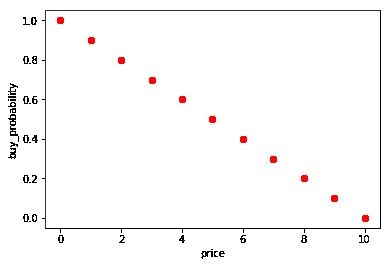
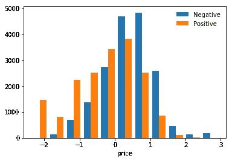
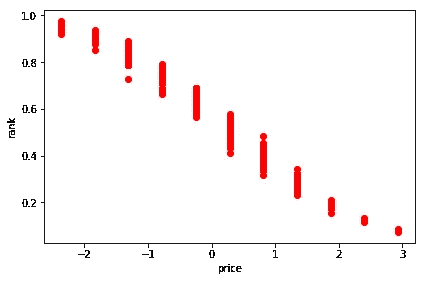
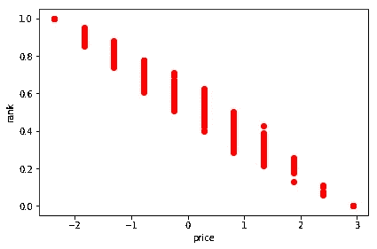
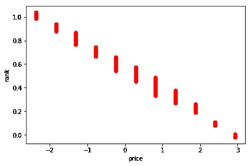

# 学习使用 Python scikit 进行排名-学习

> 原文：<https://towardsdatascience.com/learning-to-rank-with-python-scikit-learn-327a5cfd81f?source=collection_archive---------0----------------------->

如果你经营一个电子商务网站，一个经典的问题是在搜索页面上排列你的产品，以最大化你的商品被销售的可能性。例如，如果你在卖鞋，你希望搜索结果页面中的第一双鞋是最有可能被购买的。

由于机器学习的广泛采用，现在比以往任何时候都更容易建立和部署自动学习用户喜欢什么并相应地对产品目录进行排名的模型。在这篇博文中，我将分享如何使用一个简单的端到端示例，使用 [movielens 开放数据集](https://grouplens.org/datasets/movielens/100k/)来构建这样的模型。

# 介绍

想象一下，你有一个电子商务网站，你正在设计一种算法，在你的搜索页面中对你的产品进行排序。你展示的第一件物品是什么？评论最好的那个？价格最低的那个？还是两者都有？问题很快变得复杂起来。

一个简单的解决方案是利用你的直觉，从你的客户那里收集反馈，或者从你的网站上获取指标，手工制作适合你的完美配方。不太科学不是吗？一种更复杂的方法包括建立许多排名公式，并使用 [A/B 测试](http://www.alfredo.motta.name/ab-testing-from-scratch/)来选择具有最佳性能的一个。

在这里，我们将使用来自客户的数据来自动学习他们的*偏好函数*，这样我们的搜索页面的排名将最大化获得*转化率*的可能性(即客户购买你的商品)。具体来说，我们将学习如何根据人工生成的用户数据对来自 [movielens 开放数据集](https://grouplens.org/datasets/movielens/100k/)的电影进行排名。Github 上的[提供了 Jupyter 笔记本格式的完整步骤。](https://github.com/mottalrd/learning-to-rank)

# 准备培训数据

为了学习我们的排名模型，我们首先需要一些训练数据。因此，让我们生成一些模拟网站用户行为的示例:

```
event_1: <customer_1, movie_1, fail>
event_2: <customer_1, movie_2, fail>
event_3: <customer_1, movie_3, success>
event_4: <customer_2, movie_2, fail>
event_5: <customer_2, movie_3, success>
…
```

列表可以解释为: *customer_1* 看了 *movie_1* 和 *movie_2* 但决定不买。然后看了 *movie_3* 决定买电影。同样的*顾客 _2* 看了*电影 _2* 但决定不买。然后看了 *movie_3* 决定买。

在真实世界的场景中，你可以从你选择的分析工具中获得这些事件，但是对于这篇博文，我将人工生成它们。为此，我们将为每部电影关联一个 *buy_probability* 属性，并相应地生成用户事件。

我们的原始电影数据如下所示:

```
movie_data.dtypestitle object
release_date datetime64[ns]
unknown int64
Action int64
Adventure int64
Animation int64
Children’s int64
Comedy int64
Crime int64
Documentary int64
Drama int64
Fantasy int64
Film-Noir int64
Horror int64
Musical int64
Mystery int64
Romance int64
Sci-Fi int64
Thriller int64
War int64
Western int64
ratings_average float64
ratings_count int64
price float64
dtype: object 
```

这是数据集中一部电影的例子:

```
‘title’, ‘release_date’, ‘unknown’, ‘Action’, ‘Adventure’, ‘Animation’, “Children’s”, ‘Comedy’, ‘Crime’, ‘Documentary’, ‘Drama’, ‘Fantasy’, ‘Film-Noir’, ‘Horror’, ‘Musical’, ‘Mystery’, ‘Romance’, ‘Sci-Fi’, ‘Thriller’, ‘War’, ‘Western’, ‘ratings_average’, ‘ratings_count’, ‘price’
‘Toy Story (1995)’, Timestamp(‘1995–01–01 00:00:00’), 0, 0, 0, 1, 1, 1, 0, 0, 0, 0, 0, 0, 0, 0, 0, 0, 0, 0, 0, 3.8783185840707963, 452, 7.0
```

让我们假设我们的用户将仅基于价格做出购买决定，并看看我们的机器学习模型是否能够学习这样的功能。对于这个数据集，电影价格的范围在 0 到 10 之间(查看 github 以了解价格是如何分配的)，所以我决定人工定义购买概率如下:

```
movie_data[‘buy_probability’] = 1 — movie_data[‘price’] * 0.1
```

根据购买概率函数，我们的完美排名应该是这样的:



没有火箭科学，价格最低的电影最有可能被购买，因此应该排在第一位。现在让我们基于这些数据生成一些用户事件。每个用户都有许多积极和消极的事件与之相关联。正面事件是指用户购买了一部电影。负面事件是指用户看了电影，但决定不购买。

```
class User:
    def __init__(self, id):
        self.id = id
        self.positive = []
        self.negative = []

    def add_positive(self, movie_id):
        self.positive.append(movie_id)

    def add_negative(self, movie_id):
        self.negative.append(movie_id)

    def get_positive(self):
        return self.positive

    def get_negative(self):
        return self.negative
```

在继续之前，我们希望所有的特征都被标准化，以帮助我们的学习算法。所以让我们把这个弄清楚。还要注意，我们将删除 *buy_probability* 属性，这样我们就不会在学习阶段使用它(用机器学习的术语来说，这相当于作弊！).

```
def build_learning_data_from(movie_data):
    feature_columns = np.setdiff1d(movie_data.columns, np.array(['title', 'buy_probability']))
    learning_data = movie_data.loc[:, feature_columns]

    scaler = StandardScaler()
    learning_data.loc[:, ('price')] = scaler.fit_transform(learning_data[['price']])
    learning_data['ratings_average'] = scaler.fit_transform(learning_data[['ratings_average']])
    learning_data['ratings_count'] = scaler.fit_transform(learning_data[['ratings_count']])
    learning_data['release_date'] = learning_data['release_date'].apply(lambda x: x.year)
    learning_data['release_date'] = scaler.fit_transform(learning_data[['release_date']])

    return learning_data
```

最后，使用下面显示的“EventsGenerator”类，我们可以生成我们的用户事件。为了简单起见，让我们假设我们有 *1000 个*用户，并且每个用户将打开 *20 部*电影。真实世界的数据显然会有所不同，但原理是一样的。

```
np.random.seed(1)class EventsGenerator:
    NUM_OF_OPENED_MOVIES_PER_USER = 20
    NUM_OF_USERS = 1000def __init__(self, learning_data, buy_probability):
        self.learning_data = learning_data
        self.buy_probability = buy_probability
        self.users = []
        for id in range(1, self.NUM_OF_USERS):
            self.users.append(User(id))

    def run(self):
        for user in self.users:
            opened_movies = np.random.choice(self.learning_data.index.values, self.NUM_OF_OPENED_MOVIES_PER_USER)
            self.__add_positives_and_negatives_to(user, opened_movies)return self.__build_events_data()def __add_positives_and_negatives_to(self, user, opened_movies):
        for movie_id in opened_movies:
            if np.random.binomial(1, self.buy_probability.loc[movie_id]): 
                user.add_positive(movie_id)
            else:
                user.add_negative(movie_id)

    def __build_events_data(self):
        events_data = []

        for user in self.users:
            for positive_id in user.get_positive():
                tmp = learning_data.loc[positive_id].to_dict()
                tmp['outcome'] = 1
                events_data += [tmp]

            for negative_id in user.get_negative():
                tmp = learning_data.loc[negative_id].to_dict()
                tmp['outcome'] = 0
                events_data += [tmp]

        return pd.DataFrame(events_data)
```

这就是所有东西粘在一起的原因。*事件生成器*获取标准化的电影数据，并使用购买概率来生成用户事件。

```
learning_data = build_learning_data_from(movie_data)
events_data = EventsGenerator(learning_data, movie_data['buy_probability']).run()
```

这是其中一个事件的样子:

```
'Action', 'Adventure', 'Animation', "Children's", 'Comedy', 'Crime', 'Documentary', 'Drama', 'Fantasy', 'Film-Noir', 'Horror', 'Musical', 'Mystery', 'Romance', 'Sci-Fi', 'Thriller', 'War', 'Western', 'outcome', 'price',    'ratings_average', 'ratings_count', 'release_date', 'unknown'
1,        1,           0,           0,            0,        0,       0,             0,       0,         0,           0,        0,         0,         0,         0,        0,          0,     1,         0,         0.28363692, 0.16953213,        -0.14286941,     0.39397757,     0
```

在这种情况下，由于我们在函数*build _ learning _ data _ from(movie _ data)*中所做的操作，我们得到了一个否定的结果(值为 0)，并且这些特征已经被归一化并集中在零。

如果我们绘制事件图，我们可以看到分布反映了人们大多购买廉价电影的想法。由于正常化，价格再次以零为中心。



# 训练我们的模型

现在我们有了我们的事件，让我们看看我们的模型在学习(简单)“购买概率”函数方面有多好。我们将把我们的数据分成一个训练和测试集，以测量模型性能(但请确保您知道[交叉验证如何工作](http://www.alfredo.motta.name/cross-validation-done-wrong/))，并使用这个通用函数来打印不同模型的性能。

```
def train_model(model, prediction_function, X_train, y_train, X_test, y_test):
    model.fit(X_train, y_train)

    y_train_pred = prediction_function(model, X_train)print('train precision: ' + str(precision_score(y_train, y_train_pred)))
    print('train recall: ' + str(recall_score(y_train, y_train_pred)))
    print('train accuracy: ' + str(accuracy_score(y_train, y_train_pred)))y_test_pred = prediction_function(model, X_test)print('test precision: ' + str(precision_score(y_test, y_test_pred)))
    print('test recall: ' + str(recall_score(y_test, y_test_pred)))
    print('test accuracy: ' + str(accuracy_score(y_test, y_test_pred)))

    return model
```

使用 scikit-learn 训练各种模型现在只是把东西粘在一起的问题。让我们从逻辑回归开始:

```
def get_predicted_outcome(model, data):
    return np.argmax(model.predict_proba(data), axis=1).astype(np.float32)def get_predicted_rank(model, data):
    return model.predict_proba(data)[:, 1]model = train_model(LogisticRegression(), get_predicted_outcome, X_train, y_train, X_test, y_test)
```

这为我们提供了以下性能

```
train precision: 0.717381689518
train recall: 0.716596235113
train accuracy: 0.717328291166
test precision: 0.720525676086
test recall: 0.726374636238
test accuracy: 0.721590909091
```

我们可以使用神经网络和决策树来做同样的事情。这是一个具有 23 个输入(与电影特征的数量相同)和 46 个隐含层神经元(隐含层神经元加倍是一个常见的经验法则)的神经网络。

```
from nolearn.lasagne import NeuralNetdef nn():
    return NeuralNet(
        layers=[  # three layers: one hidden layer
            ('input', layers.InputLayer),
            ('hidden', layers.DenseLayer),
            ('output', layers.DenseLayer),
            ],
        # layer parameters:
        input_shape=(None, 23),  # this code won't compile without SIZE being set
        hidden_num_units=46,  # number of units in hidden layer
        output_nonlinearity=None,  # output layer uses identity function
        output_num_units=1,  # this code won't compile without OUTPUTS being set# optimization method:
        update_learning_rate=0.01, 
        regression=True,  # If you're doing classification you want this off
        max_epochs=50,  # more epochs can be good, 
        verbose=1, # enabled so that you see meaningful output when the program runs
    )def get_predicted_outcome(model, data):
    return np.rint(model.predict(data))def get_predicted_rank(model, data):
    return model.predict(data)
```

这是我们得到的表现

```
model = train_model(
 nn(), 
 get_predicted_outcome, 
 X_train.astype(np.float32), 
 y_train.astype(np.float32), 
 X_test.astype(np.float32), 
 y_test.astype(np.float32)
)train precision: 0.698486217804
train recall: 0.687534749249
train accuracy: 0.65721971972
test precision: 0.667556742323
test recall: 0.679655641142
test accuracy: 0.636136136136
```

最后是决策树

```
def get_predicted_outcome(model, data):
    return np.argmax(model.predict_proba(data), axis=1).astype(np.float32)def get_predicted_rank(model, data):
    return model.predict_proba(data)[:, 1]
```

这为我们提供了以下性能

```
from sklearn import tree
model = train_model(tree.DecisionTreeClassifier(), get_predicted_outcome, X_train, y_train, X_test, y_test)train precision: 0.680947848951
train recall: 0.711256135779
train accuracy: 0.653892069603
test precision: 0.668242778542
test recall: 0.704538759602
test accuracy: 0.644044702235
```

我们可以将各种排名标绘在一起进行比较。排名曲线的形状与我们用来定义*购买概率*的曲线非常相似，这证实了我们的算法正确地学习了*偏好函数*。

描述 buy_probability 的形状并不完全相同，因为用户事件是随机生成的(均值等于 *buy_probability* 的二项式分布)，所以模型只能根据生成的事件来近似潜在的事实。



Logistic regression



Decision trees



Neural Network

# 下一步是什么

一旦你得到了你的排名估计，你可以简单地将它们保存在你选择的数据库中，并开始为你的页面服务。随着时间的推移，你的用户的行为可能会像你的目录中的产品一样发生变化，所以要确保你有一些程序来每周更新你的排名数字，如果不是每天的话。根据一个简单的手工制作的线性公式对你的新模型进行 A/B 测试也是一个好主意，这样你就可以验证自己，机器学习是否确实在帮助你收集更多的转化率。

如果你更喜欢戴科学家的帽子，你也可以在 Github 上运行 Jupyter 笔记本[，用不同的公式计算 *buy_probability* ，看看这些模型能够在多大程度上发现潜在的真相。我确实尝试了价格和评级的非线性函数的线性组合，它在相似的准确度水平下工作得同样好。](https://github.com/mottalrd/learning-to-rank)

```
price_component = np.sqrt(movie_data['price'] * 0.1)
ratings_component = np.sqrt(movie_data['ratings_average'] * 0.1 * 2)
movie_data['buy_probability'] = 1 - price_component * 0.2 - ratings_component * 0.8
```

最后，与这里概述的方法不同的方法是使用事件对来学习排序函数。这个想法是，你给学习算法输入一对这样的事件:

```
pair_event_1: <customer_1, movie_1, fail, movie_3, success>
pair_event_2: <customer_2, movie_2, fail, movie_3, success>
pair_event_3: <customer_3, movie_1, fail, movie_2, success>
...
```

有了这样的例子，你可以猜到一个好的排序是“电影 _3，电影 _2，电影 _1 ”,因为不同客户的选择强制了我们的电影集合的总排序。尽管预测成对的结果与上面显示的例子具有相似的准确性，但为我们的电影集提出一个全局排序证明是困难的(NP 完全困难，如来自& T labs 的[这篇论文所示)，我们将不得不求助于贪婪算法进行排序，这会影响最终结果的质量。Julien le tessier](https://www.jair.org/media/587/live-587-1790-jair.pdf)[的这篇博客文章对这种方法进行了更深入的描述。](http://dec0de.me/2014/10/learning-to-rank-1)

# 结论

在这篇博文中，我介绍了如何利用用户事件数据来教会机器学习算法如何对你的产品目录进行最佳排序，以最大化你的商品被购买的可能性。我们看到了逻辑回归、神经网络和决策树如何实现相似的性能，以及如何将您的模型部署到生产中。

期待在评论中听到你的想法，如果你喜欢这个博客，你也可以在 Twitter 上关注我。

*最初发表于* [*阿尔弗雷多*](http://www.alfredo.motta.name/learning-to-rank-with-python-scikit-learn/) *。*