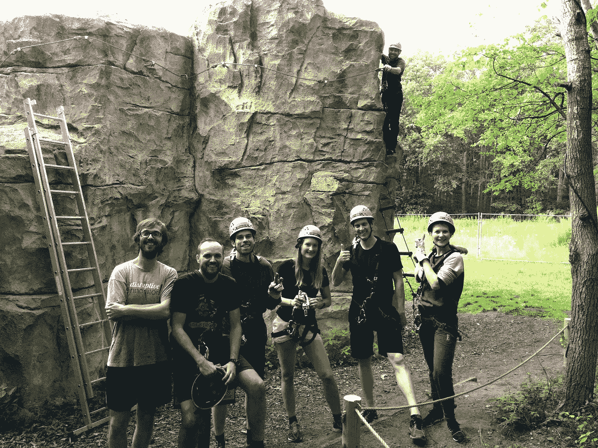
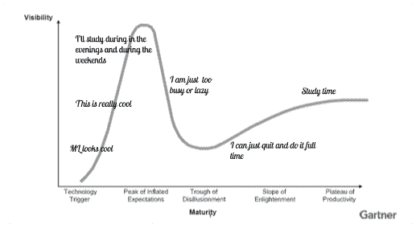

# 离开我的风投工作去学习数据科学和机器学习

> 原文：<https://towardsdatascience.com/leaving-my-vc-job-to-learn-about-data-science-and-machine-learning-4dbc15427fc5?source=collection_archive---------1----------------------->

昨天是我在九点资本的最后一天。

两年半前我加入点九时，对风险投资一无所知。我来自比利时，我和我的朋友都没有接触过这个世界。但是我突然有一种想要亲身体验的冲动，于是我开始四处寻找机会。

如果我告诉你我在申请的时候知道谁是第九点或者第九点是什么，那我就是在撒谎。然而，读了他们的工作邀请后，我只是喜欢他们的语气。所以我买了一本基本上是虚拟资本的书，花了几十个小时熟悉这个领域，阅读了 Point Nine 团队的 100 万篇博客帖子——是的，我也认为他们当时有代笔人(我们没有)——在经过不下 5 次 Skype 面试后，终于获得了一个角色。

我的第一天有点难熬，因为我第一次见到这个团队是在一次异地活动中，在一次攀岩活动中，我被卡在了一块岩石上。是的，天气很热，是的，我身后有一个伙伴变得非常紧张，是的，我总是设法让自己处于这种情况下！

从那以后，我一直在爬 VC 岩石，我身后有 Point 的工作人员，我享受着每时每刻。我感到非常幸运，我有机会与这样一个伟大的团队和如此热情的企业家一起工作。我学到了很多，并且仍然认为这份工作是世界上最好的工作之一。

那么，我为什么要离开这么好的工作呢？

当我回顾过去两年半中最让我兴奋的公司时，我意识到两件事:

1)通常涉及一些数据魔术/机器学习，

2)他们对社会产生了某种积极的影响。

一些例子:

*   [Vintra](https://www.vintra.io/) ，这是一个视频分析平台，允许公共和私人调查人员利用视频来破案、拯救生命和保护资产。数据=视频监控录像，影响=更安全的世界。
*   Corti Labs ，提供实时诊断帮助、紧急呼叫数据分析以及呼叫接听人员培训模块。数据=紧急呼叫，影响=拯救生命。

机器学习并不新鲜，而且肯定被夸大了。然而，我仍然相信，用它可以做出惊人的事情。每当我考察一家新公司时，我都非常想了解这项技术的详细工作原理。然而，风投工作的性质意味着我不能花费我想花的时间。所以我想我会在晚上和周末学习。

这是六个月前，也是预期膨胀的顶峰。三个月前，失望之余，我意识到我做不到。一个月前，在启蒙运动的斜坡上，我决定退出并全职做几个月。从 1 月 1 日起，我将开始全职学习，并有望达到生产率的最高梯度。

***我将如何学习？***

我想在网上学习一切，这样我就可以在任何地方学习。

对比课程，征求大家的意见，我起草了这个[学习计划](https://docs.google.com/spreadsheets/d/10_H_17ilUQjKzEdcGDbgA6wUkpJqQFzxn_NFbABbrt0/edit?usp=sharing)。

非常欢迎任何建议或意见！这是我的私人[邮箱](mailto:savinavanderstraten@gmail.com)或者直接在表格中留下评论。

我会在表格的第二个选项卡中不断添加我收到的建议。

***然后，接下来呢？***

不，我不打算在数据科学领域工作。我的计划是 1)获得对数据科学和机器学习的高度理解，2)参与使用这些技术并对社会产生积极影响的初创公司(可能在投资方面，但也可能不是)。

很独特，是吧？是的，这是故意的。作为一名合伙人，我每个月都有机会看到几十个甚至几百个想法。这很神奇，但也有不好的一面:很难保持专注。关注科技行业是有风险的，因为使能技术发展如此之快。话虽如此，但我自信地押注于机器学习和至少未来几年的积极影响。

几年后，产品中的机器学习功能可能会像基于云一样简单。然而，了解如何从中获得好的价值来解决一个特定的问题可能会永远有意义。至于影响力投资，我希望对社会产生积极影响仍能吸引一些人。如果没有，我就去火星！

***谢谢***

我想感谢所有在我第一次风投之旅中有机会一起工作的了不起的人。

首先，我要感谢 Point Nine 团队——Christoph Janz 和 Pawel Chudzinski，他们向我展示了做一名好的风投真正意味着什么 Rodrigo Martinez，他多次督促我成为最好的，并“矩阵化”了我的思想 Mathias Ockenfels，他在早期以极大的耐心指导了我 Clement Vouillon，他在我的博客帖子上讲了一些糟糕的笑话和很好的建议；我的松露猪同事 Robin Dechant 和 Louis Coppey 以及 amaaaazing 团队:Jenny Buch

其次，我要感谢所有我有机会与之共事并分享他们伟大创业历程的创始人，包括来自 [Juro](https://juro.com/) 的 Richard 和来自 [Zype](http://www.zype.com/) 的 Ed。

谢谢你，我希望能很快见到你！