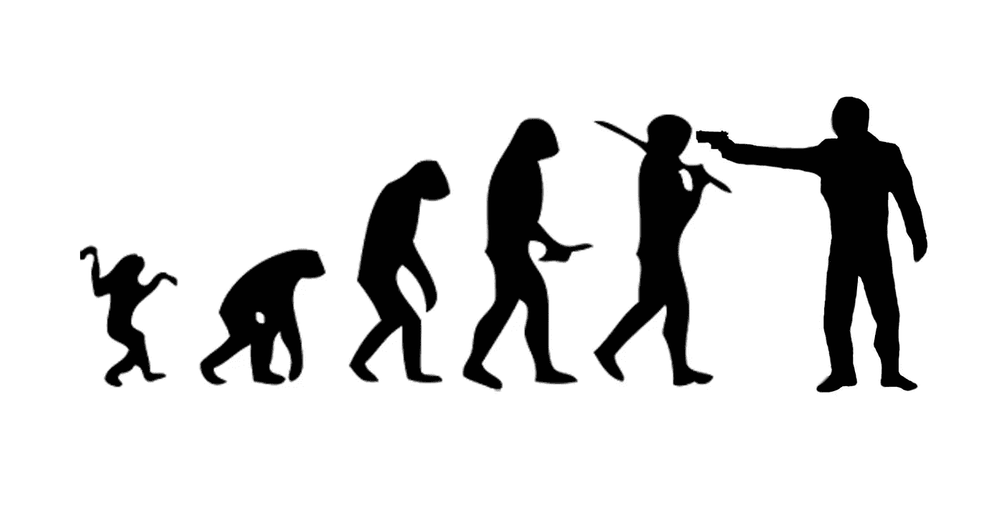

# [讲座]进化:从香草 RNN 到 GRU 和 LSTMs

> 原文：<https://towardsdatascience.com/lecture-evolution-from-vanilla-rnn-to-gru-lstms-58688f1da83a?source=collection_archive---------3----------------------->

RNNs evolution

如今，递归神经网络无处不在。像谷歌、百度这样的巨头在生产中广泛使用它们来做机器翻译、语音识别以及许多其他任务。实际上，NLP 相关任务中的几乎所有最新技术成果都是通过利用 RNNs 实现的。

随着 TensorFlow 等出色的深度学习框架的兴起，构建 LSTM 和其他类型的递归网络比以往任何时候都更容易。人们很容易将它们视为一个黑盒。

我们觉得现代 RNNs 背后的直觉是至关重要的。仅仅通过看方程，很难很好地理解 GRU 和 LSTM 网络。事实上，LSTM 网络是香草 RNN 与特定问题斗争的结果。因此，希望理解这些问题和解决它们的方法会使 GRU，LSTM 方程变得更加透明和直观。

现代 rnn 背后的想法真的很美。在今天的讲座“进化:从香草 RNN 到 GRU & LSTMs”中，我们将讨论它们！

这是幻灯片的[链接。](https://goo.gl/XodLUU)

非常尊重 R2RT 的博客文章:[书面记忆:理解、衍生和延伸 LSTM](https://r2rt.com/written-memories-understanding-deriving-and-extending-the-lstm.html) 。我们的讲座受到他们工作的强烈启发。