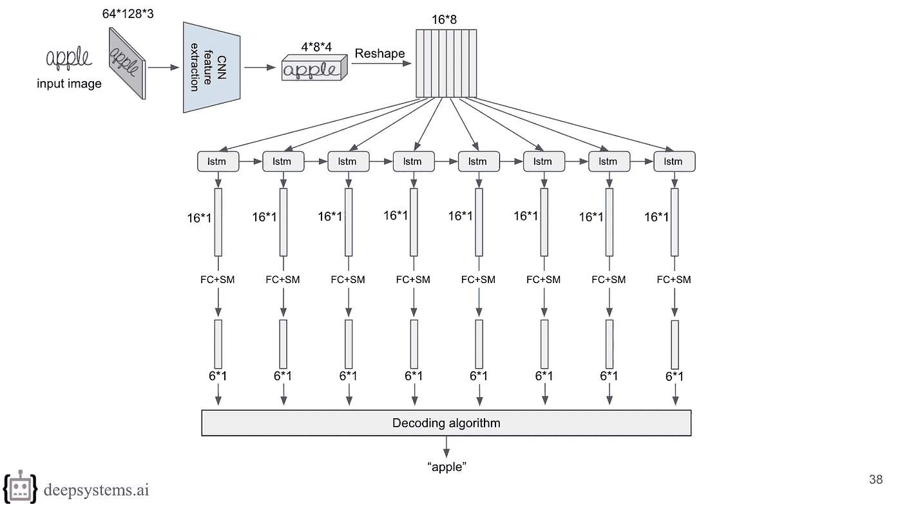

# [讲座]如何建立一个识别系统(第一部分):最佳实践

> 原文：<https://towardsdatascience.com/lecture-on-how-to-build-a-recognition-system-part-1-best-practices-46208e1ae591?source=collection_archive---------2----------------------->

你好世界！

识别系统有很多实际应用。许多公司需要创建这样的系统来优化他们的业务流程，不仅是像[谷歌](https://research.googleblog.com/2015/09/google-voice-search-faster-and-more.html)、[百度](http://research.baidu.com/gram-ctc-speech-recognition-word-piece-targets/)、[脸书](https://www.forbes.com/sites/leoking/2015/01/06/5-reasons-facebook-is-driving-at-speech-superiority/#31b501a16930)或 [Dropbox](https://blogs.dropbox.com/tech/2017/04/creating-a-modern-ocr-pipeline-using-computer-vision-and-deep-learning/) 这样的行业巨头。

例如，在医疗保健行业，一些公司为不同的患者表单开发了自动字段提取器，包括将相关数据输入数据库的保险表单。其他公司专注于识别车牌等等。

Example of recognition credit card number

幸运的是，我们在 [DeepSystems](https://deepsystems.ai/en/) 有构建图像识别系统的经验。但是由于缺乏互联网上的信息，很难深入这个领域。通过长期的研究和阅读许多论文，我们已经对创建有效的识别系统背后的主要原则有了理解。

今天，我们将与你分享我们的理解，并用浅显的语言解释它是如何工作的。

本讲座由两部分组成。第 1 部分涵盖了如何设计神经网络架构的概念。

第 2 部分(即将推出)详细解释了如何训练这样的系统，即如何进行前向和后向阶段的 CTC 丢失。我们觉得这是非常有价值的，因为不可能找到好的和简单的解释如何 CTC 损失工程。

这是幻灯片的[链接。](https://goo.gl/MrZ5jj)

第一部分:

谢谢大家！和我们在一起。欢迎在评论中提问。