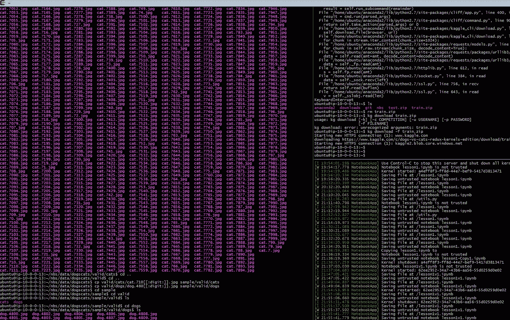
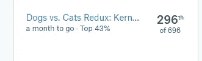
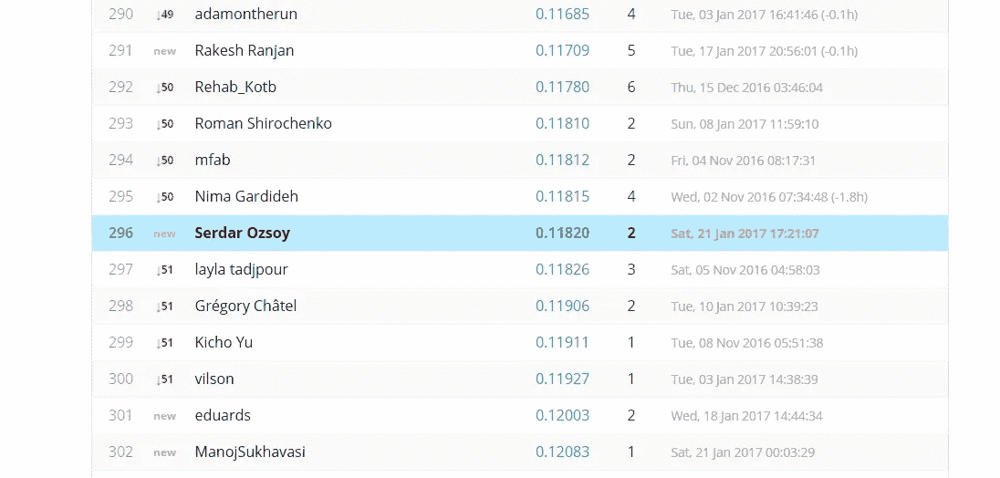

# Fast.ai 深度学习课程第一课

> 原文：<https://towardsdatascience.com/lesson-1-in-fast-ai-deep-learning-course-ccbae67fa806?source=collection_archive---------1----------------------->

[在之前的帖子](https://medium.com/@serdarozsoy/getting-started-with-fast-ai-mooc-in-aws-d2ffcd65c7b0)中，我尝试演示了 fast.ai 的[“入门”部分。第 1 课也是从解释安装开始的。获取笔记本和辅助文件对实施至关重要。这些文件的最新版本在](http://course.fast.ai/start.html) [github](https://github.com/fastai/courses/tree/master/deeplearning1/nbs) ( [utils](https://github.com/fastai/courses/blob/master/deeplearning1/nbs/utils.py) ， [vgg16](https://github.com/fastai/courses/blob/master/deeplearning1/nbs/vgg16.py) ， [vgg16bn](https://github.com/fastai/courses/blob/master/deeplearning1/nbs/vgg16bn.py) )中。

训练需要结构化数据。训练文件夹里有 12500 张狗的照片和 12500 张猫的照片。总共 25000 张照片中的 2000 张照片将被移至有效组。此外，为了快速获得洞察力，为每个类别(猫、狗)创建包含 20-50 张照片的样本文件夹将非常有用。

AWS 回复了我的 p2 使用请求，因此我可以使用它。首先，由于价格原因，我尝试使用现货实例。虽然按需实例的成本为 0.90 美元/小时，但根据您的出价，现货实例的成本可能是这个价格的四分之一。然而，这种方法也有一些缺点。当有人出价高于你的出价时，你的实例将在两分钟内关闭。因为 EBS，你不能保存你的作品。解决这个问题的一种方法是在终止前分离磁盘，但是这需要停止实例。它立即终止，我不能分离它。AMI 的一些功能在 spot 中并不有用，因为它是为点播而准备的。我不想浪费更多的时间，所以我回到了按需服务，尽管它很贵。

让我们返回终点站。Aws-alias.sh 使得在终端上连接 Aws 变得容易。只是写 aws-start 然后用 aws-ssh 登录。登录后，不要惊讶当你开始 jupyter 笔记本。用“dl_course”加密。一切正常。

您将通过这些页面学习使用 Kaggle CLI。使用 Kaggle CLI，可以下载数据和提交解决方案。

Screenshot by the author

第一课之后，笔记中有家庭作业部分。我很难从模型中获得结果并创建预测文件来提交 Kaggle。经过在论坛上的研究，这些文件被放在 github 页面的教程中。

这个笔记本帮助我创建提交文件。我将我的文件结构和方法与这个笔记本进行了比较。在我完成提交并开始第 2 课之后，这个文件在那里被提到。所以，你应该首先尝试你自己的，这是非常重要的学习。否则你只会复制代码。

作为作业的结果，我把我的作品提交给了 Kaggle 竞赛。这是一个粗略的解决方案，所以我得到了这个结果:

Screenshot by the author

第 2 课涉及更多的概念，我会用深入的知识来创作文章。