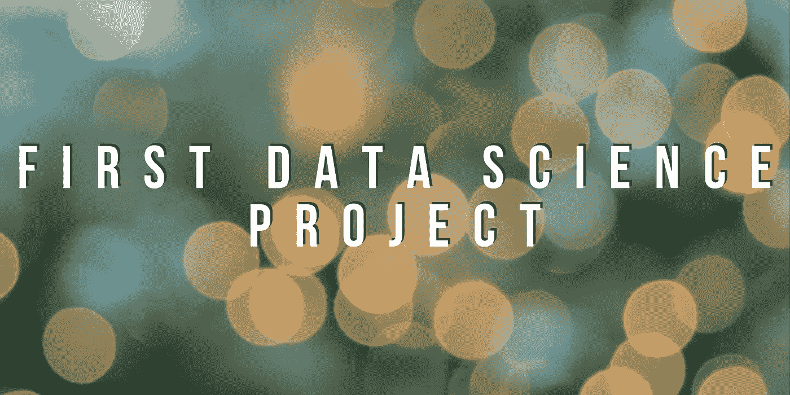
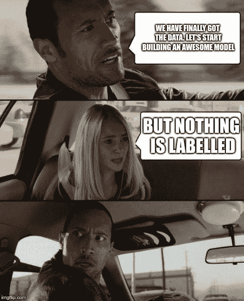
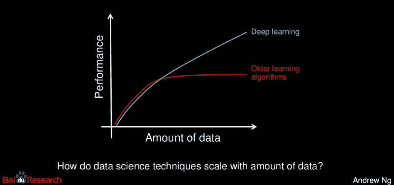
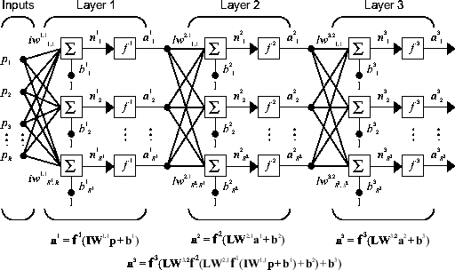
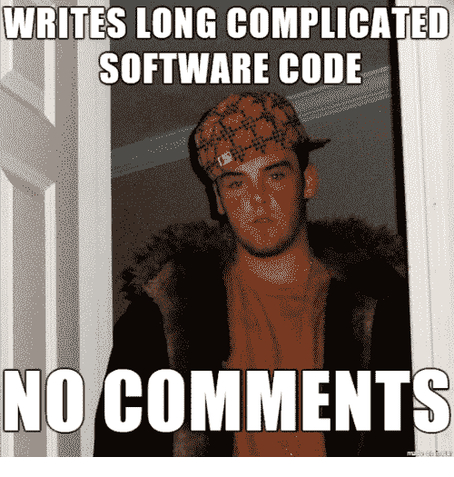

# 从我的第一个数据科学项目中获得的经验

> 原文：<https://towardsdatascience.com/lessons-from-my-first-data-science-project-630eb20af8a1?source=collection_archive---------20----------------------->

我作为一名数据科学家开始了我的职业生涯&分享交付我的第一个全功能数据科学管道的经验。

回顾过去，我意识到**我犯了很多错误**并且对这个领域有**很多误解！**

# 1.数据很乱

与 Kaggle 不同，*现实生活中的数据并不总是在漂亮的 CSV 文件中。*

您经常会遇到数据以不太理想的格式存储的情况，如 PDF/DOC/DOCX/XML/HTML 等。根据需要提取的数据，原始数据可用的格式会大大增加实际提取的难度。

在我们的例子中，我们有大量的数据存储在 pdf 中。如果您遇到这种情况，这里有一些方便的开源库:

*   文本的 [pdfminer](https://pdfminer-docs.readthedocs.io/pdfminer_index.html)
*   [图像测试](https://pypi.org/project/pytesseract/)
*   [表格的表格](https://pypi.org/project/tabula-py/0.3.0/)

# 2.标签数据并不总是可用的

机器学习领域(肯定是深度学习领域)的一大障碍是缺乏高质量的标记数据。这通常会导致使用监督方法解决手头问题不可行的情况。

通常有三种方法可以解决好的标记数据不可用的问题:

*   雇佣一群可以为你手工标注数据的人
*   使用 Amazon Turk、tractable.ai、mighty.ai 等付费工具。
*   向无监督学习问好。

在你决定向你的老板寻求第(一)或第(二)种选择之前，先获得以下问题的答案

*   与无监督方法相比，有监督方法有哪些改进？(这并不容易)
*   对于这样的改进，我需要多少标记数据？
*   项目是否有完成任务所需的时间和资金？

# 3.更多的数据不会自动带来更好的性能

有些时候，更多的数据会有帮助，有些时候则没有。

如果更多的数据对您的模型的性能几乎没有影响，请问自己以下问题

*   对于分类器/回归器来说，我的特征是否足以预测结果？
*   该模型是否存在高偏差或高方差？
*   是数据太吵了？
*   预处理做的对吗？(在涉及自然语言处理的问题中极其重要)

永远记住:垃圾入=> `PREDICTIVE MODEL` = >垃圾出

# 4.保持事情简单

深度学习和如下流行图表的最新进展导致许多人认为深度学习方法应该永远是第一选择。

我不这么认为。深度学习方法不能保证总是比传统方法产生更好的结果。即使他们这样做了，他们几乎总是以牺牲可解释性为代价。维护数据科学中的可解释性很难，但很重要。

为什么可解释性很重要？

高度的可解释性有助于您改进工作，并更有效地与非数据科学领域的人交流。

让我们举一个例子，你开发了一个 3 层的神经网络。不仅很难确定错误预测的根本原因，而且向没有数据科学背景的人传达下面导致预测的等式将是一场噩梦。

根据我的经验，应该按照以下顺序解决问题:

*   手工管理的试探法(对于循环、If/Then 条件)
*   简单的机器学习算法(线性回归、逻辑回归、决策树等。)
*   高级机器学习算法(RandomForest，XGBoost 等。)
*   浅层神经网络
*   深度神经网络

# 5.始终保持文档更新

我知道这听起来像编程 101。所以我为什么要重复？

数据科学项目是迭代的。你的第一个模特永远不会是你的最后一个。拥有一个记录良好的代码将确保您(和其他人)在稍后重新访问您的方法时理解它。

# 6.模块化编程使事情变得更容易

随着您的管道开始变得更加复杂，代码库也会变得更加复杂。

现在想象一下，你需要在管道中做一个小小的改变。但是所有的步骤都在一个大的功能块中执行。如何在不破坏管道的情况下做出相关的改变？

拥有多个执行独立任务的函数和一个调用所有其他函数的主函数使得执行更改更加容易。这有助于提高代码的可读性，因为它有助于很容易地将代码追溯到特定的操作。

# 7.变量应该是人类可以理解的

避免制造 df/data 之类的变量。不是所有的东西都是熊猫的数据框架！

如果你已经有了一个正在运行的项目，我建议你回去改变变量。如果你懒得到处改变变量，可以使用 PyCharm 中的内置函数，比如`refractor`

# 8.单元测试很重要

这是软件开发的长期最佳实践，但在数据科学等定量领域被低估了。单元测试的主要需求来自于数据科学项目是迭代的这一事实。这需要你和其他人不时地回到同一个代码库。在设计单元测试时，确保(ii)它们覆盖了您对函数的预先假设(ii)其他人在查看代码库时可以立即识别该函数试图实现什么。

要了解更多关于数据科学中的单元测试，请查看由 [Mohammed Sunasra](https://medium.com/u/7bd4c7adcfd0?source=post_page-----630eb20af8a1--------------------------------) 撰写的[这篇文章](https://medium.com/@MohammedS/beyond-data-science-unit-testing-bb537af38426)

# 结论

你的第一个数据科学项目将会既令人沮丧又充满乐趣。你从 MOOCs，Kaggle 等开始。并开始欣赏其他东西，如通信、应用程序可伸缩性、表示和可解释性。

找数据科学工作？阅读[本文](/how-to-land-a-data-scientist-job-at-your-dream-company-my-journey-to-airbnb-f6a1e99892e8)作者[彭慧琳](https://medium.com/u/f4a64ff38660?source=post_page-----630eb20af8a1--------------------------------)

数据科学新手？阅读[这篇文章](/how-to-learn-data-science-if-youre-broke-7ecc408b53c7)作者[哈里森·詹斯马](https://medium.com/u/f78a75e220e5?source=post_page-----630eb20af8a1--------------------------------)

如果你想联系我，可以通过 Linkedin 联系我，或者通过 k.mathur68@gmail.com 联系我。

感谢您的阅读！