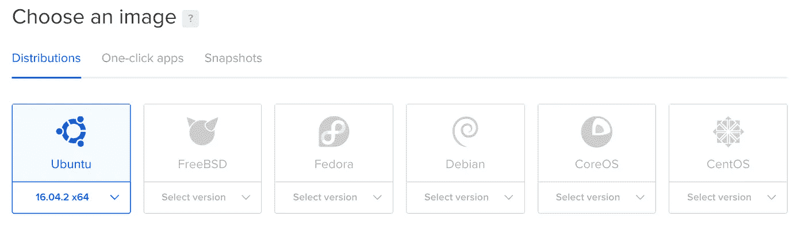
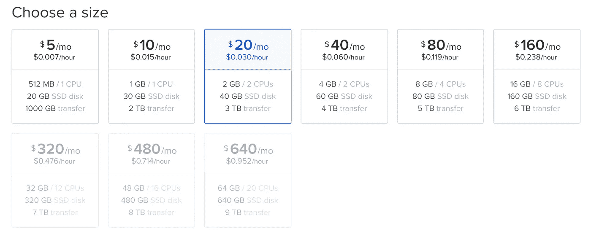
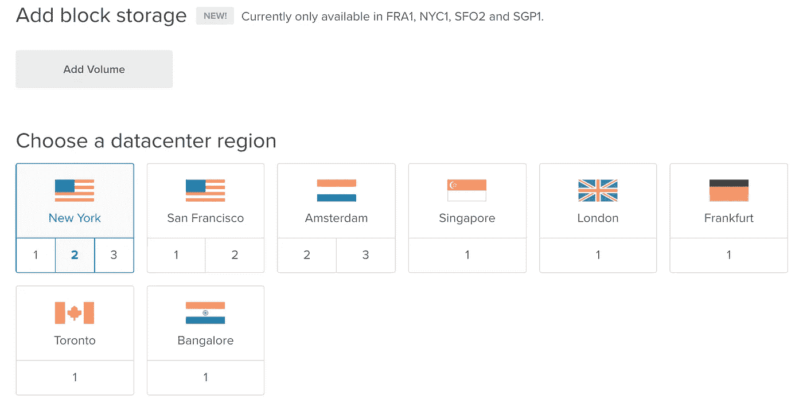
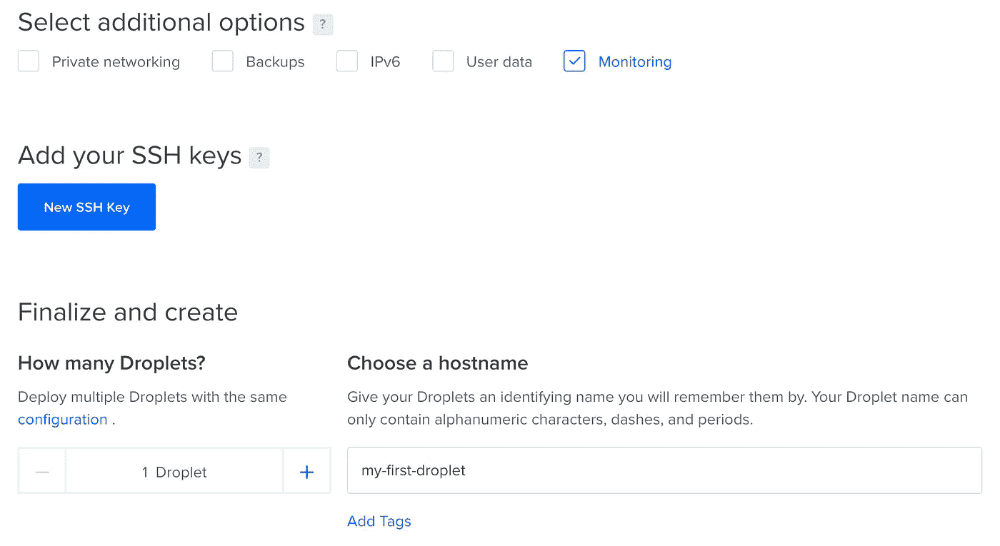
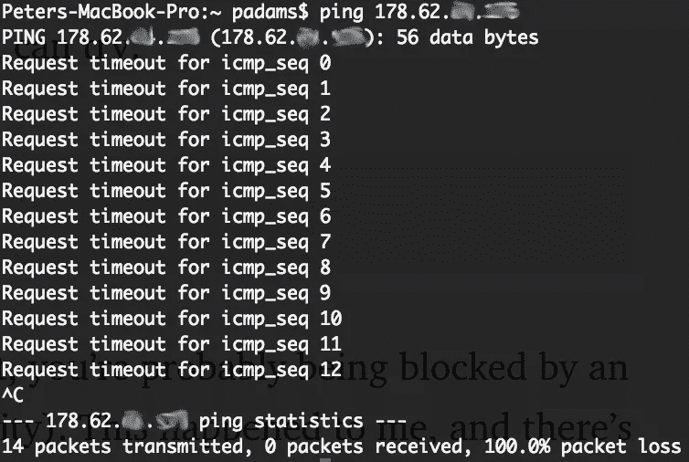
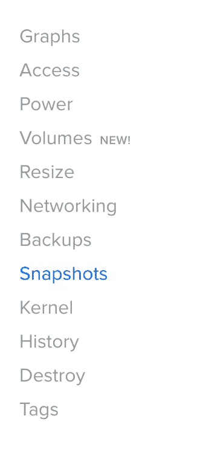
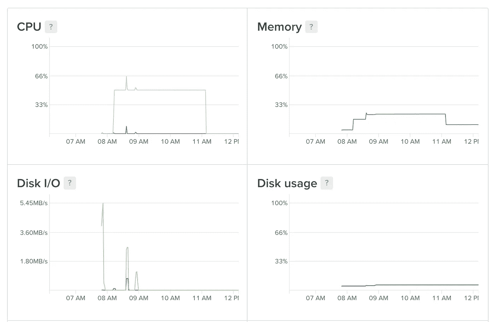
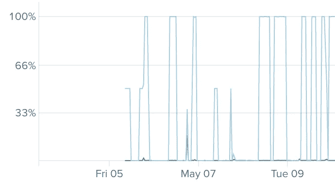
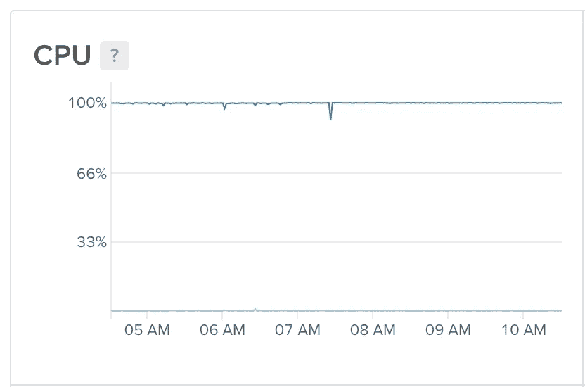

# 经验教训:Python 3 的数字海洋

> 原文：<https://towardsdatascience.com/lessons-learned-digital-ocean-for-python-3-e2442db4246f?source=collection_archive---------2----------------------->

这篇文章是正在进行的系列文章的一部分。我花很多时间尝试新技术。更多的时候，是因为一个类似于:“你应该试试【在此插入技术】，超级简单！”。

事实证明这种情况很少发生，所以每次我花几个小时试图让一些东西工作时，我都会发布我的解决方案，以及我在这个过程中学到的任何技巧和诀窍。

[Digital Ocean](https://www.digitalocean.com/) 是一家基于云的服务器提供商，拥有非常合理的计划，允许您将计算从您的计算机转移到云中，从而节省您的时间并保持您的计算机新鲜！

我最初按照[孙铁麟·梅斯特](https://medium.com/u/bc17bd299bf1?source=post_page-----e2442db4246f--------------------------------)的教程进行设置，但很快意识到我想做得更多(尽管我强烈推荐该系列的其余部分，从命令行的[数据科学)。这被证明是有点棘手，所以这里是我的演练。](https://data36.com/learn-data-analytics-bash-scratch/)

# 1.注册

前往[数字海洋](https://m.do.co/c/701d1d25ae74)并创建一个账户，使用 Paypal 或信用卡(如果你使用上面的链接，你将获得一些免费积分，我也会。如果你不想这样做，只需[点击这里](https://www.digitalocean.com/))。

如果你是学生，你还可以从 [Github 学生包](https://education.github.com/pack/offers)中获得 50 美元的积分(我也强烈推荐)。当我注册时，Digital Ocean 最初不接受我的代码，但我提交了一张支持票，他们在几个小时内就把它记入了帐户。

# 2.你的第一滴

Droplets 是专门为您保留的服务器空间。你只有在有液滴的时候才会带电(不管它是开着还是关着)，但创造和破坏它们很容易，所以不用担心在你不积极使用它的时候会带电。


在“DO”面板的右上角(如果您还没有 Droplet，则在中间)，找到“创建 Droplet”按钮。

单击它会将您带到设置页面。第一个选项是图像:



您将没有快照选项(稍后会详细介绍)，但是默认选项(Ubuntu)是我们想要的，所以您在这里不需要做任何事情。

第二个选择是定价计划:



在这里你可以看到你得到了什么，以及它的价格。水滴存在的时间是按小时收费的，所以除非你结束后不删除它，否则你的费用会比每月报价低很多。

你选择哪一个取决于几件事:

*   你要载入内存的文件有多大？(例如熊猫数据帧)。价格下面第一行是水滴有多少内存/多少 CPU。
*   你的流程可以分布式吗？(想想`sklearn njobs= -1`)。如果可以的话，多个 CPU 会加快处理速度。同样，如果您有大量数据，将数据分成两半并同时运行作业将节省时间，但这仅适用于具有 1 个以上 CPU 的 droplets。
*   你要上传的数据文件有多大？这是第二行，可用的存储量。
*   最后一行表示允许的数据传输量(上传+下载)。除非你在做非常疯狂的事情，否则 1TB 足够了。

我建议开始时选择 5 美元/月。如果你碰壁了，升级很容易。

第三步是添加块存储。最初你不需要这个。

第四是选择数据中心:



我在爱尔兰，所以选择了伦敦。选择离你最近的。

最后一步是启用监控(稍后会详细介绍)并给你的 droplet 起一个真正有用的名字！



然后点击创建水滴，大约一分钟后，你就一切就绪了！

# 3.初始设置和快照

当你完成后，你会收到一封电子邮件从数字海洋与 IP 地址，用户名和密码。复制 IP 地址，启动命令行并输入:

```
ssh root@[IP Address]
```

如果这挂起并且没有任何反应，您可以尝试:

```
ping [IP Address]
```

看看你是否有联系。如果没有，你可能被外部防火墙(你的工作单位或大学)阻挡了。这发生在我身上，你无能为力:



Hit CTRL-C to stop it after 10 or so packets

如果你确实收到了`ssh root@[IP Address]`的回复，会有一堆短信问你是否要继续。写下`yes`并按回车键。

然后会要求您输入密码。从邮件中复制并粘贴，然后按回车键。然后，您需要更改 root 密码。这样做很安全，因为你不会经常登录 root，但如果其他人这样做，他们完全可以破坏你的 droplet。

接下来，您想要创建一个用户:

```
adduser [username]
```

其中[用户名]是您想要的任何东西。

你必须为这个用户创建一个密码，它会要求你提供一些个人信息。如果你愿意，输入这个，或者跳过它(按回车键)，都没关系。

接下来，给你的新帐户权限在服务器上做事情

```
usermod -aG sudo [username]
gpasswd -a [username] sudo
```

这使您能够在不登录 root 用户的情况下进行更改。

最后，更改时区:

```
sudo dpkg-reconfigure tzdata
```

并选择您当前所在的城市。

不错！我们都在 root 上设置好了。现在，我们可以退出并检查您的用户帐户。

```
exitssh [username]@[IP Address]
```

登录后，第一步是配置 bash 配置文件，让您的生活更轻松。

```
nano .profile
```

如果你以前没有用过 Nano，它是一个简单的文本编辑器。使用箭头键移动，`Ctrl+k`剪切一行，`Ctrl+u`粘贴一行，`Ctrl+o`保存，`Ctrl-x`退出。

您可以在这里添加别名(快捷方式)以使生活更轻松。我使用 Python 3 和 Pip 3，所以我通常通过设置来避免混淆:

```
alias python="python3"
alias pip="pip3"
```

当我想更改或检查我的 bash 配置文件时，我也讨厌键入`nano ~/.profile`，所以我也使用别名:

```
alias obp="nano ~/.profile"
alias sbp="source ~/.profile"
```

您还可以在此添加任何其他别名。用`Ctrl+o`保存，用`Ctrl-x`退出。

要实现这些更改，您需要获取概要文件:

```
source .profile
```

(顺便说一句，在找到新的别名快捷方式之前，不能使用它们，所以简单地输入`sbp`还不行，但是在你找到它之后就可以了)。

`apt-get`有点像命令行的 Pip，应该在我们继续之前更新。

```
sudo apt-get update
```

Python 3 已经安装了，但是 Pip 还没有，所以让我们继续获取并更新它:

```
sudo apt-get install python3-pip
pip install -upgrade pip
```

现在你可以`pip install`你所有的常规 Python 包了！你马上就可以。出于某种原因，Matplotlib 和其他一些软件包在 Ubuntu 上有问题，但是您可以通过运行以下命令来解决这些问题:

```
sudo apt-get install libfreetype6-dev libxft-dev
sudo apt-get install python-setuptools
```

太好了，现在你可以用`pip3 install`发疯了。如果您有一个用于所有安装的`requirements.txt`文件，现在就可以运行它。

最后， [AG](https://geoff.greer.fm/ag/) 是非标准的命令行搜索工具，所以如果你愿意，你也可以安装它:

```
sudo apt install silversearcher-ag
```

太好了，你都准备好了！现在，这是一个相当大的工作量，每次都必须这样做是很糟糕的。这就是数字海洋快照的用武之地！

这是一种将你当前的 droplet“另存为”的方法，这样当你下次创建一个新的 droplet 时，你就可以加载那个图像，然后你就可以从你离开的地方开始了！完美。

使用`sudo poweroff`关闭你的 droplet，进入你的数字海洋 droplet 页面上的快照菜单项:



快照不是免费的，它们每月每 Gb 0.05 美元。我在安装 Pandas、Numpy、Matplotlib 和其他一些软件包时拍摄的快照是 1.85Gb，所以每年大约是 1.11 美元。考虑到每次设置一个水滴会节省你 10 分钟，还不错！

由于您的 droplet 已经关闭，请点击“拍摄实时快照”按钮，数字海洋将完成剩下的工作。

这里有一个旁注，你似乎不能从一个更便宜的液滴定价方案中读出一个快照。只是一些需要记住的事情。

如果你想升级你的定价方案，请点击“调整大小”菜单项。同样，你不能在这里降级，如果你想，你需要从头开始创建一个 droplet，并重复上述步骤。


要重新打开 droplet，请前往数字海洋，在 droplet 页面的右上角有一个开/关开关。重新打开它，你就可以上传数据了。

# 4.通过 SFTP 上传数据

现在，如果你的个人电脑上有数据，想把它上传到云端，你需要通过 SFTP(安全文件传输协议)来实现。这是相当容易的，虽然它没有闪电快。

首先，建立一个 SFTP 连接:

```
sftp [username]@[IP Address]
```

现在，您可以使用普通的命令行功能，如`cd`、`ls`和`pwd`，在服务器上的文件系统中移动。然而，由于某种原因，自动完成(tab)在 SFTP 上不起作用。出于这个原因，我建议把你所有的文件和代码上传到主目录，然后用`ssh`重新登录，用`mv`和自动完成功能移动内容。相信我，这简单多了。

那是在服务器端，但是在你的个人电脑上移动呢？同样的命令也可以工作，但是你需要在它们前面加上一个额外的`l`，即`lcd`、`lls`和`lpwd`。找到本地保存文件的目录，然后使用以下命令将它们上传到服务器:

```
put [localFile]
```

或者对于整个目录:

```
put -r [localDirectory]
```

这并不算快，对于我的 1.5Gb 数据文件，每个文件大约需要 20 分钟。很烦人，但是你能做的不多。您可以并行上传，但这意味着打开一个新的命令行标签，并再次登录 SFTP，再加上两个连接都慢了一半，所以总时间是一样的:(

您可以通过运行以下命令来查看您使用了多少存储空间:

```
df -h
```

作为将来的参考，从服务器下载文件非常简单:

```
get [remoteFile]
```

或者

```
get -r [remoteDirectory]
```

现在，一旦你的数据文件上传到服务器上，你也可以上传你的 python 脚本了。如果您的本地目录配置与远程目录配置不同，请确保更改代码中的任何文件位置。

从服务器上删除文件也和本地略有不同，因为`rm -rf directory`不起作用。你需要`rm filename`删除一个文件，或者清空一个目录然后`rmdir directory`删除一个文件夹。

这足以让你开始，但如果你对更高级的选项感兴趣，这里有一个很好的教程。

我强烈建议在数据的小子集上本地测试你的所有代码(我使用 PyCharm，它很棒，也有免费的学生许可证。)通过远程连接进行故障排除可能很烦人。

# 5.运行计算

现在，你已经准备好运行一些计算了。使用`ssh`重新登录，整理所有文件，使用`python filename.py`运行任何代码，就像在本地计算机上一样。

如果当你尝试运行一些代码时得到一个`Killed`响应，这意味着你没有足够的内存来完成这项工作。你有两个选择。关闭并升级您的定价方案，或者创建一个交换文件(更多信息见下文)。

打印错误日志将为您提供关于错误的更多信息:

```
sudo cat /var/log/kern.log
```

您可以在数字海洋仪表板上监控作业进度，该仪表板显示了一些漂亮的使用图表:



您甚至可以设置警报，以便在指标低于某个级别(如 CPU)时收到电子邮件，这可以用来让您知道工作何时完成！单击图形页面顶部的“创建警报策略”进行类似设置。


一旦你完成了你的处理，你可以使用 SFTP 从云中`get`你的文件，然后销毁 droplet，这样你就不会继续被收费了！

现在给你一个警告:**写入文件**时要小心。

我浪费了很多时间运行一个`pandas apply`函数，然后用`df.to_csv('filename')`保存结果。如果服务器有任何问题(很可能会有，下面会有更多)，在写入文件之前，您将会丢失所有内容。

我的解决方法是遍历整个数据框并逐行打印结果:

```
*for* row *in* range(len(df.index)):
    col_value = df.ix[row,:].values[2]
    ind = df.index[row]
    with open("./data_file.csv", "a") as file:
        file.write(ind + ',' + function(col_value) + '\n')
```

这实际上是将我的数据写入了`csv`，然后我就可以根据索引值合并数据帧来排列数据。

```
result = pd.concat([df, new_data], axis=1, join_axes=[df.index])
```

没有`apply`漂亮，但是有时当处理这种规模的数据时，最好牺牲一些性能来确保您确实得到了您想要的数据！

# 6.提高性能

DO 最大的好处之一是，您的 droplet 中可以有多达 20 个 CPU，它们可以并行运行处理。这比在一个 CPU 上处理所有数据要快得多。

您应该知道您的计划有多少个 CPU，但是如果不知道，您可以使用下面的代码来检查:

```
cat /proc/cpuinfo | grep processor | wc -l
```

我有 2 个，所以这意味着我可以同时运行两个进程。在我看来，这不会减慢任何一个过程，所以如果你把任务分成两半，你可以有效地工作两倍的速度。最好的方法是将所有的数据分成两半，然后对每个数据运行相同的脚本。在 Python 中，在用 pandas 导入您的数据后，我会添加以下代码。

```
import sysnumber_of_cores = 2
length_of_df = len(df.index)
stream = sys.argv[1]if stream == 1:
    start = 0
    end = length_of_df // number_of_cores
else:
    start = length_of_df // number_of_cores
    end = -1data_to_process = df.iloc[start:end,:]output_filename = "output_data_" + str(sys.argv[1]) + ".csv
```

然后，您可以从命令行运行

```
python script.py 1
```

它将处理前半部分的数据

```
python script.py 2
```

它将处理第二个。使用以下命令在最后合并两个数据文件

```
cat output_data_2.csv >> output_data_1.csv
```

# 7.解决纷争

我最头疼的是让我的脚本运行完成。出于某种原因(我从来没有弄清楚)，服务器会停止运行我的处理，然后我不得不手动重启它。我的使用图表如下所示:



真的不理想，尤其是我的大学防火墙阻止了我的连接，所以我不得不等到我回家重启东西。

我的解决方案的第一部分是找出 for 循环的重新开始点，这样我就不用重新计算了。我使用了`subprocess`模块，这样我就可以在 python 脚本中运行命令行函数:

```
import subprocessstream = int(sys.argv[1])if stream == 1:
    stop = 3387532
    data = "./data.csv" a = subprocess.Popen(['wc', '-l', data], stdout=subprocess.PIPE)
    wc = int(a.communicate()[0].rstrip().decode().split(' ')[0]) start = 0 + wc
```

我的文件中的总行数是 6，775，065，我有 2 个 CPU，所以像上面一样，我将停止索引设置为文件大小的一半。`subprocess.Popen`返回命令行函数的结果，在本例中是`wc -l ./data.csv`，或者检查输出数据中的行数。`stout=subprocess.PIPE`使输出更容易处理。下一行检索输出数据的实际行数，然后`start`被相应地设置为。

这意味着每当系统崩溃时，我可以简单地运行:

```
python script.py 1; 
python script.py 2;
```

在不同的终端屏幕上，我的两半数据会在适当的地方重新启动。一个好结果！

然而，这并没有阻止我的服务器崩溃，也没有在崩溃后自动重启处理。一些研究让我想到了 crontabs，它允许在特定的时间段评估函数。您可以通过以下方式查看当前的 crontabs:

```
crontab -l
```

这里不应该有任何东西，所以您可以使用以下命令创建一个:

```
crontab -e
```

第一次，你会被要求选择一个文本编辑器，Nano 是最简单的，但是这可以在以后通过运行`'select-editor'`来改变

我不会讲太多细节，但是文件的最后一行看起来是这样的:

```
# m h  dom mon dow   command
```

这代表分钟、小时、月、日和命令。这允许您将命令设置为在特定的时间间隔运行。几个例子:

```
*/10 * * * * eval "python3 script.py"
```

每 10 分钟运行一次脚本。

```
10 * * * * eval "python3 script.py"
```

每小时在整点后 10 分钟运行脚本。

```
10 5 * * 3 eval "python3 script.py"
```

每周三 5 点 10 分运行脚本。

你明白了。对我来说，我想每 10 分钟检查一次我的服务器是否崩溃，如果是，重启它。所以我的 crontabs 是:

```
*/10 * * * * eval "python3 sys_test_1.py"
*/10 * * * * eval "python3 sys_test_2.py"
```

(我必须有两个，因为从同一个文件在不同的 CPU 上运行 python 脚本很困难，这样更容易)。如果你感兴趣，这里有更多关于 crontabs [的详细解释](https://www.digitalocean.com/community/tutorials/how-to-schedule-routine-tasks-with-cron-and-anacron-on-a-vps)。

然后我的文件`sys_test_1.py`看起来像这样:

```
data = "./data.csv"a = subprocess.Popen(['wc', '-l', data], stdout=subprocess.PIPE)
wc_1 = int(a.communicate()[0].rstrip().decode().split(' ')[0])if wc_1 > 3387530:
    exit()
else:
    time.sleep(15) b = subprocess.Popen(['wc', '-l', data], stdout=subprocess.PIPE)
    wc_2 = int(b.communicate()[0].rstrip().decode().split(' ')[0]) if wc_1 == wc_2:
        subprocess.call(["python3", "run_comp.py", "1"])
```

所以我检查文件中的行数，如果超过了某个阈值(即接近所需计算的末尾)，就退出。否则，等待 15 秒并再次检查文件长度。如果它们相同，这意味着没有正在进行的计算，所以它从命令行调用计算脚本。

注意，我特别调用了`'python3'`，尽管我在 bash 配置文件中设置了一个别名`alias python="python3"`。用子进程调用 python 脚本似乎会忽略别名，所以要记住这一点。

因此，每 10 分钟运行一次，我就有办法检查是否有问题，如果有问题，就自动重新开始处理。自从我修复了这个问题，我的服务器就一直不停地运行，任何崩溃都会被快速捕获，处理会重新开始。



完美！

现在你知道了！您现在知道如何在云服务器上创建、设置、上传数据和运行脚本了！大数据，你来了！

下面有更多关于交换文件的解释，但那是可选的阅读…

如果你喜欢这篇文章，请点击❤按钮让你的粉丝知道，或者让我知道你的想法。

# 交换文件

交换文件是一种给你的 droplet 额外的内存的方法，通过对硬盘进行分区。这样，当系统内存不足时，它可以将一些数据保存到光盘上，以便以后检索。这将让你用更便宜的方案做更多的事情，但是速度会慢很多。请记住，升级您的计划可能会更好。

要创建交换文件，请运行

```
sudo fallocate -l 4G /swapfile
```

其中 4G 代表文件的大小，即 4 gb。这是您想要的内存大小。太大了，你就没有空间存放其他文件，太小了，你还是会耗尽内存。4 gb 应该没问题。

然后，您需要授予对该目录的写权限，创建交换文件，并激活它:

```
sudo chmod 600 /swapfile
sudo mkswap /swapfile
sudo swapon /swapfile
```

打开 fstab 文件:

```
sudo nano /etc/fstab
```

并添加到文件底部:

```
/swapfile none swap sw 0 0
```

有一个名为 swappiness(很棒的名字)的参数设置了内存交换到磁盘的数量和频率。值越高，交换的频率越高。我们不希望它交换那么多，所以我们希望将默认值(60%)更改为 10%。

```
sudo sysctl vm.swappiness=10
```

要将此设置为默认值，请打开:

```
sudo nano /etc/sysctl.conf
```

并添加到文件底部:

```
vm.swappiness=10
```