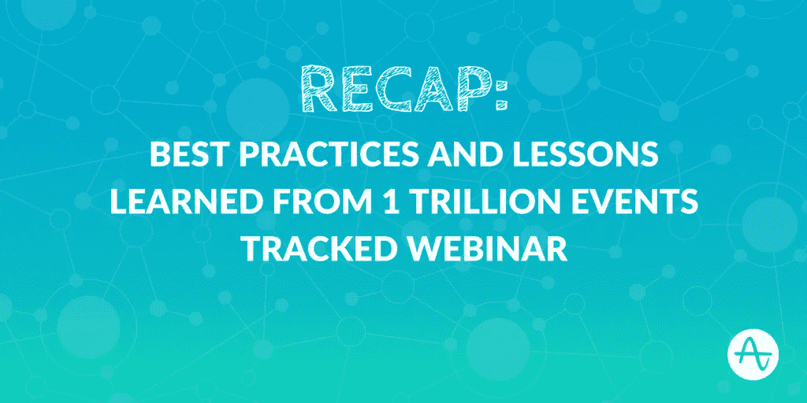

# 从跟踪的 1 万亿次事件中吸取的经验教训:网络研讨会总结

> 原文：<https://towardsdatascience.com/lessons-learned-from-1-trillion-events-tracked-webinar-recap-822eba77b5a7?source=collection_archive---------4----------------------->

本月早些时候，我们在 Amplitude 达到了一个令人兴奋的里程碑:我们现在已经跟踪了超过 1 万亿的用户行为。

利用其中一些用户行为数据，我们分享了一种思考留存的新方法——[括号留存](https://amplitude.com/blog/2016/08/11/3-ways-measure-user-retention/)—针对非日常使用的应用，而不是行业标准的“N 天”计算。

我们还举办了“最佳实践和从 1 万亿次跟踪事件中吸取的教训”，在此期间，Amplitude 首席执行官 Spenser Skates 分享了他在 Amplitude 工作四年期间学到的另外四条经验。

如果你错过了几周前斯宾塞的网上研讨会，不要担心。我们将在今天的帖子中概括这些课程。

要观看网上研讨会的录像，您也可以点击[这里](http://info.amplitude.com/1TrillionEventsTracked.html)。

# 第一课:留住人才至关重要。

我们已经在 Amplitude 博客上讨论了很多关于为什么留住人才如此重要的内容。斯宾塞和他的联合创始人柯蒂斯开始建立 Amplitude 的主要原因之一是为了解决无法提高他们的第一款产品 Sonalight 的保留率的痛苦，sona light 是一款用于 Android 的语音识别应用程序。

随着 Amplitude 的建立，Spenser 意识到，留存率不仅对年轻的创始人和初创公司至关重要，对 App Store 中的顶级消费者应用程序、B2B 公司和企业等都很重要。事实上，对大多数企业来说，留住人才是成功的第一预测指标；这是对可持续增长至关重要的一个指标。

# 第二课:用户做什么比他们是谁更重要。

营销指标几乎总是包含描述性的人口统计数据。为了制定产品策略，团队通常会跟踪诸如性别/年龄、用户来自哪里以及使用的设备或平台等信息。

我们强调不要太看重你的用户是谁，而是更看重他们在做什么——这是用户行为分析的关键。了解用户在你的产品中的行为和浏览方式，会给你更多的指导，告诉你如何更好地塑造你的产品，让它继续为用户增加价值和乐趣。

斯宾塞解释说，这正是脸书击败许多早期社会竞争对手的原因。通过专注于观察在加入的十天内添加七个朋友是用户逗留的最佳预测，脸书能够建立一个以添加朋友和与朋友互动为中心的产品。他们很快击败了当时的主要竞争对手，包括 MySpace。

Spenser 还分享了我们的一个客户的故事，像 Etsy 这样的市场型产品希望提高其保留率。开发人员根据地理位置和设备类型等用户统计属性对活跃用户进行了细分。他们发现这些片段的保留率真的没有差别；相反，是一群买家都表现出了一种特定的行为——在这种情况下，这是在向卖家传递一种信息——显示出了留存率的显著提高。虽然人口统计数据(即“用户是谁”)没有显示出任何有助于产品变化的有用见解，但*行为*数据(“他们用户做什么”)却显示了这一点。

# 第三课:你产品的价值可能会让你吃惊。

你的产品是你的用户想要的，而不是你想要的*。有时候，行为分析可以发现你可以利用的产品的令人惊讶的用例。如果你能让*更多的*用户更快体验到这种价值，你就能让你的产品更上一层楼。*

冥想 app Calm 经历的恰恰是这一点。在寻找提高用户留存率的方法时，他们决定观察使用“设置提醒”的用户群与其他用户群相比留存率如何。他们发现，这些用户的留存率是当前用户的 3 倍。Calm 发现他们为用户提供的价值不仅仅是自我指导的冥想课程，他们还起到了*提醒*用户冥想的作用。

现在，Calm 正在尝试在入职流程的早期突出“设置提醒”功能，以便让他们的用户更快地体验到这一价值，从而保留更长时间。

你可以在这里阅读更多关于 Calm 的故事[。](https://amplitude.com/blog/2016/07/14/calm-increased-retention-amplitude/)

 [## 切换到振幅后，镇静增加了 3 倍的保持力

### 平静是一个简单的正念冥想应用程序，为他们的用户带来清晰和内心的平静。有了可靠的用户…

amplitude.com](https://amplitude.com/blog/2016/07/14/calm-increased-retention-amplitude/) 

# 第四课:用户塑造产品

上周，我们分享了斯宾塞对[打造更好产品](https://amplitude.com/blog/2016/10/20/lets-build-better-products/)的愿景。我们总结了我们的“经验教训”网络研讨会，简要介绍了这一重要趋势。产品开发已经发生了根本性的变化——发布用户必须学习和适应的打包软件不再是常态。现在，最好的公司通过行为数据直接与用户交流，以了解*用户如何使用他们的产品，以及他们获得了什么价值。产品的调整和改进可以在极短的时间内完成。公司通过制造由用户塑造的产品而取胜。*

请务必阅读斯宾塞的思想文章“[让我们打造更好的产品](https://amplitude.com/blog/2016/10/20/lets-build-better-products/)”，以了解这一趋势以及 Amplitude 用户如何帮助塑造我们分析平台的全新版本。

在接下来的几个月中，我们将更深入地研究客户故事和数据，以补充这些课程，因此请在 Amplitude 博客和外部出版物中关注这些内容。如果您错过了网上研讨会，[请点击这里](http://info.amplitude.com/1TrillionEventsTracked.html)！

# 有关系的

 [## 1 万亿事件之后:思考保留的新方法

### 如果你从事移动应用业务，你可能听说过这个统计数据——80%的移动应用用户在……

amplitude.com](https://amplitude.com/blog/2016/10/12/1-trillion-events/)  [## 让我们打造更好的产品|振幅博客

### 我们宣布了 Amplitude 2.0——我们产品分析平台的下一代产品。今天，我在分享背后的故事…

amplitude.com](https://amplitude.com/blog/2016/10/20/lets-build-better-products/) 

## 喜欢你读的吗？按下❤向你的追随者推荐这个！

*原载于 2016 年 11 月 1 日*[*amplitude.com*](https://amplitude.com/blog/2016/11/01/lessons-learned-1-trillion-events-tracked-webinar-recap/)*。*