# 被协变性和相关性难倒？？？获得这两个术语的数学和分析应用..

> 原文：<https://towardsdatascience.com/let-us-understand-the-correlation-matrix-and-covariance-matrix-d42e6b643c22?source=collection_archive---------1----------------------->

协方差和相关性是统计学和概率论领域中两个重要的术语。大多数关于概率和统计的文章和阅读材料都假定对均值、标准差、相关性、样本大小和协方差等术语有基本的理解。今天让我们揭开其中几个术语的神秘面纱，这样我们就可以继续讨论其余的术语。本文的目的是定义相关矩阵和协方差矩阵这两个术语，区分两者，并理解两者在分析和数据集领域的应用。

我正在创建一个索引，以便于参考以下主题:

1.  [揭开术语的神秘面纱](#210a)
2.  [用数学方法定义术语](#64a2)
3.  [协方差对相关性](#78e7)
4.  [在分析中的应用](#c791)

# 揭开术语的神秘面纱

简而言之，这两个术语都衡量两个变量之间的关系和依赖性。“协方差”表示变量之间线性关系的方向。另一方面，“相关性”衡量两个变量之间线性关系的强度和方向。相关性是协方差的函数。**它们的区别在于相关值是标准化的，而协方差值不是。**用这两个变量的协方差除以相同值的标准差的乘积，就可以得到这两个变量的相关系数。如果我们重新审视标准差的定义，它本质上是测量数据集分布的绝对可变性。当您将协方差值除以标准差时，它实际上将值缩小到一个有限的范围内 **-1 到+1** 。这正是相关值的范围。

# 用数学方法定义术语

现在让我们来看看这些术语的数学定义。

**协方差**

两个变量(x 和 y)的协方差可以表示为 cov(x，y)。如果 E[x]是样本“x”的期望值或均值，则 cov(x，y)可以用以下方式表示:

如果我们看一个单一的变量，比如说‘y’，cov(y，y)，表达式可以写成如下方式:

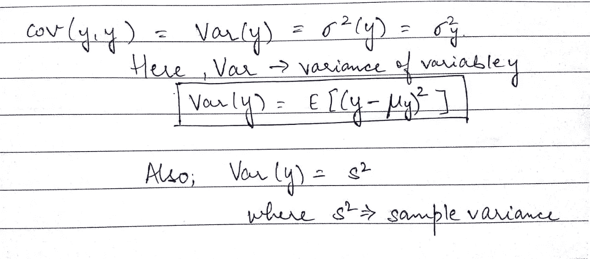

正如我们所见，在上面的图像中，“s”或抽样方差基本上是一个变量与其自身的协方差。这个术语也可以用以下方式定义:

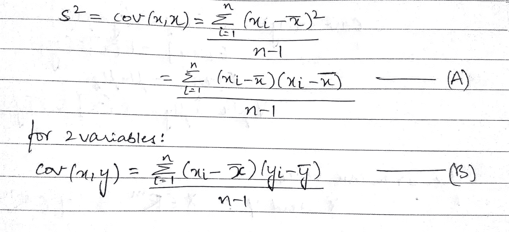

在上面的公式中，等式(A)的分子称为离差平方和。在有两个变量 x 和 y 的方程(B)中，称为叉积和。在上面的公式中，n 是数据集中的样本数。值(n-1)表示自由度。

> 为了解释什么是自由度，让我们举一个例子。在一组 3 个数中，平均值为 10，三个变量中的两个为 5 和 15，第三个数取值的可能性只有一种，即 10。对于具有相同平均值的任意 3 个数字的集合，例如:12、8 和 10，或者说 9、10 和 11，该集合中的任意 2 个给定值只有一个值。您可以在这里更改这两个值，第三个值会自动修复。这里的自由度是 2。本质上，自由度是用于计算估计值的独立数据点的数量。正如我们在上面的例子中看到的，它不一定等于样本中的项目数(n)。

**相关性**

相关系数也称为皮尔逊积差相关系数，或皮尔逊相关系数。如前所述，它是通过将两个变量的协方差除以它们的标准差的乘积而获得的。同样的数学表示可以用下面的方式表示:

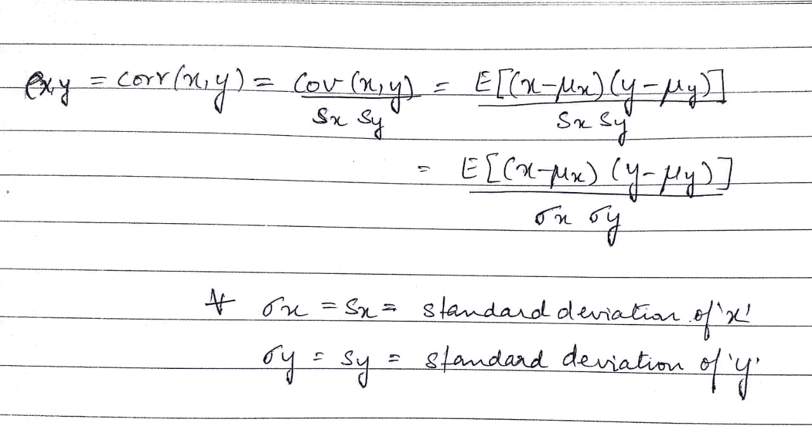

相关系数的值可以从-1 到+1。它越接近+1 或-1，这两个变量的关系就越密切。正号表示相关性的方向，即如果一个变量增加，另一个变量也应该增加。

**协方差和相关性的数据矩阵表示**

让我们再深入一点，看看协方差的矩阵表示。

对于数据矩阵，X，其中 X 可以用以下方式表示:

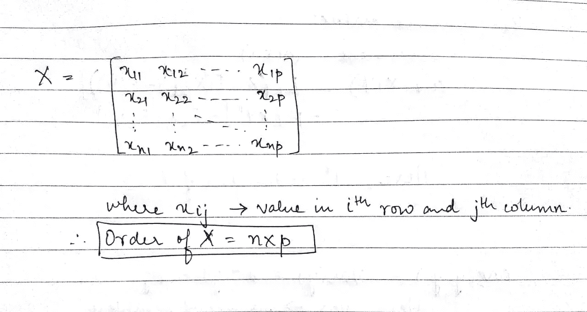

向量“xj”基本上意味着从 X 的第 j 列提取的(n × 1)个向量，其中 j 属于集合(1，2，…)。，p)。类似地，“xi `”表示 x 的第 I 行的(1 × p)向量，这里“I”可以从集合(1，2，…，n)中取值。你也可以把 X 解释为一个变量矩阵，其中‘xij’是从第 I 个项目(行)收集的第 j 个变量(列)。为了便于参考，我们称行为项目/主题，称列为变量。现在让我们看看上述数据矩阵的一列的平均值:

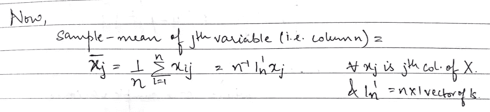

利用上述概念，现在让我们来定义行均值。它基本上是指定行中存在的元素的平均值。

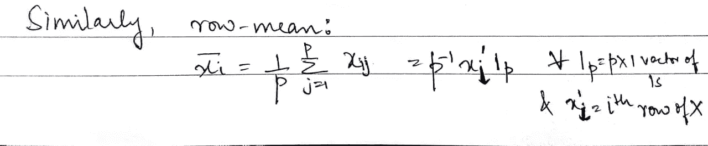

现在，我们有了上述指标，定义协方差矩阵将变得更加容易:

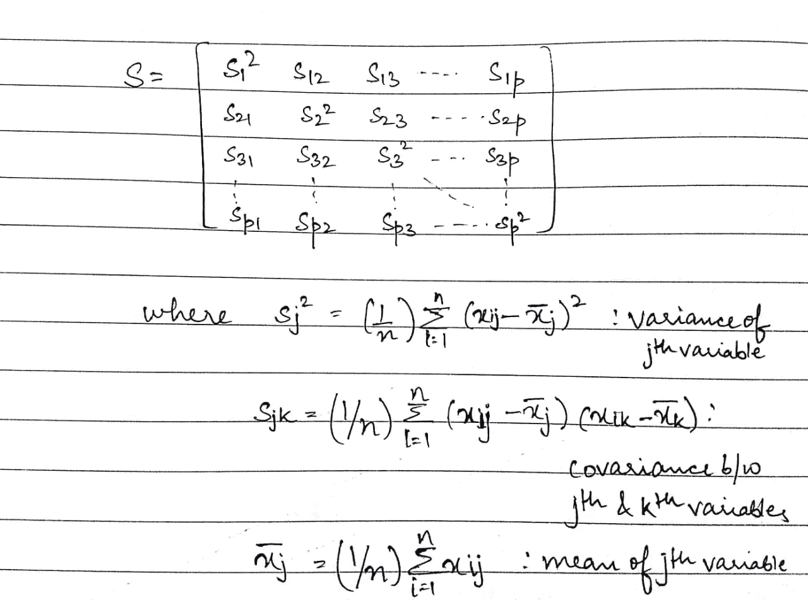

在上面的矩阵中，我们看到协方差矩阵的维数是 p × p。这基本上是一个对称矩阵，即一个与其转置矩阵(s `)相等的方阵。构建协方差矩阵的术语称为给定变量的方差，形成矩阵的对角线或填充剩余空间的两个变量的协方差。第 j 个变量与第 k 个变量的协方差等价于第 k 个变量与第 j 个变量的协方差即‘sjk’=‘skj’。

我们可以通过以下方式从数据矩阵创建协方差矩阵:

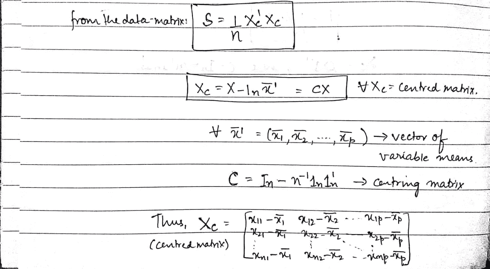

这里,“Xc”是一个中心矩阵，从每个元素中减去相应的列平均值。使用它作为中心分量，协方差矩阵“S”是“Xc”和“Xc”本身的转置的乘积，然后除以数据矩阵中的项目或行的数量(“n”)。

> 在进一步讨论之前，让我们回顾一下样本方差或 s 平方的概念。我们可以从这个值推导出一个数据集的标准偏差。数学将值“s”定义为数据集的标准偏差。它基本上表示数据围绕其[平均值](https://www.statisticshowto.datasciencecentral.com/average/)的分散或扩散程度。

类似地，使用相同的数据矩阵和协方差矩阵，让我们定义相关矩阵(R):

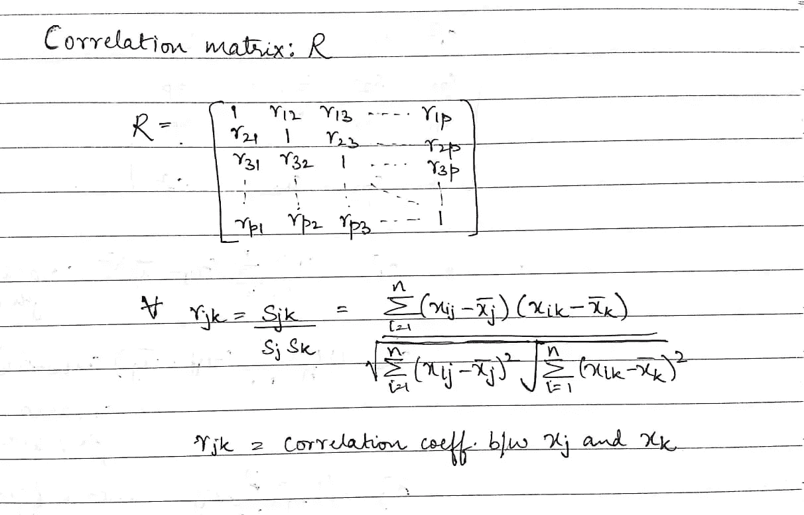

正如我们在这里看到的，相关矩阵的维数也是 p × p。现在，如果我们观察相关矩阵的各个元素，主对角线都由 1 组成。这表明元素与其自身的相关性是 1，或者可能的最高值。这在逻辑上和直觉上完全说得通。其他元素“rjk”是两个值“xj”和“xk”之间的皮尔逊相关系数。如前所述，“xj”表示数据矩阵的第 j 列，x。接下来讨论如何从数据矩阵中获得相关矩阵:

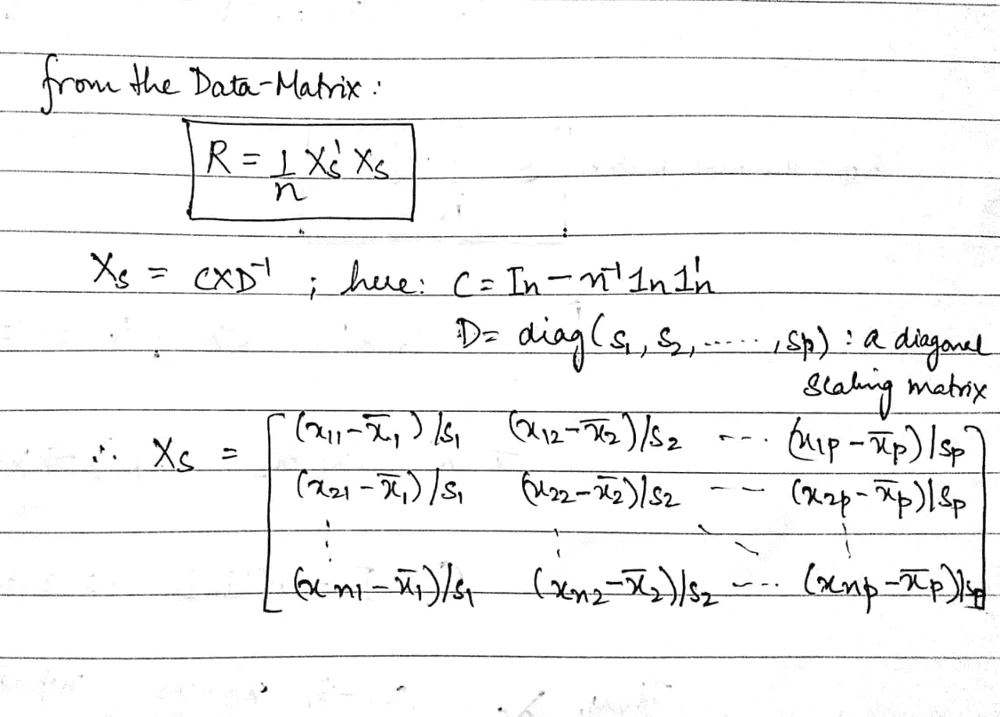

上述定义中的“Xs”被称为定标矩阵或标准化矩阵。这里我们看到，相关矩阵可以定义为缩放矩阵的转置与其自身的乘积，除以“n”。在回顾上述标准偏差的定义时，我们看到标准化矩阵“Xs”的每个元素(类似于上述协方差矩阵)都除以相应列的标准偏差。这加强了我们对相关矩阵是协方差矩阵的标准化或缩放导数的理解。

(更详细的矩阵运算和数学运算可以在这里找到:http://users.stat.umn.edu/~helwig/notes/datamat-Notes.pdf)

# 协方差与相关性

正如我们从协方差公式中看到的，它假定单位来自两个变量单位的乘积。另一方面，相关性是无量纲的。它是变量之间关系的无单位度量。这是因为我们将协方差的值除以具有相同单位的标准偏差的乘积。协方差的值受变量尺度变化的影响。如果给定变量的所有值都乘以一个常数，而另一个变量的所有值都乘以一个相似或不同的常数，那么协方差的值也会改变。然而，在做同样的事情时，相关值不受值的标度变化的影响。协方差和相关性之间的另一个区别是它们可以假设的值的范围。当相关系数位于-1 和+1 之间时，协方差可以取-∞和+∞之间的任何值。

# 分析中的应用

现在，我们已经完成了数学理论，让我们来探索它如何以及在哪里可以应用于数据分析领域。正如许多分析师所知，相关性分析是数据预处理和探索中进行特征选择和多变量分析的重要工具。相关性帮助我们调查和建立变量之间的关系。这在任何种类的统计建模或数据分析之前被用于特征选择。

PCA 或主成分分析就是其中的一个重要应用。那么我们如何决定使用什么呢？相关矩阵还是协方差矩阵？简而言之，建议您**当变量在相似的尺度上时使用协方差矩阵，当变量的尺度不同时使用相关矩阵。**

现在让我们借助例子来理解这一点。如果需要的话，为了帮助你实现，我将用 R 和 Python 来介绍例子。让我们来看第一个例子，其中我们看到当分别用相关矩阵和协方差矩阵计算时，PCA 结果是如何不同的。**对于这里的第一个例子，我们将考虑 r 中的“mtcars”数据集**

从上面的图像中，我们看到所有的列都是数字，因此，我们可以继续进行分析。我们将使用“stats”包中的 prcomp()函数来实现同样的功能。

**带协方差矩阵的 PCA**

我们将首先用协方差矩阵进行主成分分析。为此，我们将“scale”选项设置为“FALSE”:

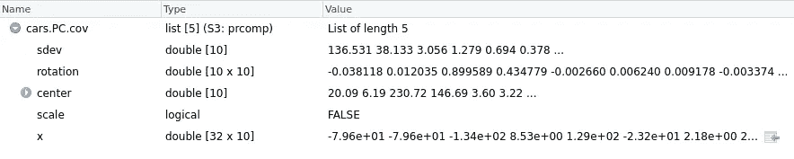

给你，汽车。PC.cov 是使用协方差矩阵对 mtcars 数据集进行主成分分析的结果。因此，prcomp()返回 5 个关键度量:sdev、旋转、中心、缩放和 x。让我们在这里简单地浏览一下所有度量:

1.  *中心*和*刻度*提供了实施 PCA 前用于标准化的变量的各自平均值和标准偏差。
2.  *sdev* 表示主成分的标准差。换句话说，它显示了特征值的平方根。
3.  *旋转*矩阵包含主分量载荷。这是该函数最重要的结果。旋转矩阵的每一列包含主分量载荷向量。分量载荷可以表示为相应 PC(主分量)上特定变量的相关性。它可以是正面的，也可以是负面的。负载值越高，相关性越高。有了组件加载的这些信息，您可以轻松地解释 PC 中的“关键变量”。
4.  矩阵 *x* 具有主成分得分向量。

现在，如果您在结果汽车列表中看到*刻度*测量。我们看到它被设置为 FALSE，正如我们在输入参数中指定的那样。现在让我们看看主分量载荷矢量:

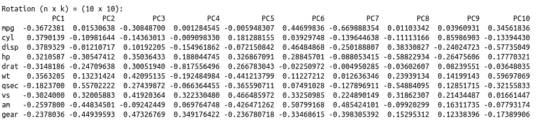

为了有助于解释，让我们画出这些结果。

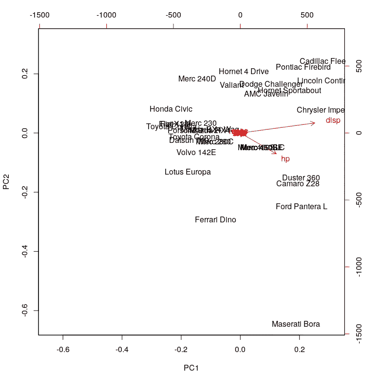

要看这个图表，你必须看最末端(上、下、左、右)。这里的第一主分量(在左边和右边)对应于“disp”和“hp”的度量。第二主成分(PC2)似乎没有一个强有力的措施。

我们可以用带有协方差矩阵的 PCA 的总结来完成这个分析:

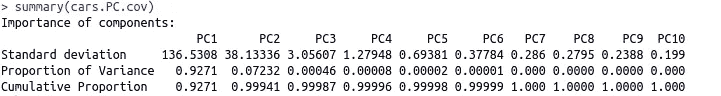

从该表中，我们看到 PC1 对变化的贡献最大(~92.7%)，所有其他主要成分的贡献逐渐降低。更简单地说，这意味着数据集中几乎 93%的方差可以用带有“disp”和“hp”度量的第一主成分来解释。这与我们从旋转矩阵和上面的图中观察到的一致。作为结论，在协方差矩阵的基础上，从主成分分析中并不能得到很多有意义的见解。

**带相关矩阵的 PCA**

现在，让我们把注意力转移到具有相关矩阵的 PCA。为此，我们需要做的就是，将“scale”参数设置为 TRUE。

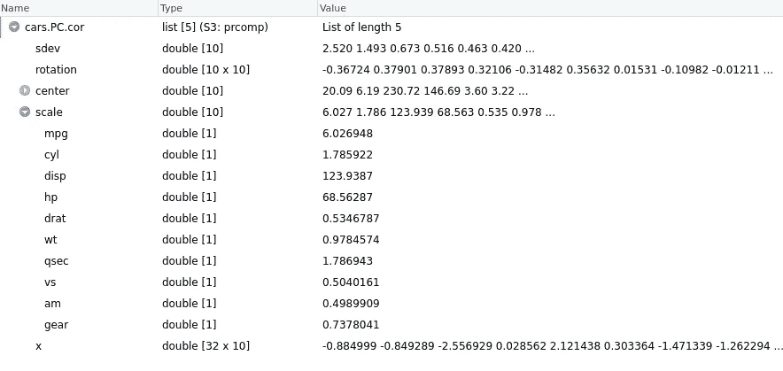

使用上面所有度量的相同定义，我们现在看到*标度*度量具有对应于每个变量的值。旋转矩阵可以用类似的方法和图一起观察。

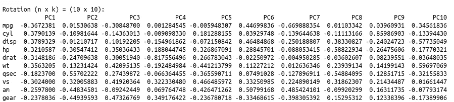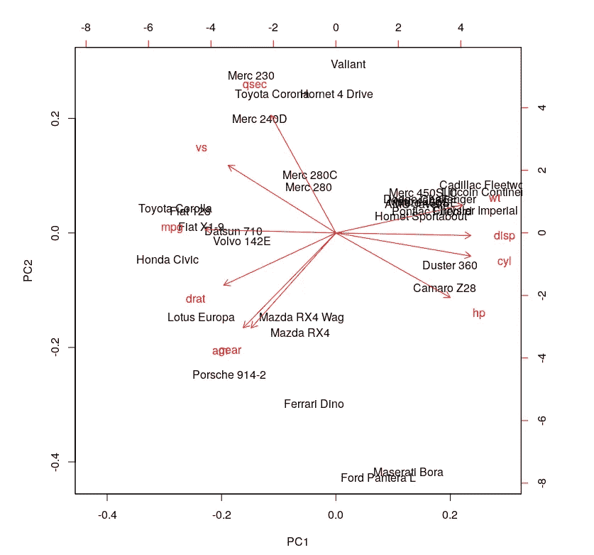

这个情节看起来信息量更大。它说像‘disp’，‘cyl’，‘HP’，‘wt’，‘mpg’，‘drat’和‘vs’这样的变量对 PC1(第一主成分)有显著贡献。qsec、“gear”和“am”对 PC2 的贡献很大。让我们试着看看这个分析的总结。

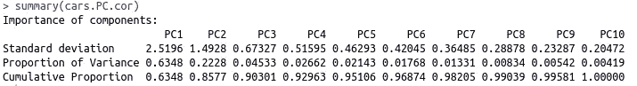

我们看到的一个显著变化是 PC1 对总变化的贡献下降。从 92.7%下降到了 63.5%。另一方面，PC2 的贡献从 7%增加到 22%。此外，组件加载值显示数据集中变量之间的关系更加结构化和分布。如果您查看上面两个结果中的标准偏差值，可以观察到另一个显著差异。与使用协方差矩阵完成的分析相比，使用相关矩阵完成的 PCA 的值彼此更接近且更均匀。

使用相关矩阵进行的这种分析明确地揭示了数据中的一些更好的结构以及变量之间的关系。从上面的例子可以得出结论，当人们试图用协方差和相关性来定义变量关系时，结果会有很大的不同。这反过来又影响了为任何进一步分析而计算的变量的重要性。预测因子和独立变量的选择是这种练习的一个突出应用。

现在，让我们举另一个例子来检查在执行 PCA 之前标准化数据集是否实际上给我们相同的结果。为了展示跨技术实现的灵活性，我将用 Python 来执行这个例子。**我们将同样考虑‘iris’数据集。**

这个数据集现在将使用内置函数进行标准化。

然后，我计算了 3 个矩阵:

1.  标准化数据的协方差矩阵
2.  标准化数据的相关矩阵
3.  非标准化数据的相关矩阵

让我们看看结果:

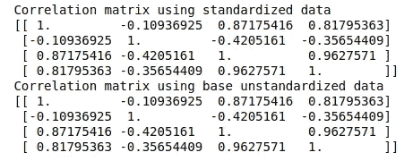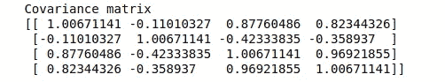

在这里，看起来结果是相似的。结果的相似性(分数差异)加强了对相关矩阵只是协方差矩阵的比例导数的理解。对这些矩阵的任何计算现在应该产生相同或相似的结果。

[为了从头开始对这些矩阵进行 PCA](https://stats.stackexchange.com/questions/2691/making-sense-of-principal-component-analysis-eigenvectors-eigenvalues)，我们必须计算[特征向量和特征值](http://setosa.io/ev/eigenvectors-and-eigenvalues/):

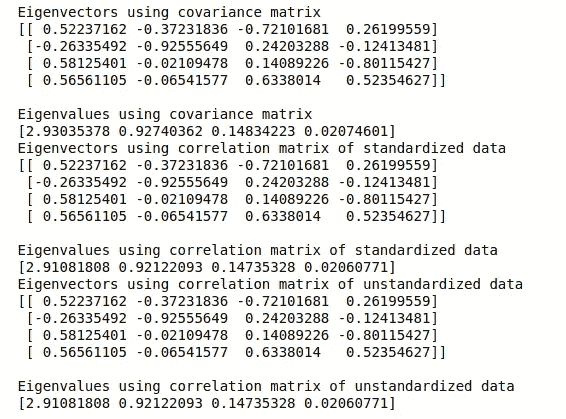

正如所料，来自所有三个关系矩阵的结果是相同的。我们现在将从这样获得的特征值中画出解释的方差图:

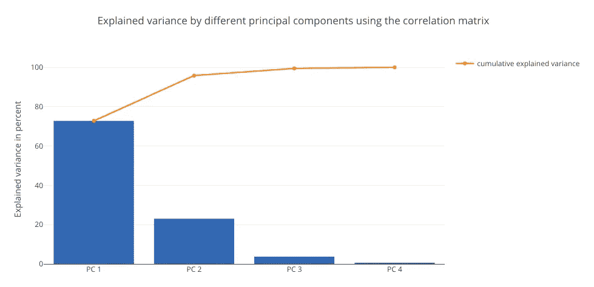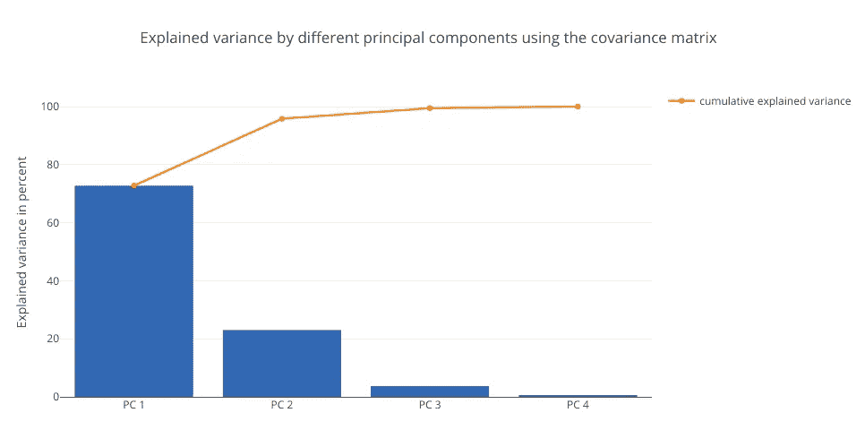

这些图表彼此相似。两个图表都显示 PC1 的贡献最大，约为 71%。这种分析确定了这样一个事实，即标准化数据集，然后计算协方差和相关矩阵将产生相同的结果。

在使用任何预测算法之前，可以使用这种学习来明智地应用变量关系的概念。