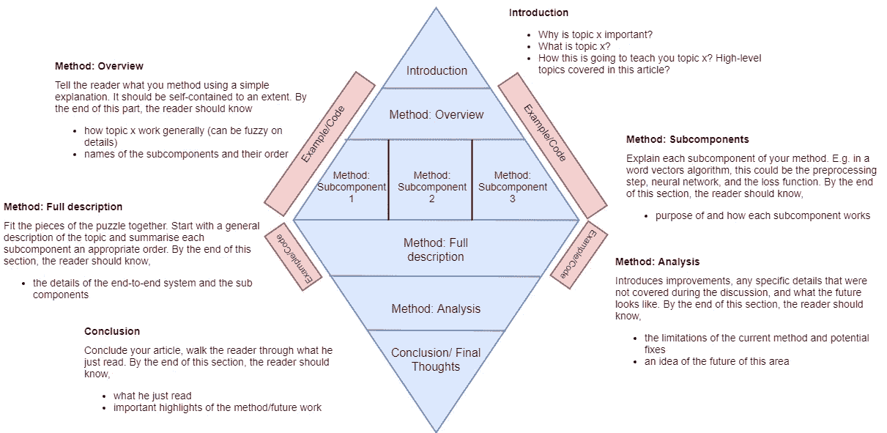

# 让我们承认，写关于数据科学的文章并不容易！

> 原文：<https://towardsdatascience.com/lets-admit-it-writing-about-data-science-is-not-easy-37a376777d36?source=collection_archive---------19----------------------->

Coutesy of Pixabay.com

# 介绍

我们看到每天都有数千篇关于数据科学的文章发表。为什么写作在数据科学家中如此受欢迎和追捧？这是因为，

*   写作占用的资源较少(例如，与创建视频讲座相比)，
*   在数据科学中，你经常会发现重温你已经看过的东西。文档比视频更容易浏览(我知道你会偷偷访问线性回归 wiki 页面来复习！) .

但是你读过的那些文章中有多少是真正突出来教你方法的，而不是滔滔不绝地说出一大堆难以理解的技术术语？其中有多少会让你欣赏作者，或者推荐给朋友？你遇到过多少次点击标题写着“话题 x 的最佳解释”符合标准？我想有不少吧。这表明数据科学领域的写作标准差异很大，只有少数文章为我们的生活增添了价值。

在这篇文章中，我将分享一些小技巧和方法，让你的文章更加清晰、切中要点，并且更容易被更多的读者接受。首先，我将向你解释如何减少不必要的行话，用简单的语言解释事情可以让你走得更远(剧透警告！解释比硬塞进行话要难得多)。接下来，我将解释“上下文”在数据科学中的重要性，这是您的文章的目的所在。然后我会用例子来说明强化文章的重要性。

最后，我将以一个图表或一个**模板来结束我的文章**。这个模板是基于我用来写文章的心智模型(尽管我承担了没有一直遵循它的责任)！

我想强调的一点是，写作是一个恶性循环；你写得越多，就越好。而且绝不是，写作容易。所以，即使你觉得自己在退步，也要坚持下去！

# 你为什么要相信我？

信任是作家成功的关键因素。这有助于你的读者放下戒备，给他们宝贵的时间来听你要说的话。首先，作为一名数据科学家，我显然会增加一些可信度。除此之外，我还是亚马逊上一本畅销的自然语言处理书籍的作者。许多人亲自联系我，感谢我的努力(非常感谢他们)。这至少可以让你相信，我对数据科学和写作略知一二。

Natural language processing with TensorFlow (the book I wrote)

介绍够了，让我们深入了解一下，作为一个多彩的作家，是什么将你与黑白世界的其他人区分开来。

# 1.简单点

是的，我知道。用花哨的术语来修饰你的文章很有诱惑力。行话很重要，世界上有太多东西你可以不用各种数学术语来解释，尤其是在数据科学中。你可能认为加入行话表明你对这个话题略知一二。

然而！相反，我认为，

> 你简化复杂概念的能力让你在某个话题上知识渊博，让你成为一个真正的好作家！

让我们跳到一个例子。我是 NLP 的粉丝，所以我将主要使用 NLP 的例子。比如我想解释什么是词向量。我对你说以下的话。

> 单词向量是单词的语义保留分布式表示，通过优化神经网络来预测给定单词的上下文来学习。

现在让我们从不同的角度来看同一个概念，

> 单词向量是单词的数字表示，保留单词之间的语义关系。例如，单词“dog”将具有与单词“cat”相似的数值，而与单词“iron”有很大不同。单词向量背后的思想是，单词的含义保留在给定单词的上下文(即周围的单词)中。

后一种开放，你不觉得更受欢迎吗？这两种解释都是正确的，然而后一种解释并没有假设很多背景知识。我同意第二个描述牺牲了一些细节来保持清晰。然而，我认为一篇文章的目的通常是给出一个大概的想法，而不是分享精确的细节。如果一个人想要确切的信息，你可以参考报纸，而不是写它。

还要记住，简化数据科学概念比用行话修补你的解释要困难得多。这样做需要对方法有真正的理解。

# 2.为读者提供上下文

我发现语境是理解一个主题或概念的最重要的因素之一。建立上下文需要回答各种问题，同时用你的文章简化它们。例如，回答这样的问题，

*   方法 x 很棒，但是它的目的/应用是什么？
*   我为什么要学这个？
*   方法 x 之前有什么？

真正帮助读者理解为什么他们应该在某件事情上投入时间。

> 上下文为读者提供了依据，并给出了他/她为什么应该阅读这篇文章并从中学习的目的。

我还发现，当概念被恰当地放在上下文中时，更容易记住/理解它们。例如，为什么我在学习矩阵乘法？神经网络本质上是基于矩阵乘法。甚至这一句话也给了我学习矩阵乘法的动力。

让我们把之前的单词向量例子联系起来，

> 单词向量是单词的数字表示，保留单词之间的语义关系。例如，单词“dog”将具有与单词“cat”相似的数值，而与单词“iron”有很大不同。单词向量背后的思想是，单词的含义保留在给定单词的上下文(即周围的单词)中。
> 
> 除了提供单词的语义上合理的视图之外，单词向量产生单词的紧凑的数字表示，这与一次性编码相反。由于这个原因，词向量被用作更复杂任务的基础，如创建聊天机器人和机器翻译。

它可能并不完美，但我认为第二段为你为什么应该学习单词向量提供了一个很好的基础。这一段，

*   讲述单词矢量的优势
*   提供关于其他方法的提示(即一次热编码)
*   概述词向量的应用

如果我是单词向量的新手，我可能会怀疑为什么我应该学习单词向量。尽管单词向量是一个简洁的概念，但它本身并不代表一种用途。然而，当我阅读上面的介绍时，我知道 NLP 中两个最大的任务是基于词向量的。这给了我学习单词向量的目的。

# 3.用例子/代码点缀你的文章

举例来说，如果你对文章中的一些细节模糊不清，你可以给读者一个退路来加强你的文章。换句话说，如果你忘记了这个方法的一两个细节，你的读者会原谅你，因为你可能已经在你的例子中提到了。一个例子是你的方法的实际具体化，所以你不太可能错过其中的细节。如果可能的话，为你的文章提供代码。

我需要向你解释一下单词向量是如何工作的。如果我想一般性地解释一下，我会说下面的话。

> 单词向量的计算如下。首先随机初始化单词向量。接下来，给定一个文本短语，通过优化网络来训练神经网络，以执行以下操作。给定短语的中间词，网络试图预测中间词周围的词。

这有助于获得一个大致的概念，但并没有为这种工作方式打下坚实的基础。让我们再试一次。

> 说你有“狗追猫”这句话。首先将每个单词表示为一个热编码向量，即 dog=[1 0 0]，chase =[0 1 0]，cat=[0 0 1]。然后你为你的狗初始化单词向量=[0，0.25]，猫=[0.5，0]，这是随机选择的。接下来，您将创建一个输入输出元组([1，0，0]，[0，0，1])，因为单词 cat 在 dog 的上下文中。现在，您将此作为神经网络的输入和输出，并使用合适的损失函数优化您的单词向量，这将使狗和猫更加接近，即狗= [0.25，0.25]，猫= [0.5，0.25])。

注意，在第一个版本中，我忘记提到你首先需要一个单词的热编码表示来学习单词向量。但是在第二个版本中，我不能绕过它，因为它是解释的一部分。因此，用例子来强化你的方法将有助于你在必要的细节上更完整。

我将很快列出其他几个帮助我提高写作水平的技巧。

# 几个更方便的提示…

我可以在以后的生活中继续使用提示，但仍然不会结束。但是让我分享几个更重要的提示。

1.  使用图片——一张图片胜过千言万语。数据科学是一个非常复杂和可视化的领域。你可能会发现，如果你使用图表和文字来解释主题，会比仅仅写下来容易得多。
2.  保持一贯的写作风格——如果你没有一贯的写作风格，读者可能不会围着你转。我们的大脑渴望一致性。这就是为什么你每天都会走同一条路线/公共汽车去上班，尽管有很多选择。你的文章也是如此。给读者一个一致的路线可循。
3.  反复阅读——第一次尝试不太可能得到一篇完美的文章。反复阅读你的文章。确保它对你有意义

# 撰写数据科学文章的模板

现在我要分享一个写技术文章的模板，准确的说是数据科学文章。请知道，这是**而不是**一个保证最好的文章工厂，这是我写作时脑海中通常的思维模式的描述。你可以随意拿着这个，换成你喜欢的。最后，这个图像是不言自明的。所以我不会重复图像中的内容。

Writing template

我想提请你们注意的一件事是引言的提法。它的顺序很奇怪。代替广为接受的“什么-如何-为什么”，我们有**为什么-什么-如何**。原因？“黄金圈”，在这个视频中解释。本质上，回答为什么可以让你的读者确定他/她为什么应该关注你。

让我们结束吧！我们学到了什么？

# 结论

这篇文章旨在帮助你成为一名更好作家。我们讨论了如何简单，而不是用不必要的术语过度杀戮，有助于传播给更广泛的读者群。接下来我们谈到了语境的重要性，以及它如何为读者提供一个目的。然后，我们继续理解有例子和你的解释是多么有帮助。最后，我分享了我写好文章所遵循的思维模式。出好文章绝不是**一蹴而就的保证方法**。但是我确信它会帮助你提高。

PS:这主要是根据我的经验。但是如果你知道任何已经存在的写好数据科学文章的方法，请分享评论。我将把他们纳入讨论。

如果你喜欢，请留下一两个掌声！希望这篇文章能找到你，让你走上成为一名优秀作家的道路。干杯！