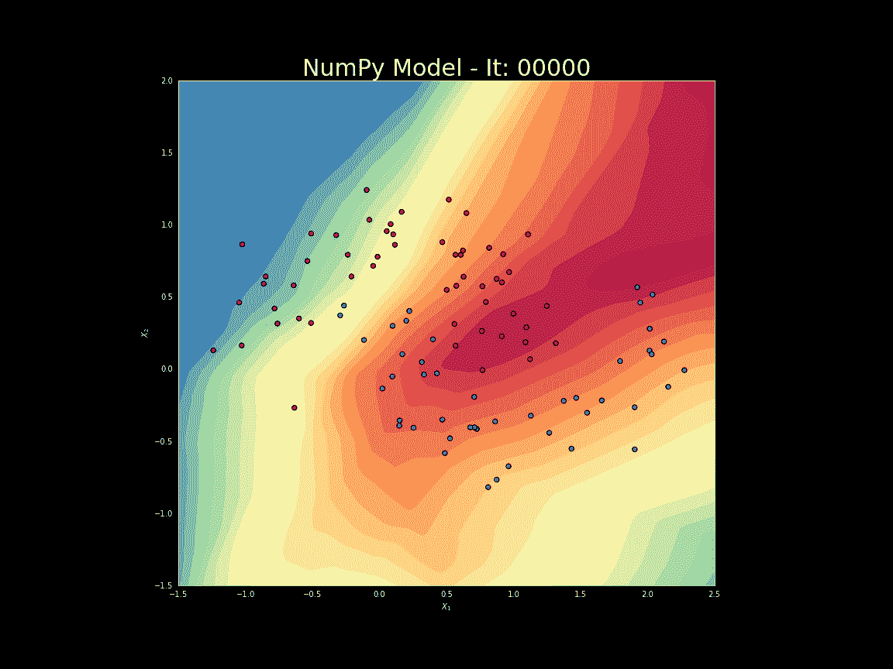
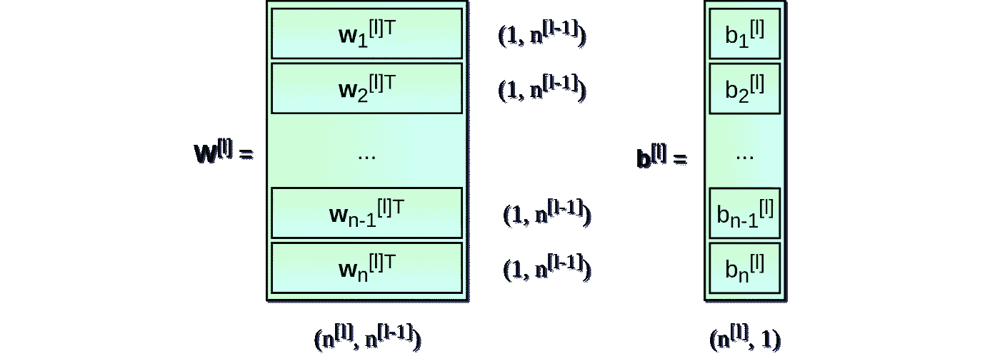
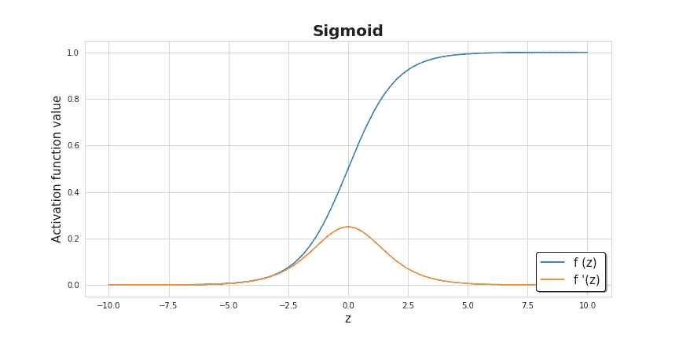
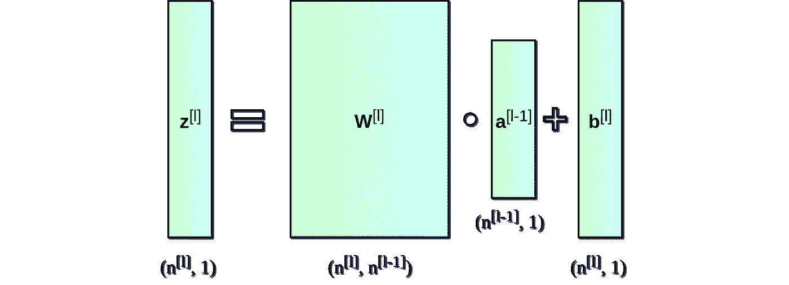
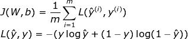
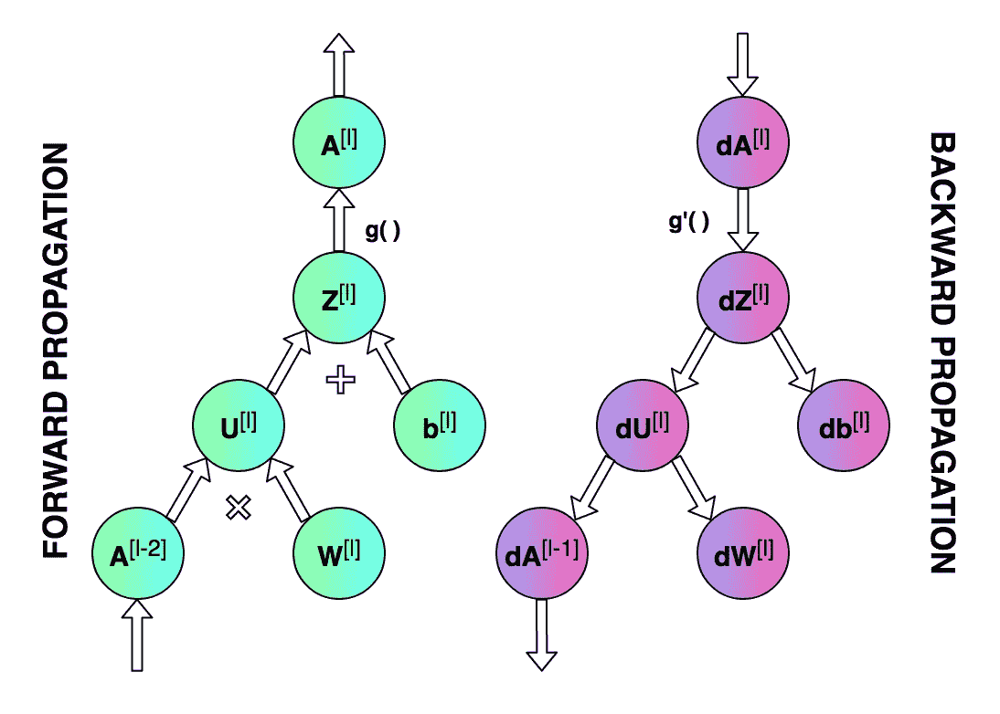
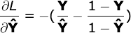
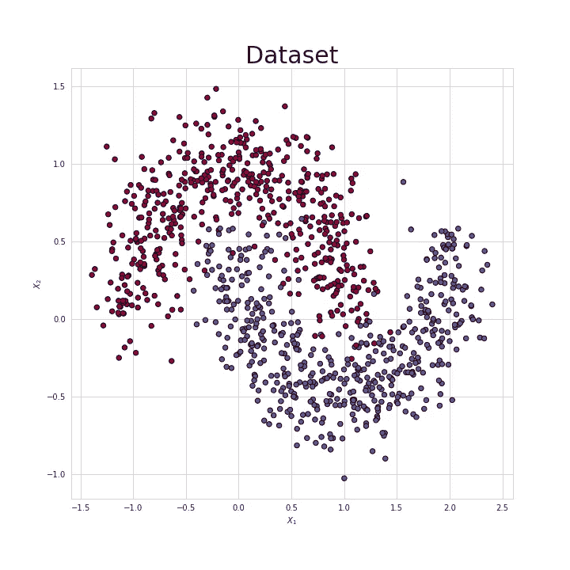
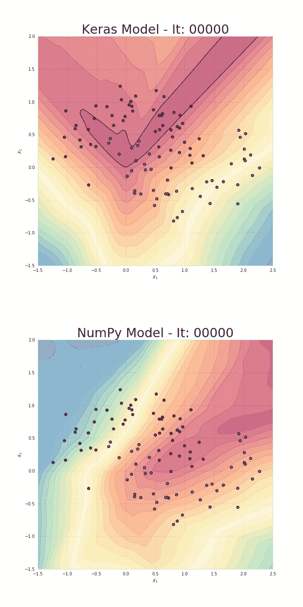

# 让我们用简单的数字编码一个神经网络

> 原文：<https://towardsdatascience.com/lets-code-a-neural-network-in-plain-numpy-ae7e74410795?source=collection_archive---------0----------------------->

## 神经网络的秘密第三部分

像 Keras、TensorFlow 或 PyTorch 这样的高级框架允许我们快速构建非常复杂的模型。然而，值得花时间深入了解和理解基本概念。不久前，我发表了一篇[文章](/https-medium-com-piotr-skalski92-deep-dive-into-deep-networks-math-17660bc376ba)，以简单的方式解释了神经网络是如何工作的。然而，这是一个高度理论化的职位，主要致力于数学，这是神经网络超能力的来源。从一开始，我就计划以更实际的方式跟进这个话题。这次我们将尝试利用我们的知识，仅使用 NumPy 构建一个完全可操作的神经网络。最后，我们还将测试我们的模型——解决简单的分类问题，并将其性能与用 Keras 构建的神经网络进行比较。

**注:**承蒙 [Jakukyo 弗列尔](https://medium.com/@weakish)的礼遇，你也可以用中文阅读这篇[文章](https://www.jqr.com/article/000532)。显然，今天的帖子将包含大部分用 Python 编写的代码片段。然而，我希望阅读不会太无聊。:)你也会在我认为不明确或者不值得关注的地方找到短评。像往常一样，所有的源代码都可以在我的 [GitHub](https://github.com/SkalskiP/ILearnDeepLearning.py) 上获得。

**Figure 1.** Example of dense neural network architecture

## 重要的事情先来

在我们开始编程之前，让我们停下来准备一个基本的路线图。**我们的目标是创建一个程序，该程序能够创建一个具有指定架构(层数和大小以及适当的激活函数)的密集连接的神经网络。**这种网络的一个例子如图 1 所示。最重要的是，我们必须能够训练我们的网络，并使用它进行预测。

**Figure 2.** Neural network blueprint

上图显示了在我们的神经网络训练过程中需要执行的操作。它还显示了在一次迭代的不同阶段，我们需要更新和读取多少参数。构建正确的数据结构并巧妙地管理其状态是我们任务中最困难的部分之一。由于时间限制，我将不详细描述图中所示的每个参数的作用。我向所有感兴趣的人推荐本系列的第一篇文章，我希望你能在那里找到困扰你的所有问题的答案。

**Figure 3.** Dimensions of weight matrix **W** and bias vector **b** for layer l.

## 神经网络层的初始化

L et 开始初始化每层的权重矩阵 **W** 和偏置向量 **b** 。在图 3 中。我准备了一个小备忘单，它将帮助我们为这些系数分配适当的维数。上标*【l】*表示当前层的索引(从 1 开始计数)，值 n 表示给定层中的单元数量。我假设描述神经网络架构的信息将以列表的形式传递给我们的程序，类似于代码片段 1 中的列表。列表中的每一项都是描述单个网络层的基本参数的字典:`input_dim` -作为该层的输入提供的信号向量的大小，`output_dim` -在该层的输出处获得的激活向量的大小，以及`activation` -将在该层内部使用的激活函数。

**Snippet 1.** A list containing parameters describing a particular neural network. This list corresponds to the NN shown in Figure 1.

如果你对这个话题很熟悉，你可能已经听到你脑海中有一个声音带着焦虑的语气说:“嘿，嘿！出事了！有些字段是不必要的……”。是啊，这次你内心的声音是对的。从一层出来的向量也是下一层的输入，所以实际上只需要知道其中一个向量的大小就足够了。然而，我特意决定使用下面的符号来保持所有层中对象的一致性，并使代码对于第一次遇到这些主题的人来说更容易理解。

**Snippet 2\.** The function that initiates the values of the weight matrices and bias vectors.

最后，让我们把重点放在我们必须完成的主要任务上——层参数的初始化。那些已经看过代码片段 2 的代码并且对 NumPy 有一些经验的人已经注意到矩阵 **W** 和向量 **b** 已经被小的随机数填充。这种做法不是偶然的。权重值不能用相同的数字初始化，因为这会导致**对称性破坏问题**。**基本上，如果所有权重都相同，无论输入 X 是什么，隐藏层中的所有单元也将相同。**在某种程度上，我们陷入了初始状态，没有任何逃脱的希望，无论我们将模型训练多久，我们的网络有多深。线性代数不会原谅。

在第一次迭代中，小值的使用提高了我们算法的效率。查看 sigmoid 函数的图表，如图 4 所示，我们可以看到，对于大值，它变得几乎平坦，这对我们的神经网络的学习速度有重大影响。总之，使用小随机数进行参数初始化是一种简单的方法，但它保证了**是我们算法的足够好的**起点。准备好的参数值存储在 python 字典中，并带有唯一标识其父图层的关键字。字典在函数结束时返回，所以我们将在算法的下一阶段访问它的内容。

**Figure 4\.** Activation functions used in the algorithm.

## 激活功能

A 综合了我们会用到的所有功能，有几个非常简单但功能强大。激活函数可以用一行代码编写，但是它们给了神经网络所需的非线性和表达能力。"**没有它们，我们的神经网络将变成线性函数的组合，所以它本身将只是一个线性函数**。"有许多激活函数，但在这个项目中，我决定提供使用其中两个的可能性——sigmoid 和 ReLU。为了能够完成整个循环并通过正向和反向传播，我们还必须准备它们的导数。

**Snippet 3.** ReLU and Sigmoid activation functions and their derivatives.

## 正向传播

他设计的神经网络将会有一个简单的架构。信息以一个方向流动——它以一个 **X** 矩阵的形式传递，然后穿过隐藏单元，产生预测向量 **Y_hat** 。为了更容易阅读，我将前向传播分成两个独立的函数——对单个层进行前向传播，对整个神经网络进行前向传播。

**Snippet 4.** Single layer forward propagation step

这部分代码可能是最简单易懂的。给定来自前一层的输入信号，我们计算仿射变换 **Z** ，然后应用选定的激活函数。通过使用 NumPy，我们可以利用矢量化功能——一次对整个图层和整批示例执行矩阵运算。这消除了迭代，大大加快了我们的计算速度。除了计算出的矩阵 **A** 之外，我们的函数还返回一个中间值 **Z** 。为什么答案如图 2 所示。在后退的过程中，我们需要 Z。

**Figure 5\.** Dimensions of individual matrices used in a forward step.

使用预先准备的一层前向步骤函数，我们现在可以很容易地建立一个完整的前向传播步骤。这是一个稍微复杂一点的函数，它的作用不仅是执行预测，而且是组织中间值的集合。它返回 Python 字典，其中包含为特定层计算的 **A** 和 **Z** 值。

**Snippet 5.** Full forward propagation step

## **损失函数**

在中，为了监控我们的进展并确保我们朝着正确的方向前进，我们应该定期计算损失函数的值。**“一般来说，损失函数旨在显示我们离‘理想’解决方案有多远。”**根据我们计划解决的问题进行选择，Keras 等框架有很多选项可供选择。因为我打算测试我们的神经网络对两个类之间的点的分类，所以我决定使用二元交叉熵，它由以下公式定义。为了获得更多关于学习过程的信息，我还决定实现一个计算准确度的函数。

**Snippet 6.** Calculating the value of the cost function and accuracy

## 反向传播

最近，反向传播被许多缺乏经验的深度学习爱好者视为令人生畏且难以理解的算法。微分学和线性代数的结合经常使没有受过扎实数学训练的人望而却步。**所以如果不能马上理解所有的东西，也不用太担心。相信我，我们都经历过。**

**Snippet 7.** Single layer backward propagation step

人们经常混淆反向传播和梯度下降，但实际上这是两回事。第一个目的是有效地计算梯度，而第二个目的是使用计算的梯度进行优化。在神经网络中，我们计算成本函数(前面讨论过)关于参数的梯度，但是反向传播可以用于计算任何函数的导数。**这个算法的本质是微积分中已知的链式法则的递归使用——计算由其他函数集合而成的函数的导数，这些函数的导数我们已经知道。**对于一个网络层，该过程由以下公式描述。不幸的是，由于本文主要关注实际实现，我将省略推导过程。看看这些公式，很明显为什么我们决定记住中间层的 **A** 和 **Z** 矩阵的值。

**Figure 6\.** Forward and backward propagation for a single layer.

就像向前传播的情况一样，我决定将计算分成两个独立的函数。第一个——如代码片段 7 所示——集中在一个层上，归结为用 NumPy 重写上面的公式。第二个表示完全向后传播，主要处理读取和更新三个字典中的值的键杂耍。我们首先计算成本函数相对于预测向量的导数——前向传播的结果。这很简单，因为它只包括重写下面的公式。然后从末端开始遍历网络的各层，根据图 6 所示的图表计算所有参数的导数。最终，函数返回一个 python 字典，其中包含我们正在寻找的渐变。

**Snippet 8.** Full backward propagation step

## 更新参数值

T 该方法的目标是使用梯度优化更新网络参数。这样，我们试图使我们的目标函数更接近最小值。为了完成这个任务，我们将使用作为函数参数提供的两个字典:`params_values`，它存储参数的当前值，以及`grads_values`，它存储根据这些参数计算的成本函数导数。现在你只需要对每一层应用下面的等式。这是一个非常简单的优化算法，但我决定使用它，因为它是更高级的优化器的一个很好的起点，这可能是我下一篇文章的主题。

**Snippet 9.** Updating parameters values using gradient descent

## 把东西放在一起

我们终于准备好了。任务中最困难的部分已经过去——我们已经准备好了所有必要的功能，现在我们只需要按照正确的顺序将它们组合在一起。为了更好地理解操作的顺序，值得再次查看图 2 中的图表。该函数返回作为训练结果获得的优化权重以及训练期间指标变化的历史记录。为了进行预测，您只需要使用接收到的权重矩阵和一组测试数据运行一个完整的前向传播。

**Snippet 10.** Training a model

## 大卫 vs 歌利亚

是时候看看我们的模型能否解决一个简单的分类问题了。我生成了一个数据集，由属于两个类的点组成，如图 7 所示。让我们试着教我们的模型对属于这个分布的点进行分类。为了对比，我还准备了一个高层框架的模型——Keras。这两种模型具有相同的架构和学习速率。然而，这确实是一场不均衡的战斗，因为我们准备的实现可能是最简单的。最终，NumPy 和 Keras 模型在测试集上都达到了相似的 95%的准确率。然而，我们的模型花了几十倍的时间才达到这样的结果。在我看来，这种状态主要是由于缺乏适当的优化造成的。

**Figure 7\.** Test dataset

**Figure 8\. V**isualisation of the classification boundaries achieved with both models

## 再见

我希望我的文章拓宽了你的视野，增加了你对神经网络内部编译操作的理解。这将是对我努力创建这个帖子的最好回报。我承认，通过编写代码和注释，我确实学到了很多东西。的确，没有什么比弄脏你的手更有教育意义。

如果你有任何问题或者你在源代码中发现了错误，请在评论中告诉我。如果你喜欢这篇文章，请在 [Twitter](https://twitter.com/PiotrSkalski92) 和 [Medium](https://medium.com/@piotr.skalski92) 上关注我，并在 [GitHub](https://github.com/SkalskiP) 和 [Kaggle](https://www.kaggle.com/skalskip) 上查看我正在进行的其他项目。本文是“神经网络的奥秘”系列的第三部分，如果你还没有机会，请阅读[其他文章](/preventing-deep-neural-network-from-overfitting-953458db800a)。保持好奇！

