# 让我们用机器学习模型为慈善事业寻找捐赠者

> 原文：<https://towardsdatascience.com/lets-find-donors-for-charity-with-machine-learning-models-7ad1da9f5538?source=collection_archive---------15----------------------->

## 监督学习算法的一个应用

欢迎来到我关于数据科学的第二篇博文。我将在这里写一个我用机器学习算法完成的项目。我将解释我做了什么，而不太依赖技术语言，但我会展示我的代码片段。代码问题:)

这个项目是一个假设的案例研究，我必须为一个慈善机构寻找潜在的捐赠者，这个慈善机构为愿意在硅谷研究机器学习的人提供资金。这个名为 CharitML 的慈善机构发现，每位捐赠者的年收入都超过了 5 万美元。我的任务是使用机器学习算法来帮助这个慈善机构在整个加州地区识别潜在的捐赠者。

> 为了这个项目，我使用了监督机器学习。在监督学习中，您有输入变量(X)和输出变量(Y ),并使用算法来学习从输入到输出的映射函数。我将描述我从一个杂乱的数据集到一个好的工作模型所采取的步骤。

## 数据处理

从探索数据开始总是好的。基本上，寻找观察的总数、特征的总数、缺失值、哪些特征应该被编码等等。最重要的是，寻找你正在解决的问题的特征。在这种情况下，我感兴趣的是有多少人年收入超过或低于 5 万美元。

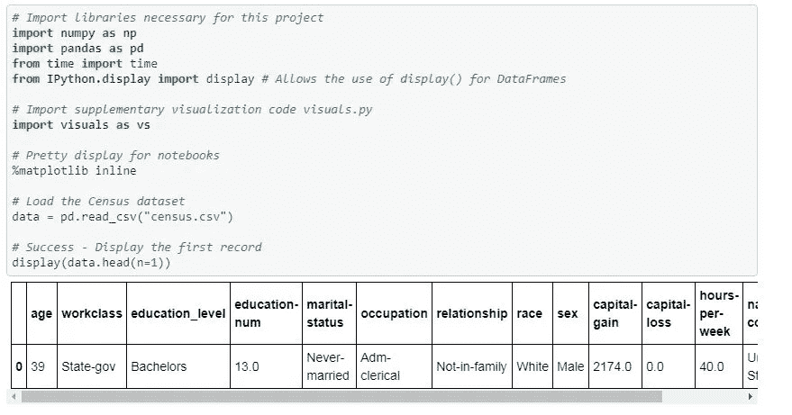

There are 13 features.

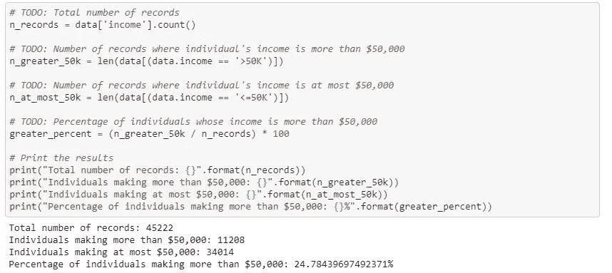

***变换歪斜连续的特征***

一个数据集有时可能包含至少一个其值趋向于接近一个单一数字的特征，但是也将具有比该单一数字大得多或小得多的非平凡数量的值。算法可能对这种值的分布很敏感，并且如果范围没有被适当地标准化，则可能表现不佳。对于我们的数据集，有两个特征符合这个描述:'`capital-gain'`和`'capital-loss'`。

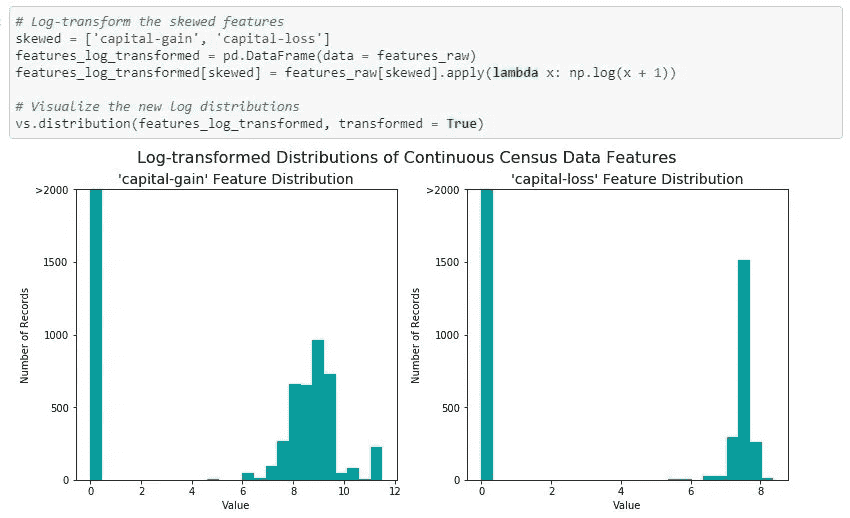

***归一化数值特征***

对数字要素执行某种类型的缩放通常是一种很好的做法。对数据进行缩放不会改变每个特征分布的形状(如上面的`'capital-gain'`或`'capital-loss'`)；但是，规范化可以确保在应用受监督的学习者时，每个特征都得到平等对待。这些特性的值将介于 0 和 1 之间。

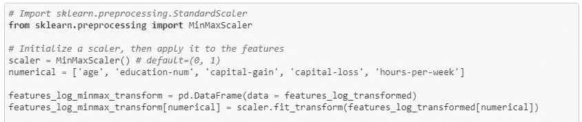

***编码数据***

通常，学习算法期望输入是数字，这需要转换非数字特征(称为*分类变量*)。转换分类变量的一种流行方法是使用**一键编码**方案。一键编码为每个非数字特征的每个可能类别创建一个*“虚拟”*变量。

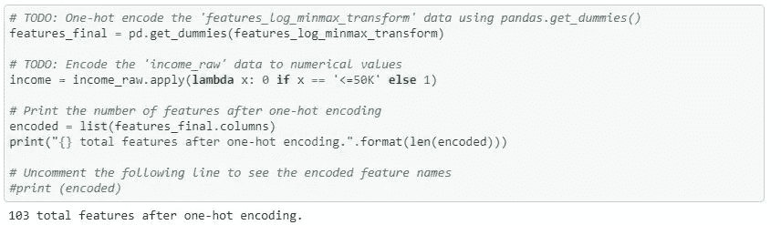

***洗牌并拆分数据***

现在所有的*分类变量*都已经被转换成数字特征，并且所有的数字特征都已经被规范化。与往常一样，我们现在将数据(包括要素及其标签)分成训练集和测试集。80%的数据将用于训练，20%用于测试。

## 模型度量

在进入我为这个项目测试的不同模型之前，我将详细说明我们如何判断一个模型的质量。我们在决定选择哪个型号时会看什么？在我们希望模型预测得有多好和它的计算代价有多高之间，总会有一个权衡；或者训练它需要多长时间。

模型性能的三个主要度量是:准确度、精确度和召回率。

**准确性**衡量分类器做出正确预测的频率。它是正确预测的数量与预测总数(测试数据点的数量)的比率。

**Precision** 告诉我们被我们归类为垃圾邮件的邮件中，实际上有多少是垃圾邮件。它是真阳性(分类为垃圾邮件的单词，实际上是垃圾邮件)与所有阳性(分类为垃圾邮件的所有单词，不管这是否是正确的分类)的比率。

**Recall(sensitivity)** 告诉我们实际上是垃圾邮件的邮件中有多少被我们归类为垃圾邮件。它是真阳性词(被归类为垃圾邮件的词，以及实际上是垃圾邮件的词)与所有实际上是垃圾邮件的词的比率。

不同的措施对不同的问题有不同程度的影响。因此，我们应该知道哪个指标对我们更重要。例如，将*收入不超过 5 万美元的人认定为收入超过 5 万美元的人将对 CharityML 不利，因为他们正在寻找愿意捐款的人。因此，一个模特的 ***的能力，准确地说*** 预测那些挣 5 万美元以上的人*比模特的 ***回忆*** 那些个人的能力*更重要。*

我们可以使用 **F-beta 分数**作为同时考虑精确度和召回率的指标:

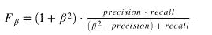

***天真基线预测值***

如果我们选择一个总是预测个人收入超过 50，000 美元的模型，那么这个模型在这个数据集上的准确性和 F 值是多少？我们想知道未经训练的模特会是什么样子。

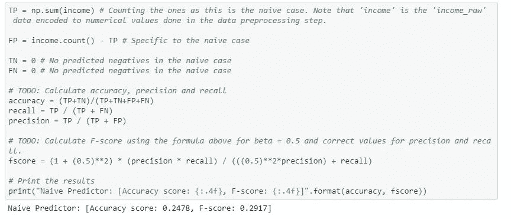

## 监督学习模型

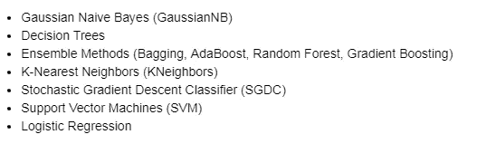

This is not an exhaustive list

在这些选项中，我尝试并测试了其中的三个: *SVM、ADABOOST 和 Random Forrest。*

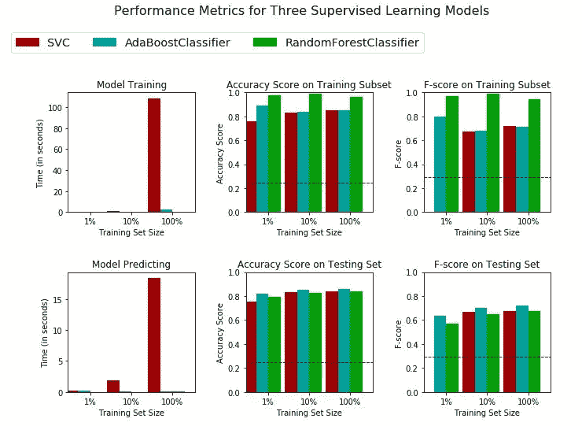

**Adaboost** 模型最适合我们的问题。Adaboost 在测试数据集上的 *F 值*最高。除此之外，像 RandomForest 一样，训练集和测试集之间的 F 分数没有很大的差异。这很重要，因为我们不希望我们的模型过度适应训练集，并返回一个夸大的 F 分数。Adaboost 在所有训练集规模下的准确率和 F 值都是最高的。训练和测试时间非常短，这意味着该模型的计算速度很快。模型的迭代方面使它能够很好地处理大量的属性，就像我们的例子一样。因此，这是一个很好的选择。

***ADABOOST 如何工作***

**Adaboost** ，简称*自适应增强*是一种集成算法。 **Adaboost** 算法使用迭代训练来给出精确的模型。它从弱学习者开始，这是数据的初始分类。也就是说，分类是用*决策树桩*完成的。这意味着分类只是用一条线来分隔数据。它被称为*‘弱’*，因为数据还没有被很好地分类。但是由于进一步的迭代，该模型使得学习者关注于*误分类点*。更准确地说，在第一步中，弱学习者分离数据，并且所有的点被同等地加权。如果存在错误分类的点，在第二次迭代中，弱学习器试图捕捉这些先前的错误中的大部分，并为它们分配更高的权重。本质上，该模型通过对误差进行更多的加权来关注误差。只要我们指派它去做，这个迭代过程就会继续。因此，随着每一次迭代，模型捕获的数据越来越好。弱学习者被组合起来，并根据他们的表现分配权重。通过计算弱分类器的加权平均值来进行预测。最终的学习者是由弱学习者组合而成的强学习者。

## 模型调整

我们可以通过使用网格搜索来进一步改进所选择的模型。这个想法是为一些参数使用不同的值，比如估计器的数量或学习率，以便获得更好的性能指标。

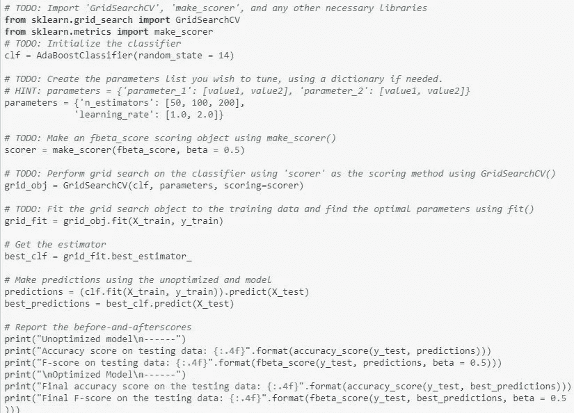

Hope you’re not tired of these yet

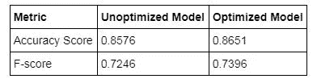

我们可以看到优化的模型比未优化的模型表现得更好。准确率从 0.8576 提高到 0.8651，F 值从 0.7246 提高到 0.7396。请记住，朴素预测器给我们的准确度分数为 0.2478，F 分数为 0.2917，这并不奇怪，因为朴素模型不对数据进行任何训练。

## 特征抽出

在这个数据集中的 13 个特征中，我很好奇哪一个具有最高的预测能力。如果我们只在模型中使用这些，会发生什么？

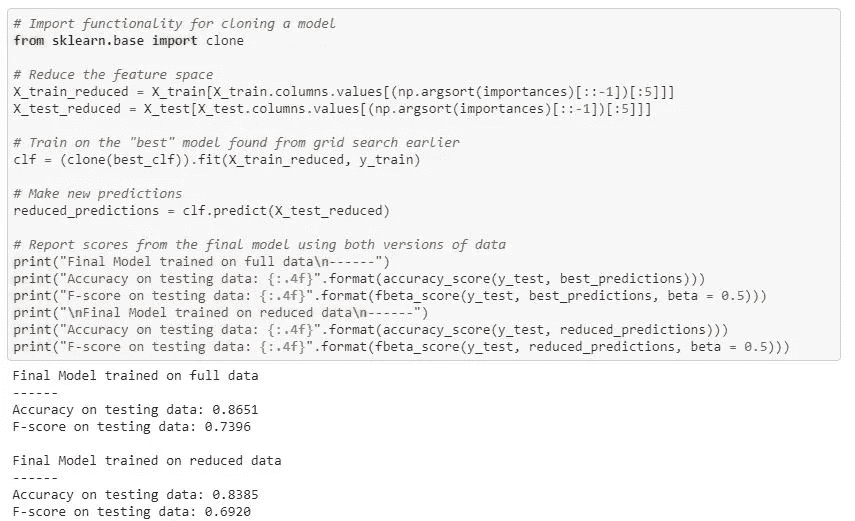

在简化的模型中，精确度和 F 值都下降了。在这种情况下，与完整模型相比，较少的特征使得模型的泛化能力稍差。然而，分数的降低并不高。反过来，训练时间更快，因为模型包含的特征更少。因此，如果训练时间是一个因素，这种权衡将是有意义的，因为我们不会在性能方面损失太多。

***汇总***

那我们做了什么？我们得到了一个数据集，并设定了一个目标，对年收入超过 5 万美元的人进行分类。我们清理了数据，将必要的变量标准化并转换成数字特征，以便在我们的模型中使用它们。我们将数据分成训练集和测试集。我们设定了一个基线预测值，并建立了另外三个模型。我们选择 ADABOOST 模型作为最佳选择。我们对它做了进一步的调整，使它稍微好了一些。我们试图使用只有五个主要特征的模型，但它的表现稍差。

## 最后的话

这是它:)如果你通过了这里，我想说一声非常感谢你。我希望这是监督机器学习的一个很好的、清晰的应用。它是数据科学中一个强有力的工具；我目前正在学习并想掌握的东西。如果你有问题，欢迎在下面发表评论，你也可以随时看看这个项目，包括我的 [github](https://github.com/andreigalanciuc/MACHINE-LEARNING-FINDING-DONORS/blob/master/finding_donors_final.ipynb) 上的许多其他项目。

在 LinkedIn 上关注我:[https://www.linkedin.com/in/andreigalanchuk/](https://www.linkedin.com/in/andreigalanchuk/)

上帝保佑你们！