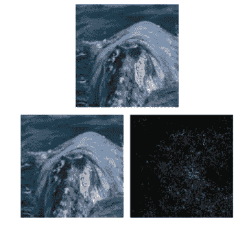
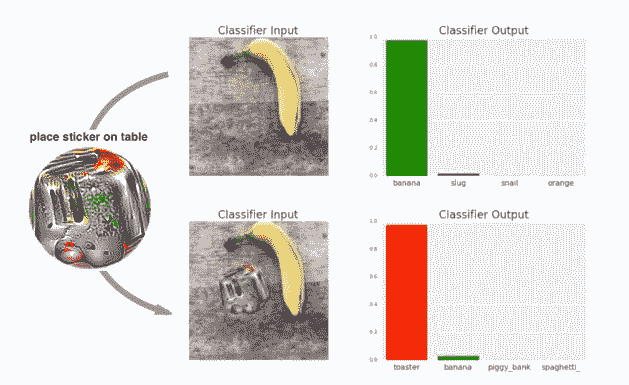
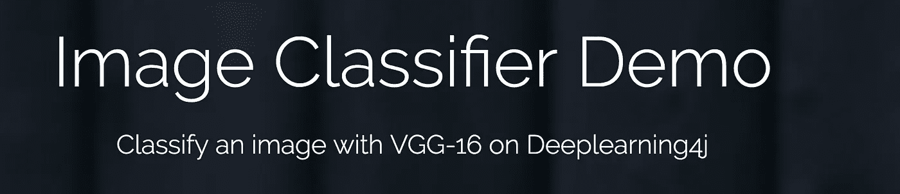
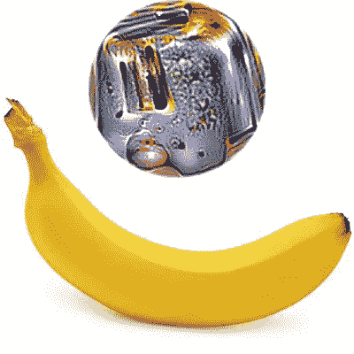
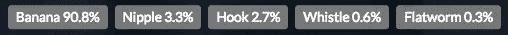
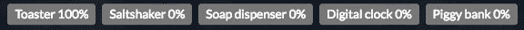
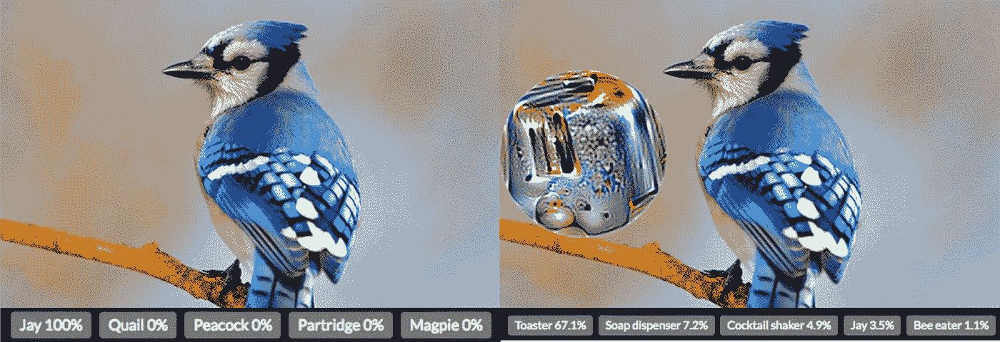

# 我们来忽悠一个神经网络！

> 原文：<https://towardsdatascience.com/lets-fool-a-neural-network-b1cded8c4c07?source=collection_archive---------2----------------------->

*通过使用对抗性补丁*

在这篇文章中将看到如何欺骗一个对象分类器神经网络，具体来说就是 [VGG16](https://arxiv.org/abs/1409.1556) ，使用一种新技术来创建**对抗性补丁。**

原文可以在这里找到[，所有代码和资料](https://arxiv.org/abs/1712.09665)[在这里](https://github.com/FrancescoSaverioZuppichini/Fool-Object-Classifier/blob/master/paper/Adversarial%20Patch.pdf)。

# 介绍

通常，欺骗对象分类器的标准方法是通过以特定的方式迭代地添加一些噪声来创建图像，试图最大化模型的误差。由此产生的图片看起来与人类非常相似，但会给网络带来巨大的误差。这种技巧的一个例子可以 **DeepFool，**在本文[中介绍](https://www.cv-foundation.org/openaccess/content_cvpr_2016/papers/Moosavi-Dezfooli_DeepFool_A_Simple_CVPR_2016_paper.pdf) **。**简而言之，它扰乱图像，使其几乎等同于人眼，但不同于神经网络



原始图像被正确分类为“鲸鱼”，而第二个图像(将两个图像相加创建)被分类为“海龟”。

虽然这种方法非常有效，但它不适合现实生活中的场景。引用原文:

> *这种策略可以产生很好的伪装攻击，但是需要修改目标图像*

[给出的创建**对抗性**](https://arxiv.org/abs/1712.09665) **补丁** [](https://arxiv.org/abs/1712.09665)的方法是通过给图像添加一个路径，一个贴纸，而不是完全改变它。



因此，人们可以只打印标签，并很容易地将其放置在真实对象附近，以欺骗网络。具体来说，生成路径是为了让模型预测一个错误的类，在我们的例子中是烤面包机。此外，这在现实生活中非常有效，例如，当分类器使用摄像机来执行活体对象检测时。

我强烈建议阅读原始论文的第二部分，以获得如何找到路径的所有细节。

# 亲自动手

让我们实际尝试一下。该文件提供了一个专门为 [VGG16](https://arxiv.org/abs/1409.1556) (广泛使用的对象分类器模型)创建的路径，它使分类器相信图像中有一个烤面包机。我用[这个网站](https://deeplearning4j.org/demo-classifier-vgg16)来测试它是否有效。



Header of the online demo of the VGG16 that I used

一个更科学的*方法是下载一个 VGG16 训练过的模型，然后**用应用了**路径的测试集中的每个图像绘制误差，但是我没有时间这么做。*

此外，路径**不应直接应用于对象**，否则它会覆盖我们试图分类的原始对象。

要将路径应用于图像，您可以使用您最喜欢的图像编辑软件。我决定稍微花点心思，在 node.js 中创建一个命令行来做到这一点。它允许我在标贴上指定目标图像的位置和大小，你可以在这里找到代码

```
> node index.js ../images/banana.jpg center up 2
Processing image: ../images/banana.jpg
Path will be placed center-up
Image saved at: ../images/banana-pathed.jpg
```

第一个参数是源图像路径，第二个和第三个分别表示路径的位置，水平和垂直，最后一个是路径相对于源图像的比率。

在这种情况下，脚本获取一个香蕉的图像，在上面粘贴标签并存储它，这就是输出。



现在让我们来看看 VGG16 用原始图像和“修补”图像预测了什么。我们使用[这个网站](https://deeplearning4j.org/demo-classifier-vgg16)是为了更新和获得一个图像的预测。

配原图:



Yep, it is a banana

有补丁的那个



Now its a toaster!

有用！或者，至少对香蕉来说。让我们试试另一个例子:

```
node index.js ../images/bird.jpg left center 3
```



We fool it again!

在原始图像上，该模型以 100%的置信度正确预测了类“Jay ”,在修补后的图像上，该模型以 67.1%的置信度预测了“Toaster ”,以 3.5%的置信度预测了“Jay”。是的，我们又骗了它！

我建议你用你自己的图像试试，它很有趣。

# **结论**

所提出的创建对抗路径的方法是一种在不修改目标图像的情况下在现实生活场景中有效愚弄神经网络的新方法。一个路径可以被打印成一个标签，并直接应用于一个对象，以改变预测的类和“愚弄”神经网络，这可能是非常危险的。

原文可以在这里找到[，所有代码和资料](https://arxiv.org/abs/1712.09665)[可以在这里](https://github.com/FrancescoSaverioZuppichini/Fool-Object-Classifier/blob/master/paper/Adversarial%20Patch.pdf)。

感谢您的阅读，

弗朗西斯科·萨维里奥