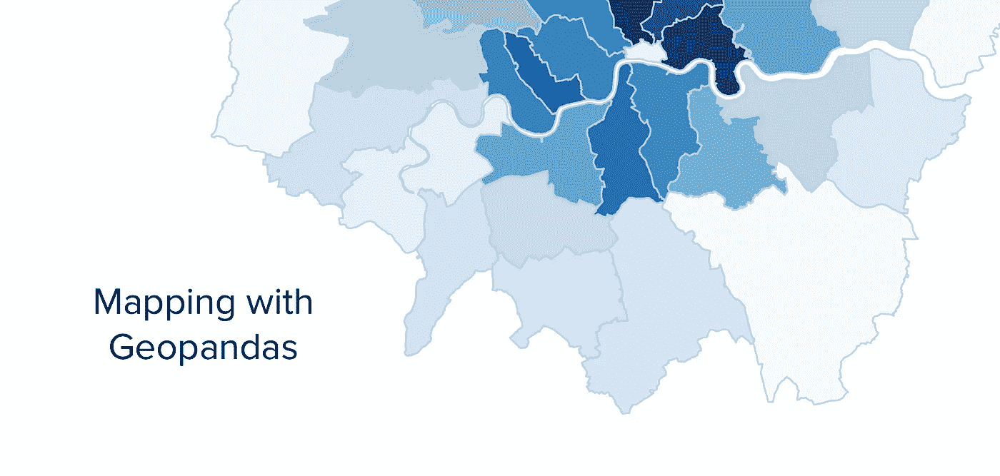
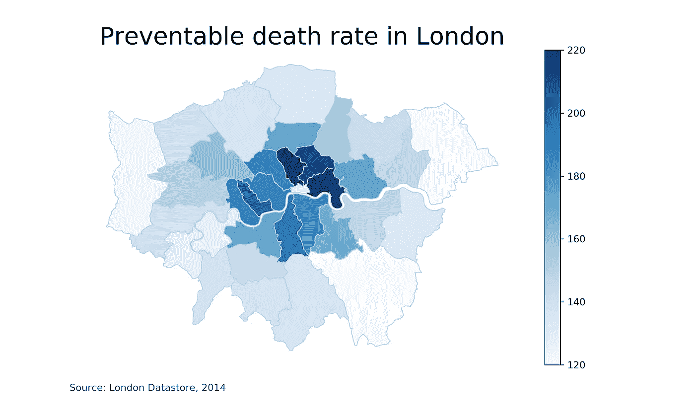
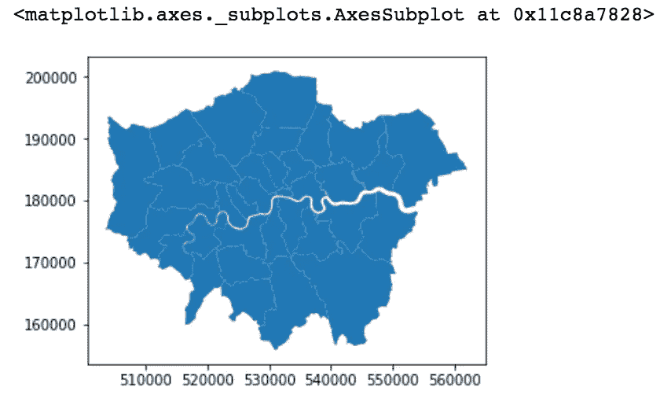
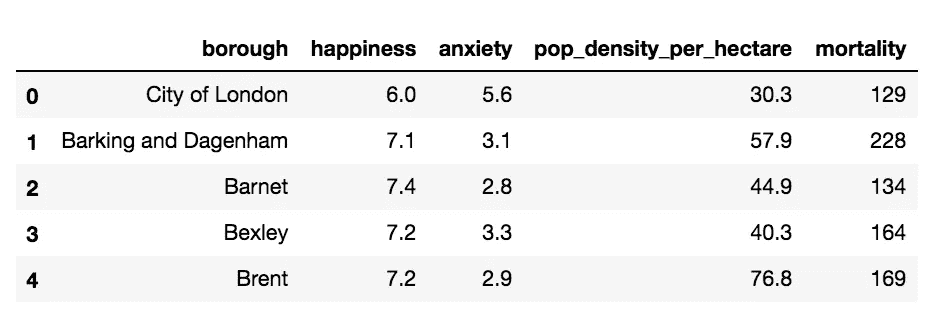
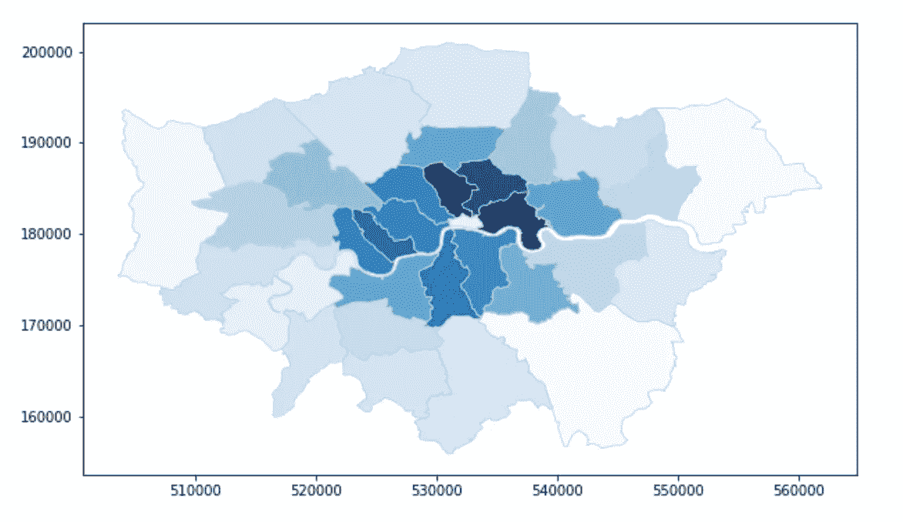
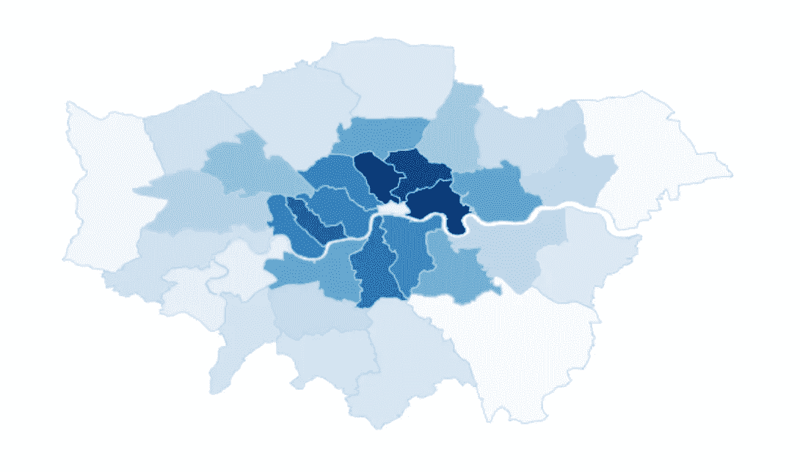
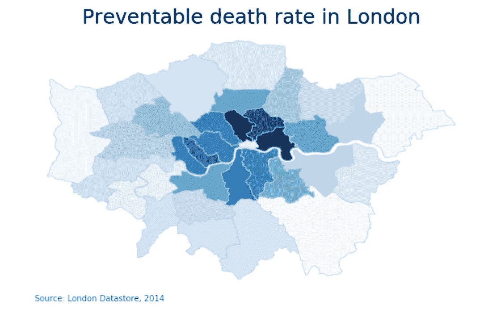

# 让我们做一张地图吧！利用 Geopandas、pandas 和 Matplotlib 制作 Choropleth 地图

> 原文：<https://towardsdatascience.com/lets-make-a-map-using-geopandas-pandas-and-matplotlib-to-make-a-chloropleth-map-dddc31c1983d?source=collection_archive---------0----------------------->



所以你想用 Python 做地图。我们开始吧！

如果你已经开始用 Matplotlib 和 Pandas 做一些数据可视化，但是正在寻找地理数据入门的下一个简单步骤，我有你。我去过那里。事实上，我花了几个小时浏览在线教程，寻找最简单的软件包来开始制作地图(特别是 choropleths)。虽然有很多选择，但我最终选择了地质公园作为门槛最低的地方。

Geopandas 很棒，因为它就像熊猫一样(但使用的是形状文件之类的地理数据)。Geopandas 数据帧与 pandas 数据帧非常相似，因此两者通常配合得很好。最重要的是，Geopandas 允许您创建快速、独立的 choropleth 地图，而没有许多其他依赖项(也没有太多代码行！).

这是我们将要制作的预览。



It’s London! Made with Python.

顺便说一句，有很多制作地图的好方法(值得注意的是， [Datawrapper](https://www.datawrapper.de/) 刚刚添加了一个 GeoJson 包装器来加载你自己的定制地图)。没有放之四海而皆准的方法。然而，大多数这些服务都有某种限制(比如不能下载 svg 格式的文件。此外，用 Python 制作地图有几个独特的好处:

*   **再现性**——Python 的一大卖点，尤其是制作超级快速图表。本教程将尽可能简化创建地图的过程(使用全局变量、清理等)，以便下次您想要创建地图时，您只需更改 csv 文件(假设它是相同的地理位置)。
*   **最大控制** —定制，下载任何你想要的格式，你打电话。尽管可能需要修改一些代码，但 Matplotlib 非常强大。
*   **很多很多的地图** —如果你需要可视化同一个有很多变量的地图(多个小地图？)或显示随时间变化的地图，将这些代码包装在 for 循环中是一个明智的做法(我将在下一篇文章中介绍)。带有 GUI 界面的图表生成器很棒，但通常不擅长自动化任务。Python 很好。
*   **不需要设计技能**——嗯，几乎不需要设计技能。好的数据设计的眼光是有帮助的。但不需要 Adobe Illustrator 或 Photoshop 技能。

好，我们开始吧。这是你需要的。我用一个 Jupyter 笔记本来存放所有的代码(我强烈推荐，这样你就可以预览渲染)，但是你可以。

*   熊猫
*   地质公园
*   Matplotlib

就是这样！

# **获取数据**

让我们把一些数据记在笔记本上。由于我目前住在伦敦，我将按地方选区(自治区级)制作伦敦地图。伦敦数据存储在使大量数据公开和可访问方面做得很好，我发现这个页面有一堆不同详细程度的形状文件。不错！

点击→下载→另存为→移动到笔记本本地目录。搞定了。

但是 shapefile 只是一层数据。这将有助于绘制地图，但如果我们想将数据绑定到它，我们还需要另一个数据集。回到伦敦数据存储:让我们下载[伦敦自治市档案数据集](https://data.london.gov.uk/dataset/london-borough-profiles)作为 csv 文件(已经预先清理干净)。这个 csv 文件有很多列，我们可以用它们作为变量来可视化。

现在两个数据集都准备好了，我又回到了我的 Jupyter 笔记本上。是时候载入了。shp 和。csv 文件。

```
# set the filepath and load in a shapefilefp = “datasets/geo-data/gis-boundaries-london/ESRI/London_Borough_Excluding_MHW.shp”map_df = gpd.read_file(fp)# check data type so we can see that this is not a normal dataframe, but a GEOdataframemap_df.head()
```

现在让我们预览一下没有数据的地图是什么样子。

```
map_df.plot()
```



酷，是伦敦！

然后，我们加载一个 csv 数据文件来连接地理数据框架。

```
df = pd.read_csv(“datasets/london-borough-profile.csv”, header=0)df.head()
```

# **清洗和连接数据框**

太好了。现在我们有两个数据帧准备好了。让我们获取一份我们将要使用的数据。

```
df = df[[‘borough’,’Happiness_score_2011–14_(out_of_10)’, ‘Anxiety_score_2011–14_(out_of_10)’, ‘Population_density_(per_hectare)_2017’, ‘Mortality_rate_from_causes_considered_preventable_2012/14’]]
```

这些列名真的很糟糕。让我们将它们重命名为更简单的名称。

```
data_for_map = df.rename(index=str, columns={“Happiness_score_2011–14_(out_of_10)”: “happiness”,“Anxiety_score_2011–14_(out_of_10)”: “anxiety”,“Population_density_(per_hectare)_2017”: “pop_density_per_hectare”,“Mortality_rate_from_causes_considered_preventable_2012/14”: ‘mortality’})# check dat dataframedata_for_map.head()
```



好多了。现在，我们需要将地理数据与清理后的伦敦数据集合并。我们将使用 pd.join()来实现这一点。

```
# join the geodataframe with the cleaned up csv dataframemerged = map_df.set_index(‘NAME’).join(data_for_map.set_index(‘borough’))merged.head()
```

# **地图时间！**

开始贴图吧。首先我们需要为 Matplotlib 做一些准备工作。我们首先将一个变量设置为 map，设置范围并为要绘制的地图创建图形。

```
# set a variable that will call whatever column we want to visualise on the mapvariable = ‘pop_density_per_hectare’# set the range for the choroplethvmin, vmax = 120, 220# create figure and axes for Matplotlibfig, ax = plt.subplots(1, figsize=(10, 6))
```

舞台已经搭好了。地图时间。

```
# create mapmerged.plot(column=variable, cmap=’Blues’, linewidth=0.8, ax=ax, edgecolor=’0.8')
```



就在那里！不完美。有点扭曲，有一个奇怪的轴围绕着整个东西，这并不意味着什么。但是我们有一个 choropleth。现在让我们做一些美化，让它看起来新鲜。

# **定制地图**

首先，那个轴心需要被移除。

```
# remove the axisax.axis(‘off’)
```



然后，让我们添加一个标题到我们的地图，和一些说明来源的文字。地图通常看起来很好，但是如果你不提供背景信息，它就没有多大意义。

```
# add a titleax.set_title(‘Preventable death rate in London’, fontdict={‘fontsize’: ‘25’, ‘fontweight’ : ‘3’})# create an annotation for the data sourceax.annotate(‘Source: London Datastore, 2014’,xy=(0.1, .08),  xycoords=’figure fraction’, horizontalalignment=’left’, verticalalignment=’top’, fontsize=12, color=’#555555')
```



漂亮！但是还缺少一样东西。我们可能应该添加一个图例，为用户显示值的范围。这将有助于它看起来不那么压扁。

```
# Create colorbar as a legendsm = plt.cm.ScalarMappable(cmap=’Blues’, norm=plt.Normalize(vmin=vmin, vmax=vmax))# empty array for the data rangesm._A = []# add the colorbar to the figurecbar = fig.colorbar(sm)
```


地图。制造。

最后一件事:我们需要保存地图，这样我们就可以发布一条带有#dataviz 标签的 tweet。

Matplotlib 在如何保存数据方面给了你很多自由。下面的代码将图片保存为 png 格式，但是如果你想在 Illustrator 中对它进行更多的修改，你也可以保存为 svg 格式。如果保存为 png，请确保使用 200 或更高的 dpi。否则地图和文字看起来会很模糊。没人想这样。

```
fig.savefig(“map_export.png”, dpi=300)
```

现在，我们的工作目录中已经有了一份可以发布的地图！太神奇了。

原来如此。您已经设置好了 Geopandas(至少对于 choropleths 是这样)。接下来，我将看看如何使用 Geopandas 制作多个地图，并将其转换成一个很酷的 gif 地图。敬请期待！

你可以在 Github 上查看并下载我的 Jupyter 笔记本。