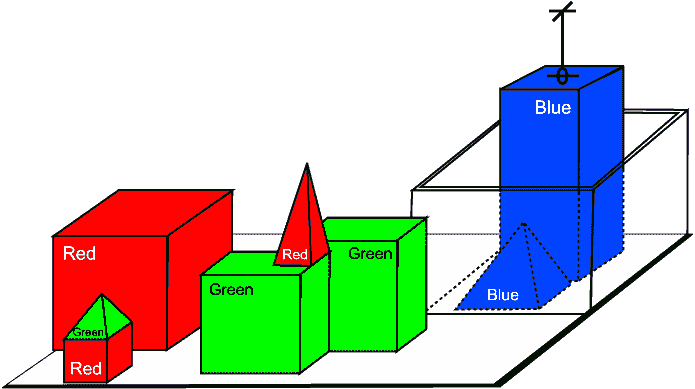

# 让我们再次让聊天机器人变得伟大

> 原文：<https://towardsdatascience.com/lets-make-chatbots-great-again-a30f5221a678?source=collection_archive---------6----------------------->

Photo by [Mohamed Nohassi](https://unsplash.com/photos/odxB5oIG_iA?utm_source=unsplash&utm_medium=referral&utm_content=creditCopyText) on [Unsplash](https://unsplash.com/search/photos/excited?utm_source=unsplash&utm_medium=referral&utm_content=creditCopyText)

聊天机器人曾经很棒。首先，在 1964 年，我们有了著名的聊天机器人伊莱扎，它让人们相信它真的是一名治疗师。然后，在 1968 年我们有了 [SHRDLU](https://en.wikipedia.org/wiki/SHRDLU) 。如果你没有听说过，SHRDLU 是一个虚拟“积木世界”的对话界面:

SHRDLU’s blocks world ([source](https://sites.google.com/site/inteligenciaartificialist/exemplos-de-ia/shrdlu))

以下是与 SHRDLU 的对话示例:

> 人:请你把两个红色方块和一个绿色立方体或一个金字塔叠起来好吗？
> 
> 电脑:好的。
> 
> 人:哪个立方体在桌子上？
> 
> 电脑:支撑红色金字塔的绿色大电脑。
> 
> 人:金字塔后面有大块吗？
> 
> 电脑:是的，三个:一个大的红色的，一个大的绿色的立方体，还有蓝色的。
> 
> 人:把一个小的放在支撑金字塔的绿色立方体上。
> 
> 电脑:好的。
> 
> 人:把最小的金字塔放在上面。
> 
> 电脑:好的。
> 
> 人:最高的金字塔的最矮的东西支撑着绿色的东西吗？
> 
> 电脑:是的，绿色金字塔。

令人印象深刻。但那是过去的事了。

现在我们有了意向——有几个可以填充的槽的扁平结构。现代系统不太可能理解用户在上述对话中的最后一个查询。

# 哪里出了问题？

Photo by [Toa Heftiba](https://unsplash.com/photos/ImqbTNUoTD0?utm_source=unsplash&utm_medium=referral&utm_content=creditCopyText) on [Unsplash](https://unsplash.com/search/photos/disappointed?utm_source=unsplash&utm_medium=referral&utm_content=creditCopyText)

这些“优秀的老式人工智能”系统在许多方面都令人惊叹，但它们也有缺陷。

他们需要大量的努力和工程才能做好。这不是将一堆训练数据粘贴到机器学习算法中并转动曲柄的情况——解释用户查询的自然语言语法是手工精心构建的。

统计技术没有被广泛使用，这意味着系统本质上是脆弱的。查询必须具有完全正确的形式，否则聊天机器人将无法理解。

他们也被限制在一个小范围内。一个可以移动街区的聊天机器人对大多数人来说是没用的。随着复杂性的迅速升级，推广 SHRDLU 这样的系统的努力失败了。

# 恢复平衡

Photo by [Jonathan Pendleton](https://unsplash.com/photos/rewyZqUwAqY?utm_source=unsplash&utm_medium=referral&utm_content=creditCopyText) on [Unsplash](https://unsplash.com/search/photos/balance?utm_source=unsplash&utm_medium=referral&utm_content=creditCopyText)

快进到 2018 年，我们已经走到了另一个极端。我们的系统非常强大。我们的解析器使用机器学习，并接受真实数据的训练。但是我们的聊天机器人太没有野心了，和 SHRDLU 比起来就相形见绌了。

他们并没有减少约束。我们现在应该能造出比 SHRDLU 更好的东西了吧？这是怎么回事？

我们已经忘记了我们的历史。我们缺乏想象力。我们忽略了学术界已经开发的技术。

# 走向综合

Photo by [Mika Ruusunen](https://unsplash.com/photos/ypVM8PnygUo?utm_source=unsplash&utm_medium=referral&utm_content=creditCopyText) on [Unsplash](https://unsplash.com/search/photos/merge?utm_source=unsplash&utm_medium=referral&utm_content=creditCopyText)

SHRDLU 很脆弱，但是可以处理复杂的查询。现代系统更加强大但简单。我们如何将这些结合起来，以建立比两者都更好的东西？

SHDRLU 由三个主要组件组成:

1.  一个积木世界的**模拟**，允许 SHRDLU 知道每一个可能的动作会发生什么。
2.  一个**语法**，它将用户查询翻译成 SHRDLU 可以解释的形式
3.  一个**计划器**，帮助它探索可能的动作，以找到满足用户请求的序列。

第二和第三个组件对应于自 SHRDLU 开发以来的几年中受到大量关注的两项人工智能技术:

*   **语义解析器**是将自然语言表达翻译成计算机理解的形式的工具。在过去五年左右的时间里，该领域重新引起了人们的兴趣，并且随着现代机器学习和新技术的应用，最先进的精确度得到了显著提高。
*   自动规划是自 SHRDLU 时代以来一直在稳步发展的人工智能领域。自动化规划器已被用于美国国家航空航天局的机器人，玩电脑游戏，最著名的是，在围棋上击败人类。现代搜索技术和机器学习在这个问题上的应用彻底改变了这个领域。

第一个组成部分，世界模拟，是针对我们试图解决的问题的。有[规划语言](https://en.wikipedia.org/wiki/Planning_Domain_Definition_Language)被设计用来描述世界。这些以自动化规划者理解的格式描述世界。

# 我们需要更好的工具

Photo by [Matt Artz](https://unsplash.com/photos/lt2GzPlOAmc?utm_source=unsplash&utm_medium=referral&utm_content=creditCopyText) on [Unsplash](https://unsplash.com/search/photos/spanner?utm_source=unsplash&utm_medium=referral&utm_content=creditCopyText)

最终，是聊天机器人创建工具让我们失望了。

我们需要工具来拓展聊天机器人的潜能。

如果我们构建一个利用这些最新进展的 SHRDLU 更新版本，会发生什么？没人知道，因为没人试过。

我想我们可以建造一些令人惊奇的东西。

请某人建造这个。否则我就得自己动手了。