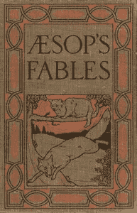
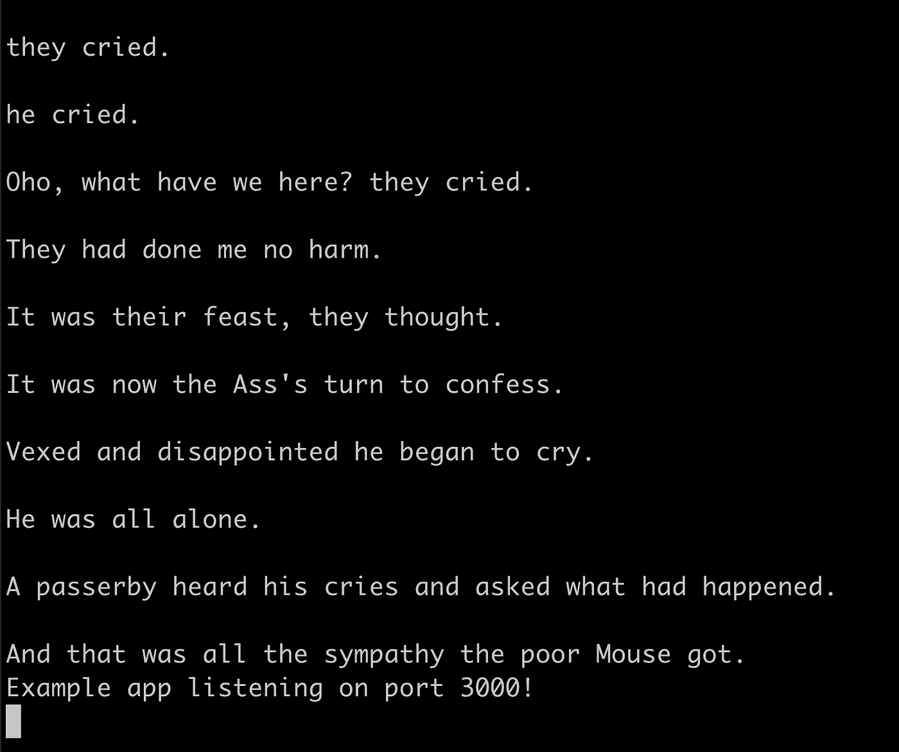
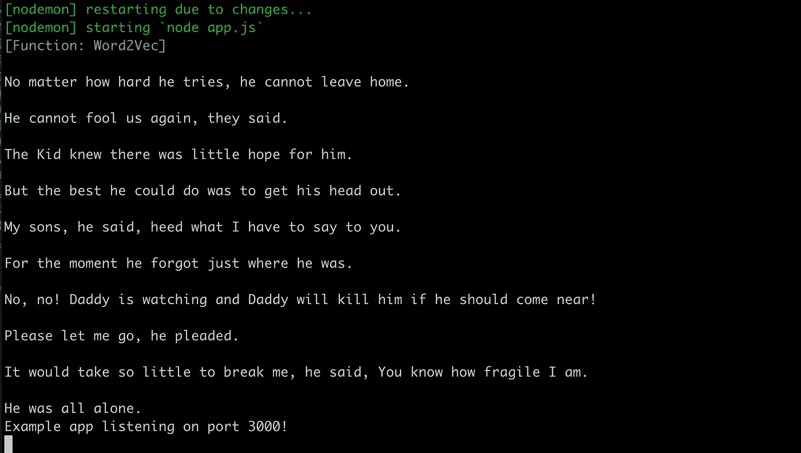

# 让我们读一个故事:一项关于使用机器学习工具为儿童讲故事的研究

> 原文：<https://towardsdatascience.com/lets-read-a-story-a-study-on-storytelling-for-children-using-machine-learning-tools-1b631bbbffac?source=collection_archive---------14----------------------->

## 让我们读一个故事是一项关于伊索寓言的研究，以及使用最近可用的机器学习工具以一种新的有趣的方式探索原始寓言中不同人物和思想之间的联系的可能性。

[*Let’s Read A Story*](http://letsreadastory.itayniv.com) *— Using Sketch RNN as a* homage to endpapers in bookbinding tradition

你可以在这里找到一个工作演示**(chrome 桌面上的最佳性能)。**

****

**[*Let’s Read A Story*](http://www.letsreadastory.xyz)**

**在下面的帖子中，我将尝试描述这个项目背后的思维过程和一些技术方面。**

**📜**

****收集资料。****

**在这个项目中，我选择关注和分析伊索寓言，在它们不同的句子之间产生新的有趣的邻接，从而创造新的故事。我被《伊索寓言》所吸引，因为它们简洁而丰富的故事情节，使用动物作为隐喻，以及每个故事中蕴含的强烈道德。**

****

**[*Aesop Fables for kids, project gutenberg*](http://www.gutenberg.org/files/49010/49010-0.txt)**

**每个原始伊索寓言包含:**

1.  **一个简短的标题，通常非常描述故事的内容和人物。**
2.  **故事本身，通常不超过 30 句。**
3.  **这个故事的寓意，通常包含一个隐喻，建立在故事中动物固有的本性或特质上。**

# **✨**

****清理数据集****

**为了对内容进行分析，我编译了一个 [JSON 文件](https://github.com/itayniv/aesop-fables-stories/blob/master/public/aesopFables.json)，其中保存了所有分解成单独句子的故事、它们的标题、角色和动物。**

**这个文件是生成实验新故事的关键，因为它保存了所有的句子，并作为实验的“数据库”。**

**此外，对于每个新生成的故事(新生成的故事从该故事发展而来),该文件充当从获取种子句子的源。**

# **⚙️**

****分析句子****

**使用谷歌的[通用句子编码器](https://colab.research.google.com/github/tensorflow/hub/blob/master/examples/colab/semantic_similarity_with_tf_hub_universal_encoder.ipynb)，一种将文本编码成高维向量的机器学习模型，可用于文本分类、语义相似性、聚类和其他自然语言任务，我分析了所有来自寓言的句子(约 1500 个句子)。**

**这产生了一个 [JSON 文件](https://github.com/itayniv/aesop-fables-stories/blob/master/public/word_embeadings.json)，其中包含了 512 维空间中每个句子的句子嵌入，这是我用来比较和生成新邻接的相似性图。**

**文件中的示例行:**

**`{“message”: “There was once a little Kid whose growing horns made him think he was a grown-up Billy Goat and able to take care of himself.”, “message_embedding”: [0.06475523114204407, -0.026618603616952896, -0.05429006740450859, 0.003563014790415764 ………..,0.06475523194004407]}`**

**为了处理和检索句子之间的相似性、平均值和距离的信息，我使用了[ML5](https://ml5js.org/)word 2 vec 类和[稍微修改了一下](https://github.com/itayniv/aesop-fables-stories/blob/master/sentence2vec.js)来使用通用句子编码器方案。**

# **💡**

****第一次结果****

**从生成 10 个句子开始，第一个结果非常令人惊讶，有意义并且非常令人信服(对于一台机器来说)🤖)，虽然对我来说有点阴暗:**

****

***First test in generating output text from the universal sentence encoder (10 lines from a random seed)***

> **他们哭了。**
> 
> **他哭了。**
> 
> **哦，这是什么？他们哭了。**
> 
> **他们没有伤害我。**
> 
> **他们认为这是他们的盛宴。**
> 
> **现在轮到驴子坦白了。**
> 
> ***又烦又失望的他哭了起来。***
> 
> **他独自一人。**
> 
> **一个路人听到了他的哭声，问发生了什么事。**
> 
> **这就是这只可怜的老鼠得到的全部同情。**

**另一次尝试产生了不同的结果，非常严峻，但仍然有趣:**

****

***Second test in generating output text from the universal sentence encoder (10 lines from a random seed)***

> **不管他怎么努力，他都不能离开家。**
> 
> **他们说，他再也骗不了我们了。**
> 
> **这孩子知道他没什么希望了。**
> 
> **但他能做的最好的事就是把头伸出来。**
> 
> **我的儿子们，他说，注意我要对你们说的话。**
> 
> **他一时忘记了自己身在何处。**
> 
> **不不。爸爸正在看着，如果他靠近，爸爸会杀了他！**
> 
> **请让我走，他恳求道。**
> 
> **只要一点点就能击垮我，他说，你知道我有多脆弱。**
> 
> **他独自一人。**

**💻**

****构建网络应用****

**对于这个项目的第一个版本，我认为它最好能在网络浏览器上运行，这样几乎每个人都可以访问它。我选择在 Node 上构建第一个版本。JS 用于服务器端(相似性计算、情感分析和提供内容)，javascript 用于前端功能(其他所有功能)。**

**🎨 +🎵**

****给故事添加插图&音乐短语****

**为了丰富故事，我选择使用 [Google Magenta 的草图-RNN 模型:一个矢量绘图的生成模型](https://github.com/tensorflow/magenta/tree/master/magenta/models/sketch_rnn)来从预先训练的模型中重建插图，以伴随生成的故事。**

**快速抽奖数据集是由游戏[的玩家贡献的跨越](https://quickdraw.withgoogle.com/) [345 个类别](https://github.com/googlecreativelab/quickdraw-dataset/blob/master/categories.txt)的 5000 万个抽奖的集合。。这些画被捕捉为带有时间戳的向量，并标有元数据，包括玩家被要求画的内容以及玩家所在的国家。**

**[谷歌品红](https://magenta.tensorflow.org/)的聪明人训练了一个公开可用的递归神经网络模型，名为 [sketch-rnn](https://arxiv.org/abs/1704.03477) 。他们通过在从 [Quick，draw 收集的数百万幅涂鸦上训练它，教会了这个神经网络画画！](https://quickdraw.withgoogle.com/data/)游戏。虽然我只是用它来简单地重建故事中的动物和其他一般插图，但这个庞大的数据集和网络还有许多其他创造性的应用。**

**对于 [*让我们读一个故事*](http://letsreadastory.otayniv.com) ，我选择使用这个模型，同时对结果句子执行简单的正则表达式搜索。javascript 功能确定哪种动物出现在生成的故事中，然后使用 [P5 从训练好的草图 RNN 模型重建插图。JS](https://p5js.org/) 。如果句子包含模型中不存在的动物，则有另一个函数“丰富”模型的关键字，并匹配句子中指定的相似动物。**

****这些插图然后变成基于一些预先确定的‘音乐’规则的音乐短语:****

***Lion Illustration and Sound***

***Lion Illustration and sound***

*   **在基于 AFINN 的情感分析库[的帮助下，我分析每个句子，并确定它是否有积极或消极的情感。基于这种情绪(分数在-5 到 5 之间)，我将插图的 X 和 Y 坐标映射到大调或小调 B 音阶上的音符——正分数得到大调音阶，负分数得到小调音阶。](https://www.npmjs.com/package/sentiment)**
*   **根据句子中出现的动物，我选择不同的 [tone.js](https://tonejs.github.io/) 合成器和不同数量的音符。例如，一种倾向于吓人的食肉动物，比如狼🐺或者狮子🦁将由一个低音合成器和少量的音符声音播放。相反，一只鸟🐦或者一只蟋蟀🦗将由高音合成器和更高音量的声音播放。**

**当然，这种方法并不旨在可靠地再现故事，也有音乐声音和故事不匹配的情况，但它给了故事一定的触动，并以某种迷人的方式丰富了人物和插图。在未来的版本中，我打算改进这种方法，并加入真实的音乐数据或某种模型，这种模型可以更好地传达情感，以更合适的方式伴随故事的信息或主要人物。**

**🔮**

****走进未来****

**这是一个正在进行的项目，我打算在接下来的几个月里进行，希望它能成为我在 NYU ITP 的论文项目。我打算开发更多的工具，在这些和其他机器学习算法的帮助下，帮助构建更强有力的叙事。在其他平台上进行测试和部署会产生不同的结果，侧重于讲故事实践的不同方面——印刷书籍，以及智能设备、扬声器、平板电脑和其他沉浸式媒体平台。**

**我想探索的一个关键方面是将它变成一个部署在带屏幕的智能设备中的对话应用程序，因为我认为利用自然语言理解将大大有助于体验，并减少孩子们的屏幕时间。**

**有些问题没有得到解答:**

*   **通过用新生成的故事分析原始故事来检索故事的新生成的寓意。**
*   **根据课文中不同的种子句子重写一个故事。**
*   **如果一个电脑故事由一个合成的声音来朗读会是什么感觉。**
*   **深入挖掘叙事结构，构建更强大、更可靠的故事。**
*   **生成多角色插图和动画。**
*   **增强音乐主题。**
*   **打破常规的动物原型，延伸人物的极限。**

**【Github 库:[*https://github.com/itayniv/aesop-fables-stories*](https://github.com/itayniv/aesop-fables-stories)**

***这个项目是作为 2018 年秋季在 ITP NYU 举办的* [*丹尼尔·希夫曼的编程 A2Z*](https://shiffman.net/a2z/) *和* [*吉恩·科岗的神经美学*](http://ml4a.github.io/classes/itp-F18/) *课程的一部分完成的。***