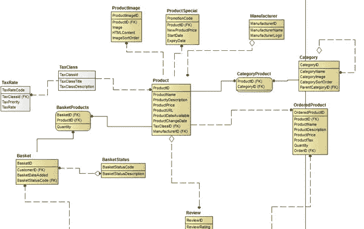
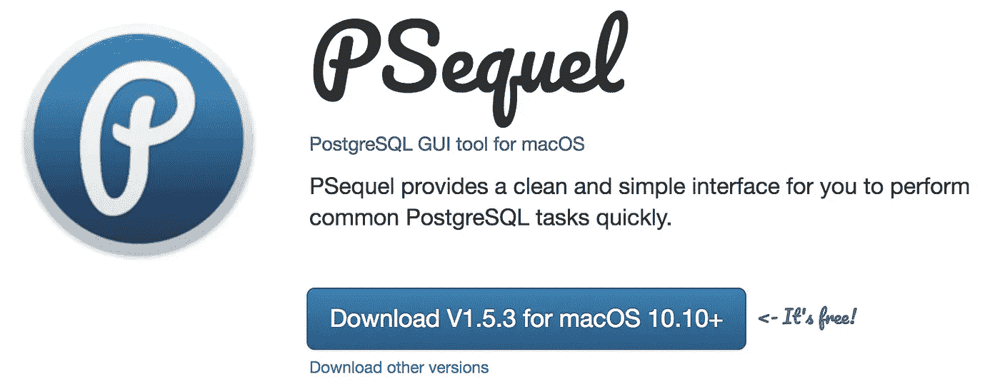
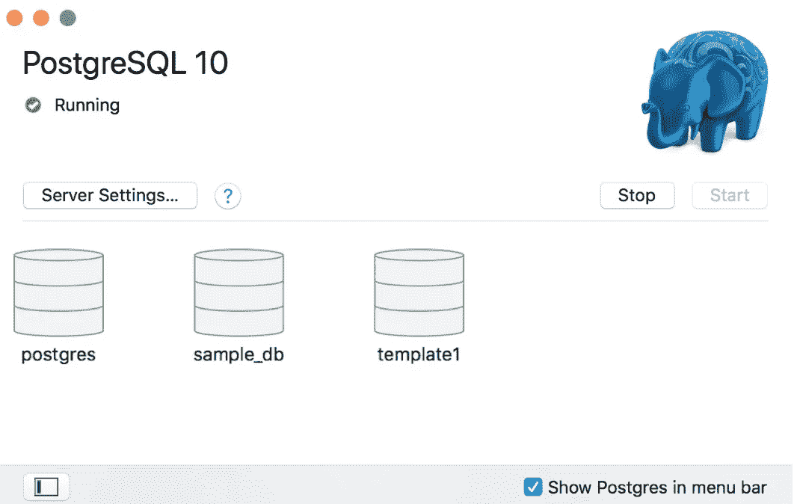
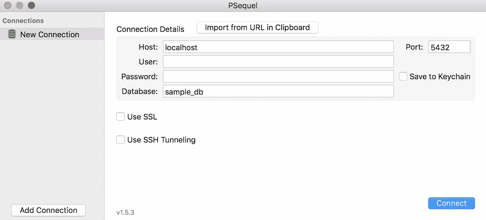
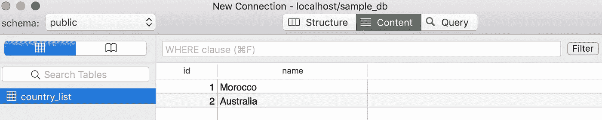

# 使用 PostgreSQL、PSequel 和 Python 设置数据库

> 原文：<https://towardsdatascience.com/leveraging-python-with-large-databases-pandas-postgresql-5073825167e0?source=collection_archive---------4----------------------->


(image source: [https://avataai.com/big-data-streaming-processing/](https://avataai.com/big-data-streaming-processing/))

随着对数据科学家[的需求持续增长](https://edgylabs.com/data-scientist-is-americas-best-career-for-the-third-year-running)，并被各种渠道(包括[《哈佛商业评论》](https://hbr.org/2012/10/data-scientist-the-sexiest-job-of-the-21st-century))称为“21 世纪最性感的工作”，有人问有抱负的数据科学家在走向他们的第一份数据分析师工作时应该掌握哪些技能。

现在有太多的在线课程来获得数据科学家擅长工作所需的技能(在线资源的优秀评论[在这里](https://medium.com/personal-growth/16-top-rated-data-science-courses-e5e161b937c3)和[在这里](https://medium.freecodecamp.org/a-path-for-you-to-learn-analytics-and-data-skills-bd48ccde7325))。然而，当我自己回顾各种课程时，我注意到许多焦点都放在令人兴奋和浮华的主题上，如机器学习和深度学习，而没有涵盖收集和存储此类分析所需的数据集所需的基础知识。

## (大)数据科学

在我们进入 PostgreSQL 之前，我猜想你们中的许多人都有同样的问题:我为什么要关心 SQL？

虽然数据库管理对于有抱负的数据科学家来说似乎是一个无聊的话题，但我知道实现一个狗品种分类器是非常有益的！—一旦你加入这个行业，这是一项必要的技能，数据也支持这一点:SQL 仍然是 LinkedIn 招聘信息中列出的最常见和最受欢迎的技能。


SQL is a necessary skills in many data science applications with large datasets (image source: c[http://exponential.io/blog/2015/02/26/big-data-sql/](http://exponential.io/blog/2015/02/26/big-data-sql/))

[Pandas](https://pandas.pydata.org/) 可以很好地执行最常见的 SQL 操作，但不适合大型数据库——它的主要限制是内存中可以容纳的数据量。因此，如果一个数据科学家正在处理大型数据库，那么在将数据加载到内存之前，SQL 被用来将数据转换成熊猫可以管理的东西。

此外，SQL 不仅仅是将平面文件放入表中的方法。SQL 的强大之处在于它允许用户拥有一组彼此“相关”的表，这通常用“实体关系图”或 ERD 来表示。

许多数据科学家同时使用这两者——他们使用 SQL 查询将数据连接、切片并加载到内存中；然后他们使用 [pandas](https://pandas.pydata.org/) 库函数在 Python 中进行大量的数据分析。



Example of an ERD (source: [http://www.datanamic.com/dezign/erdiagramtool.html](http://www.datanamic.com/dezign/erdiagramtool.html))

这在处理大数据应用中的大型数据集时尤为重要。这样的应用程序在有几十亿行的数据库中会有几十 TB。

数据科学家通常从 SQL 查询开始，在转移到 Python Pandas 进行数据分析之前，SQL 查询将提取 csv 文件所需的 1%的数据。

## **输入 PostgreSQL**

有一种方法可以在不离开深受喜爱的 Python 环境的情况下学习 SQL，在 Python 环境中教授和使用了如此多的机器学习和深度学习技术:PostgreSQL。

[PostgreSQL](https://www.postgresql.org/) 允许您在处理不是存储在平面文件而是存储在数据库中的大型数据集时，利用令人惊叹的 [Pandas 库](https://pandas.pydata.org/)进行数据辩论。

PostgreSQL 可以安装在 Windows、Mac 和 Linux 环境中(参见[安装细节这里](https://www.tutorialspoint.com/postgresql/postgresql_environment.htm))。如果你有 Mac，我强烈推荐安装 [Postgres。App](http://postgresapp.com/) SQL 环境。对于 Windows，请查看 [BigSQL](https://www.openscg.com/bigsql/postgresql/installers.jsp/) 。


PostgreSQL 使用客户机/服务器模型。这涉及两个运行过程:

*   **服务器进程**:管理数据库文件，接受客户端应用程序到数据库的连接，并代表客户端执行数据库操作。
*   **用户客户端 App** :经常涉及到 SQL 命令条目，友好的图形界面，以及一些数据库维护工具。

在实际场景中，客户端和服务器通常位于不同的主机上，它们通过 TCP/IP 网络连接进行通信。

## 正在安装 Postgres。App 和 PSequel

我会专注于 Postgres。在教程的其余部分中。
安装 [PostgresApp](https://postgresapp.com/) 后，您可以按照以下说明设置您的第一个数据库:

*   单击“初始化”创建新的服务器
*   一个可选的步骤是配置一个`$PATH` 来使用 Postgres.app 提供的命令行工具，方法是在终端中执行以下命令，然后关闭&重新打开窗口:
    `sudo mkdir -p /etc/paths.d &&
    echo /Applications/Postgres.app/Contents/Versions/latest/bin | sudo tee /etc/paths.d/postgresapp`

现在，您已经有了一个运行在 Mac 上的 PostgreSQL 服务器，默认设置为:
`Host: localhost, Port: 5432, Connection URL: posgresql://localhost`

我们将在本教程中使用的 PostgreSQL GUI 客户端是 [PSequel](http://www.psequel.com/) 。它有一个极简和易于使用的界面，我真的很喜欢轻松地执行 PostgreSQL 任务。



Graphical SQL Client of choice: [PSequel](http://www.psequel.com/)

## 创建您的第一个数据库

一旦 Postgres。App 和 PSequel 安装完毕，你现在可以设置你的第一个数据库了！首先，从打开 Postgres 开始。应用程序，你会看到一个小象图标出现在顶部菜单。



您还会注意到一个允许您“打开 psql”的按钮。这将打开一个 ommand 行，允许您输入命令。这主要用于创建数据库，我们将使用以下命令创建数据库:
`create database sample_db;`

然后，我们使用 PSequel 连接到刚刚创建的数据库。我们将打开 PSequel 并输入这个名字的数据库，在我们的例子中是:`sample_db`。单击“连接”连接到数据库。



## 创建并填充您的第一个表

让我们在 PSequel 中创建一个表(由行和列组成)。我们定义了表的名称，以及每一列的名称和类型。

PostgreSQL 中可用于列(即变量)的数据类型可在 PostgreSQL [数据类型文档](https://www.postgresql.org/docs/10/static/datatype.html)中找到。

在本教程中，我们将创建一个简单的世界国家表。第一列将为每个国家提供一个“id”整数，第二列将使用可变长度字符串(最多 255 个字符)提供国家名称。

准备就绪后，单击“运行查询”。然后将在数据库中创建该表。不要忘记单击“刷新”图标(右下角)来查看列出的表格。


我们现在准备用数据填充我们的列。有许多不同的方法来填充数据库中的表。要手动输入数据，`INSERT`会派上用场。例如，要输入 id 号为 1 的国家摩洛哥和 id 号为 2 的澳大利亚，SQL 命令是:

```
INSERT INTO country_list (id, name) VALUES (1, 'Morocco');
INSERT INTO country_list (id, name) VALUES (2, 'Australia');
```

运行查询并刷新表后，我们得到下表:



实际上，手动填充数据库中的表是不可行的。感兴趣的数据很可能存储在 CSV 文件中。要将一个 CSV 文件导入到`country_list_csv`表中，使用如下的`COPY`语句:

```
COPY country_list_csv(id,name)
FROM 'C:\{path}\{file_name}.csv' DELIMITER ',' CSV HEADER;
```

正如您在上面的命令中看到的，带有列名的表是在`COPY`命令之后指定的。列的排序方式必须与 CSV 文件中的相同。CSV 文件路径在`FROM`关键字后指定。还必须指定 CSV `DELIMITER`。

如果 CSV 文件包含带有列名的标题行，则用关键字`HEADER`表示，以便 PostgreSQL 在从 CSV 文件导入数据时忽略第一行。

## 常见 SQL 命令

SQL 的关键是理解语句。一些陈述包括:

1.  **CREATE TABLE** 是一条在数据库中创建新表的语句。
2.  **DROP TABLE** 是删除数据库中的一个表的语句。
3.  **选择**可以读取数据并显示。

**SELECT** 是您告诉查询您想要返回哪些列的地方。
**FROM** 是告诉查询从哪个表查询的地方。请注意，该表中需要存在列。例如，假设我们有一个包含几列的订单表，但是我们只对其中的三个子集感兴趣:

```
SELECT id, account_id, occurred_at
FROM orders
```

另外，当您只想查看表格的前几行时， **LIMIT** 语句非常有用。这比我们加载整个数据集要快得多。 **ORDER BY** 语句允许我们按任意行对表进行排序。我们可以将这两个命令一起用于数据库中的“订单”表，如下所示:

```
SELECT id, account_id, total_amt_usd
FROM orders
ORDER BY total_amt_usd DESC
LIMIT 5;
```

## 探索其他 SQL 命令

现在，您已经了解了如何在 PostgreSQL 中设置数据库、创建表和填充，您可以按照以下教程中的说明，探索其他常见的 SQL 命令:

*   [数据科学的 SQL 基础知识](/how-to-ace-data-science-interviews-sql-b71de212e433)
*   [可汗学院:SQL 简介](https://www.khanacademy.org/computing/computer-programming/sql/sql-basics/p/creating-a-table-and-inserting-data)
*   [简而言之 SQL](/sql-in-a-nutshell-part-1-basic-real-world-scenarios-33a25ba8d220)
*   [备忘单 SQL 命令](https://www.codecademy.com/articles/sql-commands)

## 用 Python 访问 PostgreSQL 数据库

一旦设置好 PostgreSQL 数据库和表，就可以转移到 Python 来执行任何所需的数据分析或争论。

PostgreSQL 可以使用 [psycopg2 模块](http://initd.org/psycopg/docs/)与 Python 集成。它是一个流行的 Python PostgreSQL 数据库适配器。在 Python 2.5 . x 版及更高版本中，它与默认库一起提供

可以通过以下方式连接到现有的 PostgreSQL 数据库:

```
import psycopg2
conn = psycopg2.connect(database="sample_db", user = "postgres", password = "pass123", host = "127.0.0.1", port = "5432")
```

回到我们的 country_list 表示例，在 sample_db 中向表中插入记录可以在 Python 中用以下命令完成:

```
cur = conn.cursor()
cur.execute("INSERT INTO country_list (id, name) \
      VALUES (1, 'Morocco')");
cur.execute("INSERT INTO country_list (id, name) \
      VALUES (2, 'Australia')");
conn.commit()
conn.close()
```

用于创建、填充和查询表的其他命令可以在[教程点](https://www.tutorialspoint.com/postgresql/postgresql_python.htm)和 [PostgreSQL 教程](http://www.postgresqltutorial.com/postgresql-python/)的各种教程中找到。

## 结论

现在，您已经有了一个可以运行的 PostgreSQL 数据库服务器，可以进行填充和使用了。它功能强大、灵活、免费，被许多应用程序使用。