# 理解决策树的直观指南

> 原文：<https://towardsdatascience.com/light-on-math-machine-learning-intuitive-guide-to-understanding-decision-trees-adb2165ccab7?source=collection_archive---------3----------------------->

## [点亮数学机器学习](https://towardsdatascience.com/tagged/light-on-math)

Courtesy of Pixabay.com

# 介绍

本文旨在介绍决策树；广受好评的车型，如 [xgboost](https://xgboost.readthedocs.io/en/latest/) 的流行构建模块。决策树就是一组层叠的问题。当您获得一个数据点(即一组特征和值)时，您使用每个属性(即数据点的给定特征的值)来回答一个问题。每个问题的答案决定了下一个问题。在这一系列问题的最后，您将获得数据点属于每个类别的概率。

**注**:这篇文章在中等付费墙后面。不过代码是开源的，可以通过这个 [**链接**](https://github.com/thushv89/exercises_thushv_dot_com/tree/master/decision_trees_light_on_math_ml) 访问。

**注 2** :这是关于数学机器学习 A-Z 的 ***光系列的第五篇博文。你可以在下面的信中找到以前的博客文章。***

**A B**[**C**](http://www.thushv.com/computer_vision/light-on-math-machine-learning-intuitive-guide-to-convolution-neural-networks/)**D E F**[**G**](/light-on-math-ml-intuitive-guide-to-understanding-glove-embeddings-b13b4f19c010)*** H I J**[**K**](http://www.thushv.com/machine-learning/light-on-math-machine-learning-intuitive-guide-to-understanding-kl-divergence/)**[**L**](/light-on-math-machine-learning-intuitive-guide-to-latent-dirichlet-allocation-437c81220158)*** M**[**N**](/light-on-math-machine-learning-intuitive-guide-to-neural-style-transfer-ef88e46697ee)**O P Q R S T U V****

***表示中等付费墙后面的文章**

# **为什么是这篇文章？**

**让我们后退一步！既然有这么多文章解释决策树，你为什么要读这篇文章呢？需要强调的一点是，与我在互联网上找到的文章不同，这篇文章不会停留在高层次的解释上，让读者无所适从。相比之下，我会试着，**

*   **提供模型功能的良好直觉，**
*   **公正地对待这个模型的核心，**
*   **解释过度拟合是如何发生的以及如何预防**
*   **用例子来加强整个解释。**

**我还想提一个重要的警告！吸收本质的目的不是能够从头实现一个决策树(至少不是我所期望的)，而是，**

> **当您在实践中使用各种参数(大部分参数)时，很好地理解它们的含义**

**然而，我提供的代码是一个从零开始构建的决策树，旨在作为一个向导，让您看到整个过程。除了实际看到具体细节，还有什么更好的方法来获得更好的理解呢？**

# **为什么选择决策树？**

**决策树之所以伟大，有几个原因。但是与任何模型一样，当您在合适的环境中使用模型时，真正的力量才会出现。记住，**

> **垃圾进，垃圾出！**

**决策树之所以伟大，是因为**

*   **它们很容易解释，并且遵循与人类思维相似的模式。换句话说，您可以将决策树解释为一组问题/业务规则。**
*   **预测是**快**。这是一组比较操作，直到到达一个叶节点**
*   **可适用于处理**缺失数据**而无需输入数据**

# **决策树入门:**

**正如我前面说过的，决策树基本上是一组级联问题(形成一棵树的形状)。这些问题测试数据的特征是否满足特定条件(例如，Outlook == Sunny？).让我们稍微充实一下。为此，让我们假设一个典型的天气数据集(我个人不喜欢这个天气数据集——太主流了，所以我稍后会切换到更令人兴奋的东西)。**

**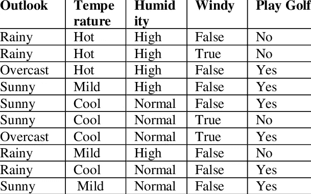**

**假设我们有上述数据集，并希望预测在给定天气的情况下我们是否会打高尔夫球。此问题的决策树可能如下所示。**

**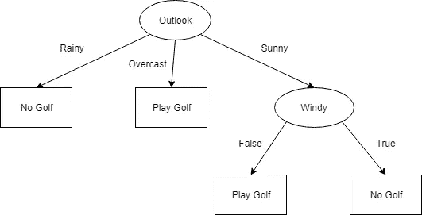**

**An example decision tree. Round nodes denote decision nodes, where square nodes denote leaf nodes**

## **决策树的组成部分**

**让我给你上一堂简单的决策树剖析课。该树有决策节点(圆形)、决策(边)和叶/预测节点(方形)。您首先从一个决策节点(例如 Outlook)开始，根据答案，您可能会有一个叶节点或另一个决策节点(例如 Windy)。决策树可以对任意数量的决策节点继续下去。但是，每个分支都应该以一个叶节点结束。**

## **用决策树进行预测**

**现在假设你有一个新的数据点，你想预测它的标签。**

> **前景=晴朗，温度=炎热，湿度=正常，有风=真实**

**为了进行预测，您从树的顶部开始，使用属性(即特征值)沿树越来越深地遍历以做出决策，直到到达叶节点。这个过程描述如下。**

**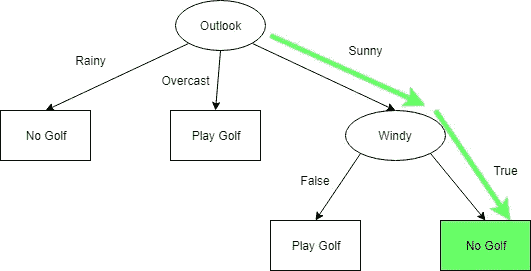**

**我猜你不是在打高尔夫。**

## **建造一棵树**

**当然，还有一个更重要的问题没有解决。**

> **我们怎样才能找到这棵树？**

**更重要的是，**

> **我们如何在给定的深度决定最佳的特征分区数据？**

**有几种不同算法用于生成树，**

*   **[**CART**](https://en.wikipedia.org/wiki/Decision_tree_learning) (分类和回归树)——使用[基尼系数](https://en.wikipedia.org/wiki/Gini_coefficient)来决定划分特征**
*   **[**ID3**](https://en.wikipedia.org/wiki/Decision_tree_learning) (使用信息增益-稍后讨论，以决定分区特征，并且**不被设计成处理连续特征**)**
*   **[**C4.5**](https://en.wikipedia.org/wiki/Decision_tree_learning) (工作原理类似 ID3，利用信息增益拆分数据。然而，C4.5 **可以处理连续特征**，并且**可以处理缺失数据****

**现在让我们来解决一个更令人兴奋的虚构问题。我们想找到一个邪恶的国王，他正在威胁着树木之地的街道。**

# **在街上找到伪装的国王**

> **(数据和特征)**

**从这一节开始，我将用一个故事来解释决策树，这个故事讲的是一个喜欢在街上伪装自己来愚弄当地人的树之王。这很烦人，因为每当有人无意中对国王不好，他就会受到惩罚。人们很烦恼，一个聪明人(让我们称他为约翰)站出来说他能在 10 天内解决这个问题！**

**约翰具有国王的几个特征，在公众面前表现出与众不同的形象。其特点是，**

*   **从城堡里出来**
*   **慢慢走**
*   **每天吃 5 次或更多**
*   **有一颗金牙**

**约翰开始观察人们，并创建一个数据集(每人一个数据点)以及目标变量(即，这个人实际上是不是国王)。他有以下的观察。不幸的是，这个数据集是以五个人的痛苦为代价的。**

**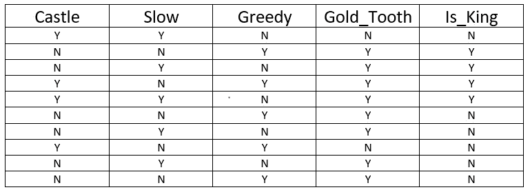**

**利用这个数据集，John 做了以下工作。他根据目标变量写下每个特征，并根据以下逻辑突出显示每个条目:**

*   **绿色-如果属性与相应的标签匹配**
*   **红色-如果属性与相应的标签不匹配**

**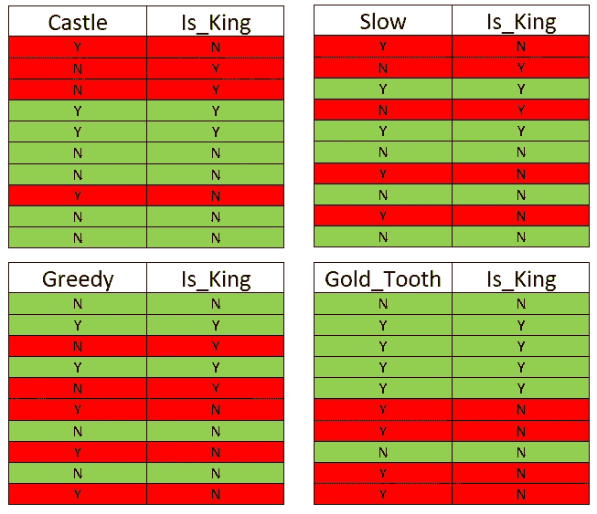**

**John’s whiteboard**

**现在，看上面的表，我们可以了解哪些特征对正确预测国王贡献最大。例如，下图总结了上表中的观察结果。**

**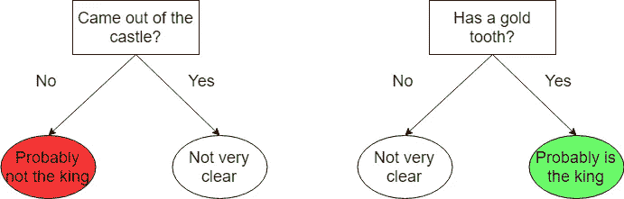**

**Summary of the observations from the highlighted tables**

**直觉还不足以让你解决问题。您需要可量化的指标来表明这些特性是强大的。事实上，TreeLand 一半的公民都是机器学习工程师！这就是信息增益的来源。**

# **信息增益:通过拆分数据获得了多少信息？**

**我们已经讨论过，树背后的基本思想是提出一个问题(即针对一个属性测试数据)，并根据答案(例如对或错)分割数据。信息增益通过根据决策节点提供的答案分割数据来衡量数据变得可预测的程度(或获得了多少信息)。戴上你的科学护目镜，是时候正式化了。对数据 Y 使用特征 F 获得的信息由下式定义:**

**IG(Y，F) = H(Y)-H(Y|F)**

**其中 ***Y*** 为目标变量， ***F*** 为某特征(如金牙)。因此，功能越强大，通过分割该功能上的数据获得的信息就越多。H(Y)是 Y 的熵，H(Y|F)是以 F 为条件的 Y 的条件熵(稍后讨论)。在代码中，计算信息增益如下所示。**

**现在让我们看看什么是熵和条件熵。**

# **熵和条件熵**

**熵衡量转换数据需要多少位。因此，数据越可预测，所需的位数就越少。相反，你的数据越不可预测，你需要的比特就越多。这是这样写下来的:**

**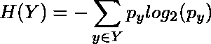**

**其中(Y 中的 Y)表示 Y 中的唯一结果(例如，在我们的示例中，King = True 或 False)。您可以很容易地用 Python 实现这一点。**

## **通俗地说就是熵**

**让我们更直观地理解熵。比方说国王一开始就决定绝不愚弄当地人，约翰决定收集数据来解决这个问题。他的熵应该为零。为什么？因为标签是 100%可预测的(即它总是 0)。但是，在我们的数据中，熵是最高的(即 1)，因为一个人成为国王或不是国王的机会是相等的。**

**想象两个人(约翰和丽莎)通过电话交谈。每次 John 呼叫 Lisa 时，Lisa 必须在没有任何附加信息的情况下，针对每个数据点(即 10 次)说出它是否是国王。下面我描述了不同熵值下的对话。**

**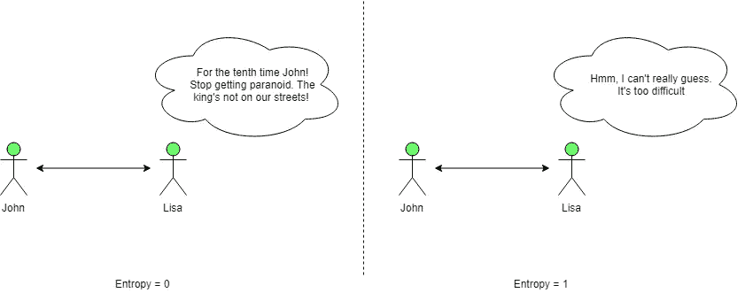**

**Difference of different entropy values**

## **通俗地说就是条件熵**

**这很好地为解释什么是条件熵(即 H(Y|F ))奠定了基础。现在想象一下，对于每个数据点，约翰告诉这个人是否有一颗金牙。然后，根据特征值(即 F)，Lisa 必须预测这是否是王。如果您查看下表，数据现在比没有任何特征更可预测。**

**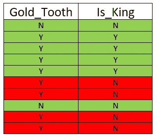**

**From Jonh’s whiteboard**

**总之，信息增益的作用是，**

> **它测量在提供关于特征 **F** 的信息之前和之后的可预测性的差异。**

**再次提醒我们，这是信息增益的公式。**

**IG(Y，F) = H(Y)-H(Y|F)**

# **与此同时，在树木之乡…**

> **(构建树)**

**约翰计算了 ***城堡*** 和 ***金牙*** 的信息增益，发现它们比****贪婪*** 好得多。然后约翰首先挑选了特征“ ***城堡*** ”。***

***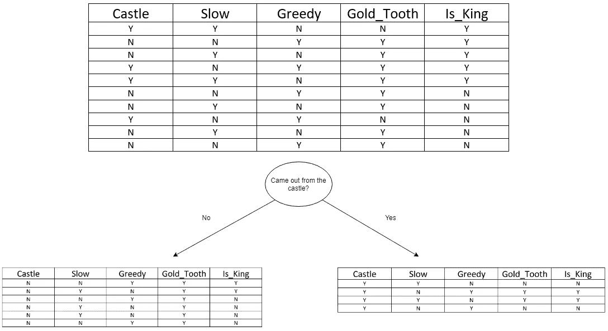***

***Tree with the feature “Castle”***

***他对左边很满意。他认为，“4/6 分类还不错”。鉴于他只有 10 个数据点，我们会放他一马。但是右侧的结果很差(即 50%正确或 50%错误)。他需要改进结果，所以他继续尝试使用给出最高信息增益的特征来分割左边的余数，结果是" ***金牙*** "特征，并获得以下结果。***

***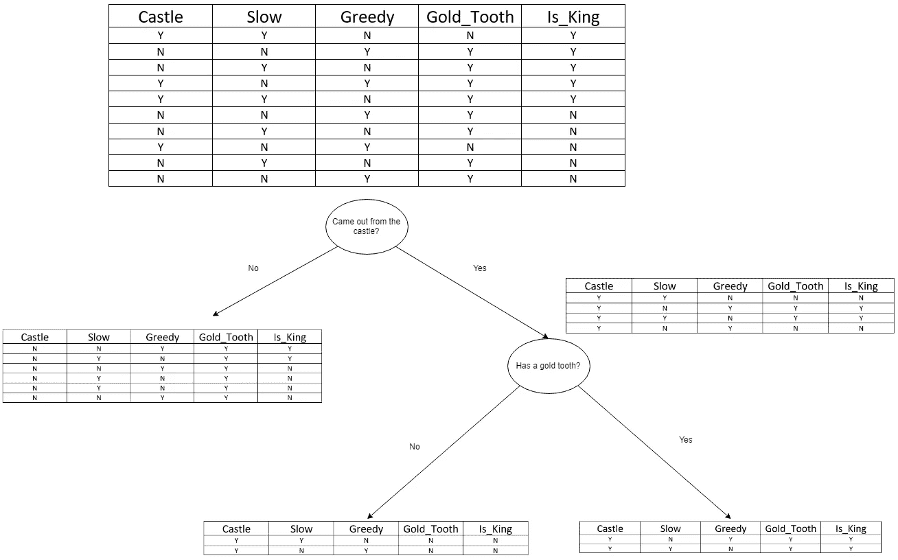***

***Tree with both “Castle” and “Gold Tooth” features***

***所以你走吧！约翰找到了秘制调味汁！这实际上就是 ***ID3 算法*** 的工作原理。更正式地说，你会有下面的伪代码。***

***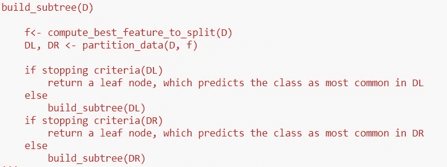***

***Peseudocode***

***这段代码中最重要的函数是 ***build_tree*** ，实际上应该是这样的(可以在[代码](https://github.com/thushv89/exercises_thushv_dot_com/blob/master/decision_trees_light_on_math_ml/decision_trees.ipynb)中找到)。***

# ***Treeland 的市民又可以放松了…***

***所以在约翰展示了他的成果后，人们被深深打动了。但是约翰知道更多的数据不仅会改进他的模型，还会验证他的发现。所以他让别人帮他收集更多的数据。但他不知道，他这样做会遇到问题。***

# ***这棵树长得太多了…***

> ***(过度拟合和正则化)***

***因此，约翰设法让几个人支持他的想法，扩大数据集并改进模型。他们设法让数据集达到 50 个数据点。因此，在收集数据后，梦想着一个更好更健壮的模型，约翰创造了一个新的树。这是他得到的树。***

***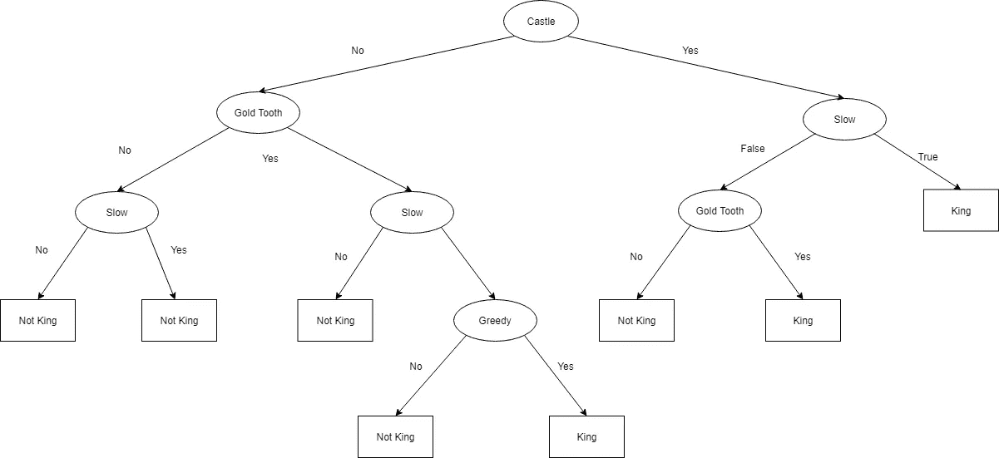***

***New decision tree***

***这棵树立刻在约翰的脑海中升起了危险信号。树太复杂了，无法解决这个问题。在一个简单的树形结构中，只需要两到三个特性就足够了。这里发生了什么？这叫 ***过拟合*** ！John 没有使用任何规则来控制树的复杂性，导致产生了一个非一般化和不可解释的树模型，这违背了目的。***

# ***让我们回头纠正约翰的错误***

***有几种方法可以防止树模型中的过度拟合。在这一节中，我将讨论三种方法。它们是:***

*   ***确保每个叶节点至少有 ***n*** 个数据点***
*   ***确保树的深度不超过 ***d******
*   ***确保信息增益大于阈值以进行分割***

***确保每个叶节点在一个叶节点中至少有 ***n*** 个数据点是很重要的。因为，通过将单个数据点分配给树中的每个叶节点，您可以为任何训练集构建世界上最完美的树(严重过度拟合)。因此，确保至少有 ***n*** 个数据点(例如 5%的数据)会导致更一般化的树模型。***

***确保树不会呈指数增长，将再次保护我们避免过度拟合。在这种方法中，我们基本上是限制我们可以问的问题的数量来预测模型的类别，这导致选择最好的几个问题来问，而不是问世界上所有可能的问题。***

***最后一点，确保信息增益高于阈值应该是有意义的。因为，如果我们不能从中获益，种这棵树又有什么意义呢？***

***因此，在修改这些技术并将其应用于模型后，John 提出了以下模型，该模型更具解释力。***

***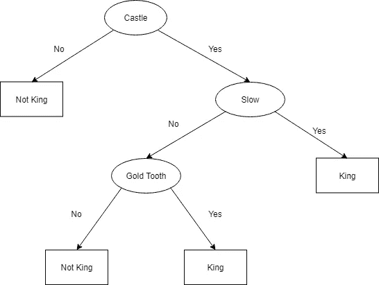***

***Regularised tree***

***我不打算重复用树来预测，因为这个过程非常简单。这可以使用如下递归函数在 Python 中实现。***

***我们以此结束了在树岛的冒险。总之，John 收集了数据，建立了一个初始模型，使用信息增益来决定有价值的特征。遇到了过度拟合的问题，并使用正则化解决了它。好消息是，他们已经学会使用 John 开发的模型来避免 king 处理错误的方式。所以他们从此幸福地生活在一起！***

# ***使用连续值***

***到目前为止，我们仅限于观察离散变量。但是你只能用离散变量做很多事情。有趣的问题通常混合了连续变量和离散变量。那么怎样才能在决策树中使用连续变量呢？有两种流行的方式。***

*   ***通过宁滨将连续要素的范围离散化为相等的条柱***
*   ***使用 ***最小熵分割***【2】在连续特征中寻找分裂***

## ***最小熵分割***

***最小熵分割(MEP)的工作方式如下。***

*   ***首先，根据数据分布的范围指定一组切割点(例如，在 T 个位置平均分布切割范围)***
*   ***然后，对于每个切割点，计算标签 Y 的熵的加权和***
*   ***选择给出最小熵的切割点***

# ***包裹***

***在本文中，我们详细讨论了决策树。决策树是一种流行的机器学习模型，因为它们更容易解释(例如，与神经网络相比)，并且通常提供良好的性能，尤其是在与集成(打包和提升)一起使用时。***

***我们首先以玩具天气数据集为例，简要讨论了决策树的功能。然后，我们跳到了一个更生动的问题，那就是确定令人讨厌的树地之王是否正在恐吓街道。我们看到了约翰如何使用信息增益来识别有助于识别国王的特征，并随后使用这些特征构建了一个树。后来，我们看到随着数据集变大，诸如“过度拟合”等问题是如何出现的。我们还讨论了如何使用各种正则化方法(例如限制树的最大深度)来防止过拟合。最后，我们结束了在 TreeLand 的冒险，并做了一个快速的边游，看看如何在决策树中处理连续特征。***

***这篇文章的代码可以在 [**这里**](https://github.com/thushv89/exercises_thushv_dot_com/blob/master/decision_trees_light_on_math_ml/decision_trees.ipynb) 找到。***

# ***参考***

***[1][CMU 讲稿](http://www.stat.cmu.edu/~cshalizi/350-2006/lecture-10.pdf)***

***[2] [用于分类学习的连续值属性的多区间离散化](https://www.ijcai.org/Proceedings/93-2/Papers/022.pdf)***

***Video from Google Developers Youtube Channel***

***Video from Stanford***