# 理解 KL 分歧的直观指南

> 原文：<https://towardsdatascience.com/light-on-math-machine-learning-intuitive-guide-to-understanding-kl-divergence-2b382ca2b2a8?source=collection_archive---------0----------------------->

## [点亮数学机器学习](https://towardsdatascience.com/tagged/light-on-math)

我正在开始一系列新的博客文章，遵循初学者友好的方法来理解机器学习中一些具有挑战性的概念。首先，我们将从 KL 散度开始。

**代号:** [此处](https://github.com/thushv89/nlp_examples_thushv_dot_com/blob/master/kl_divergence.ipynb)

本系列的其他文章可以在下面找到。

**A B**[**C**](http://www.thushv.com/computer_vision/light-on-math-machine-learning-intuitive-guide-to-convolution-neural-networks/)**[**D**](/light-on-math-machine-learning-intuitive-guide-to-understanding-decision-trees-adb2165ccab7)*** E F**[**G**](/light-on-math-ml-intuitive-guide-to-understanding-glove-embeddings-b13b4f19c010)*** H I J K**[**L**](/light-on-math-machine-learning-intuitive-guide-to-latent-dirichlet-allocation-437c81220158)*** M**[**N**](/light-on-math-machine-learning-intuitive-guide-to-neural-style-transfer-ef88e46697ee)**O P Q R S T U V****

***表示中等付费墙后面的文章**

# **概念基础**

**首先，让我们建立一些基本规则。我们将定义一些我们需要知道的事情，比如我们的手背来理解 KL 散度。**

## **什么是发行版**

**所谓分布，我们指的是不同的东西，如数据分布或概率分布。这里我们感兴趣的是概率分布。想象你在一张纸上画两条轴(即 ***X*** 和 ***Y*** )，我喜欢把一个分布想象成两条轴之间掉下来的一根线；**X和**Y。 ***X*** 表示您有兴趣获取概率的不同值。 *Y* 代表在 ***X*** 轴上观察到某个值的概率(即 ***y=p(x)*** )。我在下面想象这一点。******

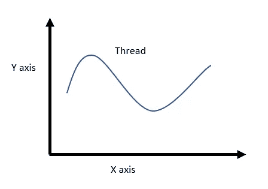

这是一个连续的概率分布。例如，将轴 ***X*** 想象为一个人的高度，将轴 ***Y*** 想象为找到具有该高度的人的概率。

如果你想使这种概率分布离散，你可以把这根线切成固定长度的段，然后把这些段以水平的方式转动。然后创建连接每条线的边缘和 x 轴的矩形。这是一个离散的概率分布。

## 什么是事件？

对于离散概率分布，一个事件就是你观察到 *X* 取某个值(例如 ***X=1*** )。我们姑且称 ***P(X=1)*** 事件发生的概率 ***X=1*** 。在连续空间中你可以把这想象成一个数值范围(例如***0.95<X<1.05***)。请注意，事件的定义不限于 x 轴上的值。然而，考虑到这一点，我们可以继续前进。

# 回到 KL 分歧

为了从这一点继续下去，我将谦虚地使用这篇[博文](https://www.countbayesie.com/blog/2017/5/9/kullback-leibler-divergence-explained)【1】中的例子。这是一篇解释 KL 分歧的很好的文章，但是我觉得解释中的一些错综复杂之处可以解释得更详细一些。好了，我们开始吧。

# 我们试图解决的问题

因此，在[1]中解决的问题的要点是，我们是一群访问广阔的外层空间的科学家，我们发现了一些太空蠕虫。这些太空蠕虫有不同数量的牙齿。现在我们需要将这些信息发送回地球。但是从太空向地球发送信息是昂贵的。所以我们需要用最少的信息量来表达这些信息。一个很好的方法是，我们不记录单个的数字，而是画一个图，其中 ***X*** 轴是已经观察到的不同齿数( *0，1，2，…，等等)。*)并使 ***Y*** 轴看到一个带 *x* 多齿的蜗杆的概率(即带 ***x* *齿的蜗杆数/蜗杆总数*** )。我们已经把我们的观察转换成一个分布。

这种分发比发送单个蠕虫的信息更有效。但是我们可以做得更好。我们可以用一个已知的分布(如均匀分布、二项式分布、正态分布等)来表示这个分布。).例如，如果我们用均匀分布来表示真实分布，我们只需要发送两条信息就可以恢复真实数据；蠕虫的均匀概率和数量。但是我们如何知道哪种分布更好地解释了真实的分布呢？这就是 KL 分歧的来源。

> 直觉:KL 散度是衡量两个分布(例如线程)之间匹配的一种方式

因此，我们可以使用 KL 散度来确保我们将真实分布与一些解释简单且众所周知的分布很好地匹配。

# 让我们改变例子中的一些东西

为了能够检查数值的正确性，让我们将概率值改为更人性化的值(与[1]中使用的值相比)。我们将做如下假设。假设我们有 100 条虫子。我们有以下数量的蠕虫。

*   0 齿:2(概率: *p0=0.02*
*   1 齿:3(概率: *p1=0.03*
*   2 齿:5(概率: *p2=0.05*
*   3 齿:14(概率: *p3=0.14*
*   4 齿:16(概率: *p4=0.16*
*   5 齿:15(概率: *p5=0.15* )
*   6 齿:12(概率: *p6=0.12* )
*   7 齿:8(概率: *p7=0.08* )
*   8 齿:10(概率: *p8=0.1* )
*   9 齿:8(概率: *p9=0.08* )
*   10 齿:7(概率: *p10=0.07* )

快速理智检查！让我们确保值加起来是 100，概率加起来是 1.0。

*总蠕虫数= 2+3+5+14+16+15+12+8+10+8+7 = 100*
*总概率= 0.02+0.03+0.05+0.14+0.16+0.15+…。0.12+0.08+0.1+0.08+0.07 = 1.0*

这是它的视觉效果。

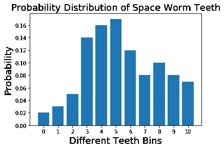

# 第一次尝试:用均匀分布建模

现在，让我们先试着用均匀分布来模拟这个分布。均匀分布只有一个参数；一致概率；给定事件发生的概率。

*p _ uniform = 1/总事件数=1/11 = 0.0909*

这就是均匀分布和真正的并排分布的样子。

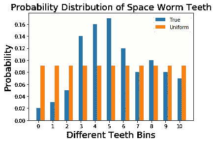

让我们把这个结果放在一边，我们将用另一种类型的分布来模拟真实的分布。

# 第二次尝试:用二项式分布建模

通过计算一枚硬币正面落地的概率，你可能对二项式概率很熟悉。我们可以把同样的概念推广到我们的问题上。对于一枚硬币，你有两种可能的输出，假设硬币正面落地的概率是 ***p*** ，你运行这个实验进行 ***n*** 次试验，获得 ***k*** 成功的概率由下式给出:

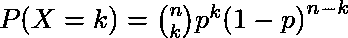

## 打破平衡

让我们顺便了解一下二项分布中的每一项，看看它们是否有意义。第一任是 ***p^k*** 。我们要获得 ***k*** 的成功，其中单次成功的概率是 ***p*** 。那么获得 ***k*** 成功的概率就是*。请记住，我们正在为 ***n*** 试验运行实验。因此，会有 ***n-k*** 次失败的试验，失败概率为***【1-p】***。所以获得 ***k*** 成功的概率是***p^k(1-p)^{n-k}***的联合概率。我们的工作不会就此结束。 ***k*** 试验可以在 *n* 试验中进行不同的排列。要在*空间内排列的不同排列 *k* 元素的数量由下式给出:**

**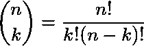**

**将所有这些相乘，我们得到了成功的二项式概率。**

## **二项分布的均值和方差**

**我们还可以定义二项分布的均值和方差。这些是由，**

***均值= np
方差= np(1-p)***

**意思反映了什么？Mean 是您运行 *n* 次试验后获得的预期(平均)成功次数。如果每次试验的成功概率为 *p* ，那么可以说如果你进行 ***n*** 次试验，你将获得 ***np*** 次成功。接下来方差代表什么？它表示成功试验的真实次数偏离平均值的程度。为了理解方差，让我们假设 ***n=1*** 。那么方程就是， ***方差=p(1-p)*** 。当 ***p=0.5*** (获得正面和反面的可能性相等)时，方差最高；当 ***p=1*** 或 ***p=0*** (肯定获得正面/反面)时，方差最低。**

## **回到建模**

**现在有了对二项分布的坚实理解，让我们回到我们手头的问题。让我们先计算一下蠕虫的预期齿数。那会是，**

**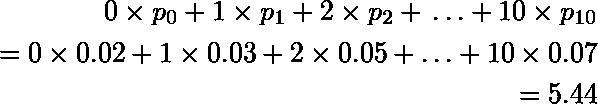**

**已知均值，我们可以计算出 ***p*** 其中，
*均值= NP
5.44 = 10p
p = 0.544***

**注意比 ***n*** 是从蠕虫种群中观察到的最大齿数。你可能会问为什么我们没有选择 ***n*** 作为蠕虫总数(即 ***100*** )或者事件总数(即 ***11*** )。我们很快就会看到原因。有了这个，我们可以定义任意数量的牙齿的概率如下。**

> **鉴于牙齿可以取值到 10，那么看到 k 颗牙齿的概率是多少(其中看到一颗牙齿就是试验成功)。**

**从抛硬币的角度来看，这就像在问，**

> **假设我有 10 次翻转，观察到 k 头的概率是多少。**

**形式上，我们计算所有不同的 ***k*** 值的概率*。这里 ***k*** 成为我们要观察的齿数。而***【pk^{bi}】***则是第 k 个*齿仓的二项概率(即 0 齿、1 齿等)。).所以当我们如下计算它们时，****

****p0^{bi} = (10！/(0!10!))0.544⁰(1–0.544)^{10} = 0.0004
p1^{bi} =(10！/(1!9!))0.544(1–0.544)⁹= 0.0046
p2^{bi} =(10！/(2!8!))0.544(1–0.544)⁸= 0.0249****

***……
p9^{bi} =(10！/(9!1!))0.544⁹(1–0.544)= 0.0190
p10^{bi} =(10！/(10!0!))0.544^{10}(1–0.544)⁰= 0.0023***

**这是真实分布和二项分布的比较。**

**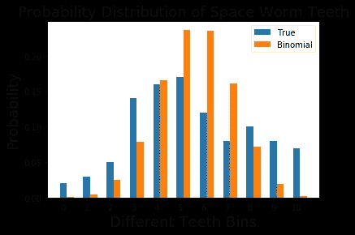**

# **让我们总结一下我们所拥有的**

**好吧，回头想想我们到目前为止做了什么。首先我们理解了我们想要解决的问题。问题是用最少的努力把某种太空蠕虫牙齿的统计数据发送到整个空间。为此，我们考虑用一些已知的分布来表示蠕虫的真实统计数据，因此我们可以只发送该分布的参数，而不是真实统计数据。我们研究了两种类型的分布，得出了以下统计数据。

*均匀分布—概率为 ***0.0909***
*二项分布—其中 ***n=10*** ， ***p=0.544*** 和 ***k*** 取 0 到 10 之间的不同值**

**现在让我们在一个地方可视化一切**

**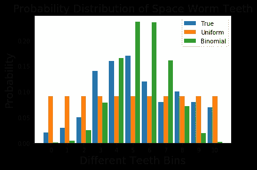**

# **我们如何定量地决定哪些是最好的？**

**有了这些复杂的计算，我们需要一种方法来衡量每个近似分布与真实分布之间的匹配程度。这一点很重要，这样，当我们传递信息时，我们可以安心，不用担心“我的选择正确吗？”在我们的余生中。**

**这就是 KL 背离的由来。KL 散度的正式定义如下。**

**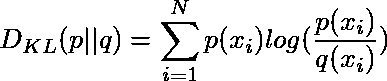**

**这里的*是近似值，而 ***p(x)*** 是真实分布，我们感兴趣的是匹配***【q(x)***来。直观地，这测量了给定的任意分布与真实分布的偏差。如果两个分布完全匹配，***[D _ { KL }(p | | q)= 0***否则可以取 ***0*** 和 ***∞*** 之间的值。KL 散度值越低，我们将真实分布与我们的近似值匹配得越好。***

# **KL 背离的直观分解**

**让我们一块一块来看 KL 发散。先取***log(p(x _ I)/q(x _ I))***分量。如果 ***q(x_i)*** 高于 ***p(x_i)*** 会怎么样？那么这个组件将产生一个负值(因为小于 1 的 log 值是负值)。另一方面，如果 ***q(x_i)*** 总是小于 ***p(x_i)*** 这个分量将产生正值。只有当***p(x _ I)= q(x _ I)***时，该值才会为零。然后为了使这成为一个[期望值](https://en.wikipedia.org/wiki/Expected_value)，你用 ***p(x_i)*** 对 log 分量进行加权。这意味着， ***p(x_i)*** 概率较高的匹配区域比 ***p(x_i)*** 概率较低的匹配区域更重要。**

**直觉上，优先正确匹配近似值中的真正高概率事件是有意义的。从数学上讲，这允许您自动忽略位于真实分布支持面(支持面是分布使用的 x 轴上的全长)之外的分布区域。此外，这避免了计算 log(0) 如果您试图计算超出真实分布支持范围的任何区域的 log 分量，将会出现这种情况。**

# **计算 KL 散度**

**现在让我们计算我们得到的每个近似分布的 KL 散度。首先让我们来看看均匀分布。**

**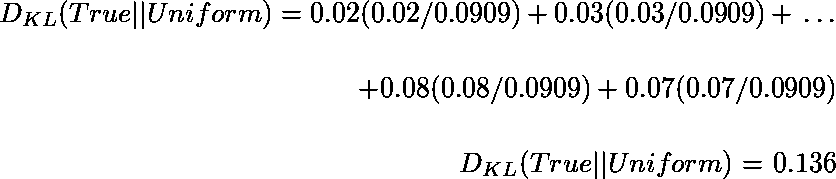**

**现在对于我们得到的二项分布，**

**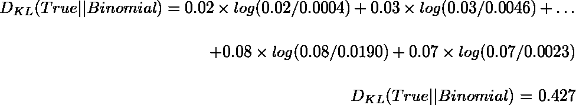**

# **关于二项式均值的 KL 散度**

**现在让我们来玩一下 KL 散度。首先，我们将看到当二项分布的成功概率改变时，KL 散度是如何变化的。不幸的是，我们不能对均匀分布做同样的事情，因为我们不能改变概率，因为 ***n*** 是固定的。**

**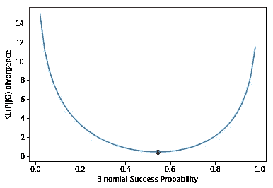**

**你可以看到，随着我们远离我们的选择(红点)，KL 散度迅速增加。事实上，如果你打印一些与我们的选择相差很小的 KL 散度值**δ**，你会看到我们选择的成功概率给出了最小的 KL 散度。**

**现在我们对 KL 散度的讨论到此结束。**

# **结论**

**现在我们有了一些可靠的结果，虽然均匀分布看起来很简单，没有什么信息，而二项式分布更微妙，但均匀分布比二项式分布更符合真实分布。说实话，这个结果其实让我很意外。因为我期望二项式能更好地模拟真实分布。因此，这给了我们一个重要的教训，那就是为什么我们不应该只相信我们的直觉！**

**代码:[此处](https://github.com/thushv89/exercises_thushv_dot_com/blob/master/kl_divergence.ipynb)**

# **KL divergence 的乐趣**

**你可以通过玩 KL 散度来获得更多的乐趣，从而更好地理解 KL 散度。你可以在[我的博客](http://www.thushv.com/machine-learning/light-on-math-machine-learning-intuitive-guide-to-understanding-kl-divergence/)中了解更多。**

# **参考**

**[1][https://www . countbayesie . com/blog/2017/5/9/kull back-lei bler-divergence-explained](https://www.countbayesie.com/blog/2017/5/9/kullback-leibler-divergence-explained)**

**注意:请去我的[网站](http://www.thushv.com)看看，因为我也在那里贴了更多机器学习的东西。**

****小提示**:我很高兴地宣布，我的关于使用 TensorFlow 进行自然语言处理的书已经出版了，供大家购买！这本书非常适合寻求基于现代深度学习的解决方案的实用视角的初级/中级读者。这本书附有指导读者实现各种 NLP 应用的练习。你可以在 [Packt](https://www.packtpub.com/application-development/natural-language-processing-tensorflow) 网站或者[亚马逊](https://www.amazon.com/Natural-Language-Processing-TensorFlow-Ganegedara-ebook/dp/B077Q3VZFR)找到。**

****