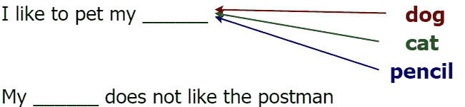
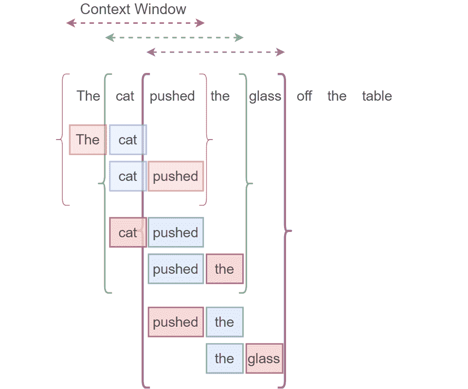
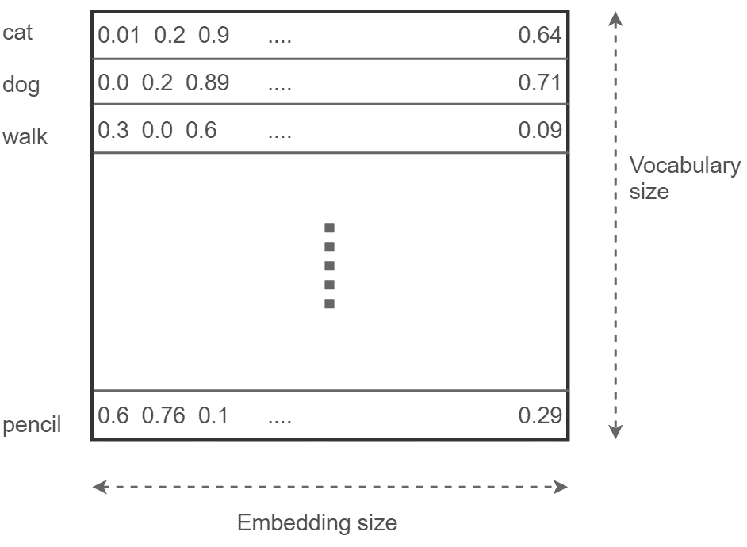
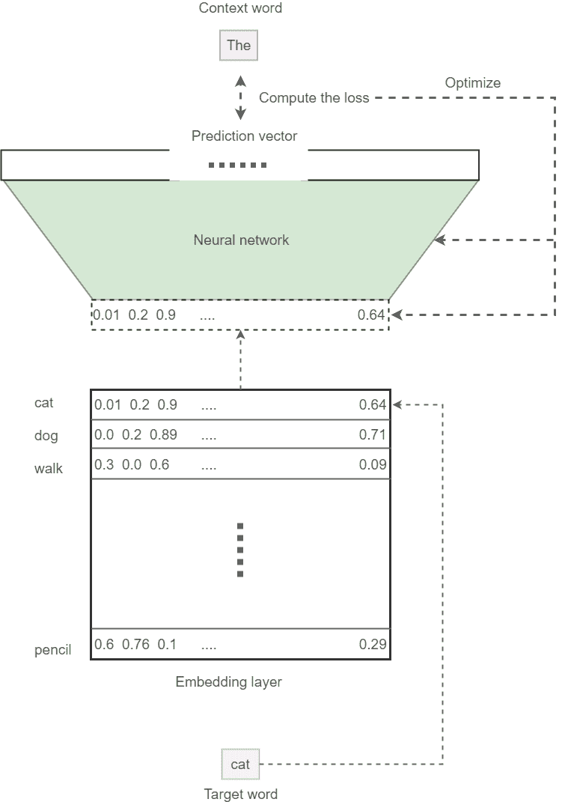
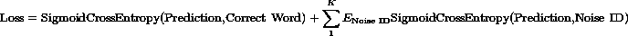
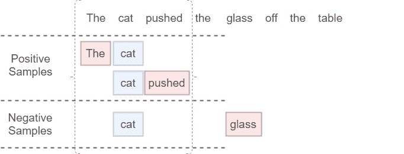
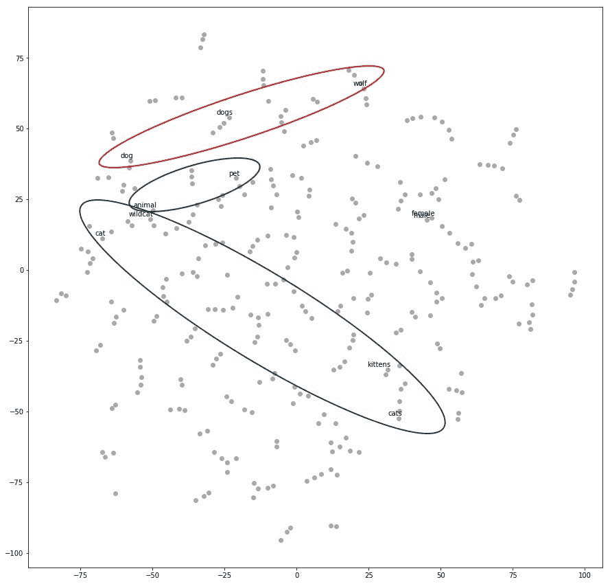
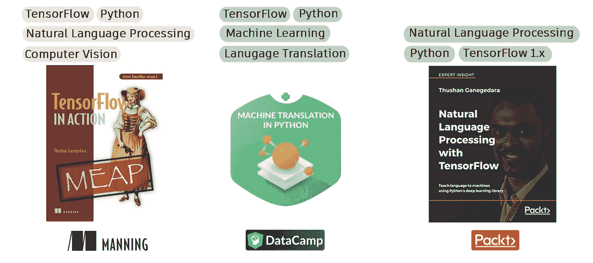

# 理解 Word2vec 的直观指南

> 原文：<https://towardsdatascience.com/light-on-math-machine-learning-intuitive-guide-to-understanding-word2vec-e0128a460f0f?source=collection_archive---------5----------------------->

## [点亮数学机器学习](https://towardsdatascience.com/tagged/light-on-math)


数学机器学习系列 ***之光 A-Z*** 的第三篇博文来了。这篇文章是关于 Word2vec 算法的。Word2vec 算法输出单词向量。单词向量是许多自然语言处理(NLP)系统的基础，这些系统已经风靡全球(亚马逊 Alexa、谷歌翻译等)。).我们将在接下来的章节中讨论细节。但是首先让我拼出我的其他博客文章的链接的字母表。

**A B**[**C**](http://www.thushv.com/computer_vision/light-on-math-machine-learning-intuitive-guide-to-convolution-neural-networks/)**[**D**](/light-on-math-machine-learning-intuitive-guide-to-understanding-decision-trees-adb2165ccab7)*** E F**[**G**](/light-on-math-ml-intuitive-guide-to-understanding-glove-embeddings-b13b4f19c010)*** H I J**[**K**](http://www.thushv.com/machine-learning/light-on-math-machine-learning-intuitive-guide-to-understanding-kl-divergence/)****L***** M**[**N**](/light-on-math-machine-learning-intuitive-guide-to-neural-style-transfer-ef88e46697ee)****

*****表示中等付费墙后面的文章****

# ****词向量，有什么大的想法？这都是关于环境的****

****没有进一步的理由，让我们坚持到底。单词向量是单词的数字表示，保留单词之间的语义关系。例如单词 ***猫*** 的向量，就会和单词 ***狗*** 的向量非常相似。然而， ***铅笔*** 的矢量将与 ***猫*** 的单词矢量大相径庭。而这种相似性是由两个被讨论的词(即[ ***猫、*** 狗]或[ ***猫、*** )在同一语境中使用的频率来定义的。例如，考虑下面的句子，****

********

****以上句子中的奇数我觉得没必要拼出来，明显是带 ***铅笔*** 的，作为漏字。为什么你觉得这是个奇怪的句子？拼写没问题，语法没错，那为什么？就是因为 ***上下文*** ，铅笔 ***一词*** 使用不正确。这应该让你相信一个词的上下文对这个词本身的影响。单词向量算法使用单词的上下文来学习单词的数字表示，使得在相同上下文中使用的单词具有相似的单词向量。****

# ****Word2vec 的影响和含义****

****要了解 Word2vec 技术的含义，请尝试以下方法。继续，调出[谷歌学者](http://scholar.google.com/)。键入一些与自然语言处理相关的任务(如问答、聊天机器人、机器翻译等)。过滤 2013 年以后发表的论文(Word2vec methods 就是那时候出的)。得到使用词向量的论文占论文总数的比例。我打赌这个比例会很高。为了使陈述具体化，单词向量被用于，****

*   ****语言建模****
*   ****聊天机器人****
*   ****机器翻译****
*   ****问题回答****
*   ****…以及更多****

****你可以看到所有令人兴奋的自然语言处理前沿实际上严重依赖于词向量。现在让我们讨论一下单词向量有什么样的含义可以使模型更好。当使用单词向量时，语义上接近的单词将在模型中表现为相似的计算，而其他单词将表现为进行不同的计算。这是一个值得拥有的属性，因为在输入本身中编码这样的信息会导致模型以较少的数据执行得很好。****

# ****从原始文本到词向量:高级方法****

****现在，有了可靠的直觉，我们将首先讨论 Word2vec 算法的高级机制。我们将在后面的小节中完善细节，直到我们确信我们知道如何实现 Word2vec 算法。为了以无人监督的方式(即没有人类标记数据)学习单词向量，我们必须定义并完成某些任务。以下是这些任务的高级列表。****

1.  ****从原始文本创建格式为[输入字，输出字]的数据元组，其中每个字被表示为一个热向量****
2.  ****定义一个模型，该模型可以将独热向量作为输入和输出来训练****
3.  ****定义一个损失函数来预测正确的单词，该单词实际上在输入单词的上下文中，以优化模型****
4.  ****通过确保相似的单词具有相似的单词向量来评估模型****

****这个看似简单的程序将导致学习非常强大的单词向量。让我们来看看上述流程中每一步的细节。****

# ****从原始文本创建结构化数据****

****这不是一项非常困难的任务。这是对原始文本进行简单处理，将其转换成特定的结构。想想下面这句话。****

*******猫把玻璃从桌子上推了下来*******

****从这句话中创建的数据如下所示。句子后面的每一行代表一个数据点。蓝框代表一键输入词( ***中间词，称为目标词*** )，红框代表一键输出词( ***上下文窗口中除中间词以外的任何词，称为上下文词*** )。从单个上下文窗口创建两个数据点。上下文窗口的大小是由用户定义的。上下文窗口越大，模型的性能越好。但是当上下文窗口很大时，随着数据量的增加，您将付出计算时间的代价。*不要把目标词和目标(正确输出)混淆对于神经网络来说，这是两个完全不同的东西。*****

********

****Creating data for Word2vec****

# ****定义嵌入层和神经网络****

****用于从上面定义的结构化数据中学习的神经网络。然而，它伴随着一个转折！为了清楚起见，您有以下组件。****

*   ****表示为独热向量的一批输入****
*   ****表示为一个热点向量的一批输出(仅在训练阶段)****
*   ****嵌入层****
*   ****神经网络****

****如果您不知道最后两个组件是什么以及如何执行的，也没有必要害怕。我们将探究这些组件中的每一个，以了解它们的作用。****

# ****嵌入层:存储所有的单词向量****

****我们议程中的第一个是 ***嵌入层*** 。嵌入层存储在词汇表中找到的所有单词的单词向量。可以想象这是一个巨大的矩阵(大小为 ***【词汇大小 x 嵌入大小】*** )。这个嵌入大小是用户可调的参数。它越高，模型的性能就越好。但是超过某一点(比如，嵌入大小为 500)，您将不会获得太多令人惊讶的性能/大小增益。这个巨大的矩阵被随机初始化(就像神经网络一样)，并在优化过程中一点一点地调整，以显示强大的单词向量。这是它看起来的样子。****

********

****What the embedding layer looks like****

# ****神经网络:将单词向量映射到输出****

****接下来是我们模型的最后一块乐高积木；神经网络。在训练期间，神经网络获取输入单词并尝试预测输出单词。然后，使用损失函数，我们惩罚错误分类的模型，奖励正确分类的模型。我们将把我们的对话限制在一次处理一个输入和一个输出。然而在现实中，您是成批处理数据的(比如说，64 个数据点)。让我们描述一下培训中使用的确切流程:****

1.  ****对于给定的输入单词(目标单词)，从嵌入层中找到相应的单词向量****
2.  ****将单词向量输入神经网络，然后尝试预测正确的输出单词(上下文单词)****
3.  ****通过比较预测和真实上下文单词，计算损失****
4.  ****使用损失和随机优化器来优化神经网络和嵌入层****

****需要注意的一点是，在计算预测时，我们使用 softmax 激活将预测标准化为有效的概率分布。****

# ****将所有内容组合在一起:从输入到模型到输出****

****知道了 Word2vec 算法的所有细节，我们就可以把所有的部分放在一起了。这样一旦训练好这个模型，我们要做的就是 ***把嵌入层保存到磁盘*** 。然后，我们可以在一天中的任何时间享受语义保留的单词向量。下面我们来看看完整的图片是什么样子的。****

********

****How the model looks at its final form****

****这种数据和模型布局的特殊排列被称为 ***跳格算法***；一个 Word2vec 算法。这就是我们要关注的。另一种算法被称为连续词袋(CBOW)模型。****

# ****定义损失函数:优化模型****

****到目前为止，我们还没有讨论的一个重要信息是损失函数，但它是必不可少的。通常，标准的 [softmax 交叉熵损失](https://en.wikipedia.org/wiki/Cross_entropy)对于分类任务来说是一个很好的损失函数。对于 Word2vec 模型来说，使用这个损失是不太实际的，因为对于一个更简单的任务，比如情绪分析(其中你有两个可能的输出:正面或负面)。在这里，事情会变得很古怪。在消耗数十亿个单词的真实单词任务中，词汇量可以很容易地增长到 100，000 或更多。这使得 softmax 归一化的计算量很大。这是因为 softmax 的完整计算需要计算关于所有输出节点的交叉熵损失。****

****所以我们要用一个更聪明的替代方案，叫做 ***采样 softmax 损耗*** 。在采样的 softmax 损失中，执行以下操作。请注意，与标准的 softmax 交叉熵损失相比，有相当多的变化。首先，计算给定目标单词的真实上下文单词 ID 和对应于真实上下文单词 ID 的预测值之间的交叉熵损失。然后，我们添加根据一些噪声分布采样的`K`负样本的交叉熵损失。概括地说，我们将损失定义如下:****

********

****`SigmoidCrossEntropy`是我们可以在单个输出节点上定义的损耗，与其余节点无关。这对于我们的问题来说非常理想，因为我们的词汇量会变得很大。我不打算深究这次损失的细节。您不需要了解这是如何实现的，因为这些是 TensorFlow 中的内置函数。但是了解损失中涉及的参数(例如`K`)是很重要的。要点是，采样的 softmax 损耗通过考虑两种类型的实体来计算损耗:****

*   ****由预测向量中的真实上下文单词 ID(上下文窗口内的单词)给出的索引****
*   ****`K`指示单词 id 的索引，并且被认为是噪声(上下文窗口之外的单词)****

****我通过一个例子进一步形象化了这一点。****

********

****Getting positive and negative samples for the sampled softmax layer****

# ****张量流实现:Skip-gram 算法****

****在这里，我们将把我们刚刚讨论的内容放入一个实现中。此处 可作为练习 [**。在本节中，我们将实现以下内容。**](https://github.com/thushv89/exercises_thushv_dot_com/blob/master/word2vec_light_on_math_ml/word2vec_light_on_math_ml.ipynb)****

*   ****数据生成器****
*   ****跳格模型(带张量流)****
*   ****运行跳格算法****

# ****数据生成程序****

****首先让我们了解如何生成数据。我们不打算深入研究这段代码的细节，因为我们已经讨论了数据生成的内部机制。这只是将逻辑转换为实现。****

```
****def** generate_batch(batch_size, window_size):
  **global** data_index 

  *# two numpy arras to hold target words (batch)*
  *# and context words (labels)*
  batch = np.ndarray(shape=(batch_size), dtype=np.int32)
  labels = np.ndarray(shape=(batch_size, 1), dtype=np.int32)

  *# span defines the total window size*
  span = 2 * window_size + 1 

  *# The buffer holds the data contained within the span*
  queue = collections.deque(maxlen=span)

  *# Fill the buffer and update the data_index*
  **for** _ **in** range(span):
    queue.append(data[data_index])
    data_index = (data_index + 1) % len(data)

  **for** i **in** range(batch_size // (2*window_size)):
    k=0
    *# Avoid the target word itself as a prediction*
    **for** j **in** list(range(window_size))+list(range(window_size+1,2*window_size+1)):
      batch[i * (2*window_size) + k] = queue[window_size]
      labels[i * (2*window_size) + k, 0] = queue[j]
      k += 1 

    *# Everytime we read num_samples data points, update the queue*
    queue.append(data[data_index])

    *# If end is reached, circle back to the beginning*
    data_index = (data_index + np.random.randint(window_size)) % len(data)

  **return** batch, labels**
```

# ****定义跳格模型****

****首先，我们将定义模型所需的一些超参数。****

```
**batch_size = 128 
embedding_size = 64 
window_size = 4 
num_sampled = 32 # Number of negative examples to sample.**
```

****`batch_size`定义了在给定时间我们处理的数据点的数量。那么`embedding_size`就是一个字向量的大小。下一个超参数`window_size`定义了我们上面可视化的上下文窗口的大小。最后`num_sampled`定义损失函数中负样本的数量(`K`)。然后我们为输入和输出定义张量流占位符。****

```
**tf.reset_default_graph() 
# Training input data (target word IDs). 
train_dataset = tf.placeholder(tf.int32, shape=[batch_size]) # Training input label data (context word IDs) 
train_labels = tf.placeholder(tf.int32, shape=[batch_size, 1])**
```

****这里，`train_dataset`获取一个代表一组选定目标单词的单词 id 列表`batch_size`。最后，`train_labels`表示所选目标单词的相应上下文单词的`batch_size`列表。接下来，我们定义定义模型所需的模型参数:嵌入层以及神经网络的权重和偏差。****

```
***################################################*
*#            Model variables                   #*
*################################################*

*# Embedding layer*
embeddings = tf.Variable(tf.random_uniform([vocabulary_size, embedding_size], -1.0, 1.0))

*# Neural network weights and biases*
softmax_weights = tf.Variable(
    tf.truncated_normal([vocabulary_size, embedding_size],
                        stddev=0.1 / math.sqrt(embedding_size))
)
softmax_biases = tf.Variable(tf.random_uniform([vocabulary_size],-0.01,0.01))**
```

****我们将嵌入层定义为一个 TensorFlow 变量:`embeddings`。然后我们定义神经网络权重(`softmax_weights`)和偏差(`softmax_biases`)。此后，我们定义将嵌入层连接到神经网络所需的关键操作，以联合优化嵌入层和神经网络。****

```
**# Look up embeddings for a batch of inputs. 
embed = tf.nn.embedding_lookup(embeddings, train_dataset)**
```

****`tf.nn.embedding_lookup`函数将我们的嵌入层作为输入和一组单词 id(`train_dataset`)，并将相应的单词向量输出到变量`embed`。定义了嵌入查找函数，我们可以定义上面讨论的采样 softmax 损失函数。****

```
**################################################ 
#              Computes loss                   # 
################################################ 
loss = tf.reduce_mean(tf.nn.sampled_softmax_loss( weights=softmax_weights, biases=softmax_biases, inputs=embed, labels=train_labels, num_sampled=num_sampled, num_classes=vocabulary_size) )**
```

****这里，`tf.nn.sampled_softmax_loss`函数接受一组权重(`softmax_weights`)、偏差(`softmax_biases`)、对应于在`train_dataset`中找到的单词 id 的一组单词向量、正确上下文单词的 id(`train_labels`)、噪声样本的数量(`num_sampled`)和词汇的大小(`vocabulary_size`)。有了输出计算操作和定义的损耗，我们可以定义一个优化器来优化关于嵌入层和神经网络的参数的损耗。****

```
**################################################ 
#                 Optimization                 # 
################################################ 
optimizer = tf.train.AdamOptimizer(0.001).minimize(loss)**
```

****然后，我们通过使向量幅度等于 1 来获得归一化的嵌入层。****

```
**################################################ 
#                For evaluation                # ################################################ 
norm = tf.sqrt(tf.reduce_sum(tf.square(embeddings), 1, keepdims=True)) 
normalized_embeddings = embeddings / norm**
```

# ****运行代码****

****这里我们将讨论如何运行之前定义的张量流模型的细节。首先我们定义一个`session`，然后随机初始化所有的张量流变量。****

```
**num_steps = 250001 
session = tf.InteractiveSession() 
# Initialize the variables in the graph
tf.global_variables_initializer().run() 
print('Initialized') 
average_loss = 0**
```

****现在，对于预定义数量的步骤，我们生成批量数据:目标单词(`batch_data`)和上下文单词(`batch_labels`)。****

```
**for step in range(num_steps): 
    # Generate a single batch of data
    batch_data, batch_labels = generate_batch( batch_size, window_size)**
```

****然后，对于每个生成的批处理，我们通过运行`session.run([optimize, loss],...)`来优化嵌入层和神经网络。我们还得出最终的损失，以确保它随着时间的推移而减少。****

```
 ***# Optimize the embedding layer and neural network*
    *# compute loss*
    feed_dict = {train_dataset : batch_data, train_labels : batch_labels}
    _, l = session.run([optimizer, loss], feed_dict=feed_dict)**
```

****在这里，每 5000 步，我们打印平均损失，作为视觉辅助。****

```
 ****if** (step+1) % 5000 == 0:
      **if** step > 0:
        average_loss = average_loss / 5000

      print('Average loss at step **%d**: **%f**' % (step+1, average_loss))
      average_loss = 0**
```

****最后，我们得到最终的嵌入，我们稍后使用它来可视化某些单词。****

```
**sg_embeddings = normalized_embeddings.eval() 
session.close()**
```

****最后，如果您使用像 t-SNE 这样的流形学习算法来可视化嵌入，您将得到以下结果。****

********

****正如你所看到的，与猫相关的单词是沿着某个方向找到的，而与狗相关的单词是沿着不同的方向找到的。介于这两个方向之间的单词(例如动物或宠物)正是我们所需要的。****

# ****结论****

****我们的谈话就此结束。单词向量是一种非常强大的单词表示，有助于机器学习模型更好地执行。我们经历了数据生成过程以及 Word2vec 模型中的不同组件。然后我们讨论了 Word2vec 算法的一个特定变体；跳过 gram 模型。我们在 TensorFlow 中实现了该算法。最后，我们可视化了嵌入，看到学习到的嵌入实际上描述了一些有用的语义。你可以在这里 找到练习文件 [**。**](https://github.com/thushv89/exercises_thushv_dot_com/blob/master/word2vec_light_on_math_ml/word2vec_light_on_math_ml.ipynb)****

****如果你喜欢我分享的关于数据科学和机器学习的故事，考虑成为会员吧！****

****[](https://thushv89.medium.com/membership) [## 通过我的推荐链接加入媒体

### 作为一个媒体会员，你的会员费的一部分会给你阅读的作家，你可以完全接触到每一个故事…

thushv89.medium.com](https://thushv89.medium.com/membership)**** 

# ****想在深度网络和 TensorFlow 上做得更好？****

****检查我在这个课题上的工作。****

********

****[1] [(书)TensorFlow 2 在行动——曼宁](https://www.manning.com/books/tensorflow-in-action)****

****[2] [(视频课程)Python 中的机器翻译](https://www.datacamp.com/courses/machine-translation-in-python) — DataCamp****

****[3] [(书)TensorFlow 中的自然语言处理 1](https://www.amazon.com.au/Natural-Language-Processing-TensorFlow-Ganegedara/dp/1788478312/ref=sr_1_25?dchild=1&keywords=nlp+with+tensorflow&qid=1603009947&sr=8-25) — Packt****