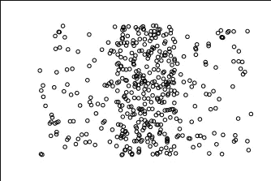
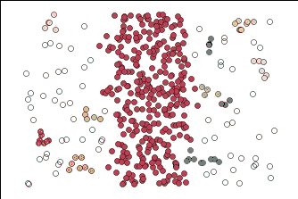
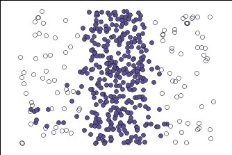
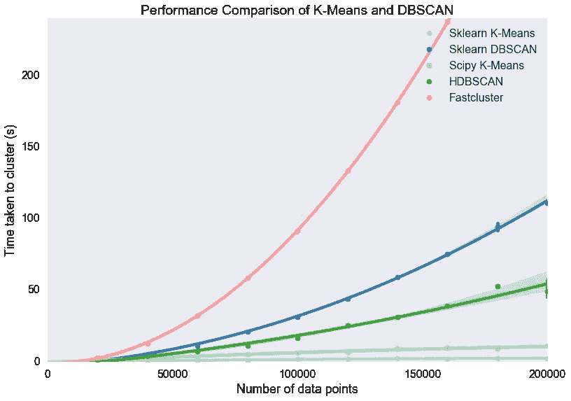
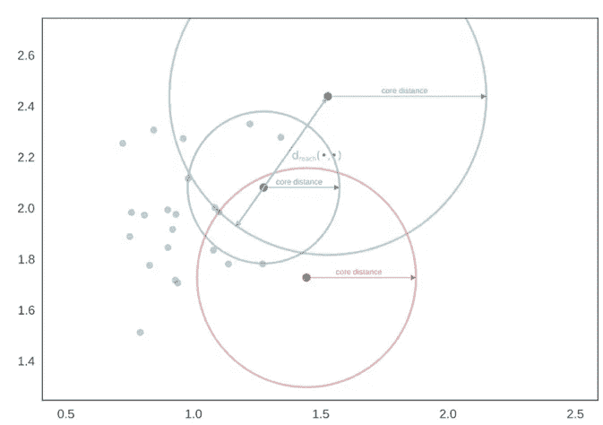
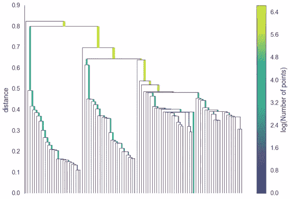
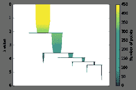

# 闪电谈话:使用 HDBScan 进行集群

> 原文：<https://towardsdatascience.com/lightning-talk-clustering-with-hdbscan-d47b83d1b03a?source=collection_archive---------1----------------------->

最近，我应邀就一种叫做 HDBScan 的聚类算法做了一个简短的演讲。HDBScan 基于 DBScan 算法，与其他聚类算法一样，它用于将相似的数据分组在一起。

Clustering with HDBScan

我在演讲中涉及了三个主题:HDBScan 的优点、实现以及它是如何工作的。

**优势**

常规 DBScan 在对不同形状的数据进行聚类方面非常出色，但在对不同密度的数据进行聚类方面却表现不佳。你可以去 [Naftali Harris 的博客](https://www.naftaliharris.com/blog/visualizing-dbscan-clustering/)看看关于 DBScan 的文章，然后玩玩密度条散点图。

下面是 Naftali 网站上的密度条散点图的副本。你可以看到，有一个主要的中心集群和噪声在左边和右边。

Density Bars

玩了参数之后，下面是 DBScan 的表现。它能够得到中心星团，但也产生了许多没有多大意义的迷你星团。

Density Bars with DBScan Applied

下面是 HDBScan 的表现。我只能得到我正在寻找的一个集群。不幸的是，没有算法是完美的，它确实把一些噪声放到了紫色的簇中，但它比常规的 DBScan 更接近我所寻找的。

Density Bars with HDBScan Applied

除了更适合不同密度的数据，它还比常规的 DBScan 更快。下面是几个聚类算法的图表，DBScan 是深蓝色，HDBScan 是深绿色。在 200，000 记录点，DBScan 花费的时间大约是 HDBScan 的两倍。随着记录数量的增加，DBScan 和 hdb scan 性能之间的差异也会增加。

Source: [http://hdbscan.readthedocs.io/](http://hdbscan.readthedocs.io/)

**实现**

HDScan 是一个独立于 scikitlearn 的库，所以你要么 pip 安装它，要么 conda 安装它。

两种算法都有最小样本数参数，该参数是记录成为核心点的邻居阈值。

DBScan 有一个参数 epsilon，它是那些邻居形成核心的半径。这是 DBScan 上图的 DBSCAN 实现(eps = 0.225，min_samples=4)。

HDBScan 的参数是最小集群大小，即集群需要多大才能形成。这比 epsilon 更直观，因为您可能知道您的集群需要多大才能做出可行的决策。这是 HDBScan 上图的 HDBSCAN 实现(min_samples=11，min_cluster_size=10，allow_single_cluster=True)。

**工作原理**

这两种算法都是从查找每个点的核心距离开始的，核心距离是该点与其由最小样本参数定义的最远邻居之间的距离。由于蓝点落在绿点的半径内，绿点可以捕捉蓝点作为其集群的一部分。然而，红点不在绿点的半径范围内，反之亦然，因此两个点都不能捕捉彼此(尽管它们可以通过其他点连接)。

Core Distances: [http://hdbscan.readthedocs.io/](http://hdbscan.readthedocs.io/)

潜在的簇可以形成树状图，树状图上的 DBScan 的截止点是ε。

Expanded Dendogram: [http://hdbscan.readthedocs.io/](http://hdbscan.readthedocs.io/)

HDBScan 以不同的方式处理这个问题，它丢弃微小的分支，而保留由最小簇大小参数定义的最大簇。这导致了一个更加浓缩的树突图，如下图所示。

Condensed HDBScan Dendogram

HDBScan 是为具有不同密度的数据的真实场景而构建的，它相对较快，并且允许您根据大小来定义哪些集群对您来说是重要的。总的来说，HDBScan 似乎是一个很棒的算法。如果您想要上面相应视频的我的幻灯片的链接，[请单击此处](https://docs.google.com/presentation/d/1B962cB0yaYc8FM_-rhnEauQrPa3cuyuBldGmB9SiTt8/edit?usp=sharing)。

**来源:**

文件:【http://hdbscan.readthedocs.io/ 

使用 HDBSCAN 实现高性能集群:[https://www.youtube.com/watch?v=AgPQ76RIi6A](https://www.youtube.com/watch?v=AgPQ76RIi6A)

可视化 DBScan 聚类:[https://www . naftaliharris . com/blog/visualizing-DBS can-Clustering/](https://www.naftaliharris.com/blog/visualizing-dbscan-clustering/)