# 用于深度学习的线性代数备忘单

> 原文：<https://towardsdatascience.com/linear-algebra-cheat-sheet-for-deep-learning-cd67aba4526c?source=collection_archive---------0----------------------->

## 常用操作初学者指南


在杰瑞米·霍华德出色的[深度学习课程](http://course.fast.ai/)中，我意识到我对先决条件有点生疏，我的模糊性影响了我理解反向传播等概念的能力。我决定就这些话题整理几个维基页面来提高我的理解。这里是深度学习中使用的一些更常见的线性代数运算的非常基本的介绍。**新**:查看[机器学习备忘单](http://ml-cheatsheet.readthedocs.io)了解更多主题。

## 什么是线性代数？

在深度学习的背景下，线性代数是一个数学工具箱，为同时操作多组数字提供了有用的技术。它提供了像向量和矩阵(电子表格)这样的结构来保存这些数字，以及如何加、减、乘、除这些数字的新规则。

## 为什么有用？

它把复杂的问题变成简单、直观、有效计算的问题。这是一个线性代数如何实现更快的速度和更简单的例子。

```
*# Multiply two arrays* 
x = [1,2,3]
y = [2,3,4]
product = []
for i in range(len(x)):
    product.append(x[i]*y[i])*# Linear algebra version*
x = numpy.array([1,2,3])
y = numpy.array([2,3,4])
x * y
```

初始化数组后，线性代数方法的速度提高了 3 倍。

## **在深度学习中是如何使用的？**

神经网络将权重存储在矩阵中。线性代数让矩阵运算变得快速简单，尤其是在 GPU 上训练的时候。事实上，GPU 是在考虑向量和矩阵运算的情况下创建的。与图像可以表示为像素阵列类似，视频游戏使用巨大的、不断发展的矩阵来产生引人注目的游戏体验。GPU 不是逐个处理像素，而是并行处理整个像素矩阵。

# 向量

向量是数字或术语的一维数组。在几何学中，向量存储了一个点的潜在变化的大小和方向。向量[3，-2]表示向右 3，向下 2。一维以上的向量称为矩阵。

## 向量记法

有多种方法来表示向量。这里有一些你可能会在阅读中遇到的。

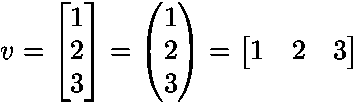

## 几何中的向量

向量通常表示从一个点开始的运动。它们存储了一个点的潜在变化的**幅度**和**方向**。向量[-2，5]表示向左移动 2 个单位，向上移动 5 个单位。[来源](http://mathinsight.org/vector_introduction)。

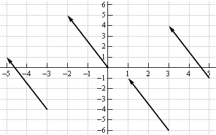

v = [-2, 5]

矢量可以应用于空间中的任何一点。向量的方向等于向上移动 5°和向左移动 2°所产生的斜边的斜率。它的大小等于斜边的长度。

## 标量运算

标量运算涉及一个向量和一个数。通过对向量中的所有值进行加、减或乘运算，可以就地修改向量。

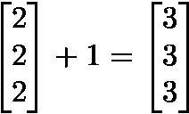

Scalar addition

## 元素式操作

在像加、减、除这样的元素运算中，位置对应的值被组合起来产生一个新的向量。向量 A 中的第一个值与向量 b 中的第一个值配对，第二个值与第二个值配对，依此类推。这意味着向量必须有相等的维数才能完成运算。*

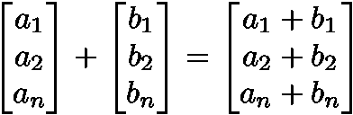

Vector addition

```
y = np.array([1,2,3])
x = np.array([2,3,4])
y + x = [3, 5, 7]
y - x = [-1, -1, -1]
y / x = [.5, .67, .75]
```

*有关 numpy 中[广播](https://docs.scipy.org/doc/numpy-1.10.0/user/basics.broadcasting.html)的详细信息，请参见下文。

## 矢乘法

矢量乘法有两种类型:点积和哈达玛积。

## 点积

两个向量的点积是一个标量。向量和矩阵的点积(矩阵乘法)是深度学习中最重要的运算之一。

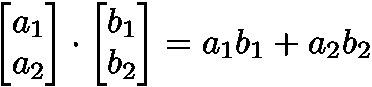

```
y = np.array([1,2,3])
x = np.array([2,3,4])
np.dot(y,x) = 20
```

## 哈达玛乘积

哈达玛乘积是逐元素乘法，它输出一个向量。


```
y = np.array([1,2,3])
x = np.array([2,3,4])
y * x = [2, 6, 12]
```

## 向量场

向量场显示了如果我们对点 *(x，y)* 应用像加法或乘法这样的向量函数，该点会假设移动多远。给定空间中的一个点，矢量场显示了我们提出的在图中的多个点处的 ***功率*** 和 ***方向*** 。

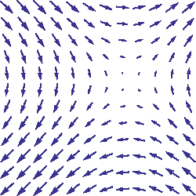

[Source](https://en.wikipedia.org/wiki/Vector_field)

这个向量场很有趣，因为它根据起点向不同的方向移动。原因是该字段后面的向量存储类似于 *2x* 或 *x* 的项，而不是类似于-2 和 5 的标量值。对于图上的每个点，我们将 x 坐标插入到 *2x* 或 *x* 中，并绘制一个从起点到新位置的箭头。向量场对于可视化机器学习技术(如梯度下降)非常有用。

# 矩阵

矩阵是数字或术语的矩形网格(类似于 Excel 电子表格)，具有特殊的加法、减法和乘法规则。

## 矩阵维度

我们用*行和*列来描述矩阵的维数。

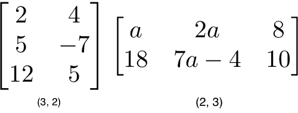

```
a = np.array([
 [1,2,3], 
 [4,5,6]
])
a.shape == (2,3)b = np.array([
 [1,2,3]
])
b.shape == (1,3)
```

## 矩阵标量运算

对矩阵的标量运算与对向量的运算方式相同。只需将标量应用于矩阵中的每个元素——加、减、除、乘等。

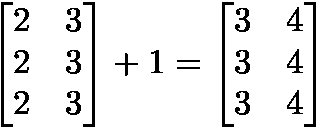

Matrix scalar addition

```
a = np.array(
[[1,2], 
 [3,4]])
a + 1
[[2,3], 
 [4,5]]
```

## 矩阵元素运算

为了加、减或除两个矩阵，它们必须有相等的维数。*我们以元素方式组合相应的值，以生成新的矩阵。

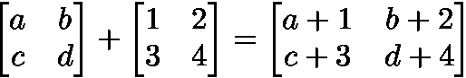

```
a = np.array([
 [1,2],
 [3,4]
])
b = np.array([
 [1,2],
 [3,4]
])a + b
[[2, 4],
 [6, 8]]a — b
[[0, 0],
 [0, 0]]
```

## 数字广播*

我不能逃避谈论这个，因为它在实践中非常相关。在 numpy 中，通过一种叫做[广播](https://docs.scipy.org/doc/numpy-1.10.0/user/basics.broadcasting.html)的机制放宽了元素操作的维度要求。如果每个矩阵中的相应维度(行与行、列与列)满足以下要求，则两个矩阵是兼容的:

1.  尺寸相等，或
2.  一个维度的大小为 1

```
a = np.array([
 [1],
 [2]
])
b = np.array([
 [3,4],
 [5,6]
])
c = np.array([
 [1,2]
])# Same no. of rows
# Different no. of columns
# but **a** has one column so this works
a * b
[[ 3, 4],
 [10, 12]]# Same no. of columns
# Different no. of rows
# but **c** has one row so this works
b * c
[[ 3, 8],
 [5, 12]]# Different no. of columns
# Different no. of rows
# but both **a** and **c** meet the 
# size 1 requirement rule
a + c
[[2, 3],
 [3, 4]]
```

在更高的维度——3D，4D，事情会变得更奇怪，但现在我们不会担心这个。了解 2D 的运作是一个良好的开端。

## 矩阵 Hadamard 积

矩阵的 Hadamard 乘积是一种元素运算。位置对应的值相乘产生新的矩阵。

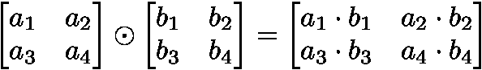

```
a = np.array(
[[2,3],
 [2,3]])
b = np.array(
[[3,4],
 [5,6]])# Uses python's multiply operator
a * b
[[ 6, 12],
 [10, 18]]
```

在 numpy 中，只要矩阵和向量的维数满足广播的要求，就可以取它们的 Hadamard 积。

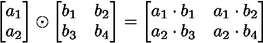

## 矩阵转置

神经网络经常处理不同大小的权重和输入，其中维数不满足矩阵乘法的要求。矩阵转置提供了一种“旋转”其中一个矩阵的方法，以便操作符合乘法要求并可以继续。转置矩阵有两个步骤:

1.  将矩阵向右旋转 90 度
2.  颠倒每行中元素的顺序(例如，[a b c]变成[c b a])

举个例子，把矩阵 **M** 转置成 **T** :

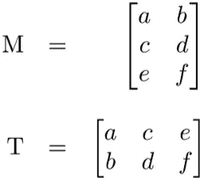

```
a = np.array([
   [1, 2], 
   [3, 4]])a.T
[[1, 3],
 [2, 4]] 
```

# 矩阵乘法

矩阵乘法指定了一组将矩阵相乘以生成新矩阵的规则。

## 规则

并非所有矩阵都适合乘法。此外，对最终矩阵输出的尺寸也有要求。[来源](https://www.khanacademy.org/math/precalculus/precalc-matrices/properties-of-matrix-multiplication/a/properties-of-matrix-multiplication)。

1.  第一个 矩阵的 ***列数必须等于第二个*** 矩阵的 ***行数***
2.  一个 M×N 矩阵和一个 N×K 矩阵的乘积是一个 M×K 矩阵。新矩阵取第一个 的 ***行和第二个*** 的 ***列***

## 步伐

矩阵乘法依靠点积来乘以各种行和列的组合。下图取自汗学院的优秀线性代数课程，矩阵 C 中的每个条目都是矩阵 A 中的一行和矩阵 b 中的一列的点积。


[Source](https://www.khanacademy.org/math/precalculus/precalc-matrices/properties-of-matrix-multiplication/a/properties-of-matrix-multiplication)

操作***a1**B1***意味着我们取矩阵 *A (1，7)* 中第一行和矩阵 *B (3，5)中第一列的点积。*

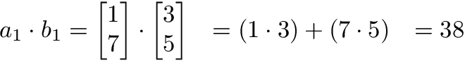

这是另一种看待它的方式:

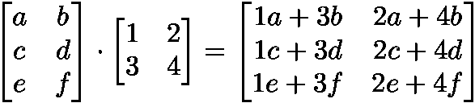

## 用这些例子测试你自己

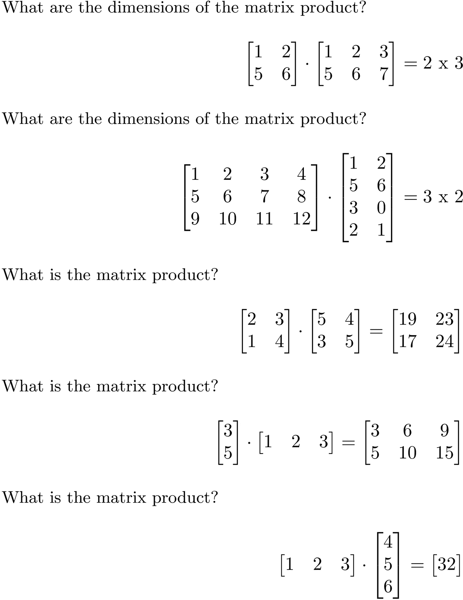

## numpy 矩阵乘法

Numpy 使用函数`np.dot(A,B)`进行向量和矩阵乘法。它还有一些其他有趣的特性和陷阱，所以我鼓励你在使用前阅读文档[这里](https://docs.scipy.org/doc/numpy/reference/generated/numpy.dot.html)。

```
a = np.array([
 [1, 2]
 ])
a.shape == (1,2)b = np.array([
 [3, 4],
 [5, 6]
 ])
b.shape == (2,2)# Multiply
mm = np.dot(a,b)
mm == [13, 16]
mm.shape == (1,2)
```

# 教程

[可汗学院线性代数](https://www.khanacademy.org/math/linear-algebra)
[深度学习书籍数学部分](http://www.deeplearningbook.org/contents/part_basics.html)
[吴恩达的课程笔记](https://www.coursera.org/learn/machine-learning/resources/JXWWS)
[线性代数讲解](https://betterexplained.com/articles/linear-algebra-guide/)
[矩阵讲解](http://blog.stata.com/2011/03/03/understanding-matrices-intuitively-part-1/)
[线性代数入门](http://www.holehouse.org/mlclass/03_Linear_algebra_review.html)
[迷你参考线性代数 4 页](https://minireference.com/static/tutorials/linear_algebra_in_4_pages.pdf)