# 深度学习背景下的线性代数解释

> 原文：<https://towardsdatascience.com/linear-algebra-explained-in-the-context-of-deep-learning-8fcb8fca1494?source=collection_archive---------6----------------------->


Photo by [Charles Deluvio 🇵🇭🇨🇦](https://unsplash.com/@charlesdeluvio?utm_source=medium&utm_medium=referral) on [Unsplash](https://unsplash.com?utm_source=medium&utm_medium=referral)

在这篇文章中，我使用了自顶向下的方式来解释深度学习的线性代数。首先提供应用程序和用途，然后深入提供概念。

维基百科中线性代数的定义:

> **线性代数**是关于**线性**方程和**线性**函数及其通过矩阵和向量空间表示的数学分支。

# 目录:

*   引言。
*   向量和矩阵的数学观点。
*   矩阵的类型。
*   矩阵分解。
*   规范。
*   矢量化。
*   广播。
*   外部资源。

[](https://www.buymeacoffee.com/laxmanvijay)

[Laxman Vijay (buymeacoffee.com)](https://www.buymeacoffee.com/laxmanvijay)

**简介:**

如果你开始学习深度学习，你首先会接触到的是前馈神经网络，这是深度学习中最简单也是最有用的网络。在引擎盖下，前馈神经网络只是一个复合函数，将一些矩阵和向量相乘。

这并不是说向量和矩阵是进行这些运算的唯一方法，但是如果你这样做，它们会变得非常高效。

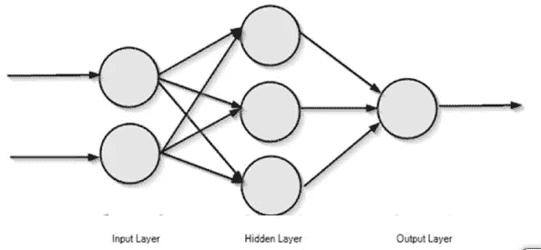

上图显示了一个简单的向前传播信息的前馈神经网络。

该图像是神经网络的漂亮表示，但是计算机如何理解这一点。在计算机中，神经网络的各层用向量表示。将输入层视为 X，将隐藏层视为 h。现在不考虑输出层。(这里不涉及前馈神经网络的计算过程。)

所以，它可以用向量和矩阵来表示，

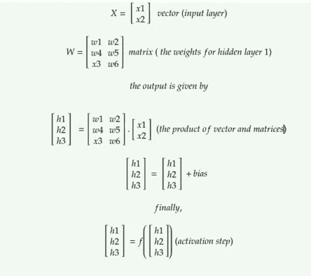

上图显示了计算上述神经网络的第一个也是唯一一个隐藏层的输出所需的操作(未显示输出层的计算)。我们来分解一下。

网络的每一列都是向量。向量是数据(或特征)集合的动态数组。在当前的神经网络中，向量' **x** '保存输入。将输入表示为向量并不是强制性的，但是如果你这样做，它们会变得越来越便于并行执行操作。

深度学习，具体来说，神经网络的计算成本很高，所以它们需要这个好技巧来加快计算速度。

**这叫矢量化。它们使得计算速度极快。这就是为什么深度学习需要 GPU 的主要原因之一**[](https://www.analyticsvidhya.com/blog/2017/05/gpus-necessary-for-deep-learning/)***，因为它们擅长矩阵乘法之类的矢量化运算。(我们将在最后深入了解这一点)。***

*隐藏层 H 的输出通过执行 **H = f( *W* 来计算。x + b)。***

*这里 W 称为权重矩阵，b 称为偏差，f 是激活函数。(本文不解释关于前馈神经网络，如果你需要一本关于 FFNN 概念的初级读本，[看这里](/deep-learning-feedforward-neural-network-26a6705dbdc7)。)*

*让我们分解这个等式，*

*第一个组件是 ***W*** 。**x；这是一个**矩阵-向量乘积，**因为 W 是矩阵， ***x*** 是向量。在开始乘法运算之前，让我们先了解一下符号:*通常向量用小粗斜体字母表示(如* ***x*** *)，矩阵用大写粗斜体字母表示(如* ***X*** *)。如果字母是大写加粗但不是斜体，那么它是一个张量(如* **X** *)。****

*从计算机科学的角度来看*

*标量:单个数字。*

*Vector:值的列表。(秩 1 张量)*

*矩阵:二维值列表。(秩 2 张量)*

*张量:秩为 n 的多维矩阵。*

***向下钻取:***

*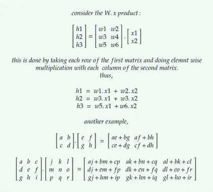*

***从数学的角度:***

***矢量:***

*矢量是既有大小又有方向的量。它是一个存在于空间的实体，如果它是一个存在于真实空间的二维向量，它的存在用 ***x∈ ℝ*** *表示。(每个元素表示沿不同轴的坐标。)**

*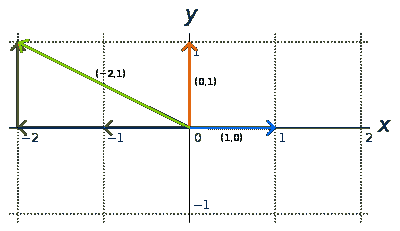*

*red and blue color vectors are the basis vectors.*

*2D 空间中的所有向量都可以通过称为**基向量**的两个向量的线性组合来获得。(用 I 和 j 表示)(一般来说，N 维的向量可以用 N 个基向量来表示。)它们是**单位法向量，因为它们的大小是 1，并且它们彼此垂直**。这两个向量中的一个不能用另一个向量来表示。所以它们被称为**线性无关矢量**。(如果任何一个向量不能由一组向量的线性组合得到，那么这个向量与那个集合线性无关)。可以通过这两个向量的线性组合获得的 2D 空间中的所有点集被称为这些向量的**跨度**。如果一个向量由一组其他向量的线性组合(加法、乘法)来表示，那么它**线性依赖于该组向量**。(将这个新向量添加到现有集合中是没有用的。)*

*任何两个矢量都可以相加。它们可以相乘。它们的乘法有两种类型，点积和叉积。[参考此处。](https://ltcconline.net/greenl/courses/107/vectors/dotcros.htm)*

***矩阵:***

*矩阵是数字的 2D 阵列。它们代表**转换**。2 * 2 矩阵的每一列表示在 2D 空间被应用该变换之后的 2 个基本向量中的每一个。它们的空间表示是 ***W ∈ ℝ *有 3 行 2 列。****

***一个矩阵的向量积叫做那个向量的变换，而一个矩阵的矩阵积叫做变换的合成。***

*只有一个矩阵不对向量做任何变换。就是单位矩阵( ***I*** )。****I 列代表基矢。*****

****矩阵的行列式***用 det(*)表示矩阵所描述的线性变换的比例因子。****

*****为什么数学视角对深度学习研究者很重要？因为它们帮助我们理解基本对象的基本设计概念。他们也帮助设计深度学习问题的创造性解决方案。但是不用担心，有很多语言和软件包为我们做这些实现。但是知道它们的实现也很好。*****

***python 编程语言的 numpy 就是这样一个库。***

***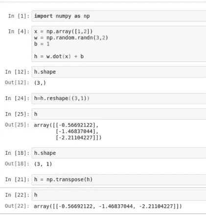***

***有很多学习数字的资源。(这对学习深度学习很重要，如果用 python 的话。)[看这里](https://docs.scipy.org/doc/numpy-1.15.0/user/basics.html)。***

****在这里，np.array 创建了一个 numpy 数组。****

***np.random 是一个包含随机数生成方法的包。***

***点法是计算矩阵间乘积的方法。***

***我们可以改变 numpy 数组的形状并检查它。***

***这里可以看到，W.x 的乘积是一个矢量，加上 b，b 是一个标量。这会自动将 b 扩展为转置([1，1])。* ***这种 b 到几个位置的隐式复制称为广播。(一会儿我们会深入了解。)*****

***你注意到转置这个词了吗:* ***一个矩阵的转置是矩阵的镜像跨过对角线(从矩阵的左上到右下。*)****

```
**## numpy code for transpose
import numpy as np
A = np.array([[1,2],
              [3,4],
              [5,6]])
B = np.transpose(A) 
##or
B = A.T**
```

****矩阵类型:****

****对角矩阵**:除主对角元素外，所有元素为零。**

**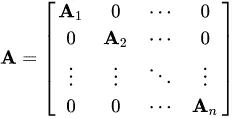**

**diagonal matrix**

****单位矩阵**:对角值为 1 的对角矩阵。**

**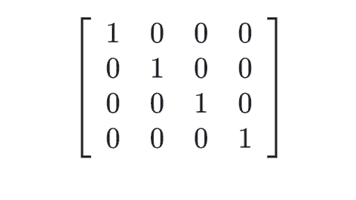**

**identity matrix**

```
**## numpy code to create identity matrix
import numpy as np
a = np.eye(4)**
```

**对称矩阵:与其转置矩阵相等的矩阵。A =转置(A)**

****奇异矩阵**:行列式为零，列线性相关的矩阵。它们的秩小于矩阵的行数或列数。**

****矩阵分解:****

****矩阵分解**或**矩阵分解**是将矩阵分解成矩阵的乘积。有许多不同的矩阵分解；每一种都在一类特定的问题中找到用途。最广泛使用的一种矩阵分解叫做**特征分解**，我们将矩阵分解成一组特征向量和特征值。**

**方阵的本征向量*是非零向量*使得乘以*仅改变*的比例******

******A . v***=λ。 ***v******

**这里 ***v*** 是本征向量，λ是本征值。**

```
**## numpy program to find eigen vectors.

from numpy import array
from numpy.linalg import eig
# define matrix
A = array([[1, 2, 3], [4, 5, 6], [7, 8, 9]])
print(A)
# calculate eigendecomposition
values, vectors = eig(A)
print(values)
print(vectors)**
```

****

**特征分解在机器学习中非常有用。这对于降维这样的概念特别有用。**

**有关特征分解的更多信息，请参考深度学习书籍[第 2 章](http://www.deeplearningbook.org/contents/linear_algebra.html)**

**深度学习中还会用到其他几种矩阵分解技术。[看这里。](https://heartbeat.fritz.ai/applications-of-matrix-decompositions-for-machine-learning-f1986d03571a)**

****规范:****

****过拟合和欠拟合:****

**当你参加深度学习讲座时，你经常会听到过度适应和欠适应这个术语。这些术语描述了深度学习模型的准确性状态。**

****

**This image is the best explanation of overfitting and underfitting.**

**过拟合是指模型对训练数据学习得太好。它真的窃取了训练数据。在过拟合模型中，训练精度非常高，验证精度非常低。**

**欠拟合模型无法学习训练数据。在欠拟合模型中，训练和验证精度都非常低。**

**过度拟合和欠拟合都会导致模型性能不佳。但到目前为止，应用机器学习中最常见的问题是过度拟合。**

**为了减少过度拟合，我们必须使用一种叫做**正则化的技术。*防止对训练数据的强记，从而避免过拟合的风险。*****

**深度学习工程师的**最重要的职责**是创建一个通常适合输入的模型。正则化有几种方法。最著名的是 **L1 正则化(Lasso)和 L2 正则化(Ridge)。****

**没有提供这些的细节，但是要理解这些，你必须知道什么是规范。**

****定额:****

**范数是向量的大小。向量 ***x*** 的范数的一般公式为:**

**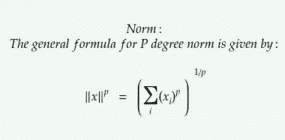**

**p=2 的 **L 范数**称为欧几里德范数，因为它是原点和 ***x.*** 之间的欧几里德距离**

****L 范数**就是向量所有元素的和。当系统需要更高的精度时，它用于机器学习。清楚地区分零元素和非零元素。L 范数也被称为**曼哈顿范数**。**

**还有**最大范数，**是量值最大的元素的绝对值。**

**矩阵的 L 范数等价于 **frobenius 范数。****

**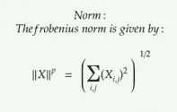**

**frobenius norm.**

**不仅在正则化，规范也用于优化程序。**

**好了，现在在所有这些概念和理论之后，我们开始涵盖深度学习所需的最重要的部分。它们是向量化和广播。**

# ****矢量化:****

**这是减少循环执行的技巧，通过提供向量形式的数据使进程并行执行。**

**许多 CPU 都有“向量”或“SIMD”(单指令多数据)指令集，这些指令集同时对两个、四个或更多个数据应用相同的操作。20 世纪 90 年代初，SIMD 在通用 CPU 上开始流行。**

**更多详细信息，请查看[弗林的分类。](https://en.wikipedia.org/wiki/Flynn%27s_taxonomy)**

**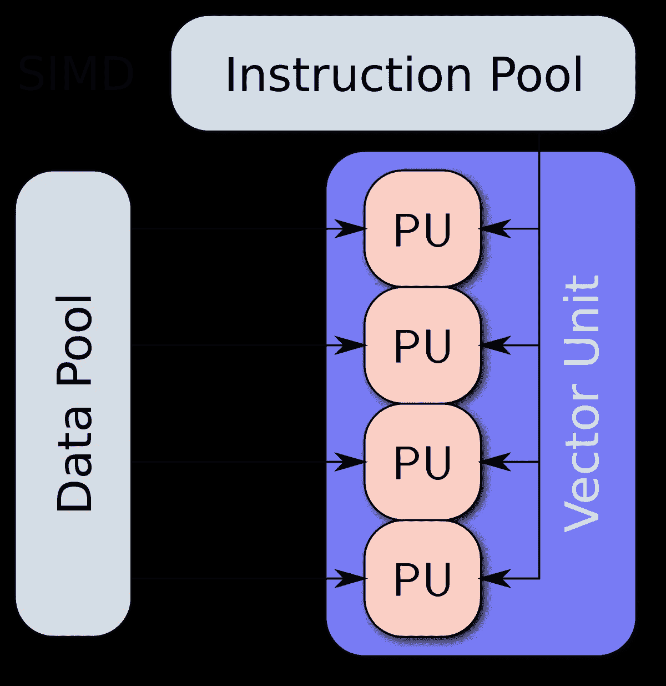**

**向量化是重写一个循环的过程，它不是处理数组中的一个元素 N 次，而是同时处理(比如说)数组中的 4 个元素 N/4 次。**

**Numpy 在他们的算法中大量实现了矢量化。这是 numpy 的官方声明。**

> **矢量化描述了没有任何显式循环、索引等。，在代码中——当然，这些事情只是在优化、预编译 C 代码的“幕后”发生。矢量化代码有许多优点，其中包括:**
> 
> **矢量化代码更加简洁，也更容易阅读**
> 
> **更少的代码行通常意味着更少的错误**
> 
> **代码更类似于标准的数学符号(通常更容易正确地编写数学结构)**
> 
> **矢量化会产生更多“Pythonic 式”代码。如果没有向量化，我们的代码将充斥着低效和难以阅读的循环。**

****代码示例:****

```
**## to add two arrays together.## consider two basic python lists.
a = [1,2,3,4,5]
b = [2,3,4,5,6]
c = []## without vectorization.for i in range(len(a)): 
    c.append(a[i]+b[i])## using vectorization.a = np.array([1,2,3,4,5])
b = np.array([2,3,4,5,6])
c = a+b**
```

**上面的代码示例是一个过于简化的矢量化示例。而**当输入数据变大时，矢量化才真正发挥作用。****

**关于矢量化的更多细节，请看这里。**

# **广播:**

**下一个重要的概念是广播。杰瑞米·霍华德爵士在他的一次机器学习讲座中说，广播可能是机器学习程序员最重要的工具和技能。**

**来自 [Numpy 文档](https://docs.scipy.org/doc/numpy-1.10.0/user/basics.broadcasting.html):**

```
**The term broadcasting describes how numpy treats arrays with 
different shapes during arithmetic operations. Subject to certain 
constraints, the smaller array is “broadcast” across the larger 
array so that they have compatible shapes. Broadcasting provides a 
means of vectorizing array operations so that looping occurs in C
instead of Python. It does this without making needless copies of 
data and usually leads to efficient algorithm implementations.**
```

**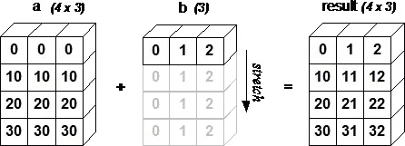**

**代码示例:**

```
**a = np.array([1.0, 2.0, 3.0])
b = 2.0
 a * b
 array([ 2.,  4.,  6.])this is similar toa = np.array([1.0, 2.0, 3.0])
b = np.array([2.0, 2.0, 2.0])
a * b
array([ 2.,  4.,  6.])**
```

**数组 b 被扩展，从而可以应用算术运算。**

**广播不是一个新概念。这是一个相对古老的工具，可以追溯到 50 年代。在他的论文 [" **符号作为思维工具** "](http://www.eecg.toronto.edu/~jzhu/csc326/readings/iverson.pdf) ，[中，Kenneth Iverson](https://en.wikipedia.org/wiki/Kenneth_E._Iverson) 描述了几种数学使用工具，这些工具允许我们以新的视角思考。他第一次提到广播不是作为一种计算机算法，而是作为一种数学过程。他在一个名为 [APL](https://en.wikipedia.org/wiki/APL_(programming_language)) 的软件中实现了许多这样的工具。**

**他的儿子后来扩展了他的想法，继续创造了另一个软件，叫做 J 软件。这一姿态意味着，通过软件，我们得到的是超过 50 年的深入研究，利用这些，我们可以在一小段代码中实现非常复杂的数学函数。**

**同样非常方便的是，这些研究也在我们今天使用的语言中找到了自己的方式，比如 python 和 numpy。**

**所以请记住，这些不是一夜之间产生的简单想法。这些就像是思考数学及其软件实现的基本方法。(以上内容摘自 fast.ai 机器学习课程。)**

**关于 numpy 版本广播的更多细节，[看这里](https://docs.scipy.org/doc/numpy-1.13.0/user/basics.broadcasting.html)。**

**好了，这就够了，这篇文章向初学者介绍了许多新单词和术语。但是我也跳过了几个向量代数的深层概念。这可能是压倒性的，但我仍然使概念尽可能实用，(欢迎反馈！).**

**由于我刚刚开始深度学习，我决定帮助其他已经开始的人，为他们提供关于深度学习术语和东西的直观文章。所以如果你觉得这些文章有什么错误，请在评论中发表。**

****以下是一些有用的资源:****

**深入直观的线性代数视频: [3blue1brown](https://www.youtube.com/playlist?list=PLZHQObOWTQDPD3MizzM2xVFitgF8hE_ab)**

**电子书:[https://www.math.ucdavis.edu/~linear/linear-guest.pdf](https://www.math.ucdavis.edu/~linear/linear-guest.pdf)**

**学习深度学习的最佳站点: [fast.ai](https://www.fast.ai/)**

**一本完整的学习书:[深度学习书，作者 Ian Goodfellow。](https://www.deeplearningbook.org/)**

****