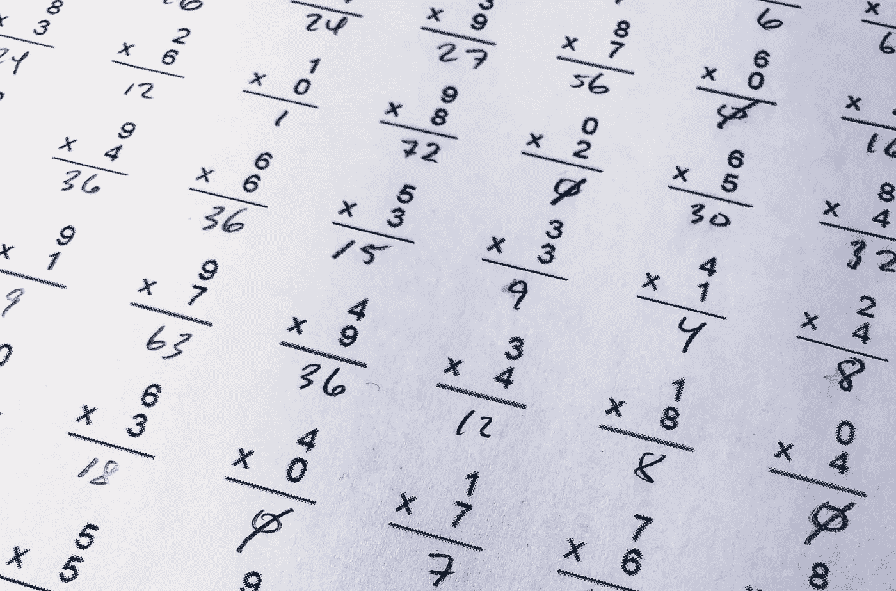
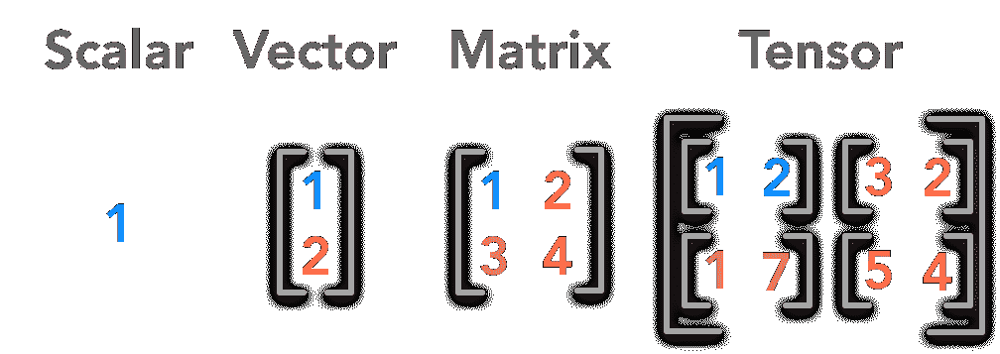
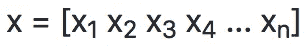
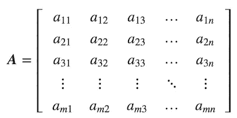
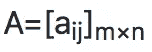
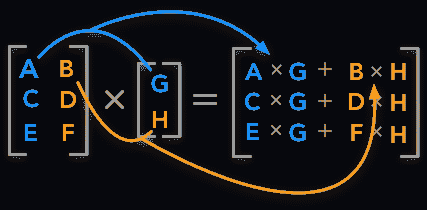
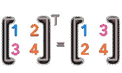
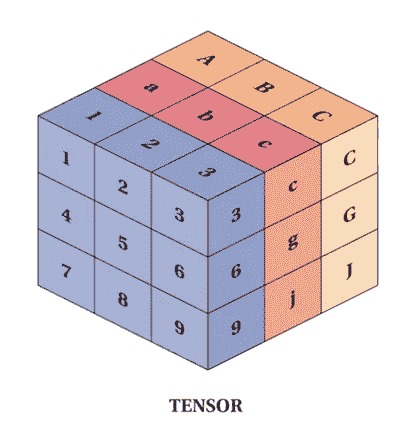

# 用于深度学习的线性代数

> 原文：<https://towardsdatascience.com/linear-algebra-for-deep-learning-506c19c0d6fa?source=collection_archive---------4----------------------->

每个深度学习程序背后的数学。

**深度学习**是机器学习的一个子域，涉及模拟大脑功能和结构的算法，称为人工神经网络。

**线性代数**是一种连续而非离散的数学形式，许多计算机科学家对它没有什么经验。对线性代数的良好理解对于理解和使用许多机器学习算法，尤其是深度学习算法至关重要。



# 为什么是数学？

线性代数、概率和微积分是机器学习的“语言”。学习这些主题将有助于更深入地理解底层算法机制，并允许开发新的算法。

当局限于更小的水平时，深度学习背后的一切都是数学。所以在开始深度学习和编程之前，了解基本的线性代数是非常重要的。



[src](https://hadrienj.github.io/posts/Deep-Learning-Book-Series-2.1-Scalars-Vectors-Matrices-and-Tensors/)

深度学习背后的核心数据结构是标量、向量、矩阵和张量。从程序上来说，让我们用这些来解决所有基本的线性代数问题。

# 标量

标量是**单个数**，是 0 阶*张量的一个例子。符号 x ∈ ℝ表示 x 是属于一组实数值ℝ.的标量*

深度学习中有不同组的感兴趣的数字。ℕ表示正整数(1，2，3，…)的集合。ℤ指定的整数，结合了正值，负值和零值。ℚ表示可以表示为两个整数的分数的有理数的集合。

少数内置标量类型是 Python 中的 **int** ， **float** ， **complex** ， **bytes** ， **Unicode** 。在 python 库 NumPy 中，有 24 种新的基本数据类型来描述不同类型的标量。有关数据类型的信息，请参考此处的文档。

*在 Python 中定义标量和少量运算:*

下面的代码片段解释了标量上的一些算术运算。

```
<class 'int'>
<class 'float'>
12.5
-2.5
37.5
0.6666666666666666
```

下面的代码片段检查给定的变量是否是标量。

```
True
False
True
```

# 向量

向量是单个数字的有序阵列，是一阶张量的一个例子。向量是称为向量空间的对象片段。向量空间可以被认为是特定长度(或维度)的所有可能向量的全部集合。由ℝ^3 表示的三维实值向量空间经常被用来以数学方式表示我们的三维空间的真实世界概念。



为了明确地识别向量的必要分量，向量的第 I 个*标量元素被写成 x[i]。*

中的深度学习向量通常表示特征向量，其原始成分定义了特定特征的相关程度。这种元素可以包括二维图像中一组像素的强度的相关重要性，或者金融工具横截面的历史价格值。

*在 Python 中定义矢量和少量运算:*

```
<class 'list'>
[1, 2, 3, 4, 5, 6]
[5 7 9]
<class 'numpy.ndarray'>
[-3  6 -3]
```

# 矩阵

矩阵是由数字组成的矩形阵列，是二阶张量的一个例子。如果 m 和 n 是正整数，即 m，n ∈ ℕ，那么 m×n 矩阵包含 m*n 个数字，有 m 行和 n 列。

完整的 m×n 矩阵可以写成:



将整个矩阵分量显示简化为以下表达式通常很有用:



在 Python 中，我们使用 numpy 库来帮助我们创建 n 维数组。这些基本上都是矩阵，我们使用矩阵方法，传入列表，从而定义一个矩阵。

$python

```
>>> import numpy as np
>>> x = np.matrix([[1,2],[2,3]])
>>> x
matrix([[1, 2],
        [2, 3]])

>>> a = x.mean(0)
>>> a
matrix([[1.5, 2.5]])
>>> # Finding the mean with 1 with the matrix x.
>>> z = x.mean(1)
>>> z
matrix([[ 1.5],
        [ 2.5]])
>>> z.shape
(2, 1)
>>> y = x - z
matrix([[-0.5,  0.5],
        [-0.5,  0.5]])
>>> print(type(z))
<class 'numpy.matrixlib.defmatrix.matrix'>
```

*在 Python 中定义矩阵和少量运算:*

## 矩阵加法

矩阵可以添加到标量，向量和其他矩阵。这些操作中的每一个都有精确的定义。这些技术在机器学习和深度学习中经常使用，因此值得你熟悉它们。

## 矩阵-矩阵加法

c = A+B(*A 和 B 的形状应该相等*)

方法 shape 返回矩阵的形状，add 接受两个参数并返回这些矩阵的和。如果矩阵的形状不一样，它会抛出一个错误，说，加法不可能。

## 矩阵标量加法

将给定标量与给定矩阵中的所有元素相加。

## 矩阵标量乘法

将给定标量乘以给定矩阵中的所有元素。

## 矩阵乘法

形状为(m×n)的 a 和形状为(n×p)的 B 相乘得到形状为(m×p)的 C



[src](https://hadrienj.github.io/posts/Deep-Learning-Book-Series-2.2-Multiplying-Matrices-and-Vectors/)

## 矩阵转置

通过转置，您可以将行向量转换为列向量，反之亦然:

a =[a*ij*mxn

AT=[a *ji* ]n×m



# 张量

张量的更一般的实体包括标量、矢量和矩阵。在物理科学和机器学习中，有时有必要使用二阶以上的张量。



[src](https://refactored.ai/track/python-for-machine-learning/courses/linear-algebra.ipynb)

我们使用像 tensorflow 或 PyTorch 这样的 Python 库来声明张量，而不是嵌套矩阵。

*在 PyTorch 中定义简单张量*

*Python 中很少对张量进行算术运算*

更多关于张量和 PyTorch 的文档请点击这里。

*重要链接*

要开始使用 python 进行深度学习:

[](/deep-learning-with-python-703e26853820) [## 使用 Python 进行深度学习

### 人脑模仿。

towardsdatascience.com](/deep-learning-with-python-703e26853820) [](/introduction-to-machine-learning-db7c668822c4) [## 机器学习导论

### 机器学习是一种从例子和经验中学习的想法，而不是显式编程。而不是…

towardsdatascience.com](/introduction-to-machine-learning-db7c668822c4) 

# 结束语

感谢阅读。如果你觉得这个故事有帮助，请点击下面的👏去传播爱。

特别感谢 Samhita Alla 对本文的贡献。