# 用于深度学习的基础线性代数

> 原文：<https://towardsdatascience.com/linear-algebra-for-deep-learning-f21d7e7d7f23?source=collection_archive---------0----------------------->

线性代数的概念对于理解机器学习背后的理论至关重要，尤其是对于深度学习。它们给你更好的直觉，让你知道算法到底是如何工作的，这让你能够做出更好的决定。所以，如果你真的想成为这个领域的专业人士，你就不能逃避掌握它的一些概念。这篇文章将向你介绍在机器学习中使用的线性代数的最重要的概念。

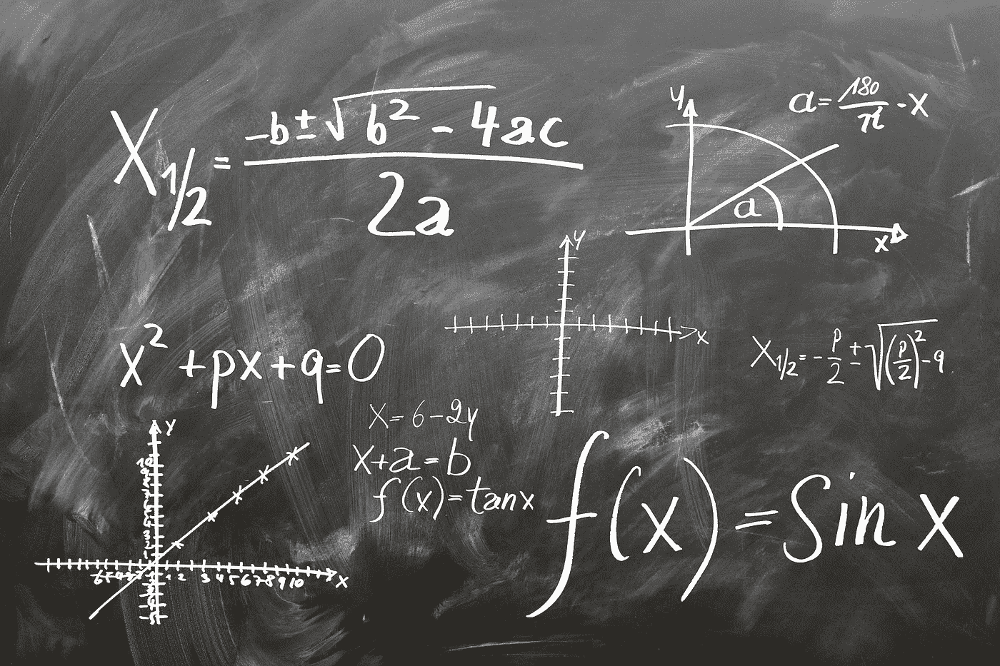

# 目录:

*   **简介**
*   **数学对象**
*   **计算规则**
*   **矩阵乘法性质**
*   **求逆和转置**
*   **总结**
*   **资源**

# 介绍

线性代数是数学的一种连续形式，应用于整个科学和工程领域，因为它允许您对自然现象建模并有效地计算它们。因为它是一种连续而非离散的数学形式，许多计算机科学家对此没有太多的经验。线性代数也是几乎所有数学领域的核心，如几何和泛函分析。它的概念是理解机器学习背后的理论的一个至关重要的先决条件，特别是如果你正在使用深度学习算法。在开始机器学习之前，您不需要了解线性代数，但在某些时候，您可能希望更好地了解不同的机器学习算法在幕后是如何工作的。这将帮助你在机器学习系统的开发过程中做出更好的决策。所以如果你真的想成为这个领域的专业人士，你就必须掌握线性代数中对机器学习很重要的部分。在线性代数中，数据由线性方程表示，线性方程以矩阵和向量的形式呈现。因此，您主要是在处理矩阵和向量，而不是标量(我们将在下一节讨论这些术语)。当您拥有合适的库(如 Numpy)时，只需几行代码就可以非常容易地计算复杂的矩阵乘法。(注:这篇博文忽略了对机器学习不重要的线性代数概念。)

# 数学对象

# 数量

标量就是一个简单的数字。例如 24。

# 矢量

向量是有序的数字数组，可以在行或列中。向量只有一个索引，它可以指向向量中的一个特定值。例如，V2 指的是向量中的第二个值，在上图中是-8。

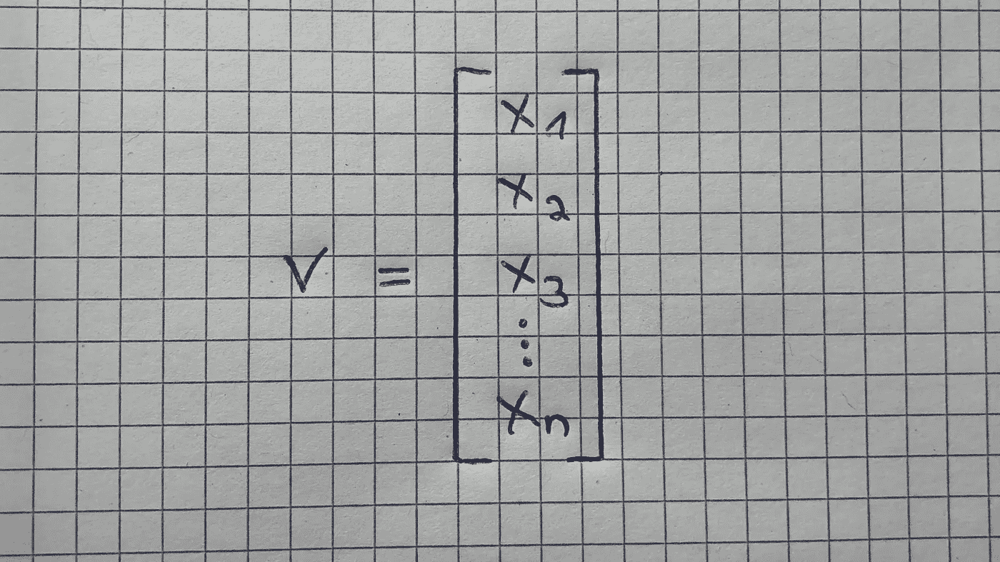

# [数]矩阵

矩阵是有序的 2D 数列，它有两个指数。第一个指向行，第二个指向列。例如，M23 指的是第二行第三列中的值，即上面黄色图形中的 8。一个矩阵可以有多个行数和列数。请注意，向量也是矩阵，但只有一行或一列。

黄色图形示例中的矩阵也是一个 2×3 维矩阵(行×列)。下面你可以看到矩阵及其符号的另一个例子:

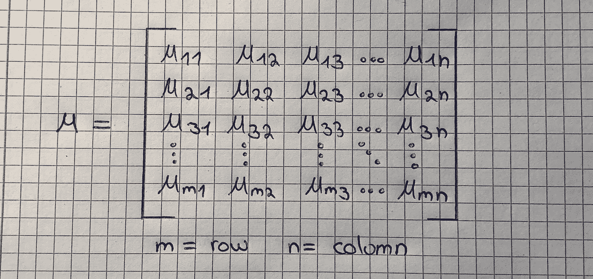

# 张量

你可以把张量想象成一个排列在规则网格上的数字阵列，轴的数量是可变的。张量有三个索引，第一个指向行，第二个指向列，第三个指向轴。例如，T232 指向第二行、第三列和第二个轴。这是指下图中右侧张量的值 0:

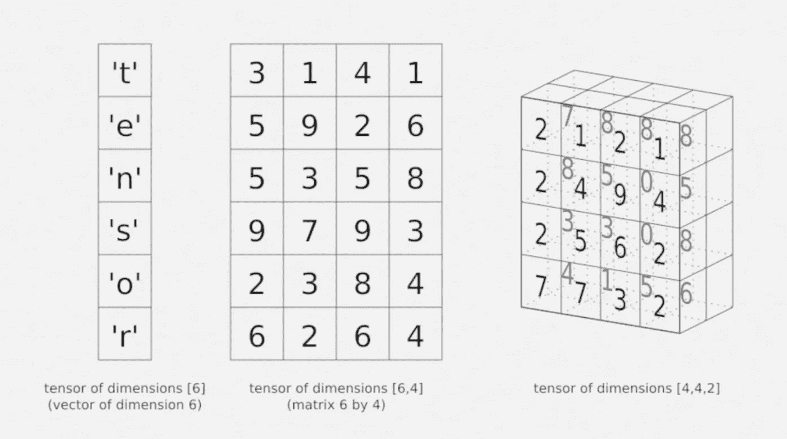

张量是上述所有概念中最通用的术语，因为张量是一个多维数组，它可以是一个向量，也可以是一个矩阵，这取决于它所包含的索引数。例如，一阶张量是一个向量(1 个索引)。二阶张量是一个矩阵(2 个指数)，三阶张量(3 个指数)和更高阶张量称为高阶张量(3 个或更多指数)。

# 计算规则

# 1.矩阵标量运算

如果你对一个矩阵进行乘、除、减或加标量，你对矩阵的每个元素都要这样做。下图完美地说明了乘法的这一点:

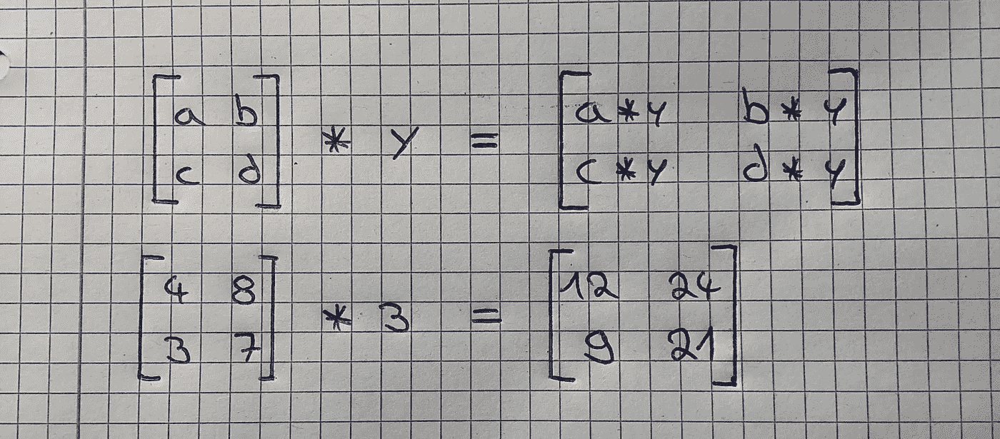

# 2.矩阵向量乘法

矩阵乘以向量可以被认为是矩阵的每一行乘以向量的列。输出将是一个与矩阵行数相同的向量。下图显示了这是如何工作的:

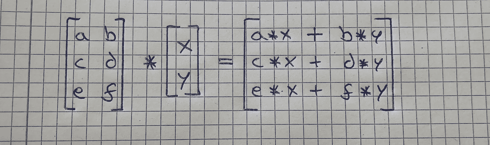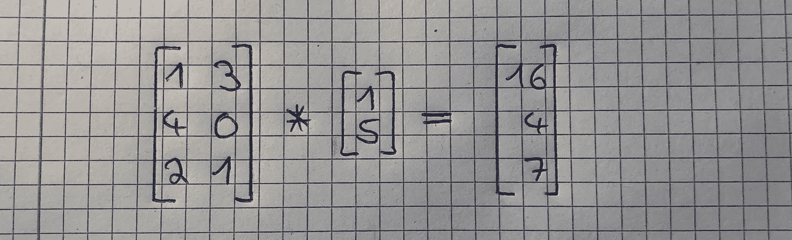

为了更好地理解这个概念，我们将通过计算第二个图像。为了得到结果向量的第一个值(16)，我们取要与矩阵相乘的向量的数字(1 和 5)，然后将它们与矩阵第一行的数字(1 和 3)相乘。这看起来像这样:

1*1 + 3*5 = 16

我们对矩阵第二行中的值做同样的处理:

4*1 + 0*5 = 4

再次对于矩阵的第三行:

2*1 + 1*5 = 7

这是另一个例子:

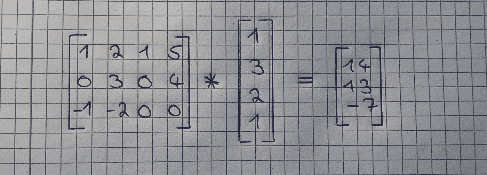

这是一种小抄:

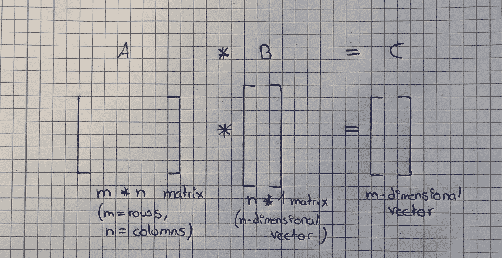

# 3.矩阵-矩阵加法和减法

矩阵-矩阵的加法和减法相当简单明了。要求是矩阵具有相同的维数，并且结果是矩阵也具有相同的维数。您只需将第一个矩阵的每个值与其在第二个矩阵中的对应值相加或相减。见下文:

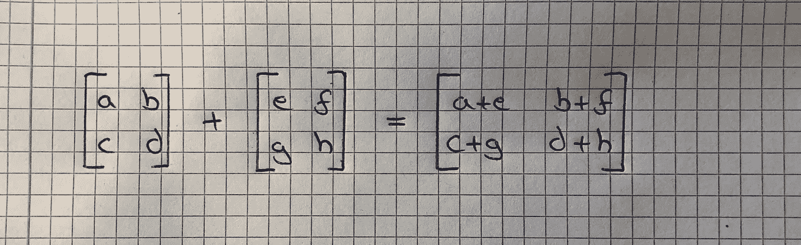

# 4.矩阵-矩阵乘法

如果你知道如何将一个矩阵乘以一个向量，那么将两个矩阵相乘也并不难。请注意，只有当第一个矩阵的列数与第二个矩阵的行数匹配时，才能将矩阵相乘。结果将是一个与第一个矩阵行数相同、与第二个矩阵列数相同的矩阵。它的工作原理如下:

您只需将第二个矩阵分解成列向量，并将第一个矩阵分别乘以这些向量。然后你把结果放入一个新的矩阵(*而不*把它们加起来！).下图一步步解释了这一点:

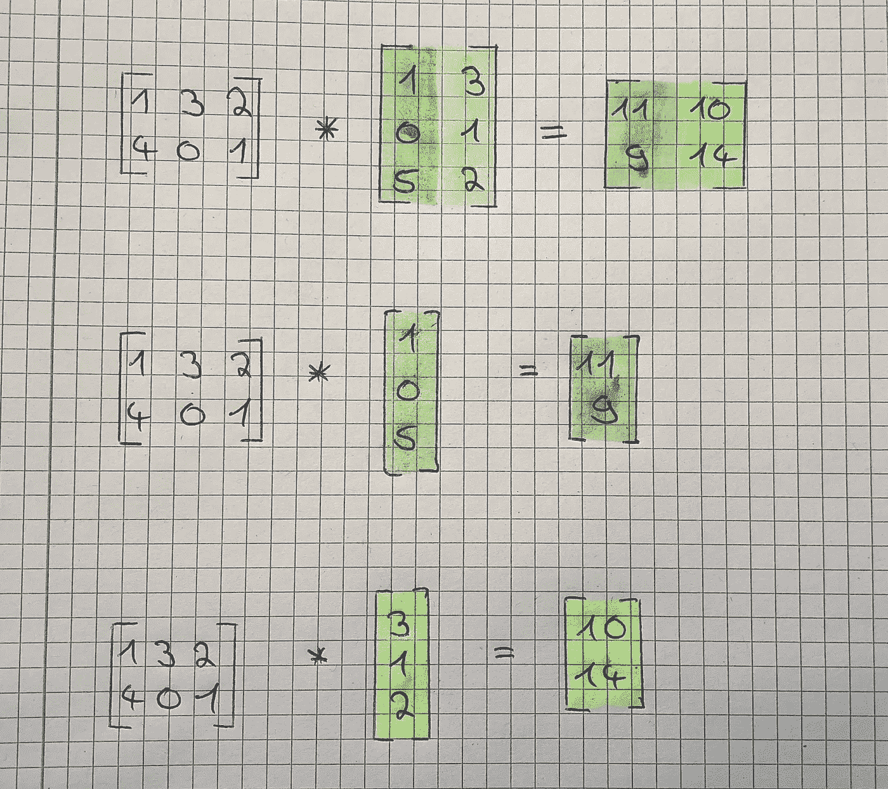

这又是一张小抄:

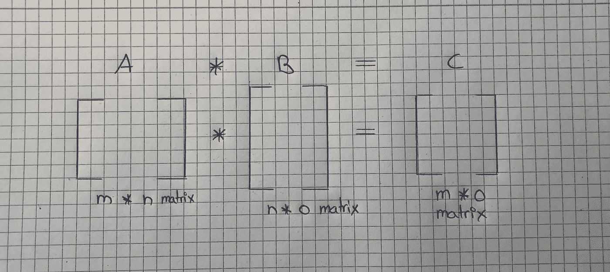

# 矩阵乘法性质

矩阵乘法有几个特性，允许我们将大量计算捆绑到一个矩阵乘法中。我们将在下面逐一讨论。我们首先用标量来解释这些概念，然后用矩阵来解释，因为这会让你更好地理解这个过程。

# 1.不可交换

标量乘法是可交换的，但矩阵乘法不是。这意味着当我们乘标量时，7*3 和 3*7 是一样的。但是当我们把矩阵相乘时，A*B 和 B*A 不一样。

# 2.联合的

标量乘法和矩阵乘法都是结合律。这意味着标量乘法 3(5*3)与(3*5)3 相同，矩阵乘法 A(B*C)与(A*B)C 相同。

# 3.分布的

标量乘法和矩阵乘法也是分布式的。这意味着
3(5 + 3)与 3*5 + 3*3 相同，A(B+C)与 A*B + A*C 相同

# 4.单位矩阵

单位矩阵是一种特殊的矩阵，但是首先，我们需要定义什么是单位矩阵。数字 1 是一个恒等式，因为你乘以 1 的所有东西都等于它本身。因此，每个矩阵乘以一个单位矩阵等于它自己。例如，矩阵 A 乘以它的单位矩阵等于 A。

你可以通过一个事实来识别一个单位矩阵，即它的对角线上有 1，而其他值都是 0。它也是一个“方阵”，这意味着它的行数与列数相匹配。

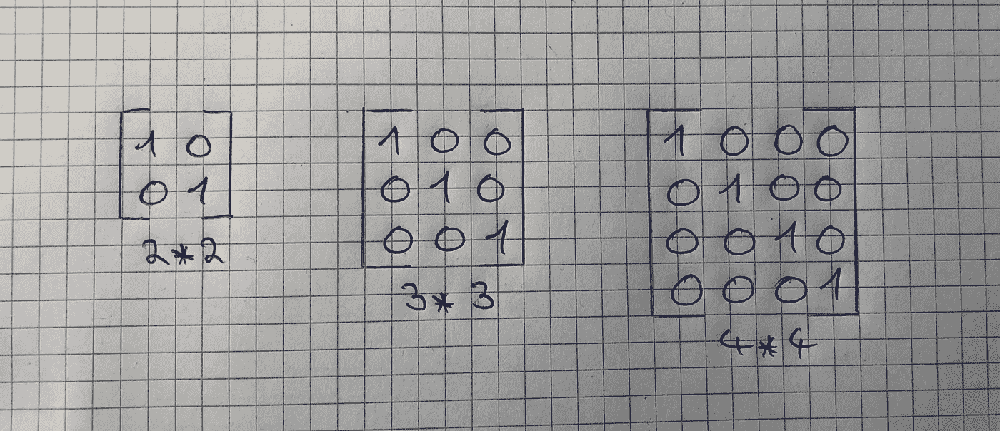

我们之前讨论过矩阵乘法是不可交换的，但有一个例外，即如果我们用一个单位矩阵乘以一个矩阵。因此，以下等式成立: **A*I = I*A = A**

# 反转和转置

矩阵求逆和矩阵转置是两种特殊的矩阵性质。同样，我们将从讨论这些性质如何与实数相关开始，然后讨论它们如何与矩阵相关。

# 1.相反的

首先，什么是逆？一个数乘以它的倒数等于 1。请注意，除了 0 以外，每个数字都有一个倒数。如果你把一个矩阵乘以它的逆矩阵，结果就是它的单位矩阵。下面的例子展示了标量的反函数是什么样子的:

但不是每个矩阵都有逆矩阵。如果一个矩阵是“方阵”并且有逆矩阵，你可以计算它的逆矩阵。不幸的是，讨论哪些矩阵有逆矩阵超出了这篇文章的范围。

为什么我们需要一个逆？因为我们不能分解矩阵。没有除以矩阵的概念，但是我们可以用逆矩阵乘以一个矩阵，结果本质上是一样的。

下图显示了一个矩阵乘以它的逆矩阵，从而得到一个 2 乘 2 的单位矩阵。

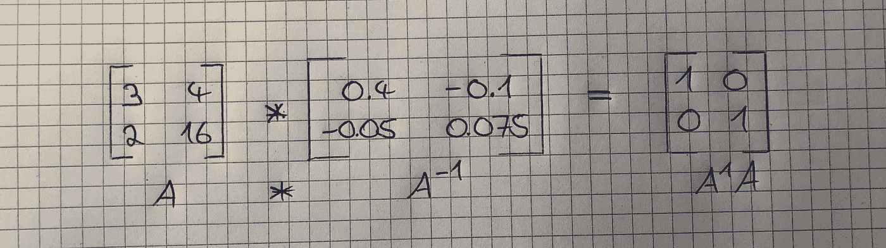

使用 Numpy 可以很容易地计算矩阵的逆矩阵(如果有的话)。以下是文档的链接:[https://docs . scipy . org/doc/numpy-1 . 14 . 0/reference/generated/numpy . Lina LG . inv . html](https://docs.scipy.org/doc/numpy-1.14.0/reference/generated/numpy.linalg.inv.html)。

# 2.移项

最后，我们将讨论矩阵转置的性质。这基本上是一个矩阵的镜像，沿着 45 度轴。得到矩阵的转置是相当简单的。它的第一列是矩阵转置的第一行，第二列是矩阵转置的第二行。将 m*n 矩阵转换成 n*m 矩阵。同样，A 的 Aij 元素等于 Aji(转置)元素。下图说明了:

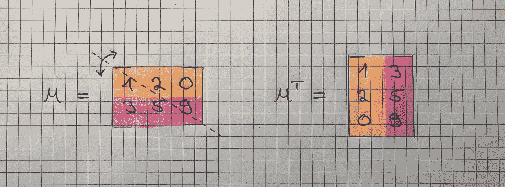

# 摘要

在本文中，您了解了机器学习中使用的线性代数的数学对象。你学会了如何乘、除、加、减这些数学对象。此外，你已经了解了矩阵的最重要的性质，以及为什么它们使我们能够进行更有效的计算。除此之外，你已经学习了什么是逆矩阵和转置矩阵，以及你可以用它们做什么。虽然机器学习中也使用线性代数的其他部分，但这篇文章为您提供了最重要概念的适当介绍。

# 资源

[深度学习(书)——伊恩·古德菲勒、约书亚·本吉奥、亚伦·库维尔](https://www.amazon.de/Deep-Learning-Adaptive-Computation-Machine/dp/0262035618/ref=sr_1_1?s=books-intl-de&ie=UTF8&qid=1521294134&sr=1-1&keywords=deep+learning)

[https://machine learning mastery . com/linear-algebra-machine-learning/](https://machinelearningmastery.com/linear-algebra-machine-learning/)

[吴恩达在 Coursera 上的机器学习课程](https://www.coursera.org/learn/machine-learning)

[https://en.wikipedia.org/wiki/Linear_algebra](https://en.wikipedia.org/wiki/Linear_algebra)

[https://www . mathsisfun . com/algebra/scalar-vector-matrix . html](https://www.mathsisfun.com/algebra/scalar-vector-matrix.html)

[https://www . quant start . com/articles/scalar-vectors-matrix-and-tensors-用于深度学习的线性代数-第一部分](https://www.quantstart.com/articles/scalars-vectors-matrices-and-tensors-linear-algebra-for-deep-learning-part-1)

[https://www . aplustopper . com/understanding-scalar-vector-quantities/](https://www.aplustopper.com/understanding-scalar-vector-quantities/)

 [## 向量和矩阵

### 向量是机器学习中最重要的概念之一，因为许多错误都是由于拥有矩阵/向量…

machinelearning-blog.com](https://machinelearning-blog.com/2017/11/04/calculus-derivatives/) 

【https://machinelearning-blog.com】这个帖子最初发表在我的博客上(**【T10”)。**