# R:预测电影受欢迎程度中的线性和贝叶斯建模

> 原文：<https://towardsdatascience.com/linear-and-bayesian-modelling-in-r-predicting-movie-popularity-6c8ef0a44184?source=collection_archive---------4----------------------->

## 该选哪部电影？

让我们想象一个雨天。你透过窗户向外望去，一切都是灰色的，冰冷的。你抓起你的毯子，坐在你最喜欢的沙发上；这里非常舒适，你刚刚决定这是看电影的完美一天。你想看一部好电影，或者至少是受欢迎的电影。你有几个选择，但其中一些甚至没有在典型的电影网站评级！能够预测人们对这些电影的看法不是很好吗？好吧，也许有解决的办法。根据一些特征来预测一部电影的人气怎么样？我们只需要一个包含电影、一些统计工具和 R studio 的数据集。

在我们的数据集中，有 651 部 ***随机抽样的*** 电影在 1970 年至 2016 年期间在美国电影院上映。数据从[烂番茄](https://www.rottentomatoes.com/)和 [IMDB](https://www.imdb.com/) 获得。该数据集包含每部电影的 32 个特征，包括流派、美国电影协会评分、制作工作室以及它们是否获得奥斯卡提名等特征。所以现在，我们可以问自己:

> 一部电影的受欢迎程度可以通过考虑它的某些特征来预测吗，比如类型、流派、美国电影协会评分、IMDb 票数以及它是否获奖？

在继续开发任何模型之前，我们需要回答两个问题:*我们的结果可以推广吗？* *当前数据集可以做哪种类型的推断？。*对于第一个问题，我们可以注意到，该数据集中包含的电影是从上述两个来源中随机采样的，并且采样方法没有产生任何偏差，因此，我们可以假设所获得的结果可以****推广到 1970 年到 2016 年*** 之间上映的所有美国电影。另一方面，这是一项*观察性研究*，因此从该数据中可以发现的关系表明 ***关联*** ，而*不是因果关系*。*

*准备好开始了吗？等一下。我们所理解的一部电影的“流行”是什么？我们的数据集包括来自两个不同来源的电影样本，我们有两个变量可以潜在地用作*流行度* : `audience_score`(烂番茄上的观众评分)和`imdb_rating`(IMDB 上的评级)。让我们继续分析这两个变量。首先，我们将检查这些变量之间是否存在相关性。为此，我们将在散点图中绘制两个变量:*

*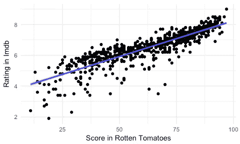*

*我们可以看到，该图显示了两个变量之间可能的正相关关系。我们将通过使用函数`cor`对相关性进行数值计算来确认这一点:*

*正如我们所观察到的，这两个变量之间有很高的相关性。如果我们要将其中一个变量作为响应，最好不要将另一个变量作为自变量。所以我们需要决定选择哪一个作为响应变量。我们可以利用`histogram`和汇总统计来分析它们的分布，做出明智的选择。让我们从`imbd_rating`开始:*

*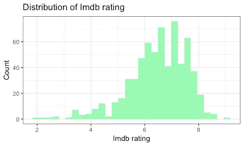**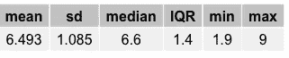*

*然后，我们可以对`audience_score`做同样的事情:*

*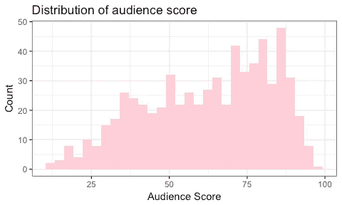**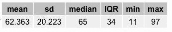*

*我们可以看到，变量`imbd_rating`显示了一个接近正态的分布，其平均值为 6.493，中位数为 6.00。另一方面，变量`audience_score`显示出更均匀的分布，平均值为 62.36，中位数为 65.00。因为它的分布，我们将选择只考虑`imdb_rating`。*

*在决定将哪个变量作为我们的响应变量后，我们需要*探索我们的解释变量*。我们可以分析我们感兴趣的变量的分布，包括在我们的模型中，通过绘制每个变量的直方图，并获得总结描述表。对于那些**分类**的变量，我们可以使用内置函数`table`创建一个比例表。另一方面，我们可以为**连续变量**创建一个数据框，并应用函数`summary`。我不会在这里展示整个代码，但是例如，在我们的数据集中，分析显示投票数的分布是右偏的。为了对此进行调整，我们可以对这些值进行对数转换(`log_votes`)。*

*之后，我们可以分析我们的探索变量和响应变量之间的相互作用。对于这项任务，我们可以根据探索变量是数值型还是分类型来绘制箱线图或散点图。我将只展示重要的发现。*

*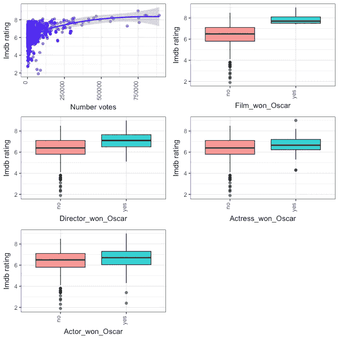*

*从获得的情节和概要描述中，可以看出，在我们的数据集中，那些获得过奥斯卡奖的电影或导演获得过奥斯卡奖的电影似乎具有稍高的评级。此外，给出的投票数显示了与 IMDB 评级的微弱正相关。最后，变量`best_actor_win`和`best_actress_win`看起来具有相同的分布，并且与`imdb_rating`有相似的关联，所以我们将把这两个变量合并成一个新的变量`main_oscar_win`。*

*现在，我们对我们的反应变量有了一个很好的想法，也暗示了哪些变量对预测一部电影的受欢迎程度可能很重要。*是时候开始建模了！*。我们将采取两种方法:首先，我们将做一个多元线性回归，然后，我们将开发一个贝叶斯模型。*

***多元线性回归模型***

*多元线性回归试图通过对数据拟合线性方程来模拟两个或多个独立变量或解释变量与响应变量之间的关系。*

*我们的目标是达成一个**简洁的模型**，这就是更简单的模型，具有巨大的解释预测能力。为了做到这一点，我们有两个模型选择选项:向前选择和向后排除。在第一种情况下，我们从一个空模型开始，一次添加一个预测器。我们将选择第二个选项:向后排除意味着从包含所有候选的模型开始，并且一次丢弃一个预测器，直到达到最节省的模型。在我们的例子中，我们的第一个完整模型将包括我们之前发现的对预测电影受欢迎程度可能很重要的六个变量:`genre`、`best_pic_win`、`best_dir_win`、`main_oscar_win`、`log_votes`和`mpaa_rating`。在 R 中，我们可以使用函数`lm`建立一个线性模型:*

*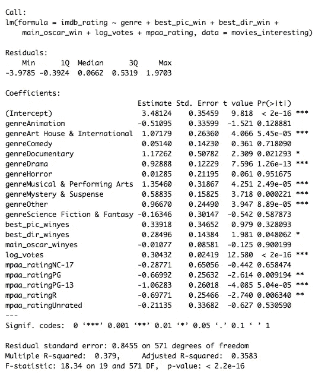*

*现在我们有了完整的模型，我们可以使用几个标准来删除变量:p 值和调整后的 R。我们将选择 p 值作为排除标准，因为在这种情况下，我们的目标是创建一个仅使用具有显著性的变量来显示最高预测值的模型。*

*在运行包含所有相关变量的完整模型后，我们获得了 0.3582 的调整后 R，这意味着我们仍然可以改进模型。为了做到这一点，我们可以从每次移除具有最高 p 值的变量开始，直到模型中剩余的所有变量都是显著的。所以我们模型中 p 值最高的变量是`main_oscar_win`。*

*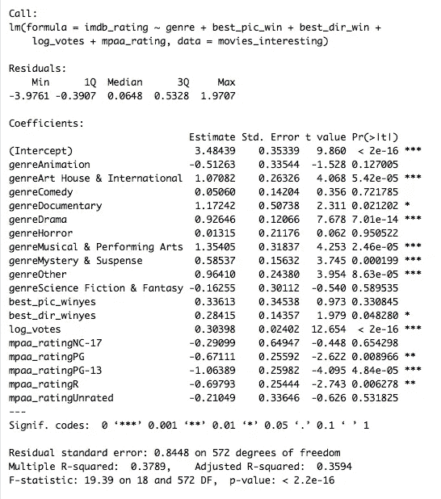*

*再次运行我们的简单模型后，我们可以看到现在我们调整后的 R 是 0.3594。我们可以通过再次消除具有最高 p 值的变量来进一步改进我们的模型。这种情况下会是`best_pic_win`。*

*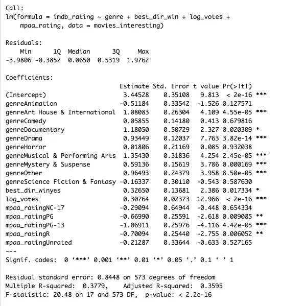*

*我们现在看到，调整后的 R 是 0.3595，与我们之前在步骤 1 中的模型没有不同，但不同的是，这次涉及的所有变量都是显著的。出于实际考虑，我不会在这里展示它，但移除任何其他变量都会降低调整后的 R。因此，我们认为这是我们的最终模型。*

*对于线性回归，有一个非常重要的概念需要记住:**共线性。**当两个变量高度相关时，它们被认为是共线的。包含共线预测值使模型估计变得复杂。*

*因此，在这一点上，我们可以看看我们的变量，看看我们感兴趣的变量是否显示某种程度的共线性。在我们的数据集中，我们有混合变量，这是因为我们有一些分类变量和一些连续变量，所以在这种情况下，测量共线性的一种方法是使用 ***方差膨胀因子* (VIF) *。*** 用于量化普通线性回归中多重共线性程度的 VIF，计算为包含多个项的模型的方差与仅包含一个项的模型的方差之比。简而言之，它告诉我们由于模型中存在共线性，回归系数的方差增加了多少。所以，让我们来计算一下:*

*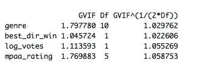*

*我们的预测值都没有很高的 VIF，所以我们可以假设多重共线性在我们的模型中不起作用。*

*现在，是时候在我们模型中运行一些诊断了。多元回归模型取决于以下四个假设:*

1.  *每个数字解释变量与响应变量线性相关*
2.  *残差接近正态分布，平均值为 0*
3.  *残差的可变性几乎是恒定的*
4.  *残差是独立的*

*我们将在我们的模型环境中逐一测试这些假设:*

1.  *我们模型中唯一的数字变量是`log_values`。因此，我们可以通过检查残差图来探索第一个假设。*

*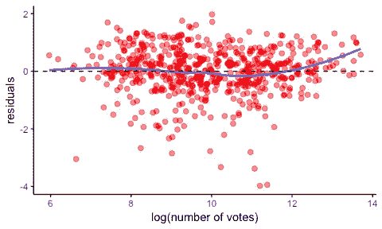*

*该图显示残差在 0 附近随机分散，这表明数值探索变量和响应变量之间存在线性关系。*

*2.为了检查这种情况，我们将首先执行残差直方图，然后执行残差 Q-Q 图。*

*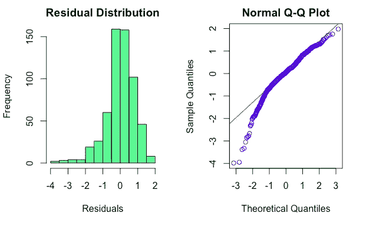*

*正如我们在上面看到的，分布直方图和残差 Q-Q 图显示接近正态分布，也模拟了在原始`imdb rating`变量中观察到的左侧偏斜。*

*3.现在，我们需要检查残差对于预测响应变量的低值和高值是否同样可变。然后，我们将检查残差与预测值的关系图。*

*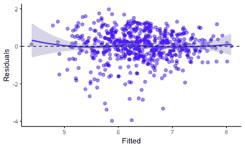*

*残差随机分散在宽度为 0 左右的恒定带中。*

*4.最后，我们将检查残差的独立性:*

*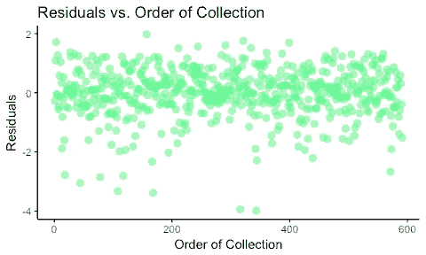*

*上面的图没有显示任何特定的模式，所以可以假设残差是独立的，因此观察值也是独立的。*

***贝叶斯模型***

*通常，我们被教导用传统的频率统计来解决问题。然而，还有另一种方法，它有时因主观而被削弱，但它更直观或更接近我们在日常生活中思考概率的方式，但却是一种非常强大的工具:**贝叶斯统计**。这个理论所依赖的一些关键概念有:*条件概率*和*贝叶斯定理。**

*条件概率是在一个事件发生的情况下，另一个事件发生的概率。如果已知或假设事件 B 已经发生，那么我们感兴趣的事件 A 给定 B 的条件概率就写成 *P* (A|B)。*

*当两个事件是独立的，意味着 A 的发生不影响 B 的发生时，A 和 B 的*合取概率*(换句话说，两个事件都为真的概率)写成 *P* ( *A 和 B* )= P(A) P(B)。但如果 A 条件 B 发生则不是这样，这里的合取概率是*p*(*A*B)=*p*(*A*)*p*(*B*|*A*)。*

*这里，经过一些数学计算后，可以推导出*贝叶斯定理*，并表示如下:*

**p*(*A*|*B*)=*p*(*A*)*p*(*B*|*A*/*p*(*B*)*

*换句话说:给定的 B 发生的概率等于 A 发生的无条件概率乘以 A 发生时 B 发生的概率，再除以 B 的无条件概率。*

*这个定理有一个强大的解释，叫做**历时解释**，意思是随着时间的推移，一些事情正在发生，它提供了一个工具来更新假设提供新数据的概率。在这种解释中，我们方程中的术语隐含着一些其他的概念:*

*   **p* ( *A* )是我们看到数据之前假设的概率，叫做先验概率，或者就叫**先验**。*
*   **p* (A|B)是我们的目标，这是我们看到数据后假设的概率，称为**后验**。*
*   **p* ( *B* |A)是假设下数据的概率，称为**似然**。*
*   **p* ( *B* )是数据在任何假设下的概率，称为**归一化常数**。*

*当我们想要在贝叶斯方法下建立一个模型时，有一个元素是关键的:贝叶斯因子。*贝叶斯因子*是两个竞争假设(通常是无效假设和替代假设)的似然概率之比，它帮助我们量化一个模型对另一个模型的支持。在贝叶斯建模中，先验分布的选择是分析的关键组成部分，可以修改我们的结果；然而，当我们添加更多的数据时，先验开始变弱。当分析师没有太多先验信息时，非信息先验是方便的。*

*在 R 中，我们可以使用`BAS`包进行贝叶斯回归。我们将使用贝叶斯模型平均( **BMA** )，它提供了一种解释模型不确定性的机制，并且我们需要指出函数的一些参数:*

*先验:**策尔纳-西奥·柯西**(使用针对多变量情况扩展的[柯西分布](https://en.wikipedia.org/wiki/Cauchy_distribution)*

*模型先验:统一(为所有模型分配相等的概率)*

*方法:[马尔可夫链蒙特卡罗](https://en.wikipedia.org/wiki/Markov_chain_Monte_Carlo) ( **MCMC** )(提高模型搜索效率)*

*我们现在将打印为该模型获得的边际包含概率:*

*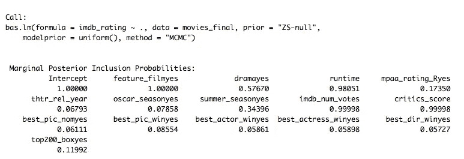*

*之后，我们可以使用函数`summary`来查看变量包含的零一指标的前 5 个模型。*

*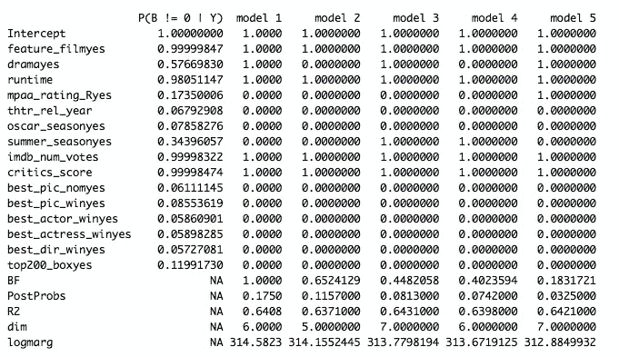*

*它还显示了一个列，该列具有最高概率模型的每个模型的贝叶斯因子( *BF* )、模型的后验概率(*postpross*)、模型的其余部分、模型的维度( *dim* )以及在所选先验分布下的对数边际可能性( *logmarg* )。*

*最后，我们可以利用函数`image`来可视化对数后验概率和模型等级。*

*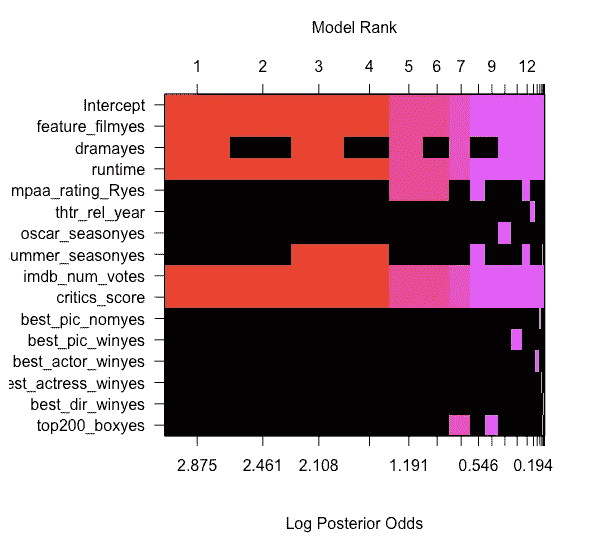*

*在上图中，每一行对应于完整模型中包含的每个变量，还有一行用于截距。在每一列中，我们可以看到所有可能的模型(2 个⁶，因为我们有 16 个变量)按后验概率排序，从最好到最差排列在顶部(从左到右)。*

*从上面的模型和图片可以看出:
> `feature_film`边际概率为 0.999， 并且出现在所有五个顶级模型中的
> `critics_score`边际概率为 0.999 并且也出现在所有五个顶级模型中的
> `runtime`边际概率为 0.98 并且出现在所有五个顶级模型中的
> `drama`边际概率为 0.57 并且出现在五个顶级模型中的三个
> `imbd_num_votes`边际概率为 0.99 并且出现在五个顶级模型中的三个
>*截距* 也有边际概率为 1，出现在所有五大顶级型号

据此，最佳型号包括截距、`feature_film`、`critics_score`、`drama`、`imbd_num_votes`和`runtime`*

*我们现在可以获得 BMA 下的系数估计和标准差，以便能够检查重要变量系数的边际分布。为此，我们将使用函数`coef`并使用`plot`绘制它们*

*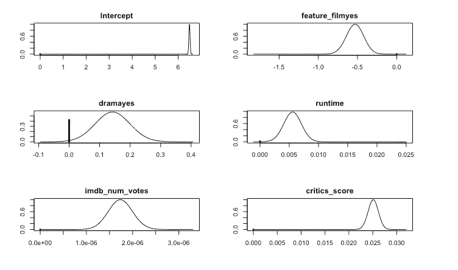*

*垂直线对应于系数等于 0 的后验概率。另一方面，成形曲线显示了系数非零的可能值的密度。值得一提的是，线的高度与其概率成比例。这意味着截距和`feature_film`、`critics_score`、`imbd_num_votes`和`runtime`没有表示非零概率的线。*

*最后，我们可以使用`confint`方法获得系数的 95%可信区间(真实均值包含在给定区间内的概率为 0.95)。*

*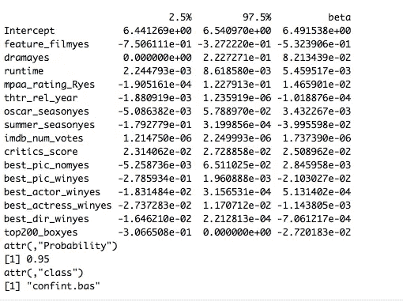*

*`BAS`包为我们提供了一种简单的方法，只需使用函数`plot`和`which`选项就可以获得模型的图形摘要。*

1.  *残差与拟合图*

*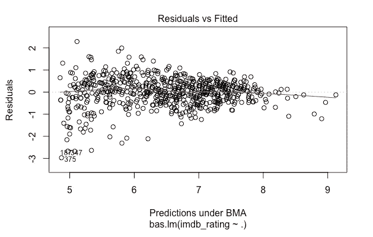*

*理想情况下，我们不会看到异常值或非常数方差。然而，在这种情况下，我们可以看到预测值有一个常数，但有两个异常值。*

*2.模型概率*

*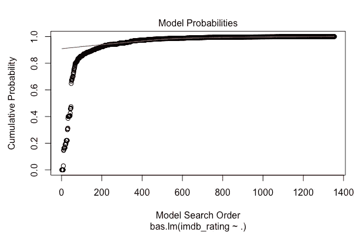*

*此图按采样顺序显示模型的累积概率。该图显示，累积概率在 300 次模型试验后开始变得平稳，因为每个额外的模型仅增加了累积概率的一个小增量。模型搜索在大约 1400 处停止，而不是 2 个⁵组合的枚举。*

*3.模型复杂性*

**

*该图显示了每个模型的维度，即回归系数的数量，包括截距与模型边际可能性的对数。在这种情况下，我们可以看到从 5 到 12 维可以达到最高的对数边际。*

*4.边际包含概率*

*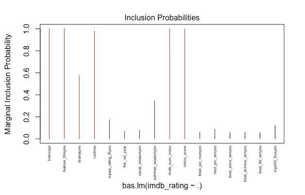*

*在这种情况下，我们可以观察每个协变量的边际后验包含概率，大于 0.5 的边际后验包含概率显示为红色(解释数据和预测的重要变量)。在图表中，我们可以看到之前已经显示的关于哪些变量对最终得分有影响。*

***预测***

**现在是时候测试一下* *我们两款*的预测能力了！我们会用 2016 年上映的电影“ *Zootropolis* ”。相应信息从 [IMDB 网站](https://www.imdb.com/title/tt2948356/?ref_=nv_sr_1)和 [RottenTomatoes](https://www.rottentomatoes.com/m/zootopia) 获得，与分析数据一致。*

****

*正如我们在上面看到的，真实的`imdb_rating`是 8，这与我们的贝叶斯模型预测的非常接近。*

*那么我们能得出什么结论呢？从线性回归和贝叶斯模型中，我们了解到，实际上可以通过考虑每部电影的特征数据来预测电影的受欢迎程度。*

*在线性回归分析中，可以建立一个简洁的、多变量的线性模型，该模型能够在一定程度上预测电影的受欢迎程度，即 IMDb 评分，并选择四个具有统计意义的预测值。然而，重要的是要记住，我们最终模型的调整后 R 仅为 0.3595，因此这意味着 35.95%的可变性由模型解释。在贝叶斯模型中，我们最终得到了一个同样满足贝叶斯假设的简约模型。从这两个模型中，我们可以看出贝叶斯模型的预测更接近真实的 IMDb 评级。*

****参考文献:****

*   *彭罗杰 D. (2016) *探索性数据分析用 R.* [LeanPub](https://leanpub.com/exdata)*
*   *唐尼艾伦 B. (2012) *想想贝叶斯。Python 中的贝叶斯统计。* [绿茶出版社](http://greenteapress.com/wp/think-bayes/)。*