# 线性回归—详细概述

> 原文：<https://towardsdatascience.com/linear-regression-cost-function-gradient-descent-normal-equations-1d2a6c878e2c?source=collection_archive---------0----------------------->

有人问我 ***为什么我们使用线性回归？*我回答了，对于*的预测。*他又问我***什么是预测？*** *我用一个情况回答“假设你和我走在一条路上。我们来到了十字路口，现在我告诉你，我们将直走。这种情况会发生五次。现在在第六个十字路口。我问你我们将走哪条路。你的回答会是，我们会直走。这你说的就叫预测。*他问我下一个问题***我们是怎么做到的？我解释说，每当我们处于十字路口时，我们会查看数据，或者在这种情况下，我以前的回答，并考虑我们假设我们将直走。*****

**什么是线性回归？**这是一种对因变量和自变量之间的关系进行建模的方法。又一个问题**什么是自变量和因变量？现在下图有一些关于房子的数据。我们有“房子的面积”和“房子的成本”。我们可以看到，成本取决于房子的面积，当面积增加时，成本也会增加，当面积减少时，成本也会减少。所以我们可以说**成本是因变量**而**面积是自变量。在线性回归的帮助下，我们将对房屋成本和房屋面积之间的关系进行建模。****

Figure 1 : Example of House(Area vs Cost) Data set

模拟这种关系的最好方法是绘制一张成本和房子面积之间的图表。X 轴表示房屋的*面积，Y 轴*表示*造价。**回归会怎样？它将尝试通过这些点拟合直线。左图显示绘制的点，右图显示拟合这些点的线。***

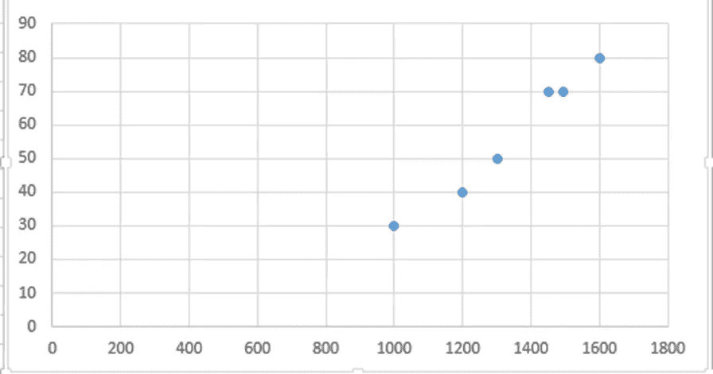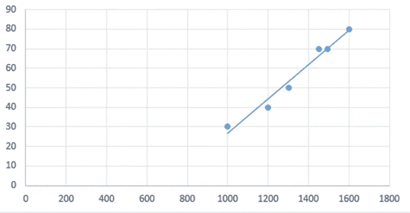

Figure 2 :Plotting Area of the house (X-axis) Vs Cost of house(Y-axis)

如果我们想借助上图预测房屋面积为 1100 平方英尺的房子的成本，可以按照下图所示进行，因为你可以看到 1100 平方英尺房子的成本大约是 35。

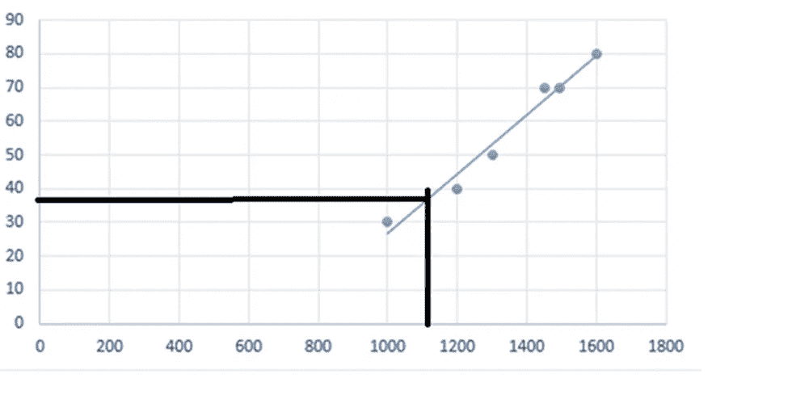

Figure 3 : Finding Cost of House when Area of house is 1100sq feet

在深入之前，我们应该理解一些术语，我将用它们来推导和解释数学解释。

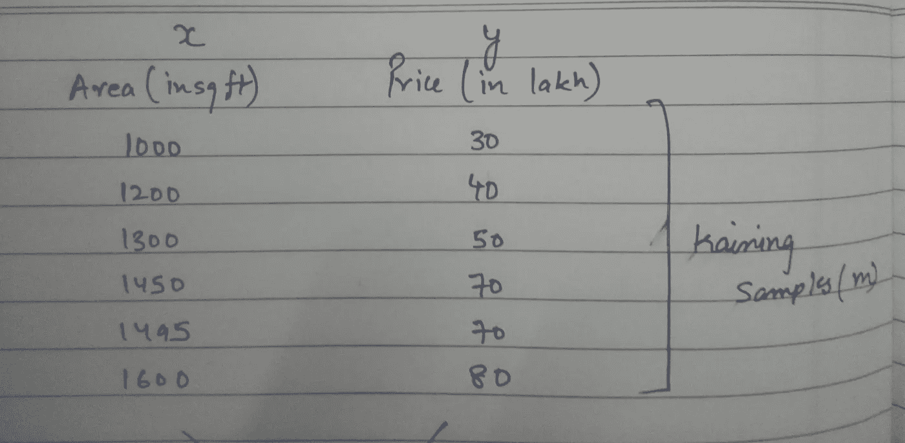

Figure 4: Terms and Notations

*   M :=训练样本
*   x :=输入特征/变量。这些可以不止一个。
*   y :=输出特征/变量。
*   (x，y) :=训练示例。例:(1000，30)

这条线在数学上是如何表示的？

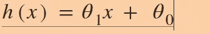

**Figure 5: Hypothesis h(x)**

h(x)在数学上表示线，因为现在我们只有一个输入特征，该方程将是线性方程，它也类似于线方程 *"Y = mx + c "。现在我们来看看选择θ的值会对行产生什么影响。*

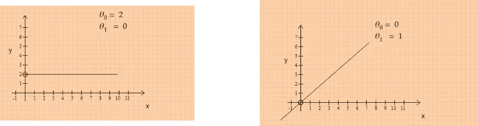

**Figure 6 : The value of theta will have effect the slope and intercept of the line. As you can in left and right images.**

**为什么是线性的？**线性是基本的构建模块。我们将在后面讨论更复杂的问题，这些问题可能需要用到非线性函数或高次多项式

**如何最好地拟合我们的数据？**为了最好地拟合我们的数据，我们必须选择θ的值，使得 h(x)和 y 之间的差异最小。为了计算这个，我们将定义一个误差函数。正如你在下图中看到的。-

*   误差函数由 h(x) — y 之差定义。
*   我们将绝对误差作为误差的平方，因为有些点在线的上方和下方。
*   为了得到所有点的误差，我们使用了求和法。
*   平均，然后除以 2，以使计算更容易。它对总误差没有影响。

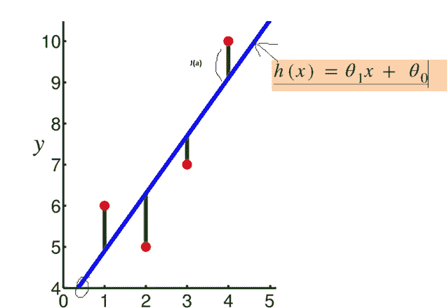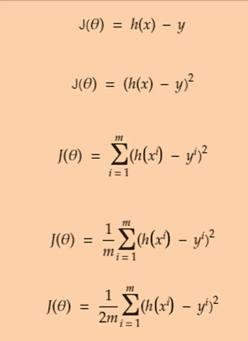

Figure 7 : Error Function Derivation(source : [www.google.com/images)](http://www.google.com/images))

现在来看一下θ和误差函数(J)之间的关系。我们将绘制θ和误差函数之间的图表。右下角的图像显示了 X 轴代表θ，Y 轴代表 J(θ)误差函数的图形。我们将假设θ0 为零。这意味着直线将始终通过原点。

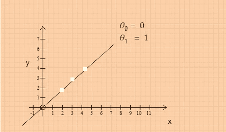

Figure 8.1 : Plotting h(x) when theta_0 = 0 and theta_1 = 1

*   我们假设了一些点(1，1)，(2，2)，(3，3)，并假设θ0 = 0，θ1 = 1。我们计算了误差，显然它将是零。

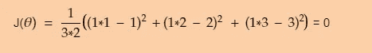

Figure 8.2 : Calculation Of Error for Figure 8.1

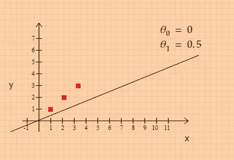

Figure 8.3 : Plotting h(x) when theta_0 = 0 and theta_1 = 0.5

*   然后，我们用值 0 和 0.5 重复相同的过程，我们得到的误差是 0.58，你也可以在图像中看到。这条线与给定点不太吻合。

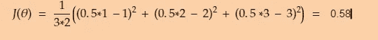

Figure 8.4 : Calculation Of Error for Figure 8.3

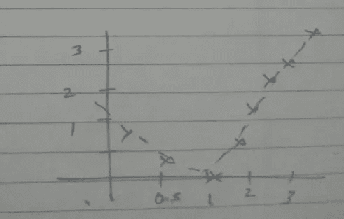

Figure 8.5 : Graph between Error Function and Theta_1

*   现在，如果取更多的θ值，我们会得到一些类似手绘的图(右下角),因为我们可以最小化θ1 = 1

但不幸的是，我们不能总是让θ0 = 0，因为如果我们可以，一些数据点就像下图所示，我们可以采取一些截距，或者我们永远无法达到最佳拟合，而θ0 有一些值，我们将绘制一个 3D 图，如右图所示。它将永远是保龄球形的图形。

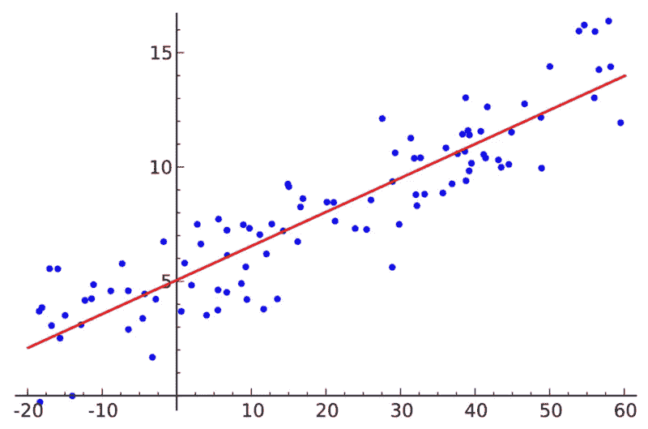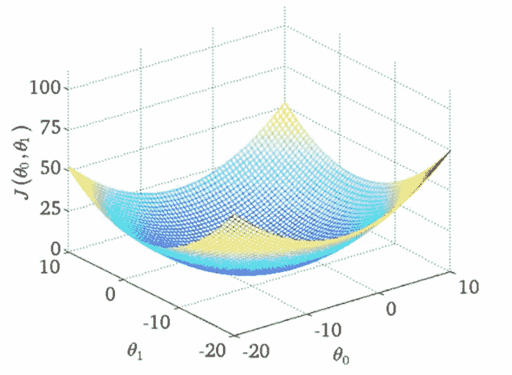

Figure 9 : 3D plot while considering both Theta(source : [www.google.com/images)](http://www.google.com/images))

3D 再现很难研究。所以我们不会研究它们。我们将在 2D 绘制它们也被称为**等高线图**

在下图中，你会看到假设的等高线图。这些日食在图像中代表了什么？

*   同一次月食中的任何一点都会给我们相同的误差函数值，因为左下图中用粉色表示的三个点会有相同的误差函数值。
*   红点描述了左侧图像的假设，您将得到θ0(intecept)= 800 和θ1(slope)=-0.5，而在右下图中，θ0(intecept)= 500 和θ1(slope)= 0。所以你可以画一条平行于 x 轴的线。
*   在左图中，红点远离椭圆的中心，线也不是很适合，但在右图中，读数更接近椭圆的中心，线也比左图更适合。因此，我们也可以得出结论，椭圆的中心将是θ的最小值或最佳值，这将最适合给定的数据点

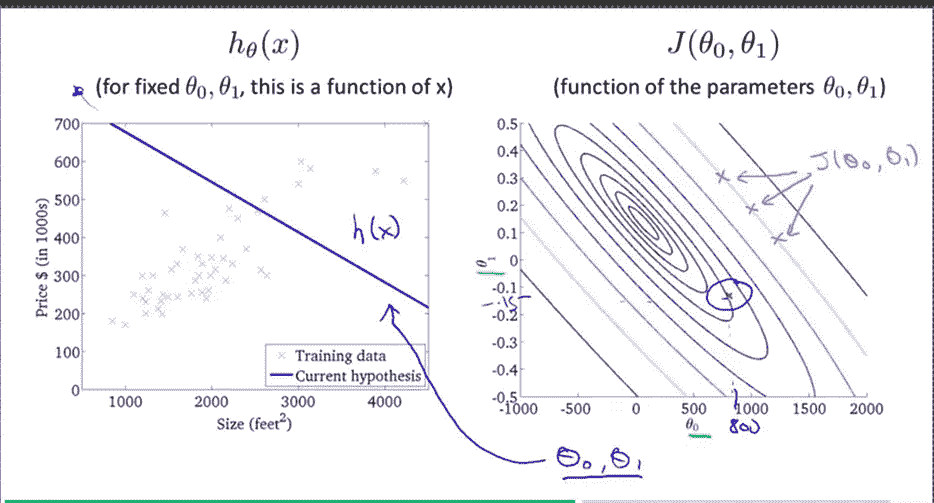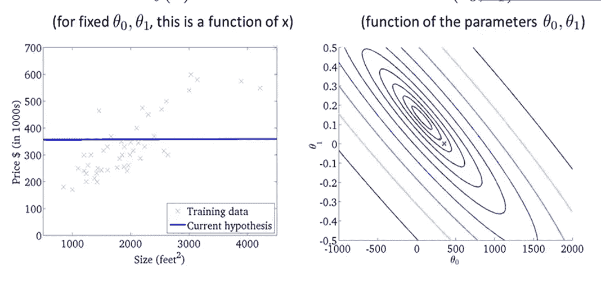

Figure 10 : Contour Plots(source : [www.google.com/images](http://www.google.com/images))

我们已经写了成本函数，但是如何最小化它呢？所以我们有解决问题的方法

*   梯度下降
*   正规方程

# 梯度下降

我们站在山顶，360 度环视四周。我们想朝着走下坡路的方向迈出一小步。在最佳方向的情况下，应该是最陡下降的方向。然后，我们到达一个点，我们遵循相同的步骤，直到我们到达地面的情况下，如下图。

Figure 11 : Gradient Descent (source : [https://codesachin.wordpress.com/tag/gradient-descent/](https://codesachin.wordpress.com/tag/gradient-descent/))

还有一件事。**你确定你会一直达到同样的最小值吗？**我可以保证你不确定。在梯度下降的情况下，你不能确定。让我们来看看山的问题。如果你从右边开始走几步，完全有可能到达完全不同的最小值，如下图所示

Figure 12 : Problem with Gradient Descent(source : [https://codesachin.wordpress.com/tag/gradient-descent/](https://codesachin.wordpress.com/tag/gradient-descent/))

我们将讨论梯度下降的数学互穿，但让我们理解如下一些术语和符号:

*   **阿尔法**是学习率，描述你迈出的步伐有多大。
*   **导数**给出了‘theta’切线的斜率，可以是正的也可以是负的，导数告诉我们将增加或减少‘theta’。
*   同时更新意味着应该同时更新两个θ。

推导将由下式给出

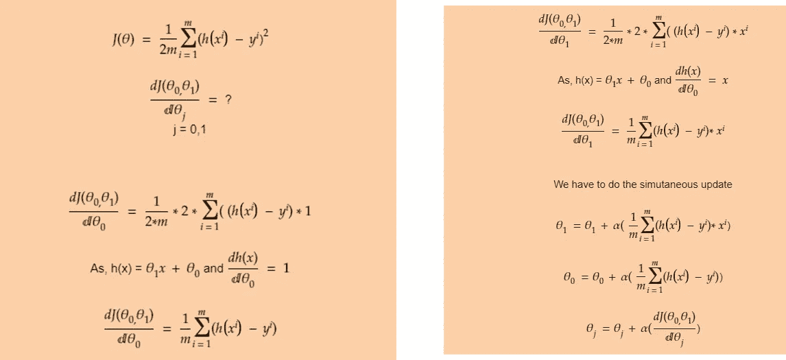

Figure 13 : Gradient Descent Derivation

# 正规方程

由于梯度下降是一个迭代过程，正规方程有助于一次找到最优解。他们使用矩阵乘法。图像中解释了公式和符号。下图将解释我们的例子中的 X 和 y。X 的第一列总是 1，因为它将乘以θ0，我们知道θ0 是我们与轴的截距。

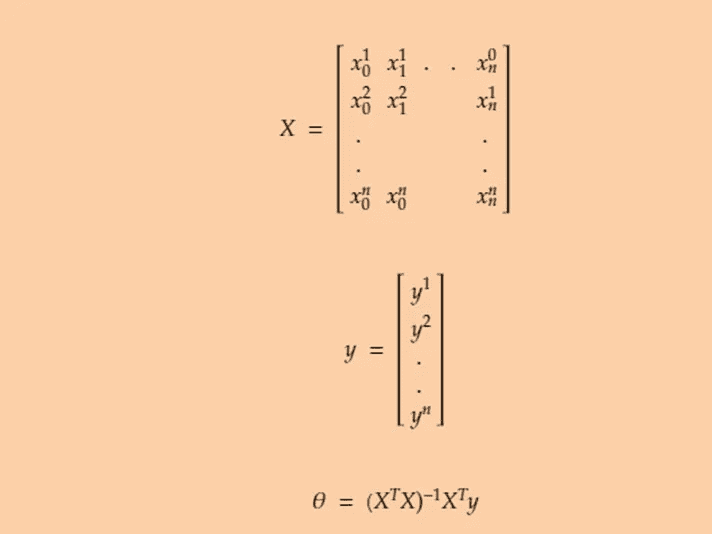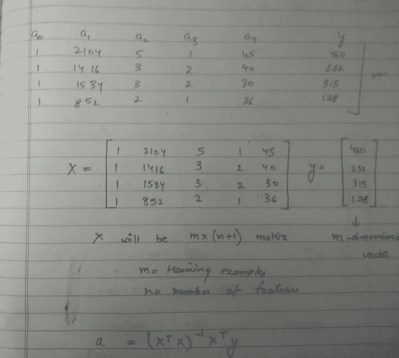

Figure 14 : Normal Equation with Example

下图解释了法线方程的推导过程。他们使用矩阵符号和性质。

这张图片解释了

*   θ矩阵
*   x '矩阵
*   假设被扩展
*   使用这些矩阵，我们可以重写上一步给出的假设

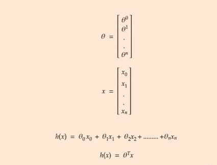

Figure 15: Notations in Normal Equations

图 16 解释了以下内容

*   我们将在误差函数中替换我们的假设。
*   我们假设 z 矩阵如步骤 2 所示
*   误差函数可以重写为步骤 3。所以如果你把 Z 矩阵的转置和 Z 矩阵相乘。我们会得到第一步的等式
*   我们可以分解步骤 2 中的 z，如步骤 4 所示。
*   根据步骤 6 中给出的属性。我们将重写步骤 7 中给出的 z。大写 X 也被称为设计矩阵是小 X 的转置

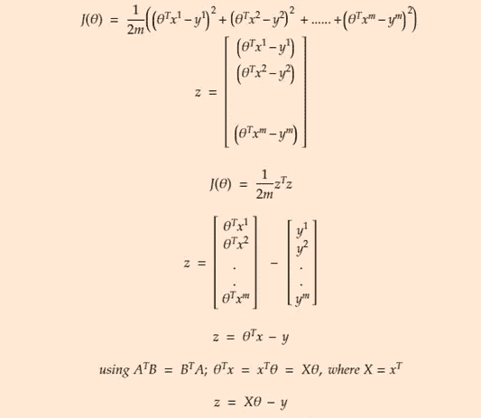

Figure 16 : Normal Equation Derivation Part 1

*   在等式中代入 z
*   展开误差方程，然后对θ求导，使其等于 0。
*   我们会找到解决办法的。如下图所示

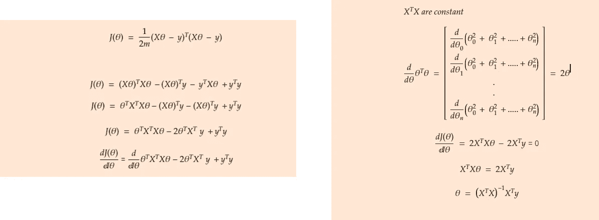

Figure 17: Normal Equation Derivation Part 2

# 梯度下降法与正规方程的比较

*   在梯度下降的情况下，我们需要选择α，θ的初始值，但是正规方程我们不需要选择α或θ。
*   梯度下降是一个迭代过程，而正规方程马上给你答案。
*   随着要素数量的增加，法线方程的计算速度会变慢，但梯度下降在要素数量非常大的情况下表现良好。

我们已经看到，线性回归是一种强大的算法，可用于建立关系模型并基于该关系预测值。我们还讨论了最小化误差的方法，以便我们可以获得我们的参数的最佳值。线性回归在分类问题上表现不佳。我们将在下一篇文章中讨论是什么算法克服了这个限制。继续读。

如果你想和我交流。请随时在 LinkedIn 上与我联系。

 [## Sameer Negi —自动驾驶汽车培训生— Infosys | LinkedIn

### 查看 Sameer Negi 在全球最大的职业社区 LinkedIn 上的个人资料。Sameer 有 3 份工作列在他们的…

www.linkedin.com](https://www.linkedin.com/in/sameer-negi-356881115/)