# 线性回归-详细视图

> 原文：<https://towardsdatascience.com/linear-regression-detailed-view-ea73175f6e86?source=collection_archive---------0----------------------->

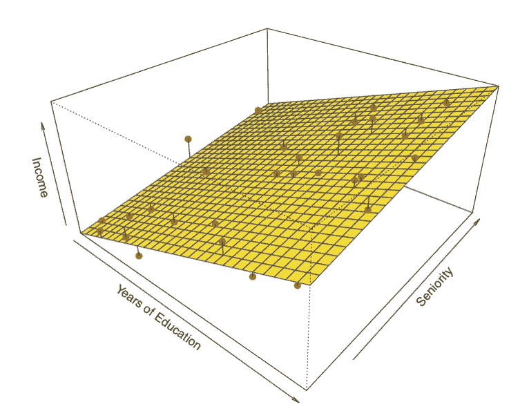

Figure 1 : Linear Regression Graph ( Source: [http://sphweb.bumc.bu.edu/otlt/MPH-Modules/BS/R/R5_Correlation-Regression/R5_Correlation-Regression_print.html](http://sphweb.bumc.bu.edu/otlt/MPH-Modules/BS/R/R5_Correlation-Regression/R5_Correlation-Regression_print.html))

线性回归用于寻找目标和一个或多个预测值之间的线性关系。有两种类型的线性回归-简单和多重。

# **简单线性回归**

简单线性回归有助于发现两个连续变量之间的关系。一个是预测变量或自变量，另一个是响应变量或因变量。它寻找统计关系，而不是确定性关系。如果一个变量可以被另一个精确地表达，那么两个变量之间的关系就是确定的。例如，使用摄氏温度可以准确预测华氏温度。统计关系在确定两个变量之间的关系时不准确。比如身高和体重的关系。

核心思想是获得最适合数据的线。最佳拟合线是总预测误差(所有数据点)尽可能小的线。误差是点到回归线的距离。

(完整代码—[https://github . com/SSaishruthi/Linear _ Regression _ Detailed _ Implementation](https://github.com/SSaishruthi/Linear_Regression_Detailed_Implementation))

***实时例子***

我们有一个数据集，其中包含有关“学习小时数”和“获得分数”之间关系的信息。已经观察了许多学生，记录了他们的学习时间和成绩。这将是我们的训练数据。目标是设计一个模型，如果给定学习的小时数，可以预测分数。使用训练数据，获得将给出最小误差的回归线。这个线性方程然后被用于任何新的数据。也就是说，如果我们给出学生学习的小时数作为输入，我们的模型应该以最小的误差预测他们的分数。

Y(pred) = b0 + b1*x

b0 和 b1 值的选择必须使误差最小。如果将误差平方和作为评估模型的指标，则目标是获得一条最能减少误差的直线。

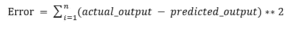

Figure 2: Error Calculation

如果我们不平方误差，那么正负点就会互相抵消。

对于具有一个预测器模型，

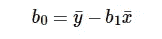

Figure 3: Intercept Calculation

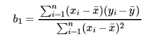

Figure 4: Co-efficient Formula

***探索‘B1’***

*   如果 b1 > 0，那么 x(预测值)和 y(目标值)具有正的关系。也就是 x 的增加会增加 y。
*   如果 b1 < 0, then x(predictor) and y(target) have a negative relationship. That is increase in x will decrease y.

***探索‘B0’***

*   如果模型不包括 x=0，那么预测将变得没有意义，只有 b0。例如，我们有一个关于身高(x)和体重(y)的数据集。取 x=0(即身高为 0)，将使方程只有 b0 值，这是完全没有意义的，因为在实时身高和体重永远不会为零。这是由于考虑了超出其范围的模型值。
*   如果模型包括值 0，那么“b0”将是 x=0 时所有预测值的平均值。但是，将所有预测变量设置为零通常是不可能的。
*   b0 值保证剩余具有平均值零。如果没有' b0 '项，那么回归将被强制越过原点。回归系数和预测都会有偏差。

***系数从正规方程***

除了上述方程外，模型的系数也可以通过标准方程计算。

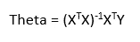

Figure 5: Co-efficient calculation using Normal Equation

θ包含所有预测值的系数，包括常数项“b0”。正规方程通过对输入矩阵求逆来执行计算。计算的复杂性将随着特征数量的增加而增加。当特征的数量变大时，它变得非常慢。

下面是该等式的 python 实现。

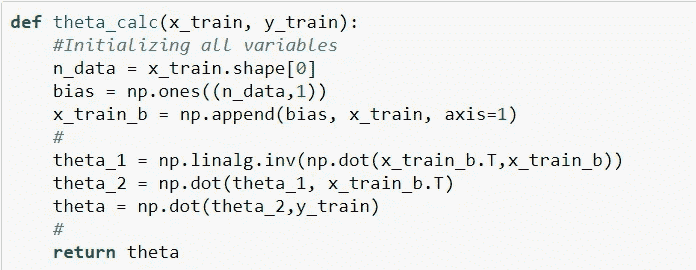

Figure 6: Python implementation of Normal Equation

***使用梯度下降优化***

正规方程的复杂性使得它很难使用，这就是梯度下降法发挥作用的地方。成本函数相对于参数的偏导数可以给出最佳系数值。

(梯度下降的完整详情在[https://medium . com/@ saishruthi . TN/math-behind-gradient-descent-4d 66 EB 96d 68d](https://medium.com/@saishruthi.tn/math-behind-gradient-descent-4d66eb96d68d))

梯度下降的 Python 代码

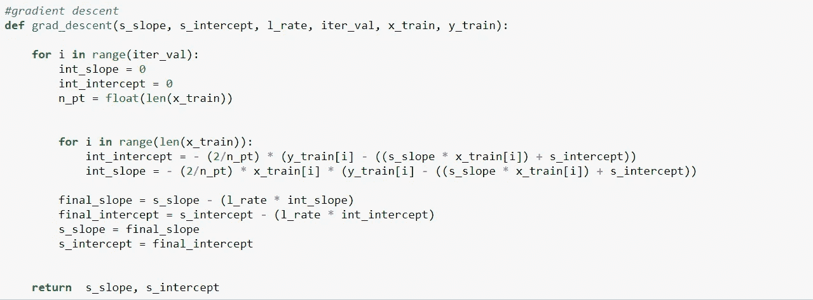

Figure 7: Python Implementation of gradient descent

***残差分析***

随机性和不可预测性是回归模型的两个主要组成部分。

预测=确定性+统计

确定性部分被模型中的预测变量覆盖。随机部分揭示了预期值和观察值不可预测的事实。总会有一些信息被遗漏。这个信息可以从剩余信息中获得。

我们通过一个例子来解释一下残数的概念。考虑一下，当给定一个地方的温度时，我们有一个预测果汁销售的数据集。回归方程预测的值与实际值总会有一些差异。销售额不会与真正的产值完全相符。这种差异被称为剩余。

残差图有助于使用残差值分析模型。它绘制在预测值和残差之间。他们的价值观是标准化的。该点与 0 的距离指定了该值的预测有多差。如果该值为正值，则预测值较低。如果该值为负，则预测值为高。0 值表示完全预测。检测残差模式可以改进模型。

残差图的非随机模式表明该模型，

*   缺少对模型目标有重要贡献的变量
*   缺少捕捉非线性(使用多项式项)
*   模型中的术语之间没有交互

残留物的特征

*   残差不显示任何模式
*   相邻残差不应相同，因为它们表明系统遗漏了一些信息。

剩余实现和情节

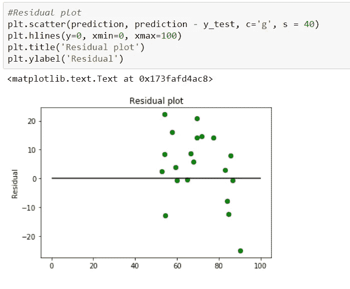

Figure 8: Residual Plot

[(其他一些参考资料— 1](https://newonlinecourses.science.psu.edu/stat501/node/250/) ) & ( [参考资料— 2)](http://blog.minitab.com/blog/adventures-in-statistics-2/why-you-need-to-check-your-residual-plots-for-regression-analysis)

***模型评估指标***

***R 平方值***

该值的范围从 0 到 1。值“1”表示预测器完全考虑了 y 中的所有变化。值“0”表示预测器“x”没有考虑“y”中的任何变化。

1.回归平方和(SSR)

这给出了估计回归线离水平“无关系”线(实际产量的平均值)有多远的信息。

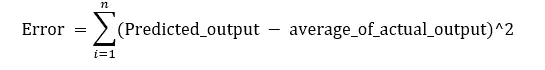

Figure 9: Regression Error Formula

2.误差平方和

目标值围绕回归线变化的程度(预测值)。

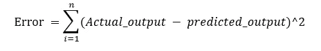

Figure 10: Sum of Square Formula

3.平方和总计(SSTO)

这表明数据点围绕平均值移动了多少。

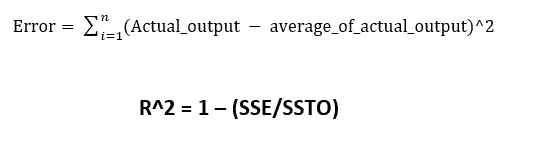

Figure 11: Total Error Formula

Python 实现

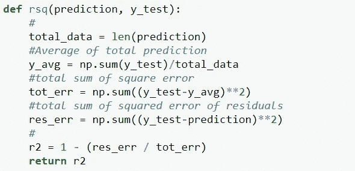

Figure 12: Python Implementation of R-Square

***R 平方的取值范围是否总是在 0 到 1 之间？***

如果回归线强行穿过一个点，R2 的值可能最终为负。这将导致回归线强行穿过原点(无截距),产生的误差高于水平线产生的误差。如果数据远离原点，就会出现这种情况。

(模式详情—[https://medium . com/@ saishruthi . TN/is-r-sqaure-value-always-between-0-to-1-36 a8d 17807 D1](https://medium.com/@saishruthi.tn/is-r-sqaure-value-always-between-0-to-1-36a8d17807d1))

***【相关系数(r)***

这与“r 平方”的值有关，可以从符号本身观察到。它的范围从-1 到 1。

r = (+/-) sqrt(r)

如果 b1 的值为负，则‘r’为负，而如果 b1 的值为正，则‘r’为正。它是无单位的。

***零假设和 P 值***

零假设是研究者利用以前的研究或知识提出的最初主张。

低 P 值:拒绝指示预测值与响应相关的零假设

高 P 值:预测值的变化与目标值的变化无关

获得的回归线

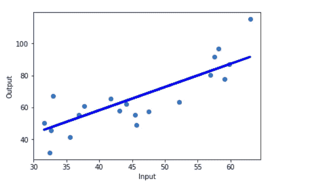

Figure 13: Final Regression line over test data

完整代码:https://github . com/SSaishruthi/Linear _ Regression _ Detailed _ Implementation

这是一个由材料(如吴恩达教授的课程，Siraj Raval 的视频等)编辑而成的教育帖子。)在我的旅途中帮助了我。其他参考资料在内容附近说明。

— —未完待续