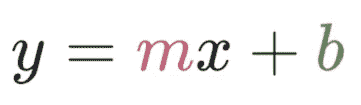
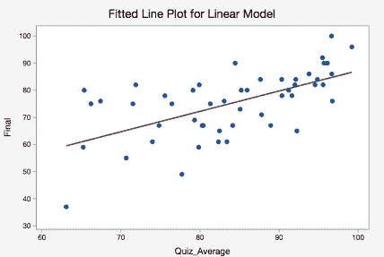
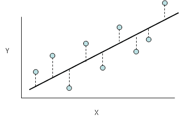
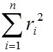
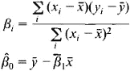
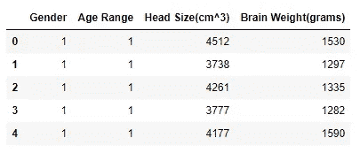
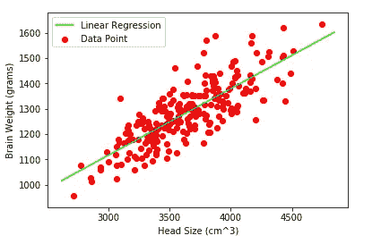
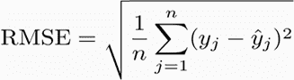

# 从头开始线性回归

> 原文：<https://towardsdatascience.com/linear-regression-from-scratch-cd0dee067f72?source=collection_archive---------1----------------------->

数据科学正处于巅峰，使用机器学习模型你可以做很多事情，从预测股票价格到生成著名的蒙娜丽莎的假画(哦，这应该是一个秘密)。线性回归是最容易实现的机器学习算法之一，我们将在本文中探讨这种算法。

## 什么是线性回归？

线性回归是一种用于定义因变量( **Y** )和自变量( **X** )之间关系的方法。简单地写为:



其中 **y** 为因变量， **m** 为比例因子或系数， **b** 为偏差系数， **X** 为自变量。[偏差系数](https://stats.stackexchange.com/questions/13643/bias-an-intuitive-definition)为该模型提供了额外的自由度。目标是在 **X** 和 **Y** 之间画一条最佳拟合线，估计 **X** 和 **Y** 之间的关系。

但是我们如何找到这些系数，我们可以用不同的方法找到它们。一种是**普通最小二乘法**方法和**梯度下降**方法。我们将实现普通的最小均方方法。

## 普通最小均方误差

之前我们讨论了估算 **X** 和 **Y** 到一条直线的关系。例如，我们获得样本输入和输出，并在 2d 图上绘制这些分散点，类似于下图:



图中看到的线是我们要完成的实际关系，我们希望最小化模型的误差。这条线是穿过大多数散点的最佳拟合线，也减少了误差，误差是从点到线本身的距离，如下图所示。



而线性模型的总误差是各点误差之和。即，



r*I =*I 点与 **i 点**T34 点点之间的距离。

*n =* 总点数。

我们将每个距离平方，因为有些点会在线上，有些点会在线下。我们可以通过最小化 **r** 来最小化线性模型的误差，因此我们有



其中 ***x*** 是输入变量 **X** 的平均值，而 ***y*** 是输出变量 **Y.** 的平均值


现在让我们用 python 实现这个方法(有趣的部分)。

要继续下去，你需要 python 和你那令人敬畏的自我。使用 [pip](https://pypi.org/project/pip/) 我们将安装以下依赖项

*   numpy
*   熊猫
*   matplotlib

我们将使用包含不同人的头部大小和大脑重量的数据集。该数据集可在本次[回购](https://github.com/FeezyHendrix/LinearRegressionfromscrath)中获得。

我们从导入数据集和依赖项开始

```
#import libraries
%matplotlib inline
import numpy as np
import matplotlib.pyplot as plt
import pandas as pddataset = pd.read_csv('dataset.csv')
print(dataset.shape)
dataset.head()(237, 4)
```



让我们找出头部大小和大脑重量之间的关系。

```
# initializing our inputs and outputs
X = dataset['Head Size(cm^3)'].values
Y = dataset['Brain Weight(grams)'].values# mean of our inputs and outputs
x_mean = np.mean(X)
y_mean = np.mean(Y)#total number of values
n = len(X)# using the formula to calculate the b1 and b0
numerator = 0
denominator = 0
for i in range(n):
    numerator += (X[i] - x_mean) * (Y[i] - y_mean)
    denominator += (X[i] - x_mean) ** 2

b1 = numerator / denominator
b0 = y_mean - (b1 * x_mean)#printing the coefficient
print(b1, b0)# output : 0.26342933948939945 325.57342104944223
```

现在我们有了偏差系数(b)和比例因子(m)。用数学术语来说:

```
***Brain weights =  325.57342104944223 + 0.26342933948939945 * Head size***
```

现在我们有了一个线性模型。

让我们用图表来描绘它。

```
#plotting values 
x_max = np.max(X) + 100
x_min = np.min(X) - 100#calculating line values of x and y
x = np.linspace(x_min, x_max, 1000)
y = b0 + b1 * x#plotting line 
plt.plot(x, y, color='#00ff00', label='Linear Regression')#plot the data point
plt.scatter(X, Y, color='#ff0000', label='Data Point')# x-axis label
plt.xlabel('Head Size (cm^3)')#y-axis label
plt.ylabel('Brain Weight (grams)')plt.legend()
plt.show()
```



我们需要能够衡量我们的模型有多好(准确性)。有许多方法可以实现这一点，但我们将实现**均方根误差**和**决定系数** ( **R 分数**)。

均方根误差是所有误差之和除以数值个数的平方根，或者从数学上讲，



这里的*是第 ***与第*** 预测的输出值。现在我们会找到 RMSE。*

```
*rmse = 0
for i in range(n):
    y_pred=  b0 + b1* X[i]
    rmse += (Y[i] - y_pred) ** 2

rmse = np.sqrt(rmse/n)print(rmse)#output : 72.1206213783709*
```

*让我们找到我们的 R 分数，以便能够从数学上衡量我们的线性模型的准确性:*

**

***SST** 是平方和的总和， **SSR** 是残差平方和的总和。*

*R 的分数通常在 0 到 1 之间。如果模型完全错误，它也会变成负数。现在我们将找到 **R** 的分数。*

```
*sumofsquares = 0
sumofresiduals = 0for i in range(n) :
    y_pred = b0 + b1 * X[i]
    sumofsquares += (Y[i] - y_mean) ** 2
    sumofresiduals += (Y[i] - y_pred) **2

score  = 1 - (sumofresiduals/sumofsquares)print(score)#output : 0.6393117199570003*
```

*0.63 当然不差，但我们可以通过以下方式提高分数:*

*   *获取更多数据集*
*   *改进功能*
*   *适合多种型号等*

## *结论*

*线性回归是所有机器学习算法的基础，也是最容易获得的，我们已经实现了**普通最小均方**方法来根据头部大小预测大脑重量，并且还使用**均方根误差**和**决定系数** ( **R 分数**)来测量准确度。代码可以在这个[回购](https://github.com/FeezyHendrix/LinearRegressionfromscrath)上找到。*

*信用:[https://mubaris.com/posts/linear-regression/](https://mubaris.com/posts/linear-regression/)*