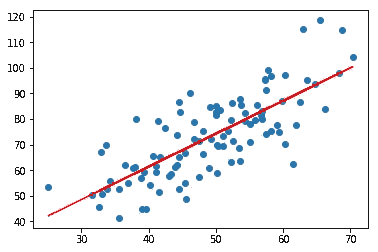

# 用 6 行 Python 实现线性回归

> 原文：<https://towardsdatascience.com/linear-regression-in-6-lines-of-python-5e1d0cd05b8d?source=collection_archive---------2----------------------->

在这篇简短的帖子中，我想分享一种方法，使用这种方法，您可以用 6 行 Python 代码执行线性和多元线性回归。

Check out the video version of this post if you prefer that !

在统计学中，线性回归是一种对因变量和一个或多个自变量之间的关系进行建模的线性方法。如果您想了解更多关于线性回归及其实现方式的信息，请查看这两种从头开始执行线性回归的方法:

[](/linear-regression-using-gradient-descent-97a6c8700931) [## 使用梯度下降的线性回归

### 在本教程中，你可以学习梯度下降算法的工作原理，并从头开始用 python 实现它。首先…

towardsdatascience.com](/linear-regression-using-gradient-descent-97a6c8700931) [](/linear-regression-using-least-squares-a4c3456e8570) [## 使用最小二乘法的线性回归

### 线性回归是最简单的机器学习形式。在这篇文章中，我们将看到线性回归是如何…

towardsdatascience.com](/linear-regression-using-least-squares-a4c3456e8570) 

今天，为了快速执行线性回归，我们将使用库 scikit-learn。如果您还没有它，您可以使用 pip 安装它:

```
pip install scikit-learn
```

现在让我们从几个导入开始:

我们需要 numpy 来执行计算，pandas 来导入本例中 csv 格式的数据集，matplotlib 来可视化我们的数据和回归线。我们将使用 LinearRegression 类来执行线性回归。

现在让我们执行回归:

我们在 Y_pred 中有我们的预测。现在让我们可视化数据集和回归线:



Data set in blue, Regression line in red

就是这样！您可以使用您选择的任何数据集，甚至可以使用 sklearn.linear_model 中的 Linear Regression 类执行多元线性回归(多个独立变量)。这个类也使用普通的最小二乘法来执行这个回归。因此，与其他技术相比，精确度不高。但是如果你想做一些快速预测，并对给你的数据集有所了解，那么这是一个非常方便的工具。

*在这里找到数据集和代码:*[https://github . com/chasing infinity/ml-from-scratch/tree/master/03% 20 linear % 20 regression % 20 in % 202% 20 minutes](https://github.com/chasinginfinity/ml-from-scratch/tree/master/03%20Linear%20Regression%20in%202%20minutes)

*有问题吗？需要帮助吗？联系我！*

*电子邮件:adarsh1021@gmail.com*

*领英:*[*https://www.linkedin.com/in/adarsh-menon-739573146/*](https://www.linkedin.com/in/adarsh-menon-739573146/)

*推特:*[*https://twitter.com/adarsh_menon_*](https://twitter.com/adarsh_menon_)

*insta gram:*[*https://www.instagram.com/adarsh_menon_/*](https://www.instagram.com/adarsh_menon_/)