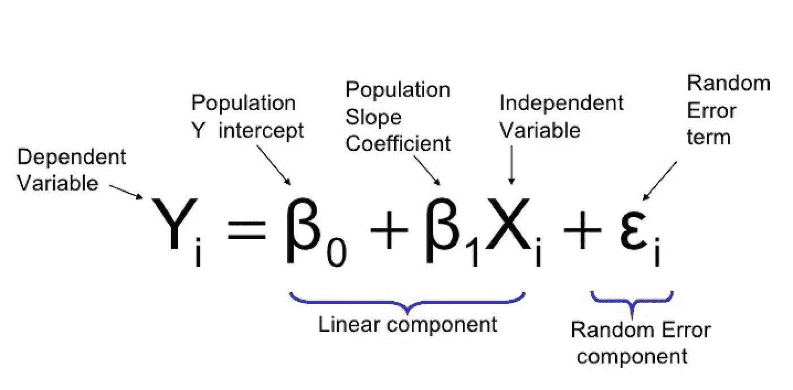
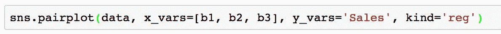
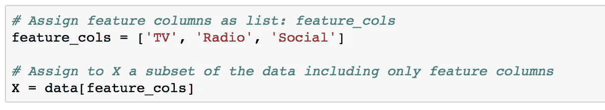
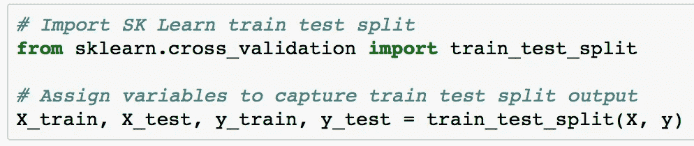
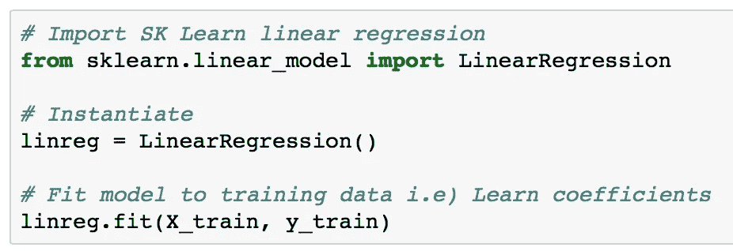
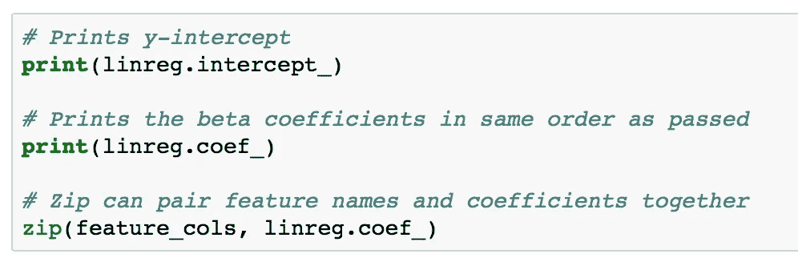
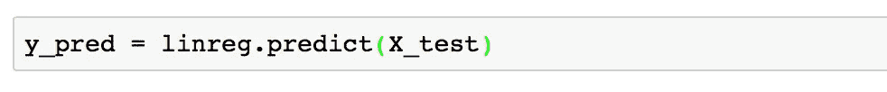
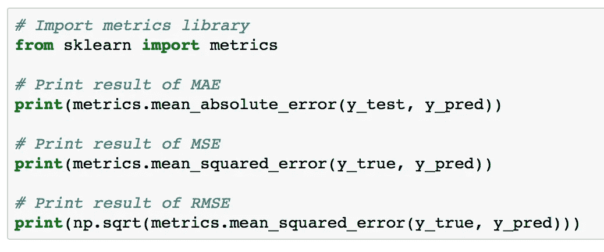

# Python 中的线性回归

> 原文：<https://towardsdatascience.com/linear-regression-in-python-9a1f5f000606?source=collection_archive---------1----------------------->

在线性回归中，在给定用于定型模型的定型数据的情况下，您试图构建一个允许您预测新数据值的模型。这将变得清晰，因为我们通过这个职位的工作。

Courtesy of Department of Statistics, ITS Surabaya

以上，我们可以看到简单的线性回归方程。y 变量被认为是我们的反应或因变量。这是我们打算预测的，比如*销售*是一个热门选择。

B0 是 y 轴截距，即 X=0，直线与 y 轴相交。B1X 本质上是我们的 B1(我们的 X 对我们的 y 的影响量)，以及我们的 X，它是我们的特征/独立变量。与我们的 y 变量不同，多个 X 可以与相应的 beta(每个的系数)一起使用。这允许我们创建一个具有许多特征(X)变量的模型来预测 y 中的值。随机误差分量是不可约误差。

**第一步:可视化**

使用可视化，你应该能够判断哪些变量与 y 有线性关系。

在这种情况下，我们使用“销售”作为我们的回答/y。用您预期的功能列表替换测试版的变量列表

Seaborn Pairplot

*要使用的附加参数:*

size=:允许您操纵渲染的 pairplot 的大小

kind= 'reg ':将尝试添加最佳拟合线和 95%置信区间。目标是最小化误差平方和。

**第二步:SK 学习—设置变量**

Scikit-Learn 期望 X 是一个特征矩阵(Pandas Dataframe)，y 是一个响应向量(Pandas Series)。让我们从如下分离变量开始。

处理您的功能(X):

*在本例中，我们使用 TV、Radio 和 Social 列作为预测变量。*

处理您的回答(y):

如果您想知道为什么大写的 X 表示特性，小写的 y 表示响应，这主要是由于惯例。

**第三步:SK Learn —拆分我们的数据**

将 X & y 分成训练集和测试集:

通过将 X 和 y 变量传递给 train_test_split 方法，我们能够通过将 4 个变量分配给结果来捕获数据中的分割。

**第四步:SK Learn —训练我们的模型**

首先，我们需要导入 sklearn.linear_model 来访问 LinearRegression。然后它需要被实例化，模型适合我们的训练数据。这是下面看到的。

Instantiate and fitting model to training data

**第五步:解释系数**

这些系数将允许我们用β值来模拟我们的方程。linreg 变量(分配给 LinearRegression 对象)能够使用下面的代码提取截距和系数。

Extracting data from model

截距就是你的 B0 值；并且每个系数将是通过的 X 的相应β(按照它们各自的顺序)。

**第六步:根据你的模型进行预测**

基于您的模型进行预测就像使用下面的代码一样简单:向 predict 方法传递您的测试数据。给定新的测试 X 数据，这将返回 y 的预测值。

Returns results of y predictions given X data in X_test

**第七步:模型评估**

有三个主要指标用于评估线性模型。这些是:平均绝对误差(MAE)，均方误差(MSE)，或均方根误差(RMSE)。

梅:最容易理解。代表平均误差

MSE:类似于 MAE，但噪声被夸大，较大的误差被“惩罚”。它比 MAE 更难解释，因为它不是基本单位，然而，它通常更受欢迎。

RMSE:最流行的度量，类似于 MSE，然而，结果是平方根，因为它是基本单位，所以更容易解释。建议将 RMSE 作为解释您的模型的主要指标。

下面，您可以看到如何计算每个指标。它们都需要两个列表作为参数，一个是您的预测值，另一个是真实值

**第八步:特征选择**

获得误差度量后，请注意哪些 X 对 y 的影响最小。移除其中一些特征可能会提高模型的准确性。

因此，我们开始了一个反复试验的过程，这个过程从头开始，直到一个令人满意的模型产生。以下步骤可能对这一特定部分有用。

1.  替换特征列
2.  训练 _ 测试 _ 分割您的数据
3.  使用 linreg.fit 再次将模型拟合到 linreg
4.  使用(y_pred = linreg.predict(X_test))进行预测
5.  计算 RMSE
6.  重复直到 RMSE 满意