# Python 中的线性回归；预测湾区的房价

> 原文：<https://towardsdatascience.com/linear-regression-in-python-predict-the-bay-areas-home-price-5c91c8378878?source=collection_archive---------0----------------------->

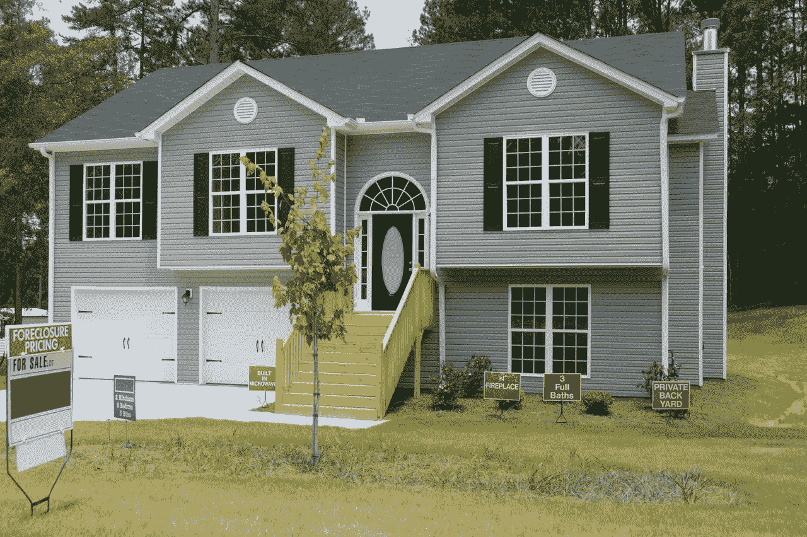

# 动机

为了预测湾区的房价，我选择了来自[湾区房屋销售数据库](http://www.sfgate.com/webdb/homesales/)和 [Zillow](https://www.zillow.com/san-francisco-ca/home-values/) 的房价数据集。该数据集基于 2013 年 1 月至 2015 年 12 月期间售出的房屋。它有很多学习的特点，数据集可以从[这里](https://raw.githubusercontent.com/RuiChang123/Regression_for_house_price_estimation/master/final_data.csv)下载。

# 数据预处理

```
import pandas as pd
sf = pd.read_csv('final_data.csv')
sf.head()
```

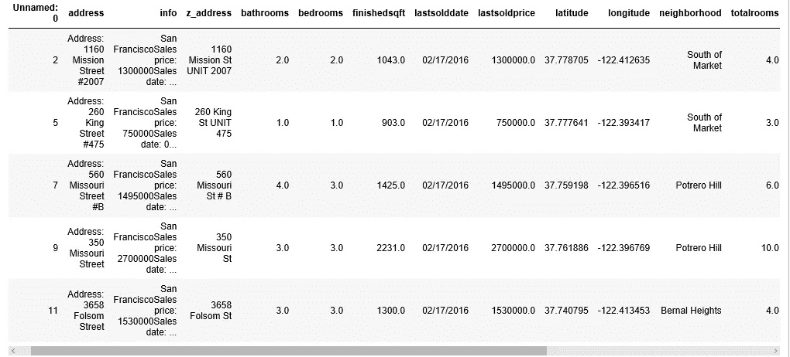

有几个功能是我们不需要的，比如“info”、“z_address”、“zipcode”(我们有“neighborhood”作为位置变量)、“zipid”和“zestimate”(这是 [Zillow](https://www.zillow.com/how-much-is-my-home-worth/) 估算的价格，我们不希望我们的模型受此影响)，所以，我们将放弃它们。

```
sf.drop(sf.columns[[0, 2, 3, 15, 17, 18]], axis=1, inplace=True)sf.info()
```

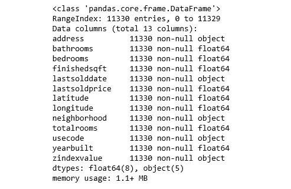

“zindexvalue”的数据类型应该是数字，所以让我们更改一下。

```
sf['zindexvalue'] = sf['zindexvalue'].str.replace(',', '')
sf['zindexvalue'] = sf['zindexvalue'].convert_objects(convert_numeric=True)sf.lastsolddate.min(), sf.lastsolddate.max()
```

***('01/02/2013 '，' 12/31/2015')***

日期集中的房屋出售时间在 2013 年 1 月至 2015 年 12 月之间。

我现在使用 describe()方法来显示数字变量的汇总统计信息。

```
sf.describe()
```

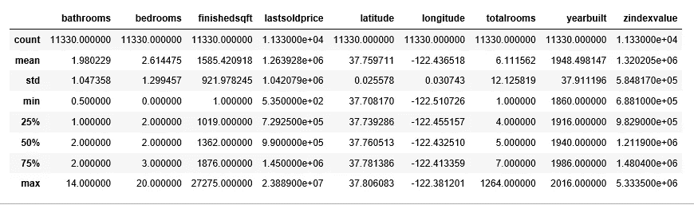

计数、平均值、最小值和最大值行是不言自明的。std 显示标准偏差，25%、50%和 75%的行显示相应的百分位数。

为了了解我们正在处理的数据类型，我们为每个数字变量绘制了一个直方图。

```
%matplotlib inline
import matplotlib.pyplot as plt
sf.hist(bins=50, figsize=(20,15))
plt.savefig("attribute_histogram_plots")
plt.show()
```

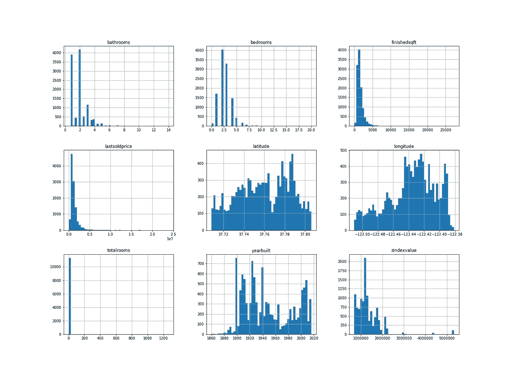

Figure 1\. *A histogram for each numerical variable*

一些直方图有点向右倾斜，但这并不异常。

让我们创建一个带有纬度和经度的散点图来可视化数据:

```
sf.plot(kind="scatter", x="longitude", y="latitude", alpha=0.2)
plt.savefig('map1.png')
```

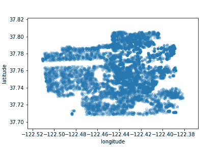

Figure 2\. A scatter plot of the data

现在让我们从最贵到最便宜的区域进行颜色编码:

```
sf.plot(kind="scatter", x="longitude", y="latitude", alpha=0.4, figsize=(10,7),
    c="lastsoldprice", cmap=plt.get_cmap("jet"), colorbar=True,
    sharex=False)
```

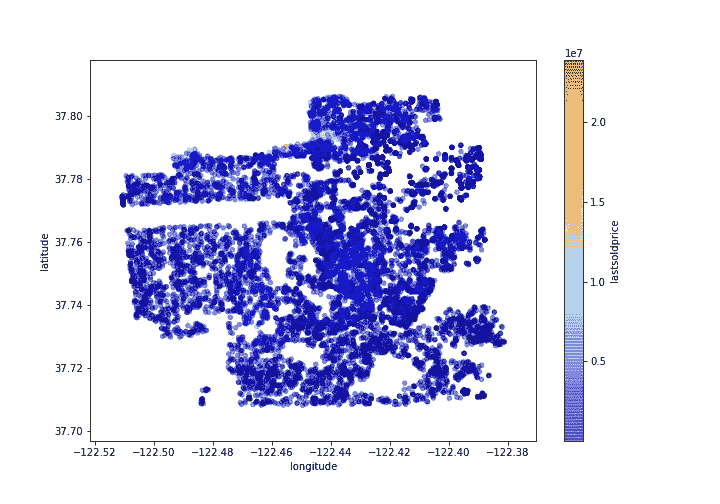

Figure 3\. The Bay Area housing prices

这张图片告诉我们，最贵的房子是在北部地区。

我们要预测的变量是“最后成交价格”。所以我们来看看每个自变量和这个因变量的相关程度。

```
corr_matrix = sf.corr()
corr_matrix["lastsoldprice"].sort_values(ascending=False)
```

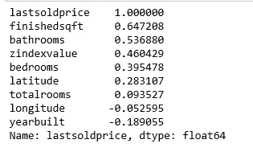

当完工面积和浴室数量增加时，最终售价往往会上升。你可以看到建造年份和上一次销售价格之间有一个小的负相关。最后，接近零的系数表示没有线性相关性。

我们现在将使用 Pandas 的`scatter_matrix`函数来可视化变量之间的相关性。我们将只关注几个有希望的变量，它们似乎与最后的销售价格最相关。

```
from pandas.tools.plotting import scatter_matrixattributes = ["lastsoldprice", "finishedsqft", "bathrooms", "zindexvalue"]
scatter_matrix(sf[attributes], figsize=(12, 8))
plt.savefig('matrix.png')
```

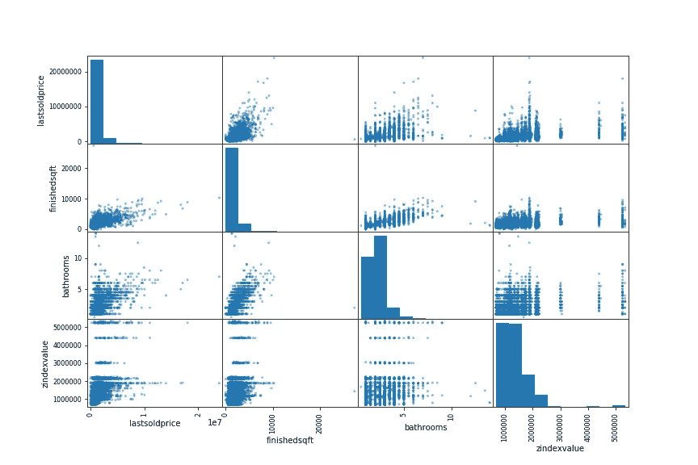

Figure 4\. a scatter matrix

预测最后销售价格的最有希望的变量是完成的平方英尺，所以让我们放大它们的相关散点图。

```
sf.plot(kind="scatter", x="finishedsqft", y="lastsoldprice", alpha=0.5)
plt.savefig('scatter.png')
```

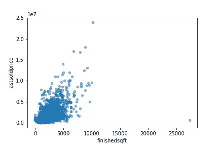

Figure 5\. Finished sqft vs. Last Sold Price

相关性确实很强；你可以清楚地看到上升的趋势，而且这些点不是太分散。

因为每个房子有不同的平方英尺，每个社区有不同的房价，我们真正需要的是每平方英尺的价格。于是，我们添加了一个新的变量“price_per_sqft”。然后，我们检查这个新的独立变量与最后销售价格的相关性。

```
sf['price_per_sqft'] = sf['lastsoldprice']/sf['finishedsqft']
corr_matrix = sf.corr()
corr_matrix["lastsoldprice"].sort_values(ascending=False)
```

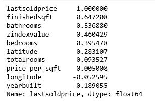

不幸的是，新的 price_per_sqft 变量只显示了与最后销售价格非常小的正相关性。但是我们仍然需要这个变量来对邻居进行分组。

数据里有 71 个小区，我们准备分组。

```
len(sf['neighborhood'].value_counts())
```

***71***

以下步骤将邻域聚类成三组:1 .价格低；2.高价低频；3.高价高频。

```
freq = sf.groupby('neighborhood').count()['address']
mean = sf.groupby('neighborhood').mean()['price_per_sqft']
cluster = pd.concat([freq, mean], axis=1)
cluster['neighborhood'] = cluster.indexcluster.columns = ['freq', 'price_per_sqft','neighborhood']cluster.describe()
```

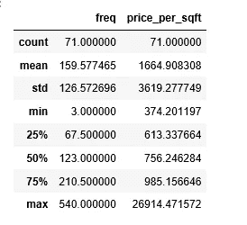

这些是低价格社区:

```
cluster1 = cluster[cluster.price_per_sqft < 756]
cluster1.index
```

***索引(【‘湾景’，‘中央里士满’，‘中央日落’，‘克罗克亚马逊’，
‘戴利市’，‘钻石高地’，‘精益求精’，‘森林山’，
‘森林山延伸’，‘金门高地’，‘英格莱赛德’，‘英格莱赛德高地’，‘英格莱赛德露台’，‘内公园边’，
‘内里士满’，‘内日落’，‘湖岸’，‘小好莱坞’，
‘默塞德高地’，‘米申台’，‘戴维森山庄园’，
‘海景’，‘外宣’，‘外***

这些是高价格和低频率的社区:

```
cluster_temp = cluster[cluster.price_per_sqft >= 756]
cluster2 = cluster_temp[cluster_temp.freq <123]
cluster2.index
```

***索引(['布埃纳维斯塔公园'，'中央滨水区—多克帕奇'，'科罗纳高地'，'海特—阿什伯里'，'湖边'，'孤山'，'中城露台'，
'北海滩'，'北部滨水区'，'帕纳萨斯—阿什伯里'，'普雷斯迪奥高地'，'海崖'，'圣弗朗西斯伍德'，'电报山'，'双峰']，dtype='object '，name='neighborhood')***

这些是高价格和高频率的社区:

```
cluster3 = cluster_temp[cluster_temp.freq >=123]
cluster3.index
```

***索引(['Bernal Heights '，' Cow Hollow '，' Downtown '，' Eureka Valley-Dolores Heights-Castro '，' Glen Park '，' Hayes Valley '，' Lake '，' Lower Pacific Heights '，' Marina '，' Miraloma Park '，' Mission '，' Nob Hill '，' Noe Valley '，' North Panhandle '，' Pacific Heights '，' Potrero Hill '，' Russian Hill '，' South Beach '，' South ' Market '，' Van Ness-civice centre '，' Yerba***

我们根据集群添加一个组列:

```
def get_group(x):
    if x in cluster1.index:
        return 'low_price'
    elif x in cluster2.index:
        return 'high_price_low_freq'
    else:
        return 'high_price_high_freq'
sf['group'] = sf.neighborhood.apply(get_group)
```

在执行上述预处理后，我们不再需要以下列:“address，lastsolddate，latitude，longitude，neighborhood，price_per_sqft”，因此，我们从分析中删除它们。

```
sf.drop(sf.columns[[0, 4, 6, 7, 8, 13]], axis=1, inplace=True)
sf = sf[['bathrooms', 'bedrooms', 'finishedsqft', 'totalrooms', 'usecode', 'yearbuilt','zindexvalue', 'group', 'lastsoldprice']]
sf.head()
```

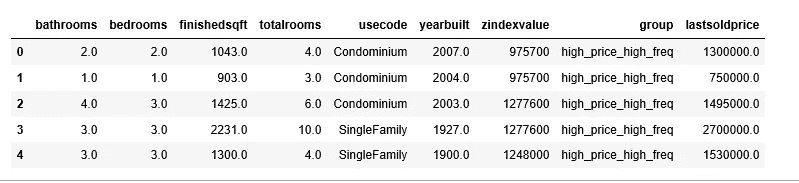

我们的数据看起来很完美！

但是在构建模型之前，我们需要为这两个分类变量创建虚拟变量:“usecode”和“group”。

```
X = sf[['bathrooms', 'bedrooms', 'finishedsqft', 'totalrooms', 'usecode', 'yearbuilt', 
         'zindexvalue', 'group']]
Y = sf['lastsoldprice']

n = pd.get_dummies(sf.group)
X = pd.concat([X, n], axis=1)m = pd.get_dummies(sf.usecode)
X = pd.concat([X, m], axis=1)drops = ['group', 'usecode']
X.drop(drops, inplace=True, axis=1)X.head()
```

这是我们的数据在创建虚拟变量后的样子:

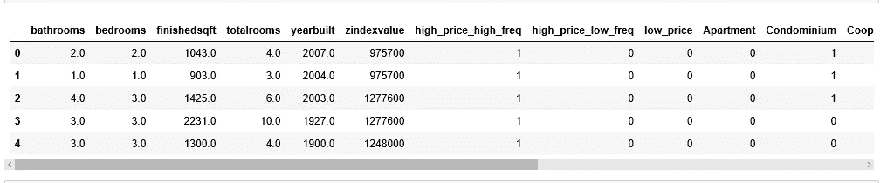

# 训练并建立线性回归模型

```
from sklearn.cross_validation import train_test_splitX_train, X_test, y_train, y_test = train_test_split(X, Y, test_size=0.3, random_state=0)from sklearn.linear_model import LinearRegression
regressor = LinearRegression()
regressor.fit(X_train, y_train)
```

*搞定了。我们现在有一个工作的线性回归模型。*

*计算 R 的平方:*

```
*y_pred = regressor.predict(X_test)
print('Linear Regression R squared": %.4f' % regressor.score(X_test, y_test))*
```

****线性回归 R 的平方:0.5619****

*因此，在我们的模型中，Y 的 56.19%的可变性可以用 x 来解释。这并不令人兴奋。*

*计算均方根误差(RMSE)*

```
*import numpy as np
from sklearn.metrics import mean_squared_error
lin_mse = mean_squared_error(y_pred, y_test)
lin_rmse = np.sqrt(lin_mse)
print('Linear Regression RMSE: %.4f' % lin_rmse)*
```

****线性回归 RMSE: 616071.5748****

*我们的模型能够预测测试集中每栋房子的价格，误差在 616071 美元以内。*

*计算平均绝对误差(MAE):*

```
*from sklearn.metrics import mean_absolute_errorlin_mae = mean_absolute_error(y_pred, y_test)
print('Linear Regression MAE: %.4f' % lin_mae)*
```

****线性回归 MAE: 363742.1631****

# *随机森林*

*让我们尝试一个更复杂的模型，看看结果是否可以改进 RandomForestRegressor:*

```
*from sklearn.ensemble import RandomForestRegressorforest_reg = RandomForestRegressor(random_state=42)
forest_reg.fit(X_train, y_train)*
```

****RandomForestRegressor(bootstrap = True，criterion='mse '，max_depth=None，max_features='auto '，max_leaf_nodes=None，
min _ infinity _ split = 1e-07，min_samples_leaf=1，
min_samples_split=2，min_weight_fraction_leaf=0.0，
n_estimators=10，n_jobs=1，oob_score=False，random_state=42，
详细****

```
*print('Random Forest R squared": %.4f' % forest_reg.score(X_test, y_test))*
```

****随机森林 R 的平方】:0.6491****

```
*y_pred = forest_reg.predict(X_test)
forest_mse = mean_squared_error(y_pred, y_test)
forest_rmse = np.sqrt(forest_mse)
print('Random Forest RMSE: %.4f' % forest_rmse)*
```

****随机森林 RMSE: 551406.0926****

*好多了！让我们再试一次。*

# *梯度推进*

```
*from sklearn import ensemble
from sklearn.ensemble import GradientBoostingRegressor
model = ensemble.GradientBoostingRegressor()
model.fit(X_train, y_train)*
```

****GradientBoostingRegressor(alpha = 0.9，criterion='friedman_mse '，init=None，learning_rate=0.1，loss='ls '，max_depth=3，max_features=None，max_leaf_nodes=None，min _ infinity _ split = 1e-07，
min_samples_leaf=1，min_samples_split=2，min_weight_fraction_leaf=0.0，n _ estimators = 100，预排序='auto '，random_state****

```
*print('Gradient Boosting R squared": %.4f' % model.score(X_test, y_test))*
```

****梯度增强 R 的平方】:0.6616****

```
*y_pred = model.predict(X_test)
model_mse = mean_squared_error(y_pred, y_test)
model_rmse = np.sqrt(model_mse)
print('Gradient Boosting RMSE: %.4f' % model_rmse)*
```

****渐变助推 RMSE: 541503.7962****

*这是我们迄今为止最好的结果，所以，我认为这是我们的最终模型。*

## *特征重要性*

*我们在模型中使用了 19 个特征(变量)。让我们找出哪些特性是重要的，反之亦然。*

```
*feature_labels = np.array(['bathrooms', 'bedrooms', 'finishedsqft', 'totalrooms', 'yearbuilt', 'zindexvalue', 
                           'high_price_high_freq', 'high_price_low_freq', 'low_price', 'Apartment', 'Condominium', 'Cooperative', 
                          'Duplex', 'Miscellaneous', 'Mobile', 'MultiFamily2To4', 'MultiFamily5Plus', 'SingleFamily', 
                           'Townhouse'])
importance = model.feature_importances_
feature_indexes_by_importance = importance.argsort()
for index in feature_indexes_by_importance:
    print('{}-{:.2f}%'.format(feature_labels[index], (importance[index] *100.0)))*
```

**

*最重要的特征是完工面积、zindex 值、浴室数量、总房间数、建造年份等等。最不重要的特征是公寓，这意味着不管这个单元是否是公寓，对出售价格都无关紧要。总的来说，这 19 个特性大部分都用上了。*

# *轮到你了！*

*希望这篇文章能让你对机器学习回归项目有一个好的了解。正如你所看到的，大部分工作都在数据争论和准备步骤中，这些程序消耗了花在机器学习上的大部分时间。*

*现在是时候走出去，开始探索和清理您的数据了。尝试两三个算法，然后告诉我进展如何。*

*创建这篇文章的源代码可以在[这里](https://github.com/susanli2016/Machine-Learning-with-Python/blob/master/Predict_Bay_Area_Home_Price.ipynb)找到。我将很高兴收到关于上述任何反馈或问题。*