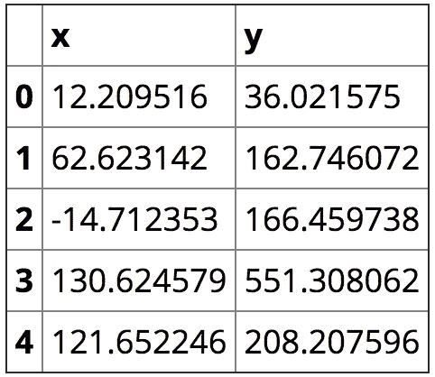
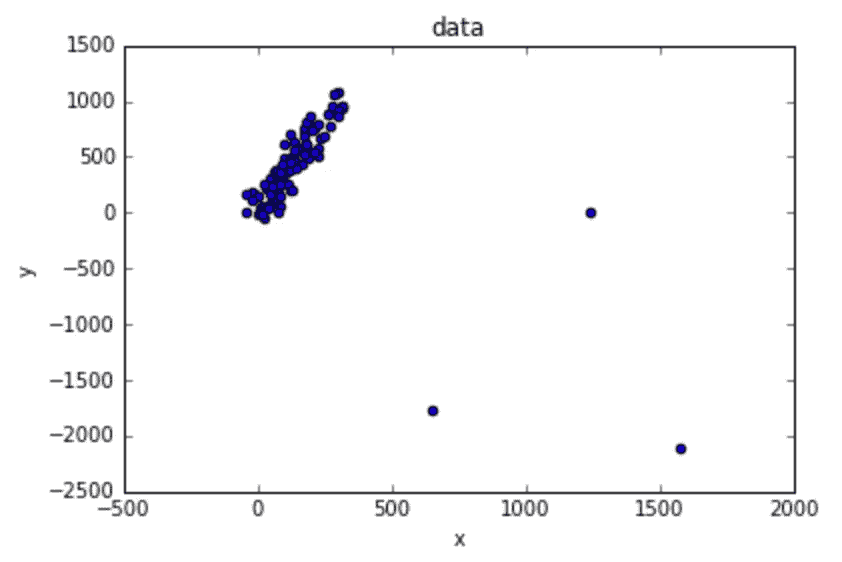
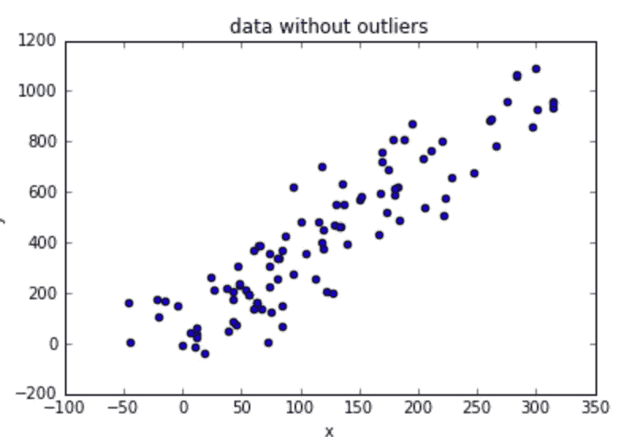
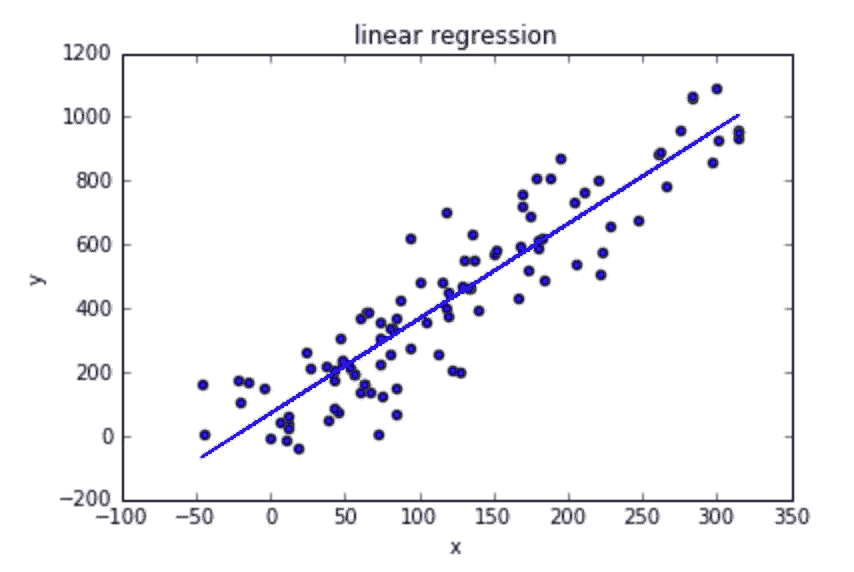
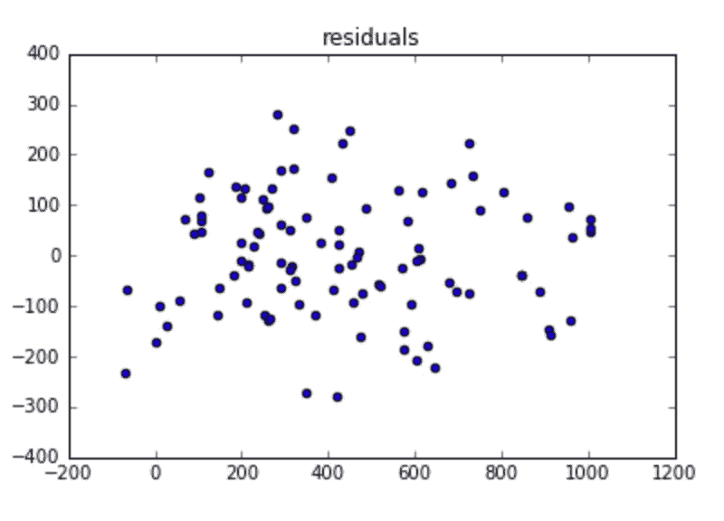
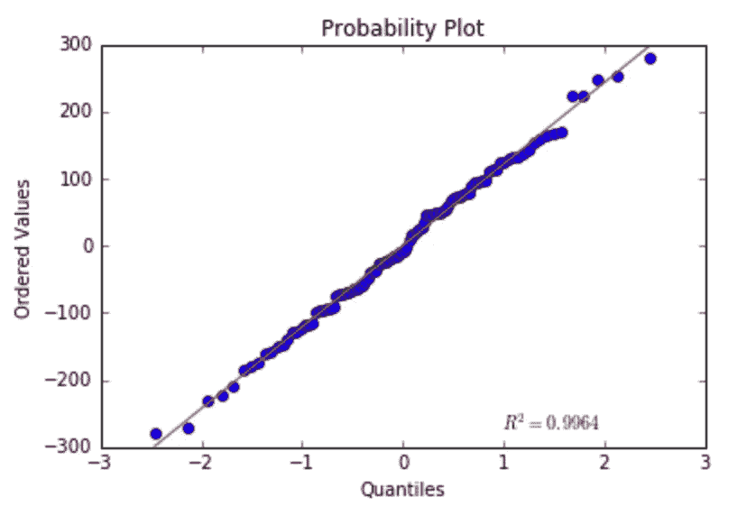
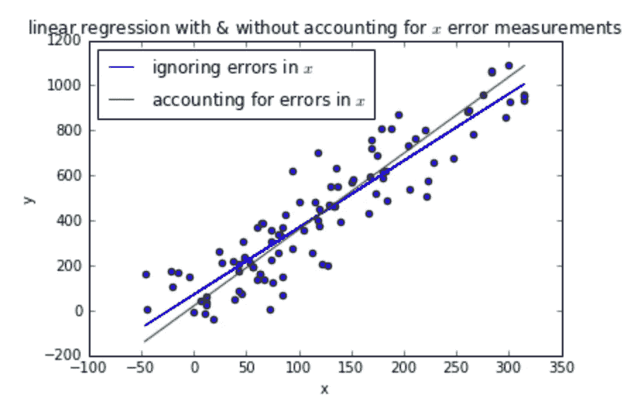

# 野外线性回归

> 原文：<https://towardsdatascience.com/linear-regression-in-the-wild-335723a687e8?source=collection_archive---------11----------------------->


在一次数据科学家职位的面试中，我接到了一个家庭作业，我想和你分享一下。

面试官给我发了一个 CSV 文件，里面有实测量 *x* 和 *y* 的样本，其中 *y* 是一个响应变量，可以写成 *x* 的显函数。众所周知，在标准偏差的意义上，用于测量 *x* 的技术比用于测量 *y* 的技术好两倍。

任务:将 *y* 建模为 *x* 的函数。

这是我需要的所有进口货:

```
import pandas as pd
import numpy as np
from sklearn.linear_model import LinearRegression
from scipy.stats import probplotimport matplotlib.pyplot as plt
%matplotlib inlinedata = pd.read_csv('data.csv', names=['x', 'y'])
data.head()
```



让我们将数据可视化，看看是否容易用肉眼捕捉到模式:

```
data.plot.scatter('x', 'y', title='data')
```



这看起来很像线性回归的情况。首先，我将手动移除异常值:

```
data = data[data['x'] < 600]
data.plot.scatter('x', 'y', title='data without outliers')
```



我将使用`LinearRegression`来拟合最佳线条:

```
lr = LinearRegression().fit(data[['x']], data['y'])
data.plot.scatter('x', 'y', title='linear regression')
lr_predicted_y = lr.predict(data[['x']])
plt.plot(data['x'], lr_predicted_y)
```



fitting a line through the data

视觉上看起来很有说服力，但我会验证线性回归假设，以确保我使用的是正确的模型。

如果你对线性回归假设不熟悉，你可以在文章[用假设深入回归分析，绘制&解](https://www.analyticsvidhya.com/blog/2016/07/deeper-regression-analysis-assumptions-plots-solutions/)中阅读。

首先，我们将绘制残差图:

```
residuals = lr_predicted_y - data['y']
plt.scatter(x=lr_predicted_y, y=residuals)
plt.title('residuals')
```



*   残差中似乎没有自相关。
*   异方差在这里看起来也不是问题，因为方差看起来几乎是恒定的(除了图的左边部分，但是没有太多的数据，所以我会忽略它)。
*   多重共线性在这里不相关，因为只有一个因变量。
*   残差应呈正态分布:我将使用 QQ-plot 验证:

```
probplot(residuals, plot=plt)
```



这看起来相当正常…

我的结论是，假设线性关系，x 和 y 之间的关系最好建模为

```
print 'y = %f + %f*x'  % (lr.intercept_, lr.coef_)>>> y = 70.023655 + 2.973585*x
```

给定 *x* (两者都有测量误差)，或者换句话说，线的系数，我们得到了计算 *y* 所需参数的一致估计值。

到目前为止，我所做的只是简单的线性回归。关于这个任务有趣的事情是 *x* 有测量误差(这在真实世界用例中是典型的)。

如果我们想要在给定精确的 *x* 值(没有测量误差)的情况下估计计算 *y* 所需的参数，我们需要使用不同的方法。使用简单的线性回归而不考虑随机噪声的 *x* 导致线斜率略小于真实的线斜率(描述没有测量误差的 *x* 的线)。你可以阅读这个维基页面来了解原因。

我将使用[戴明回归](https://en.wikipedia.org/wiki/Deming_regression)，这是一种当两个变量 *x* 和 *y* 的误差被假设为独立且正态分布，并且它们的方差比(表示为 *δ* )已知时可以使用的方法。这种方法非常适合我们的环境

> 在标准偏差的意义上，用于测量 x 的技术比用于测量 y 的技术好两倍。

所以在我们的设置中， *δ* 是 2 的平方。

使用在[维基页面](https://en.wikipedia.org/wiki/Deming_regression#Solution)中找到的公式，我们得到

```
cov = data.cov()
mean_x = data['x'].mean()
mean_y = data['y'].mean()
s_xx = cov['x']['x']
s_yy = cov['y']['y']
s_xy = cov['x']['y']
delta = 2 ** 2slope = (s_yy  - delta * s_xx + np.sqrt((s_yy - delta * s_xx) ** 2 + 4 * delta * s_xy ** 2)) / (2 * s_xy)
intercept = mean_y - slope  * mean_x
```

使用戴明回归，将 *x* 和 *y* 之间的关系建模为

```
print 'y = %f + %f*x'  % (intercept, slope)>>> y = 19.575797 + 3.391855*x
```

让我们绘制两个模型:

```
data.plot.scatter('x', 'y', title='linear regression with & without accounting for $x$ error measurements')
plt.plot(data['x'], lr_predicted_y, label='ignoring errors in $x$')
X = [data['x'].min(), data['x'].max()]
plt.plot(X, map(lambda x: intercept + slope * x, X), label='accounting for errors in $x$')
plt.legend(loc='best')
```



我们拟合了两个模型:一个是简单的线性回归模型，另一个是考虑到 *x* 中的测量误差的线性回归模型。

如果我们的目的是给定一个具有测量误差的新的 *x* 来计算 *y* (由与训练模型时使用的测量误差相同的分布产生)，则更简单的方法可能就足够了。

如果我们想在一个没有测量误差的世界里，将 *y* 的真实关系描述为 *x* 的函数，我们应该使用第二个模型。

这是一个很好的面试问题，因为我学到了一种新的模式，这是非常整洁的:)

尽管这并不是如标题所示的*线性回归的真实例子*(好吧，我撒谎了)，这篇文章确实展示了许多人没有注意到的一个重要概念:在许多情况下，因变量是以不准确的方式测量的，这可能需要加以考虑(取决于应用)。

小心退步！

*这个帖子最初是我在 www.anotherdatum.com*[](http://anotherdatum.com/linear-regression-in-the-wild.html)**发的。**