# 线性回归:建模和假设

> 原文：<https://towardsdatascience.com/linear-regression-modeling-and-assumptions-dcd7a201502a?source=collection_archive---------7----------------------->


Source: HD Wallpapers

回归分析是一种功能强大的统计过程，用于查找数据集中的关系，重点关注自变量(预测值)和因变量(结果)之间的关系。它可用于构建推理或预测模型。在回归分析的几种方法中，线性回归奠定了基础，并被广泛用于几个现实世界的应用中。

在这篇文章中，我们将着眼于建立一个线性回归模型进行推理。我们将使用的数据集是从 [Kaggle](https://www.kaggle.com/mirichoi0218/insurance/home) 获得的保险费用数据。这个数据集由 1，338 个观察值和 7 列组成:年龄、性别、bmi、儿童、吸烟者、地区和费用。

我们要问的关键问题是:

1.  医疗收费和数据集中的其他变量有关系吗？
2.  我们建立的模型有多有效？
3.  我们能做些什么来改进模型？

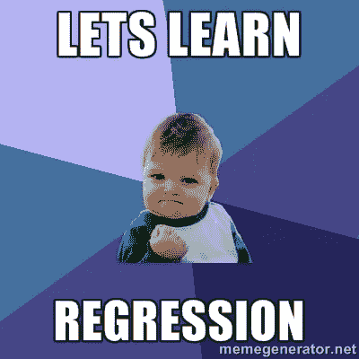

Source : Google Images

我们从导入所需的主要库和数据开始:

```
library(magrittr)
library(car)
library(broom)
library(ggplot2)fileName <- './input/medicalCost/insurance.csv'insurance <- read.csv(fileName)
summary(insurance)
```

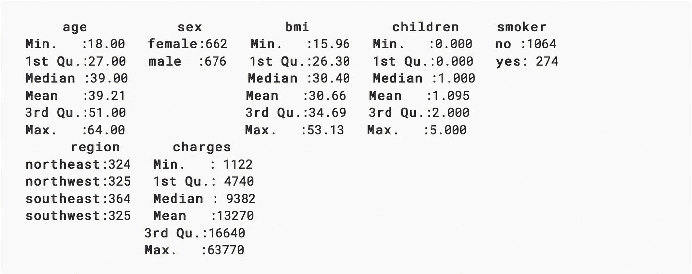

从摘要中可以得出一些简单的观察结果:

1.  参与者的年龄从 18 岁到 64 岁不等。
2.  大约 49.48%的参与者是女性。
3.  参与者的 bmi 从 15.96 到 53.13 不等。
4.  只有 20.48%的参与者是吸烟者。

让我们从建立一个线性模型开始。在简单的线性回归中，只有一个预测因子和一个结果，我们将采用多元线性回归，有多个预测因子和一个结果。

多元线性回归遵循以下公式:

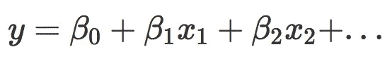

这个线性方程中的系数表示预测值和响应之间的加性关系的大小。更简单地说，在保持其他一切不变的情况下，x1 的单位变化将导致结果中β1 的变化，依此类推。

# 医疗收费和预测因素有关系吗？

我们的第一步是发现结果和预测之间是否有任何关系。

无效假设是任何预测值和反应之间没有关系，这可以通过计算 [F 统计量](http://www.statisticshowto.com/probability-and-statistics/F%20statistic-value-test/)来检验。F 统计量的 p 值可用于确定是否可以拒绝零假设。

我们将从使用所有预测值拟合多元线性回归模型开始:

```
lm.fit <- lm(formula = charges~., data = insurance) 
*#Here '.' means we are using all the predictors in the dataset.
* 
summary(lm.fit)
```

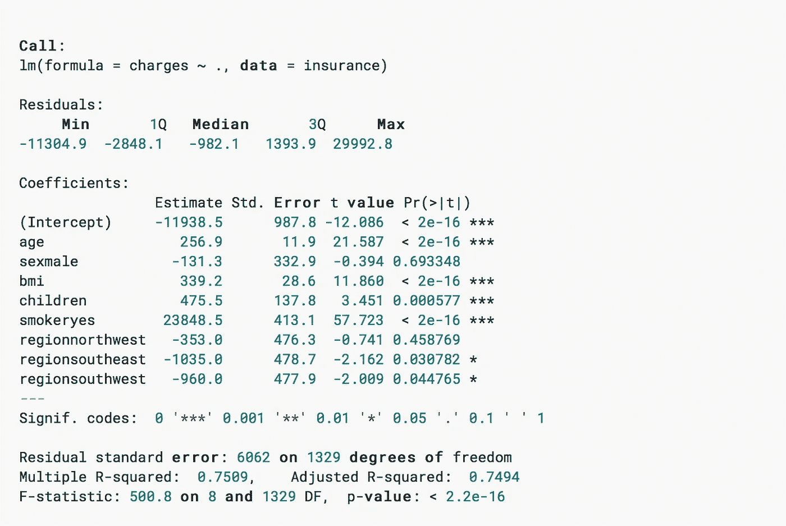

具有非常低的 p 值(< 2.2e-16)的高 F 统计值意味着可以拒绝零假设。这意味着预测因素和结果之间存在潜在的联系。

RSE(剩余标准误差)是对不可约误差(即使我们知道真实回归线也无法减少的误差)的标准偏差的估计；因此，不可约)。简单来说，就是实际结果与真实回归线的平均偏差。RSE (6062)的大值意味着我们的模型与真实回归线的高偏差。

R-squared (R)衡量模型可以解释的结果中可变性的比例，并且[几乎总是在 0 和 1](https://stats.stackexchange.com/questions/12900/when-is-r-squared-negative) 之间；该值越高，模型就越能更好地解释结果的可变性。然而，由于 R 平方的[膨胀，预测因子数量的增加通常会导致 R 值的增加。](https://en.wikipedia.org/wiki/Coefficient_of_determination#Inflation_of_R2)[调整 R 的平方](https://en.wikipedia.org/wiki/Coefficient_of_determination#Adjusted_R2)调整 R 的值以避免这种影响。较高的调整后 R 值(0.7494)表明数据中超过 74%的方差可以用模型来解释。

性病。误差给出了预测器的估计系数与预测器的实际系数之差的平均值。它可以用来计算估计系数的置信区间，我们将在后面看到。

预测器的 *t 值*告诉我们它的估计系数距离 0 有多少个标准差。*预测值的 Pr ( > |t|)* 是估计的回归系数的 p 值，这与说明看到回归系数的 t 值的概率相同。预测值的非常低的 p 值(< 0.05)可用于推断预测值和结果之间存在关系。

我们的下一步应该是[回归分析的验证](https://en.wikipedia.org/wiki/Regression_validation)。这可能意味着验证模型的潜在假设，用不同的预测值检查模型的结构，寻找模型中没有足够好地表示的观察值，等等。我们将研究其中的一些方法和假设。

# 哪些变量与医疗费用有很大关系？

既然我们已经确定了预测因素和结果之间的关系，我们的下一步将是找出是否所有或只有一些预测因素与结果相关。

如果我们查看上面估计系数的 p 值，我们会发现并非所有系数都具有统计显著性(< 0.05)。这意味着只有预测因子的子集与结果相关。

我们可以查看各个 p 值来选择变量。当预测值的数量(7)与观察值的数量(1338)相比非常小时，这可能不是问题。然而，由于[多重测试问题](http://www.statisticshowto.com/multiple-testing-problem/)，当预测值的数量大于观察值的数量时，这种方法将不起作用。选择预测值的更好方法是[特征/变量选择](https://en.wikipedia.org/wiki/Feature_selection)方法，如前向选择、后向选择或混合选择。

在使用这些方法进行特征选择之前，让我们尝试使用仅具有显著 p 值的特征进行线性回归。

```
lm.fit.sel <- lm(charges~age+bmi+children+smoker+region, 
    data = insurance)
```

我们将这与混合选择(T4)进行比较，混合选择是向前和向后选择的结合。这可以在 R 中使用 *stepAIC()* 函数来完成，该函数使用 [Akaike 信息标准](https://en.wikipedia.org/wiki/Akaike_information_criterion) (AIC)从多个模型中选择最佳模型。

```
**#selecting direction = "both" for mixed selection** 
step.lm.fit <- MASS::stepAIC(lm.fit, direction = "both", 
    trace = FALSE)
```

让我们比较一下这两种模型:

```
step.lm.fit$call
lm.fit.sel$call
```

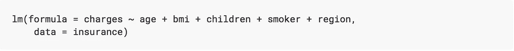

逐步选择给出的模型与我们通过选择具有显著 p 值的预测因子得到的模型相同(在这种情况下有效)。

# 有什么多重共线性特征吗？

多重回归中的多重共线性是一种现象，其中两个或多个预测因子彼此高度相关，因此一个预测因子可用于预测另一个预测因子的值。多重共线性的问题是，它会使估计预测者对结果的个别影响变得更加困难。

多重共线性可以使用方差膨胀因子(VIF)来检测。任何预测值的 VIF 是其在完整模型中的估计系数的方差与仅适合其自身结果时的估计系数的方差之比(如在简单线性回归中)。VIF 为 1 表示不存在多重共线性。通常，大于 5 或 10 的 VIF 值被视为多重共线性的指标。在这种情况下，消除多重共线性的最简单方法是丢弃 VIF 值较高的预测值。

```
**vif**(**step**.lm.fit) %>%    
    **knitr**::kable()
```

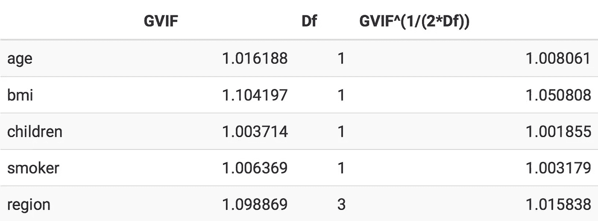

在我们的例子中，没有一个预测值有很高的 VIF 值。因此，在我们的例子中，我们不需要担心多重共线性。

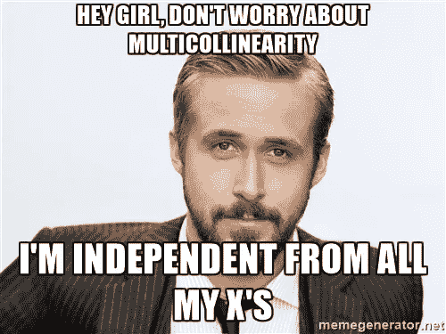

Source: Google Images

# 关系是线性的吗？

通过应用线性回归，我们假设预测值和结果之间存在线性关系。如果潜在的关系远远不是线性的，那么我们所做的大多数推论都是可疑的。

可以使用拟合值对残差的残差图来确定模型的非线性。[任何观测值的残差](http://www.statisticshowto.com/residual/)是实际结果与模型拟合结果之间的差异。残差图中模式的存在意味着模型的线性假设有问题。

```
**#**type = "rstandard" draws a plot **for** standardized residualsresidualPlot(step.lm.fit, type = "rstandard")
```


蓝线表示拟合值和标准残差之间的平滑模式。在我们的例子中，曲线表示数据中的轻微非线性。

通过查看[分量残差图](https://www.r-bloggers.com/r-regression-diagnostics-part-1/) (CR 图)，可以进一步探究非线性。

```
**ceresPlots**(**step**.lm.fit)
```

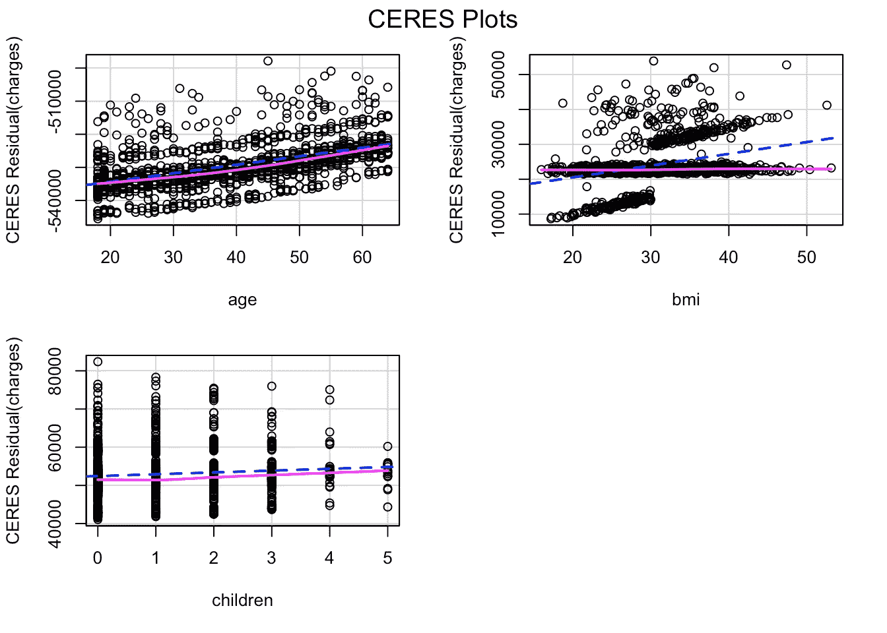

粉色线(残差线)是预测值和残差之间关系的模型。蓝色虚线(组件线)代表最佳拟合线。预测因子的两条线之间的显著差异意味着预测因子和结果没有线性关系。

这种不一致可以在 *bmi* 的 CR 图中看到。解决这一问题的方法之一是引入模型预测值的非线性变换。让我们试着给这个模型添加一个 bmi 的非线性转换。

```
**#update**() **can** **be** **used** **to** **update** **an** **existing** **model** **with** **new requirements****step**.lm.fit.new <**-** **update**(**step**.lm.fit, .~.+**I**(**bmi**^1.25))  **ceresPlots**(**step**.lm.fit.new)
```

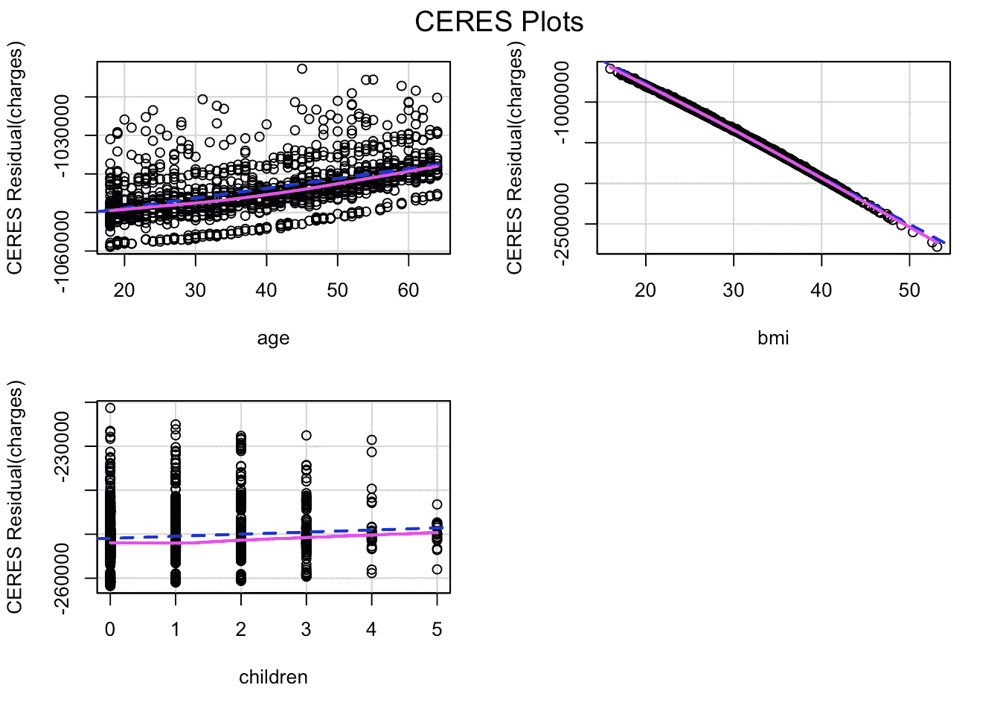

bmi 的 CR 图在残差线和成分线之间不再有差异。

我们可以使用 ANOVA 来检查新模型是否明显优于以前的模型。低 p 值(<0.05) for the new model will mean we can conclude that it is better than the previous model:

```
anova(step.lm.fit, step.lm.fit.new, test = "F")
```

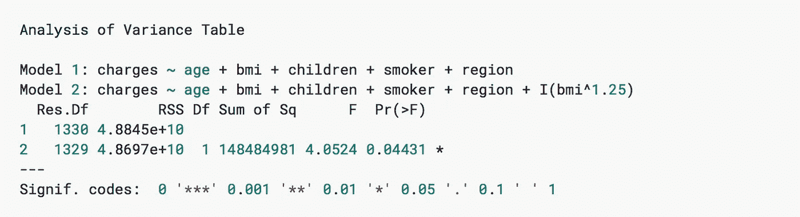

Since the model with non-linear transformation of *bmi* 有足够低的 p 值(< 0.05)，我们可以得出结论，它比之前的模型更好，虽然 p 值很小。

我们来看看这个新模型的剩余剧情。

```
residualPlot(step.lm.fit.new, type = "rstandard")
```

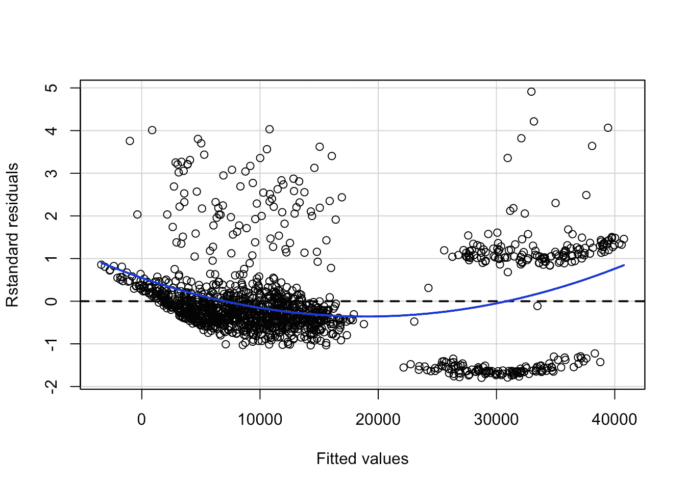

查看新模型的残差图，标准残差的整体模式没有太大变化。

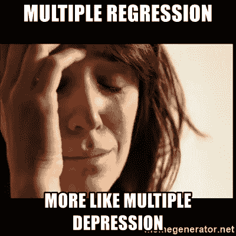

Source: Google Images

解决非线性问题的另一种方法是在一些预测器之间引入一个[交互](https://en.wikipedia.org/wiki/Interaction_(statistics)#In_regression)。与 bmi 较低且不吸烟的人相比，吸烟且 bmi 较高的人可能要支付更高的费用。让我们更新模型，在 *bmi* 和*吸烟者*之间引入一种相互作用，看看这是否会产生影响:

```
lm.fit1 <- update(step.lm.fit.new, ~ .+bmi*smoker)residualPlot(lm.fit1, type = "rstandard", **id**=TRUE)
```

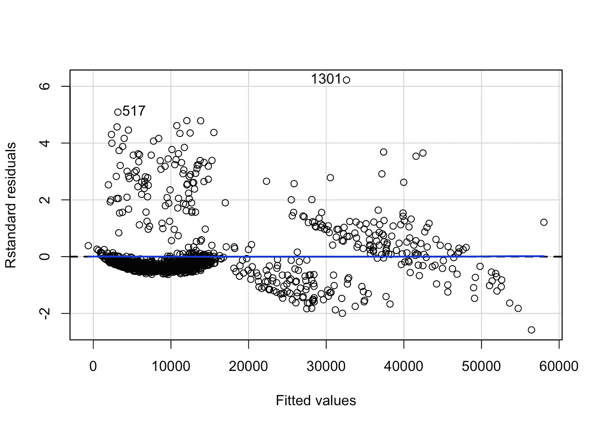

```
anova(step.lm.fit.new, lm.fit1, test = "F")
```

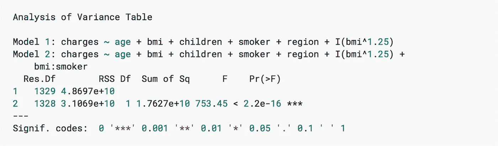

不仅关系变得更加线性，残差图中出现的模式更少，而且新模型明显优于以前的模型(没有相互作用)，这可以从 p 值(< 2.2e-16)中看出。

```
*#checking the value of adjusted r-squared of new model* summary(lm.fit1)$adj.r.squared
```

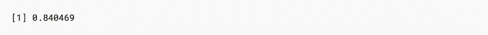

模型的 R 值也提高到了 0.84 以上。

# 误差项的非恒定方差

误差的恒定方差([同方差](https://en.wikipedia.org/wiki/Homoscedasticity))是线性回归模型的另一个假设。例如，在误差的非恒定方差(异方差)的情况下，误差项可能随着响应变量的值而变化。识别异方差的一些图形方法是残差图中存在漏斗形状，或者残差图中存在曲线。在上面的情节中，我们没有看到任何清晰的模式。

统计方法是 Breusch-Pagan 测试的扩展，可在 cars 包中作为 *ncvTest()* 获得。它假设误差方差不变的零假设，而另一个假设是误差方差随着反应水平或预测因子的线性组合而变化。

```
**#** non-constant error variance test 
ncvTest(lm.fit1)
```

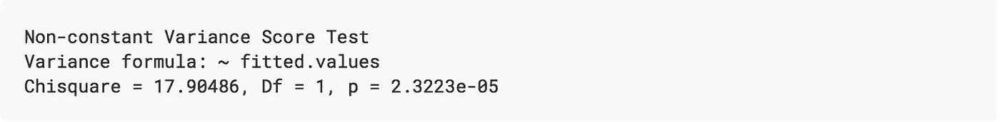

非常低的 p 值(~0.000023)意味着可以拒绝零假设。换句话说，误差具有非恒定方差的可能性很高。

解决这个问题的方法之一是转换结果变量。

```
**yTransformer** <**-** 0.8 
**trans**.lm.fit <**-** **update**(**lm**.fit1, **charges**^**yTransformer**~.)# **non-constant** **error** **variance** **test** 
**ncvTest**(**trans**.lm.fit)
```

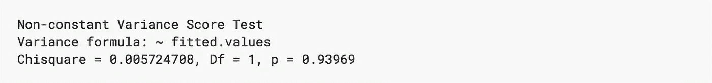

```
residualPlot(trans.lm.fit, type = "rstandard", id=T)
```

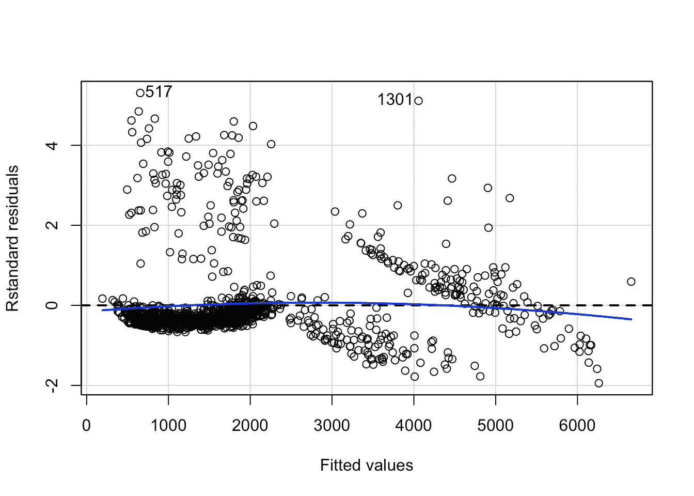

p 值约为 0.94 意味着我们不能拒绝误差项方差不变的零假设。然而，从残差图中可以看出，模型的非线性略有增加。这可以通过观察单个预测因子和结果之间的关系来进一步确定。

# 误差项的相关性

线性回归模型的一个重要假设是连续误差项是不相关的。估计回归系数的标准误差是根据这一假设计算的。如果连续误差项相关，估计回归系数的标准误差可能会大得多。

我们可以使用[德宾-沃森测试](https://en.wikipedia.org/wiki/Durbin%E2%80%93Watson_statistic)来检查误差项的自相关性。无效假设是连续误差没有自相关。

```
set.seed(1)**#** Test **for** Autocorrelated Errors 
durbinWatsonTest(trans.lm.fit, max.lag = 5, reps=1000)
```

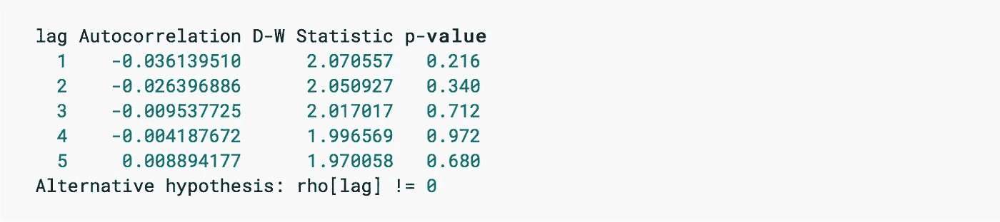

5 个滞后中没有一个的 p 值小于 0.05。因此，我们不能拒绝连续误差不相关的零假设，得出连续误差相互独立的结论。

# 解释

让我们看看最终模型的实际电荷与拟合值，并将其与初始模型的结果进行比较。绘制 fitted_vs_actual 的函数，在下一个块之前使用，在这里是:

```
*#fitted values of initial model*fitted_init <- predict(lm.fit, insurance, 
    interval = "confidence") %>%   
    tidy()
g1 <- fitted_vs_actual(fitted_init, "Initial Model")*#fitted values of final model*fitted_final <- predict(trans.lm.fit, insurance,
    interval = "confidence")^(1/yTransformer) %>% 
    tidy()
g2 <- fitted_vs_actual(fitted_final, "Final Model")*#creating the two plots side-by-side* 
gridExtra::grid.arrange(g1,g2, ncol = 2)
```

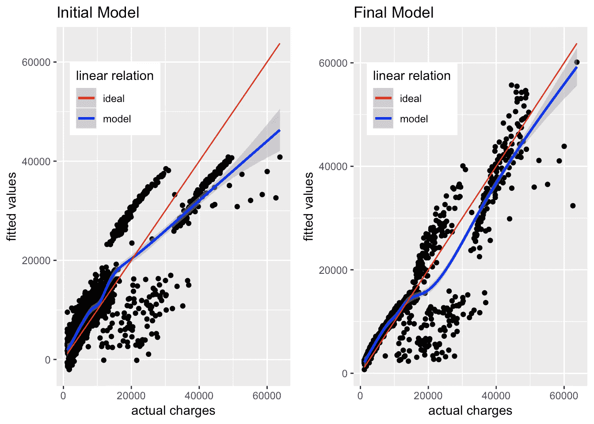

最初的模型能够逼近低于 17，000 美元的实际费用，但是随着实际费用超过 20，000 美元，实际费用和拟合值之间的差距不断增大。根据初始模型，接近 50，000 美元的实际费用被拟合为接近或低于 40，000 美元，并且该差距继续向上增加。

相比之下，新模型中的拟合值更接近实际费用，尽管仍有许多变化未被该模型解释。它仍然是最初模型的一个重大改进。

我们可以查看预测值的估计系数及其置信区间，以解释它们如何定义模型。

```
confint(trans.lm.fit) %>%   
    tidy() %>%   
    tibble::add_column(coefficients = trans.lm.fit$coefficients,
        .after = 2) %>%   
    knitr::kable()
```

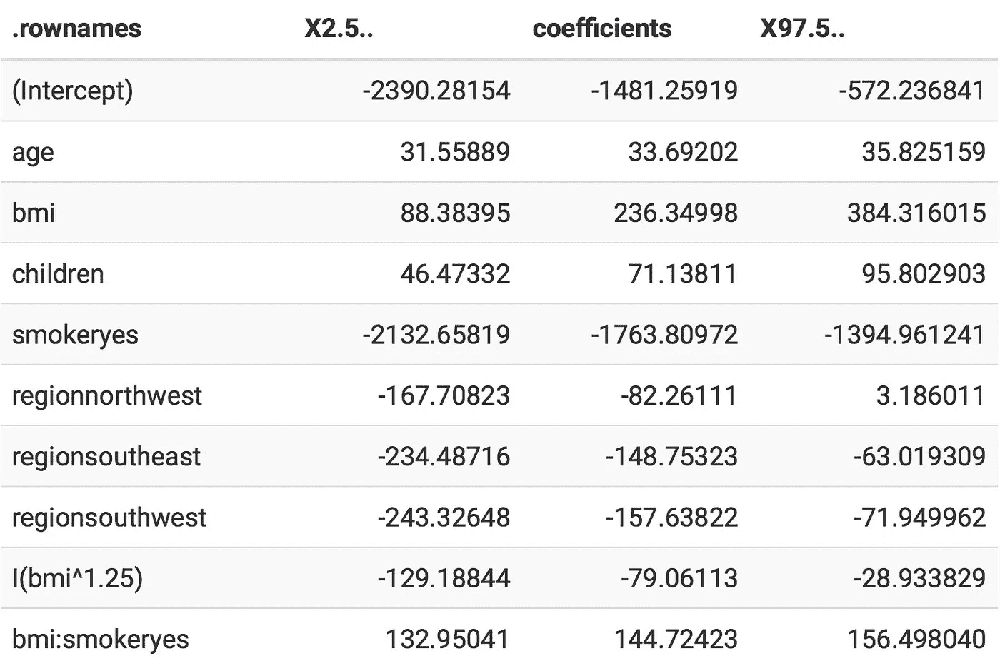

在上表中，X2.5 和 X97.5 标记了回归系数 95%置信区间的下限和上限。这些是使用估计系数的标准误差计算的。例如，对于*年龄*，估计系数约为 33.69，95%置信区间介于约 31.56 至约 35.83 之间。这意味着，根据模型，保持其他一切固定，年龄增加 1 岁将导致 charges^(0.8).值增加 33.69(因为我们转换了结果)。但是，这是一个估计值，因此有变动的余地。置信区间说明了这种变化，表示在大约 95%的情况下，charges^(0.8 值的变化将在 31.56 和 35.83 之间，保持其他一切固定。

让我们将这些影响形象化，以更好地理解预测因素与模型结果之间的关系。获得模型对转换结果影响的函数是这里的。

```
plot_effect('age', 'age') %>% 
    ggplot(aes(x = age, y = fit)) + 
    theme_bw() + 
    geom_line() + 
    geom_ribbon(aes(ymin = lower, ymax = upper), alpha = 0.5)
```

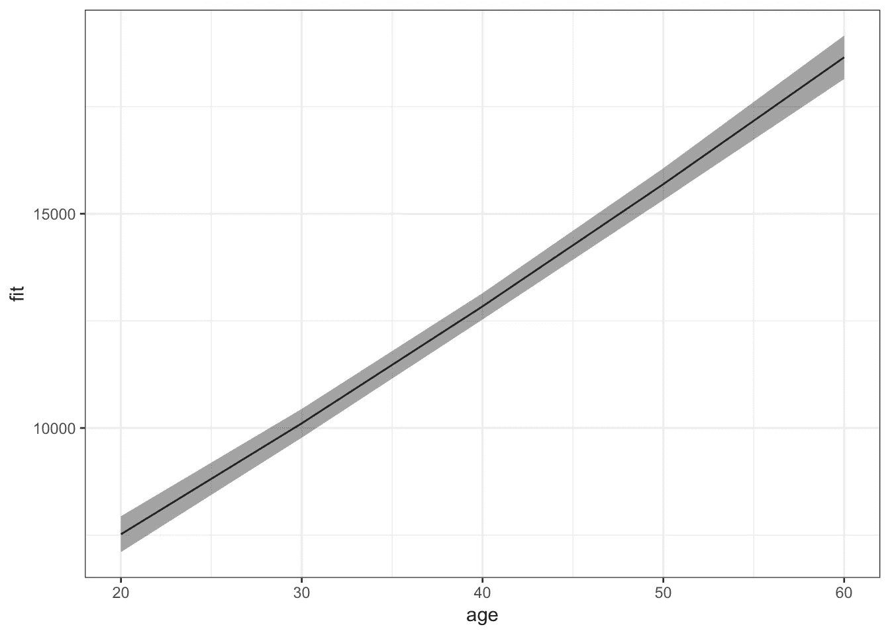

对于其他预测因子的平均值，保险费随着年龄的增加而增加。在*体重指数*和*吸烟者*之间的互动中可以看到更有趣的效果:

```
plot_effect('bmi*smoker', 'bmi') %>% 
    ggplot(aes(x = x.bmi, y = fit)) + 
    facet_wrap(~x.smoker) + 
    theme_bw() + 
    geom_line() + 
    geom_ribbon(aes(ymin = lower, ymax = upper), alpha = 0.5)
```

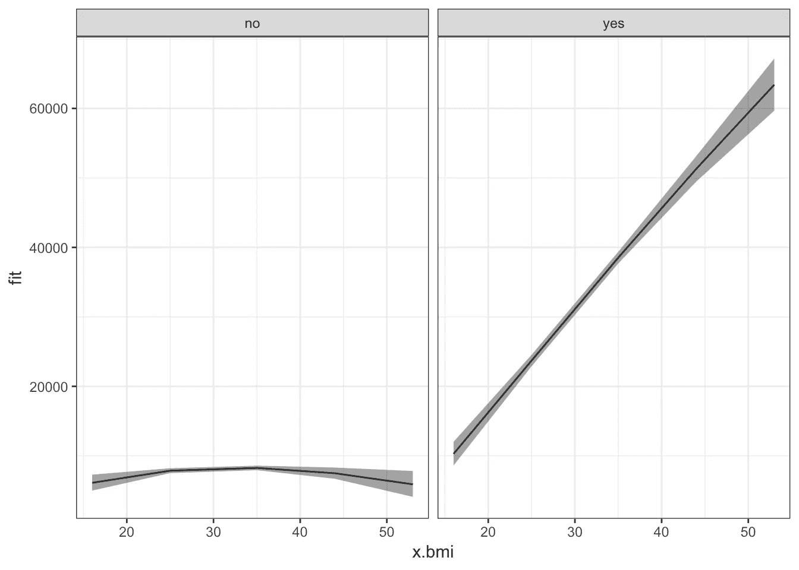

不吸烟者，不管他们的 bmi 如何，对于其他预测指标的平均值来说，他们的保险费用大多较低。低 bmi 吸烟者的保险费较低，尽管仍高于任何 bmi 值的非吸烟者。此外，随着他们 bmi 的增加，吸烟者的保险费用也迅速增加。

# 结论

我们建立的模型可用于推断不同的预测因素如何影响结果。它远非完美。它们仍然存在非线性和误差的非恒定方差。此外，应该分析异常值和杠杆点，以找到更好的模型。当用于预测新的、看不见的数据的结果时，它可能不会(并且很可能不会)给出类似的结果。为了将其用于预测，应该采取更具体的措施来确保模型的准确性，如交叉验证。它仍然有助于提供预测和结果之间的重要关系的良好估计。这些估计可以用来以更有用和更直观的方式总结数据。

你可以在这里看到原帖[，或者在](https://bit.ly/2Ijcyhz) [LinkedIn](http://linkedin.com/in/krohitm/) 上找到我。

# 来源

*   统计学习导论及其应用。
*   维基百科(一个基于 wiki 技术的多语言的百科全书协作计划ˌ也是一部用不同语言写成的网络百科全书ˌ 其目标及宗旨是为全人类提供自由的百科全书)ˌ开放性的百科全书
*   [Quick-R](https://www.statmethods.net/)
*   [如何统计](http://www.statisticshowto.com/)
*   [堆叠交换](https://stats.stackexchange.com)
*   [堆栈溢出](https://stackoverflow.com/)