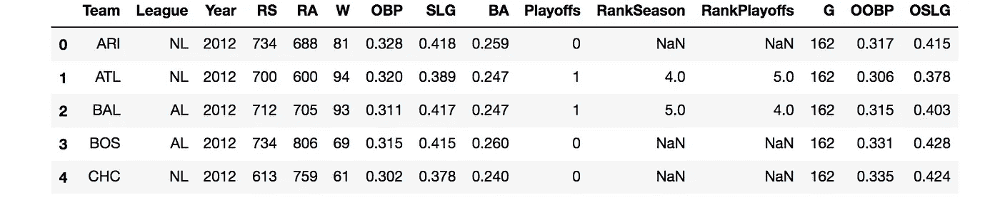
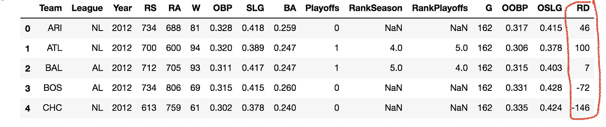
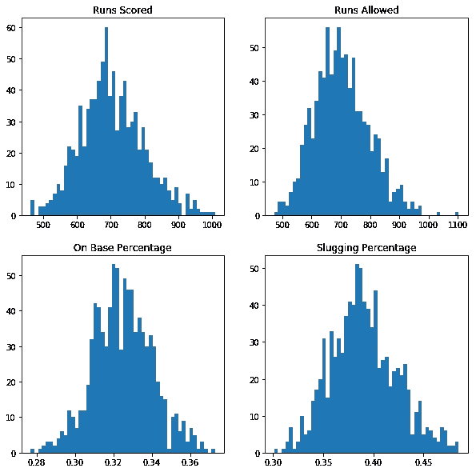
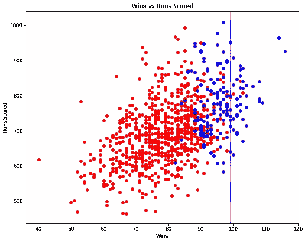

# 线性回归:钱球—第 1 部分

> 原文：<https://towardsdatascience.com/linear-regression-moneyball-part-1-b93b3b9f5b53?source=collection_archive---------4----------------------->

## 大众体育故事的统计案例研究


“The macro view of an old baseball on a wood surface” by [Joey Kyber](https://unsplash.com/@jtkyber1?utm_source=medium&utm_medium=referral) on [Unsplash](https://unsplash.com?utm_source=medium&utm_medium=referral)

# 概观

因 2011 年的电影 [Moneyball](http://www.imdb.com/title/tt1210166/) 而走红的最引人注目的体育分析故事之一，2002 年的[奥克兰运动家队](https://en.wikipedia.org/wiki/Oakland_Athletics)创造了历史，在 2002 年 8 月 13 日至 9 月期间[连续赢了 20 场比赛](https://www.si.com/mlb/2017/09/08/longest-winning-streaks-2002-oakland)。

奥克兰运动家队(通常被称为运动家队)在那个赛季的成功很大程度上归功于他们的总经理比利·比恩和前助理总经理保罗·德波斯塔。

DePodesta 毕业于哈佛大学经济学，于 1999 年加入美国棒球协会，并很快开始整合棒球统计数据分析，以评估和购买球员。( [Sabermetrics](https://en.wikipedia.org/wiki/Sabermetrics) )

这种方法在 2002 年历史性的赛季后受到关注，当时比利·比恩购买了被严重低估的球员，以取代赛季开始前离开的关键球员。由于奥克兰运动家队严重的预算限制，比利求助于 DePodesta 正在研究的方法，以购买被低估的球员来满足加州球队的工资。


Brad Pitt as Billy Beane and Jonah Hill as Paul DePodesta’s counterpart in the movie Moneyball. [Source](https://info.umkc.edu/unews/moneyball/)

本文试图重现 Paul DePodesta 的部分分析，以展示最简单的监督学习技术(也称为线性回归)的威力。

## 放弃

这一分析与麻省理工学院 edX[Analytics Edge](https://www.edx.org/course/analytics-edge-mitx-15-071x-3)课程中的案例研究非常相似。然而，我为本文选择的编程语言是 Python，而不是前面提到的课程中使用的 R。

## 线性回归

线性回归是机器学习中的一种监督学习算法，它起源于统计学原理。它主要用于模拟一个解释变量(通常为 *y* ，)与一个或多个自变量(用 *X.* 表示)之间的关系，当只有一个自变量用于预测 *y，*时，称为简单线性回归或线性回归，而当有多个自变量时，称为多元线性回归。


Linear Regression equation. [Source](https://stats.stackexchange.com/questions/86830/transformation-to-normality-of-the-dependent-variable-in-multiple-regression)

称为回归系数的β项指的是 *x* 变量和*因变量 *y.* 之间的关系，让我们用一个例子来说明这一点。*

方程式:

***房价= 50000+1.35×(房屋面积平方)+ ε***

*上面的等式是一个回归函数的例子，该函数用于在给定房屋面积(平方英尺)的情况下确定房屋价格。*

*1.35 是β的值，表示房子*、*每增加 1 平方英尺，房子*的价格就会增加 1.35 美元。*如果β的值为-1.35，那么房屋面积每增加 1 平方英尺*，*就会有 1.35 美元的单位 d **房价*下降。****

*误差项ε用于表示残差或 *Y 的实际值和预测值之间的差异。*它告诉我们我们的预测值与实际值有多远。*

*残差公式:*

***ε=*y*—*ŷ*t23】***

*其中 *y* 表示实际值，而 *ŷ* 表示我们的模型预测的 y 值。*

**

*Plot of Simple Linear Regression with one independent variable. [Source](https://en.wikipedia.org/wiki/Linear_regression)*

*我不会详细讨论β值是如何计算的，模型是如何优化的。相反，让我们直接进入模型构建框架。*

## *资料组*

*我使用的数据集是从 baseball-reference.com 收集的来自 Kaggle 的 Moneyball 数据集。*

# *探索数据*

*使用 pandas 库将数据读入 python。*

```
*df = pd.read_csv("baseball.csv")
df.head()*
```

**

*我们需要在这里定义一些术语:*

*   *RA 代表允许运行。*
*   *RS 代表得分得分。*
*   *OBP 代表基数百分比。*
*   *SLG 代表段塞百分比。*
*   *巴是击球手。*
*   *OOBP 是对手的 OBP。*
*   *OSLG 是对手的 SLG。*
*   *w 代表该赛季的获胜次数。*

*增加一个新变量 RD，作为 RS 和 RA 之间的差值。*

**

*此外，我们将只保留年< 2002 in order to replicate the data prior to the 2002 season.*

*We will use plots in order to find insights regarding the distributions of the numerical variables.*

**

*Histograms of numerical features*

*Observe that all four features(variables) are approximately [正态分布](https://en.wikipedia.org/wiki/Normal_distribution)的记录。得分得分和允许得分的图表似乎都稍微向左倾斜。运行评分图的[尾部](https://en.wikipedia.org/wiki/Heavy-tailed_distribution)似乎比允许运行图的尾部厚。*

*Statistical analysis clip from Moneyball.(2011) [Source](https://www.youtube.com/watch?v=KWPhV6PUr9o&t=85s)*

*根据 DePodesta 在片段中的角色，为了进入 2002 年的季后赛，运动家队需要至少 99 场胜利。让我们试着想象这种洞察力。*

```
*# Plotting scatterplotplt.figure(figsize=(10,8))
plt.scatter(x=moneyball0.W,y = moneyball0.RS,c="red")
plt.scatter(x=moneyball1.W,y = moneyball1.RS,c="blue")
plt.xlabel("Wins")
plt.ylabel("Runs Scored")
plt.axvline(x = 99)*
```

**

*从上面的图中我们看到，DePodesta 估计的 99 胜是有道理的，因为似乎只有 3 个观察值(红色)没有以≥ 99 胜进入季后赛。*

*DePodesta 还计算出，为了进入季后赛，湖人队至少需要 814 分，并且只允许 645 分。这意味着得分得分和允许得分之间的差距大约需要 169(RD)。让我们来看看研发和成功之间的关系。*

```
*x = np.array(moneyball.RD)
y = np.array(moneyball.W)# Deriving slope,intercept valuesslope, intercept = np.polyfit(x, y, 1)
abline_values = [slope * i + intercept for i in x]#Plotting the figureplt.figure(figsize=(10,8))
plt.scatter(x, y)
plt.plot(x, abline_values, 'b')
plt.title("Slope = %s" % (slope))
plt.xlabel("Run Difference")
plt.ylabel("Wins")
plt.show()*
```

**

*我们可以清楚地看到，两个变量之间的关系是线性的。*

```
*print(np.corrcoef(x,y))output:[[ 1\.          0.93851498]
 [ 0.93851498  1\.        ]]*
```

*此外，研发和获胜次数之间有很强的[相关性](https://en.wikipedia.org/wiki/Correlation_and_dependence)0.9385。*

*因此，我们的探索性数据分析证实了 DePodesta 的估计到目前为止是正确的。在研究的下一部分，我们将建立回归模型来进一步验证 DePodesta 的分析。*

*请继续关注第二部分。*

# *来源*

1.  *【https://www.edx.org/course/analytics-edge-mitx-15-071x-3 *
2.  *[http://www.imdb.com/title/tt1210166/](http://www.imdb.com/title/tt1210166/)*
3.  *[https://en.wikipedia.org/wiki/Linear_regression](https://en.wikipedia.org/wiki/Linear_regression)*
4.  *[http://www.numpy.org/](http://www.numpy.org/)*
5.  *[https://matplotlib.org/](https://matplotlib.org/)*